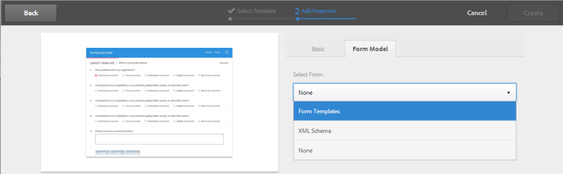
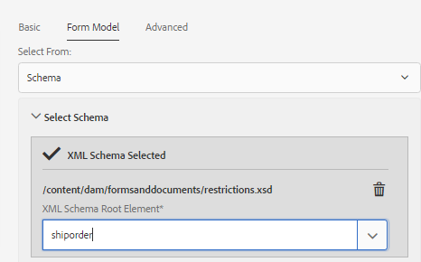

# Creating an adaptive form {#creating-an-adaptive-form}

 Adobe recommends using the modern and extensible data capture [Core Components](https://experienceleague.adobe.com/docs/experience-manager-core-components/using/adaptive-forms/introduction.html) for [creating new Adaptive Forms](/help/forms/using/create-an-adaptive-form-core-components.md) or [adding Adaptive Forms to AEM Sites pages](/help/forms/using/create-or-add-an-adaptive-form-to-aem-sites-page.md). These components represent a significant advancement in Adaptive Forms creation, ensuring impressive user experiences. This article describes older approach to author Adaptive Forms using foundation components. 

| Version | Article link |
| -------- | ---------------------------- |
| AEM as a Cloud Service |    [Click here](https://experienceleague.adobe.com/docs/experience-manager-cloud-service/content/forms/adaptive-forms-authoring/authoring-adaptive-forms-foundation-components/create-an-adaptive-form-on-forms-cs/creating-adaptive-form.html)                  |
| AEM 6.5     | This article         |

## Create an adaptive form {#strong-create-an-adaptive-form-strong}

Follow these steps to create an adaptive form.

1. Access [!DNL Experience Manager Forms] Author instance at `https://'[server]:[port]'/<custom-context-if-any>.`

1. Enter your credentials on the Experience Manager login page.

   After you are logged in, in the upper-left corner, select **[!UICONTROL Adobe Experience Manager]** &gt; **[!UICONTROL Forms]** &gt; **[!UICONTROL Forms & Documents]**.

   >[!NOTE]
   >
   >For a default installation, the login is `admin` and the password is `admin`.

1. Select **[!UICONTROL Create]** and select **[!UICONTROL Adaptive Form]**.
1. An option to select a template appears. For more information about templates, see [Adaptive form templates](creating-adaptive-form.md#p-adaptive-form-templates-p). Select a template to select it and select Next.
1. An option to 'Add Properties' appears. Specify the values for following property fields. The Title and Name fields are mandatory:

    * **[!UICONTROL Title:]** Specifies the display name of the form. The title helps you identify the form in the [!DNL Experience Manager Forms] user interface.
    * **[!UICONTROL Name:]** Specifies the name of the form. A node with the specified name is created in the repository. As you start typing a title, value for the name field is automatically generated. You can change the suggested value. The name field can include only alphanumeric characters, hyphens, and underscores. All the invalid inputs are replaced with a hyphen.
    * **[!UICONTROL Description:]** Specifies the detailed information about the form.
    * **[!UICONTROL Tags:]** Specifies tags to uniquely identify the adaptive form. Tags help in searching the form. To create tags, type new tag names in the **[!UICONTROL Tags]** box.

1. You can create an adaptive form based on one of following form models:

    * [Form data model](#fdm)
    * [XFA form template](#create-an-adaptive-form-based-on-an-xfa-form-template)
    * [XML or JSON schema](#create-an-adaptive-form-based-on-xml-or-json-schema)
    * None or without any form model

   You can configure these from the **[!UICONTROL Form Model]** tab on the **[!UICONTROL Add Properties]** page. By default, the form model selected is **[!UICONTROL None]**.

1. Select **[!UICONTROL Create]**. An adaptive form is created and a dialog to open the form for editing appears.

   Once you have finished specifying all the properties, click **[!UICONTROL Create]**. An adaptive form is created and a dialog to open the form for editing appears.

   Once you have finished specifying all the properties, click **[!UICONTROL Create]**. An adaptive form is created and a dialog to open the form for editing appears.

1. Select **[!UICONTROL Open]** to open the newly created form in a new tab. The form opens for editing and displays the contents available in the template. It also displays the sidebar to customize the newly created form according to the needs.

   Based on the type of adaptive form, the form elements present in the associated XFA form template, XML schema, or JSON schema are displayed in the **[!UICONTROL Data Model Objects]** tab of the **[!UICONTROL Content Browser]** in the sidebar. You can also drag-drop these elements to build your adaptive form.

   For information about adaptive form authoring interface and available components, see [Introduction to authoring adaptive forms](introduction-forms-authoring.md).

   >[!NOTE]
   >
   >Allow pop up windows in your browser to open the newly created form in a new tab.

## Create an adaptive form based on a form data model {#fdm}

[[!DNL Experience Manager Forms] data integration](data-integration.md) lets you integrate multiple data sources and bring their entities and services together to create a form data model. It is an extension of JSON schema. You can use a form data model to create an adaptive form. The entities or data model objects configured in a form data model are available as data model objects for form authoring. They are bound to respective data sources and used to prefill a form and write submitted data back to the respective data sources. You can also call services configured in a form data model using adaptive form rules.

To use a form data model for creating an adaptive form:

1. In Form Model tab on Add Properties screen, select **[!UICONTROL Form Data Model]** in the **[!UICONTROL Select From]** drop-down list.

   

1. Select to expand **[!UICONTROL Select Form Data Model]**. All available form data models are listed.

   Select a from data model.

   

>[!NOTE]
>
>You can also change the form data model for an adaptive form. For detailed steps, see [Edit Form Model properties of an adaptive form](#edit-form-model).

## Create an adaptive form based on an XFA Form template {#create-an-adaptive-form-based-on-an-xfa-form-template}

You can repurpose your XFA form templates to create adaptive forms. To repurpose, upload and associate an XFA form template with an adaptive form. The elements of the Form Template (XFA form) are made available for use in the content finder at the time of adaptive form authoring. From the Content Finder, you can drag-and-drop the form template elements on the form.

<!-- >>[!NOTE]
>
>[Upload the XFA Form Template](get-xdp-pdf-documents-aem.md) to AEM Forms before you start creating an adaptive form based on the form template.

Do the following to use an XFA form template as form model for your adaptive form:

1. On the **[!UICONTROL Add Properties]** page, open the **[!UICONTROL Form Model]** tab.
1. In the Form Model tab, from the drop-down list, select **[!UICONTROL Form Templates]**. All the form templates that are uploaded to the repository via AEM Forms UI are listed for selection. Select a template from the list.

   
**Figure:** *Selecting a form template*

   >[!NOTE]
   >
   >You can also change the form template for an adaptive form. For detailed steps, see [Edit Form Model properties of an adaptive form](#edit-form-model). --> 

## Create an adaptive form based on XML or JSON schema {#create-an-adaptive-form-based-on-xml-or-json-schema}

XML and JSON schemas represent the structure in which data is produced or consumed by the back-end system in your organization. You can associate a schema to an adaptive form and use its elements to add dynamic content to the adaptive form. The elements of the schema are available in the Data Model Object tab of the content browser for authoring adaptive forms. You can drag-drop the schema elements to build the form.

See the following documents to understand how to design XML or JSON schema for authoring adaptive forms.

* [Creating adaptive forms using XML schema](adaptive-form-xml-schema-form-model.md)
* [Creating adaptive forms using JSON schema](adaptive-form-json-schema-form-model.md)

Do the following to use XML or JSON schema as form model for an adaptive form:

1. On the **[!UICONTROL Add Properties]** step of adaptive form creation page, select on the **[!UICONTROL Form Model]** tab.
1. In the Form Model tab, select **[!UICONTROL Schema]** from the **[!UICONTROL Select From]** drop-down field.

1. Select **[!UICONTROL Select Schema]** and do one of the following:

    * **[!UICONTROL Upload from disk]** - Select this option and select Upload Schema Definition to browse and upload an XML schema or JSON schema from your file system. The uploaded schema file resides with the form and is not accessible to other adaptive forms.
    * **[!UICONTROL Search in repository]** - Select this option to select from the list of schema definition files available in the repository. Select the XML or JSON schema file as form model. The selected schema is associated with the form by reference and is accessible for use in other adaptive forms.

   >[!CAUTION]
   >
   >Ensure that the JSON schema filename ends with **.schema.json**. For example: mySchema.schema.json

   
**Figure:** *Selecting XML or JSON schema*

1. (For XML schema only) After you select or upload an XML Schema, specify a root element of the selected XSD file to map with the adaptive form.

   
**Figure:** *Selecting XSD root element*

>[!NOTE]
>
>You can also change the schema for an adaptive form. For detailed steps, see [Edit Form Model properties of an adaptive form](#edit-form-model).

## Adaptive form templates {#adaptive-form-templates}

A template provides a basic structure and defines appearance (layouts and styles) of an adaptive form. It has pre-formatted components containing certain properties and content structure. <!-- Out of the box, AEM Forms provides some adaptive form templates. To get the complete template package including advanced templates, you need to install the AEM Forms add-on package. For more information, see [Installing AEM Forms add-on package](installing-configuring-aem-forms-osgi.md).-->

In addition, you can use the template editor to create your own templates. For more information about working with templates, see [Adaptive form templates](template-editor.md).

>[!NOTE]
>
>When you open an adaptive form created using the advanced template for editing, an error message appears. The advanced template has a Signature Step component and Adobe Sign is enabled for it by default. Create and select an [Adobe Sign cloud configuration](adobe-sign-integration-adaptive-forms.md) and [configure a signer](working-with-adobe-sign.md#addsignerstoanadaptiveform) to resolve the error.

## Edit Form Model properties of an adaptive form {#edit-form-model}

Adaptive forms are created without a form model (using the None option for form model) or using a form model such as a form template, XML schema or JSON schema, or form data model. You can change the form model for an adaptive form from None to another form model. For adaptive form based on a form model, you can choose another form template, XML schema, JSON schema, or form data model for the same form model. However, you cannot change from one form model to another.

1. Select the adaptive form and select the **Properties** icon.
1. Open the **[!UICONTROL Form Model]** tab and do one the following.

    * If the adaptive form is without a form model, you can choose another form model and accordingly select a form template, XML or JSON schema, or form data model.
    * If the adaptive form is based on a form model, you can choose another form template, XML or JSON schema, or form data model for the same form model.

1. Select **[!UICONTROL Save]** to save the properties.

## Auto save an adaptive form {#auto-save-an-adaptive-form}

By default, the contents of an adaptive form are saved on a user action, such as on pressing the save button. You can also configure an adaptive form to automatically start saving the content based on an event or time-interval. The auto save option is helpful in:

* Automatically saving the content for anonymous and logged-in users
* Saving the content of a form without or minimal user intervention
* Start saving content of a form based on a user event
* Saving the content of a form repeatedly after a specified time interval

### Enable Auto Save for an adaptive form {#enable-auto-save-for-an-adaptive-form}

By default, the auto save option is not enabled. You can enable the auto save option from the Auto Save tab of an adaptive form. The Auto Save tab also provides several other configuration options. Perform the following steps to enable and configure the auto save option for an adaptive form:

1. To access the auto-save section in the properties, select a component, then select  &gt; **[!UICONTROL Adaptive Form Container]**, and then select .
1. In the **[!UICONTROL Auto Save]** section, **[!UICONTROL Enable]** the auto-save option.
1. In the **[!UICONTROL Adaptive Form Event]** box, specify 1 or TRUE to automatically start saving the form when the form is loaded in the browser. You can also specify a conditional expression for an event, which when triggered and returns true, starts saving the content of the form.
1. Specify the Trigger. Auto-save is triggered based on your configuration. Your options are:

    * **[!UICONTROL Time based:]** Select the option to start saving the content based on a specific time interval.
    * **[!UICONTROL Event based:]** Select the option to start saving the content based when an event is triggered.

   When you select a trigger, Strategy Configuration box is enabled. Strategy Configuration box lets you:

    * Specify a time interval if you select **[!UICONTROL Time based]** trigger.
    * Specify an event name if you select **[!UICONTROL Event based]** trigger.

   <!-- You can also create and add your own custom strategy to the list. For details, see [Implement a custom strategy to autosave the forms](auto-save-an-adaptive-form.md#p-implement-a-custom-strategy-to-enable-autosave-for-adaptive-forms-p). -->

1. (Time-based autosave only) Perform the following steps to configure options for the Time-based autosave.

    1. In the **[!UICONTROL Auto save on this interval]** box, specify the time interval in seconds. The form is saved repeatedly after the number of seconds specified in the interval box elapse.

1. (Event-based auto save only) Perform the following steps to configure options for Event-based auto save.

    1. In the **[!UICONTROL Auto save after this event]** box, specify a [GuideBridge](https://helpx.adobe.com/aem-forms/6/javascript-api/GuideBridge.html) event. The form is saved every time the expression evaluates to TRUE.

1. (Optional) To automatically save the content for anonymous users, select the **[!UICONTROL Enable Autosave for anonymous users]** option, and click **[!UICONTROL OK]**.

   >[!NOTE]
   >
   >For auto save option to work for anonymous users, ensure that you configure the Forms Common Configuration Service to allow all users to preview, verify, and sign forms.
   >
   >To configure the service, go to Adobe Experience Manager Web Console configuration at `https://'[server]:[port]'system/console/configMgr` and edit the **[!UICONTROL Forms Common Configuration Service]** to choose the **[!UICONTROL All Users]** option in the **[!UICONTROL Allow]** field, and save the configuration.

## How to rename an AEM Adaptive Form ? {#rename-an-AEM-Adaptive-Form}

To rename an adaptive form, perform the following steps:

1. Select an adaptive form in your AEM Forms user interface.
1. Click on the **Properties** located on the upper rail.

    

1. Change the name of the form in the **Title** tab, as shown in the image below.
1. Click **Save and Close**.

    
