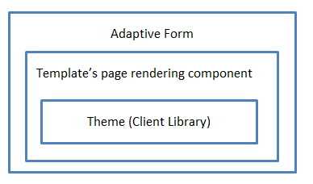
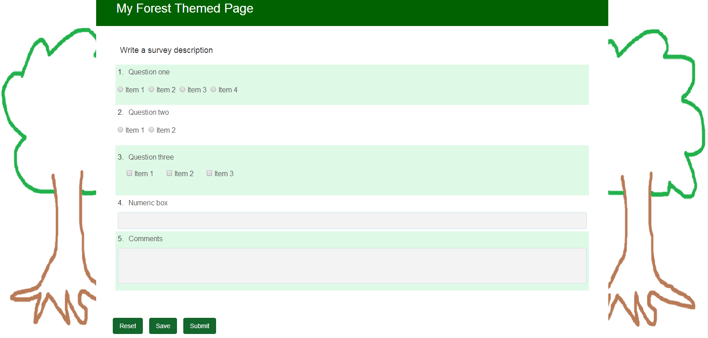
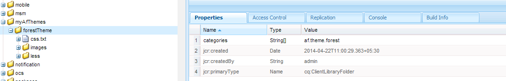

# Creating custom adaptive form themes {#creating-custom-adaptive-form-themes}

>[!CAUTION]
>
>Adobe Experience Manager (AEM) Forms provide the [Theme Editor](/help/forms/using/themes.md) capability to create and modify adaptive forms [themes](/help/forms/using/themes.md). Perform the steps listed in this article only if you have upgraded from a version that does not have [Theme Editor](/help/forms/using/themes.md) and you have an existing investment in themes created using Less/CSS files (pre-theme editor method).

## Prerequisites {#prerequisites}

* Knowledge of the LESS (Leaner CSS) framework
* How to create a client library in Adobe Experience Manager
* [Creating an adaptive form template](/help/forms/using/custom-adaptive-forms-templates.md) for using the theme you create

## Adaptive form theme {#adaptive-form-theme}

An **adaptive form theme** is an AEM client library that you use to define the styles (look and feel) for an adaptive form.

You create an **adaptive template** and apply the theme to the template. You can then use this custom template to create an **adaptive form**.



## To create an adaptive form theme {#to-create-an-adaptive-form-theme}

>[!NOTE]
>
>The following procedure is described using sample names for AEM objects such as nodes, properties, and folders.
>
>If you follow these steps using the names, the resultant template should appear similar to the following snapshot:


**Figure:** *Forest Theme Sample*

1. Create a node of type `cq:ClientLibraryFolder` under the `/apps`node.

   For example, create the following node:

   `/apps/myAfThemes/forestTheme`

1. Add a multi-valued string property `categories` to the node and set its value appropriately.

   For example, set the property to: `af.theme.forest`.

   

1. Add two folders, `less` and `css`, and a file `css.txt` to the node created in step 1:

    * `less` folder: Contains the `less` variable files in which you define the `less` variables and `less mixins` that are used to manage the .css styles.

      This folder consists of `less` variable files, `less` mixin files, `less` files defining styles using mixins, and variables. And all these `less` files are then imported in styles.less.

    * `css`folder: Contains the .css files in which you define the static styles to be used in the theme.

   **Less variable files**: These are the files where you define or override the variables that are used in defining CSS styles.

   Adaptive forms provide out-of-the-box variables defined in the following `.less` files:

    * `/apps/clientlibs/fd/af/guidetheme/common/less/globalvariables.less`
    * `/apps/clientlibs/fd/af/guidetheme/common/less/layoutvariables.less`

   Adaptive forms also provide third-party variables defined in:

   `/apps/clientlibs/fd/af/third-party/less/variables.less`

   You can use the `less` variables provided with adaptive forms, you can override these variables, or you can create new `less` variables.

   >[!NOTE]
   >
   >While importing the files of the less pre-processor, in the import statement specify the relative path of the files.

   Sample overriding variables:

   ```css
   @button-background-color: rgb(19, 102, 44);
   @button-border-color: rgb(19, 102, 44);
   @button-border-size: 0px;
   @button-padding: 10px 15px;
   @button-font-color: #ffffff;
   ```

   To override the `less`variables:

    1. Import default adaptive form variables:

       `/apps/clientlibs/fd/af/guidetheme/common/less/globalvariables.less/apps/clientlibs/fd/af/guidetheme/common/less/layoutvariables.less`

    1. Then import the less file that includes overridden variables.

   Sample new variable definitions:

   ```css
   @button-focus-bg-color: rgb(40, 208, 90);
   @button-hover-bg-color: rgb(30, 156, 67);
   ```

   **Less mixin files:** You can define the functions that accept variables as arguments. The output of these functions is the resultant styles. Use these mixins within different styles so you can avoid repeating CSS styles.

   Adaptive forms provide out-of-the-box mixins defined in:

    * `/apps/clientlibs/fd/af/guidetheme/common/less/adaptiveforms-mixins.less`

   Adaptive forms also provide third-party mixins defined in:

    * `/apps/clientlibs/fd/af/third-party/less/mixins.less`

   Sample mixin definition:

   ```css
   .rounded-corners (@radius) {
     -webkit-border-radius: @radius;
     -moz-border-radius: @radius;
     -ms-border-radius: @radius;
     -o-border-radius: @radius;
     border-radius: @radius;
   }

   .border(@color, @type, @size) {
      border: @color @size @type;
   }
   ```

   **Styles.less File:** Use this file to include all the `less` files (variables, mixins, styles) that you must use in the client library.

   In the following sample `styles.less` file, the import statement can be placed in any order.

   The statements to import the following `.less` files are mandatory:

    * `globalvariables.less`
    * `layoutvariables.less`
    * `components.less`
    * `layouts.less`

   ```css
   @import "../../../clientlibs/fd/af/guidetheme/common/less/globalvariables.less";
   @import "../../../clientlibs/fd/af/guidetheme/common/less/layoutvariables.less";
   @import "forestTheme-variables";
   @import "../../../clientlibs/fd/af/guidetheme/common/less/components.less";
   @import "../../../clientlibs/fd/af/guidetheme/common/less/layouts.less";

   /* custom styles */

   .guidetoolbar {
     input[type="button"], button, .button {
       .rounded-corners (@button-radius);
       &:hover {
         background-color: @button-hover-bg-color;
       }
       &:focus {
         background-color: @button-focus-bg-color;
       }
     }
   }

   form {
       background-image: url(../images/forest.png);
    background-repeat: no-repeat;
    background-size: 100%;
   }
   ```

   The `css.txt` contains the paths of .css files to be downloaded for the library.

   For example:

   ```javascript
   #base=/apps/clientlibs/fd/af/third-party/css
   bootstrap.css

   #base=less
   styles.less

   #base=/apps/clientlibs/fd/xfaforms/xfalib/css
   datepicker.css
   listboxwidget.css
   scribble.css
   dialog.css
   ```

   >[!NOTE]
   >
   >The styles.less file is not mandatory. This means that you do not need to create this file, if you have not defined any custom styles, variables, or mixins.
   >
   >However, if you do not create a style.less file, in the css.txt file, you must uncomment the following line:
   >
   >**`#base=less`**
   >
   >And comment the following line:
   >
   >**`styles.less`**

## To use a theme in an adaptive form {#to-use-a-theme-in-an-adaptive-form}

After you have created an adaptive form theme, perform the following steps to use this theme in an adaptive form:

1. To include the theme created in [to create an adaptive form theme](/help/forms/using/creating-custom-adaptive-form-themes.md#p-to-create-an-adaptive-form-theme-p) section, create a custom page of type `cq:Component`.

   For example, `/apps/myAfCustomizations/myAfPages/forestPage`

    1. Add a `sling:resourceSuperType` property and set its value as `fd/af/components/page/base`.

       

    1. To use a theme in the page, you must add an overriding file library.jsp to the node.

       You can then import the theme created in To create an adaptive form theme section of this article.

       The following sample code snippet imports the `af.theme.forest` theme.

       ```jsp
       <%@include file="/libs/fd/af/components/guidesglobal.jsp"%>
       <cq:includeClientLib categories="af.theme.forest"/>
       ```

    1. **Optional**: In the custom page, override the header.jsp, footer.jsp, and the body.jsp, as required.

1. Create a custom template (for example: `/apps/myAfCustomizations/myAfTemplates/forestTemplate`) whose the jcr:content points to custom page created in the previous step (for example: `myAfCustomizations/myAfPages/forestPage)`.

   

1. Create an Adaptive form using the template created in the previous step. The look and feel of the adaptive form is defined by the theme created in the To create an adaptive form theme section of this article.
