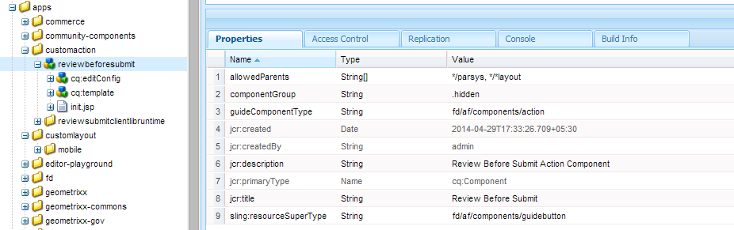
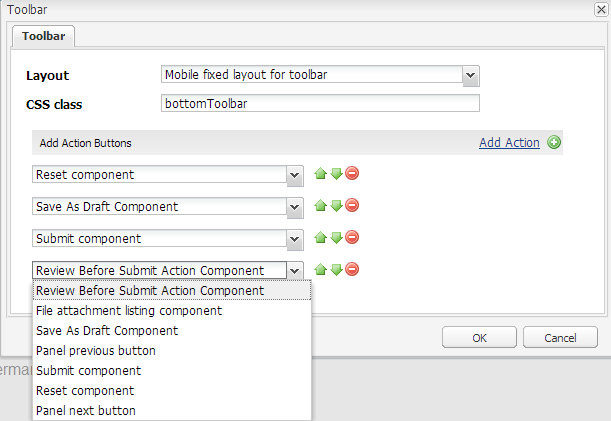
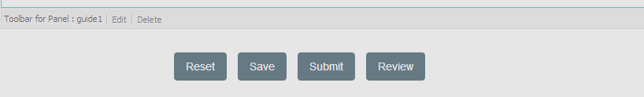

# Creating a custom toolbar action{#creating-a-custom-toolbar-action}

## Prerequisites {#prerequisite}

Before you create a custom toolbar action, make yourself familiar with [Using Client Side Libraries](/help/sites-developing/clientlibs.md) and [Developing with CRXDE Lite](/help/sites-developing/developing-with-crxde-lite.md).

## What is an action {#what-is-an-action-br}

An adaptive form provides a toolbar that lets a form author configure a set of options. These options are defined as actions for the adaptive form. Click the Edit button in the Toolbar for Panel to set the actions supported by adaptive forms.


Besides the set of actions provided by default, you can create custom actions in the toolbar. For example, you can add an action to enable the user to review all the adaptive form fields before a form is submitted.

## Steps to create a custom action in an adaptive forms {#steps}

To illustrate the creation of a custom toolbar action, the following steps guide you to create a button for end users to review all the adaptive form fields before submitting a filled form.

1. All the default actions supported by adaptive forms are present in `/libs/fd/af/components/actions` folder. In CRXDE, copy the `fileattachmentlisting` node from `/libs/fd/af/components/actions/fileattachmentlisting` to `/apps/customaction`.

1. After copying the node to `apps/customaction` folder, rename the node name to `reviewbeforesubmit`. Also, change the `jcr:title` and `jcr:description` properties of the node.

   The `jcr:title` property contains the name of the action that is displayed in the toolbar dialog. The `jcr:description` property contains more information that is displayed when a user hovers the pointer over the action.

   

1. Select `cq:template` node in `reviewbeforesubmit` node. Ensure that the value of `guideNodeClass` property is `guideButton` and change `jcr:title` property accordingly.
1. Change the type property in the `cq:Template` node. For the current example, change the type property to button.

   The type value is added as a CSS class in the generated HTML for the component. Users can use that CSS Class to style their actions. The default styling for both, mobile and desktop devices, is provided for the button, submit, reset, and save type values.

1. Select the custom action from the adaptive form edit toolbar dialog. A Review button is displayed in the toolbar for the panel.

    

1. To provide functionality to the Review button, add some JavaScript and CSS code and server-side code in the init.jsp file, present inside the `reviewbeforesubmit` node.

   Add the following code in `init.jsp`.

   ```jsp
   <%@include file="/libs/fd/af/components/guidesglobal.jsp" %>
   <guide:initializeBean name="guideField" className="com.adobe.aemds.guide.common.GuideButton"/>

   <c:if test="${not isEditMode}">
           <cq:includeClientLib categories="reviewsubmitclientlibruntime" />
   </c:if>

   <%--- BootStrap Modal Dialog  --------------%>
   <div class="modal fade" id="reviewSubmit" tabindex="-1">
       <div class="modal-dialog">
           <div class="modal-content">
               <div class="modal-header">
                   <h3>Review the Form Fields</h3>
               </div>
               <div class="modal-body">
                   <div class="modal-list">
                       <table class="table table-bordered">
                           <tr class="name">
                               <td class="reviewlabel col-md-3 active">
                                   <label>Your Name is: </label>
                               </td>
                           </tr>
                           <tr class="pan">
                               <td class="reviewlabel col-md-3 active">
                                   <label>Your Pan Number is: </label>
                               </td>
                           </tr>
                           <tr class="dob">
                               <td class="reviewlabel col-md-3 active">
                                   <label>Your Date Of Birth is: </label>
                               </td>
                           </tr>
                           <tr class="80cdeclaration">
                               <td class="reviewlabel col-md-3 active">
                                   <label>Your Total 80C Declaration Amount is: </label>
                               </td>
                           </tr>
                           <tr class="rentpaid">
                               <td class="reviewlabel col-md-3 active">
                                   <label>Your Total HRA Amount is: </label>
                               </td>
                           </tr>
                       </table>
                   </div>
               </div><!-- /.modal-body -->
               <div class="modal-footer">
                   <div class="fileAttachmentListingCloseButton col-md-2 col-xs-2 col-sm-2">
                       <button data-dismiss="modal">Close</button>
                   </div>
               </div>
           </div><!-- /.modal-content -->
       </div><!-- /.modal-dialog -->
   </div><!-- /.modal -->
   ```

   Add the following code in the `ReviewBeforeSubmit.js` file.

   ```javascript

   /*anonymous function to handle show of review before submit view */
   $(function () {
       if($("div.reviewbeforesubmit button[id*=reviewbeforesubmit]").length > 0) {
           $("div.reviewbeforesubmit button[id*=reviewbeforesubmit]").click(function(){
               // Create the options object to be passed to the getElementProperty API
               var options = {},
                   result = [];
               options.somExpressions = [];
               options.propertyName = "value";
               guideBridge.visit(function(model){
                   if(model.name === "name" || model.name === "pan" || model.name === "dateofbirth" || model.name === "total" || model.name === "totalmonthlyrent"){
                           options.somExpressions.push(model.somExpression);
                   }
               }, this);
               result = guideBridge.getElementProperty(options);

               $('#reviewSubmit .reviewlabel').each(function(index, item){
                   var data = ((result.data[index] == null) ? "No Data Filled" : result.data[index]);
                   if($(this).next().hasClass("reviewlabelvalue")){
                       $(this).next().html(data);
                   } else {
                       $(this).after($("<td></td>").addClass("reviewlabelvalue col-md-6 active").html(data));
                   }
               });
               // added because in mobile devices it was causing problem of backdrop
               $("#reviewSubmit").appendTo('body');
               $("#reviewSubmit").modal("show");
           });
       }
   });
   ```

   Add the following code to `ReviewBeforeSubmit.css` file.

   ```css
   .modal-list .reviewlabel {
       white-space: normal;
       text-align: right;
       padding:2px;
   }

   .modal-list .reviewlabelvalue {
       border: #cde0ec 1px solid;
       padding:2px;
   }

   /* Adding icon for this action in mobile devices */
   /* This is the glyphicon provided by bootstrap eye-open */
   /* .<type> .iconButton-icon */
   .reviewbeforesubmit .iconButton-icon {
       position: relative;
       top: -8px;
       font-family: 'Glyphicons Halflings';
       font-style: normal;
   }

   .reviewbeforesubmit .iconButton-icon:before {
       content: "\e105"
   }
   ```

1. To verify the functionality of the custom action, open the adaptive form in Preview mode and click Review in the toolbar.

   >[!NOTE]
   >
   >The `GuideBridge` library is not loaded in authoring mode. Hence, this custom action does not work in the authoring mode.

   

## Samples {#samples}

The following archive contains a content package. The package includes an adaptive form related to the above demo of custom toolbar action.

[Get File](assets/customtoolbaractiondemo.zip)
