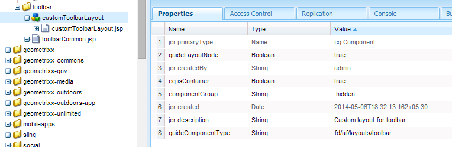
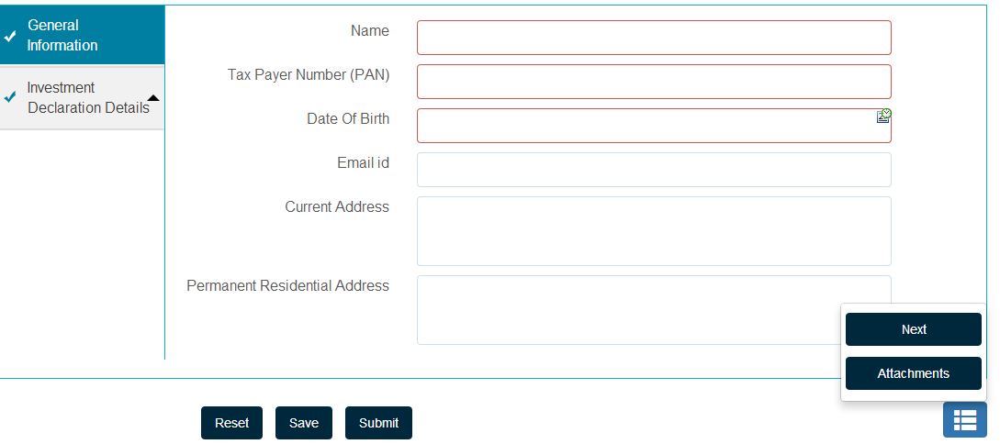

# Creating custom toolbar layout{#creating-custom-toolbar-layout}

## Toolbar layouts {#layout}

When you create an adaptive form, you can specify a toolbar layout for the form. The toolbar layout defines the commands and the layout of the toolbar on the form.

Toolbar layout uses rely heavily on client-side processing driven by complex JavaScript and CSS code. Organizing and optimizing the serving of this code can be a complicated issue. To help deal with this issue, AEM provides Client-side Library Folders, which let you store your client-side code in the repository, organize it into categories, and define when and how each category of code is to be served to the client. The client-side library system then takes care of producing the correct links in your final webpage to load the correct code. For detailed information, see [How client-side libraries work in AEM.](/help/sites-developing/clientlibs.md)


Sample layout of the toolbar

Adaptive forms provide a set of out-of-the-box layouts:


Toolbar layouts available out-of-the-box

In addition, you can create a custom toolbar layout.

The following procedure details the steps to create a custom toolbar that displays three actions in the toolbar and the other actions in a drop-down list in the toolbar.

The attached content package contains the entire code described below. After installing the content package, open `/content/forms/af/CustomLayoutDemo.html` to view the custom toolbar layout demo.

CustomToolbarLayoutDemo.zip

[Get File](assets/customtoolbarlayoutdemo.zip)
Demo custom toolbar layout

## To create a custom toolbar layout {#layout-1}

1. Create a folder to maintain your custom toolbar layouts. For example:

   `/apps/customlayout/toolbar`.

   To create a custom layout, you can use (and customize) one of the out-of-the-box toolbar layouts available in the following folder:

   `/libs/fd/af/layouts/toolbar`

   For example, copy the `mobileFixedToolbarLayout` node from the `/libs/fd/af/layouts/toolbar` folder to the `/apps/customlayout/toolbar` folder.

   Also, copy the toolbarCommon.jsp to the `/apps/customlayout/toolbar` folder.

   >[!NOTE]
   >
   >The folder that you create to maintain the custom layouts much be created with the `apps` folder.

1. Rename the copied node, `mobileFixedToolbarLayout`, to `customToolbarLayout.`

   Also, provide a relevant description for the node. For example, change the jcr:description of the node to **Custom layout for toolbar**.

   The `guideComponentType` property of the node determines the layout type. In this case, the layout type is toolbar, hence it appears in toolbar layout selection drop-down.

   

   A node with relevant description

   Your new custom toolbar layout is displayed in the **Adaptive Form Toolbar** dialog configuration.

   

   List of available toolbar layouts

   >[!NOTE]
   >
   >The description updated in the previous step is displayed in the Layout drop-down list.

1. Select this custom toolbar layout and click OK.

   Add clientlib (javascript and css) in the `/etc/customlayout` node and include the reference of the clientlib in the `customToolbarLayout.jsp`.

   

   Path of the customToolbarLayout.css file

   Sample `customToolbarLayout.jsp`:

   ```jsp
   <%@include file="/libs/fd/af/components/guidesglobal.jsp" %>
   <cq:includeClientLib categories="customtoolbarlayout" />
   <c:if test="${isEditMode}">
           <cq:includeClientLib categories="customtoolbarlayoutauthor" />
   </c:if>
   <div class="guidetoolbar mobileToolbar mobilecustomToolbar" data-guide-position-class="guide-element-hide">
       <div data-guide-scroll-indicator="true"></div>
       <%@include file="../toolbarCommon.jsp" %>
   </div>

   ```

   >[!NOTE]
   >
   >Add the guidetoolbar class for the layout. The out-of-the-box styling for the toolbar is defined with respect to the guidetoolbar class.

   Sample `toolBarCommon.jsp`:

   ```jsp
   <%@taglib prefix="fn" uri="https://java.sun.com/jsp/jstl/functions"%>
   <%--------------------
   This code iterates over all the tool bar items using the guideToolbar bean.
   If the number of toolbar items are more than 3, then we create a dropdown menu using bootstrap for other actions present in the toolbar.
   In both desktop and mobile devices, the layout is different.
   ---------------------------------%>

   <c:forEach items="${guideToolbar.items}" var="toolbarItem" varStatus="loop">
       <c:choose>
         <c:when test="${loop.index gt 2}">
      <c:choose>
       <c:when test="${loop.index eq 3}">
                     <div class="btn-group dropdown">
                       <button type="button" class="btn btn-primary dropdown-toggle label" data-toggle="dropdown">Actions <span class="caret"></code></button>
                       <button type="button" class="btn btn-primary dropdown-toggle icon" data-toggle="dropdown"><span class="glyphicon glyphicon-th-list"></code></button>
             <ul class="dropdown-menu" role="menu">
                           <li>
                               <div id="${toolbarItem.id}_guide-item">
                                 <sling:include path="${toolbarItem.path}" resourceType="${toolbarItem.resourceType}"/>
                              </div>
                           </li>
                           <c:if test="${loop.index eq (fn:length(guideToolbar.items)-1)}">
                                </ul>
                                </div>
                           </c:if>
       </c:when>
       <c:when test="${loop.index eq (fn:length(guideToolbar.items)-1)}">
                          <li>
                                     <div id="${toolbarItem.id}_guide-item">
                                         <sling:include path="${toolbarItem.path}" resourceType="${toolbarItem.resourceType}"/>
                                     </div>
                           </li>
                       </ul>
                     </div>

       </c:when>
       <c:otherwise>
         <li>
          <div id="${toolbarItem.id}_guide-item">
           <sling:include path="${toolbarItem.path}" resourceType="${toolbarItem.resourceType}"/>
          </div>
         </li>
       </c:otherwise>
      </c:choose>
         </c:when>
         <c:otherwise>
     <div id="${toolbarItem.id}_guide-item">
           <sling:include path="${toolbarItem.path}" resourceType="${toolbarItem.resourceType}"/>
        </div>
         </c:otherwise>
    </c:choose>
   </c:forEach>

   ```

   The CSS present inside the clientlib node:

   ```css
   .mobilecustomToolbar .dropdown {
       display: inline-block;
   }

   .mobilecustomToolbar .dropdown {
       float: right;
   }

   .mobilecustomToolbar .dropdown > button {
      padding: 6px 12px;
   }

   .mobilecustomToolbar .dropdown .guideFieldWidget, .mobilecustomToolbar .dropdown .guideFieldWidget button {
       width: 100%;
   }

   .mobilecustomToolbar .dropdown .caret{
       border-bottom: 6px solid;
       border-right: 6px solid transparent;
       border-left: 6px solid transparent;
    border-top: transparent;
   }

   .mobilecustomToolbar .dropdown-menu{
    top: auto;
    bottom: 100%;
   }

   .mobilecustomToolbar .btn-group {
    vertical-align: super;
   }

   .mobilecustomToolbar .glyphicon {
    font-size: 24px;
   }

   @media (max-width: 767px){

    .mobilecustomToolbar .dropdown .guideButton .iconButton-icon {
      display: none;
       }

       .mobilecustomToolbar .dropdown .guideButton .iconButton-label {
      display: inline-block;
       }

       .mobilecustomToolbar .dropdown .guideButton button {
      background-color: #013853;
       }

    .mobilecustomToolbar .btn-group {
     vertical-align: top;
    }

   }
   ```

>[!NOTE]
>
>The description updated in the previous step is displayed in the Layout drop-down list.



Desktop view of the custom layout toolbar
