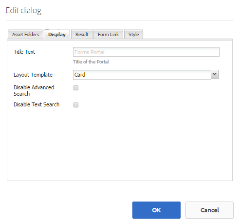
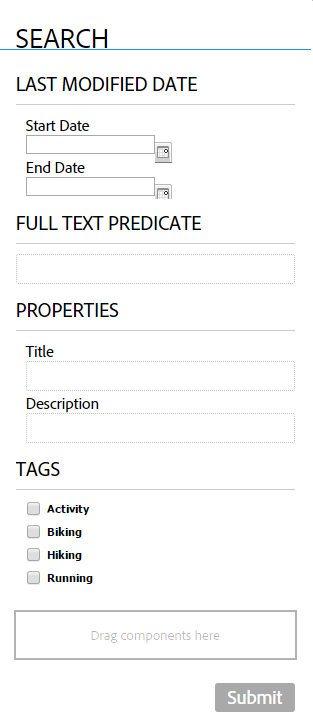
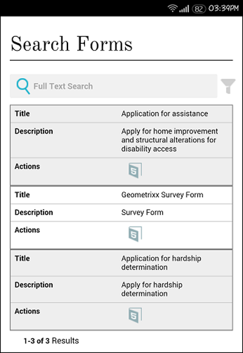

# Creating a forms portal page{#creating-a-forms-portal-page}

| Version | Article link |
| -------- | ---------------------------- |
| AEM as a Cloud Service |    [Click here](https://experienceleague.adobe.com/docs/experience-manager-cloud-service/content/forms/adaptive-forms-authoring/authoring-adaptive-forms-foundation-components/configure-forms-portal.html)                  |
| AEM 6.5     | This article         |

Forms portal components equips Web Developers with components to create and customize a forms portal on websites authored using Adobe Experience Manager (AEM). For a quick overview of forms portal, see [Introduction to publishing forms on a portal](../../forms/using/introduction-publishing-forms.md).

## Prerequisites {#prerequisites}

Forms portal components are not available for use by default. Ensure that the following forms portal component categories are enabled as described in [Enabling forms portal components](/help/forms/using/enabling-forms-portal-components.md).

**Document Services** Includes Search & Lister, Link, and Drafts and Submissions components.

**Document Services Predicates** Includes Date Predicate, Full Text Predicate, Properties Predicate, and Tags Predicate components. These components are used to configure search in the Search & Lister component.

Once they are enabled on an AEM sites page, these component categories are available for use in the component browser.

Forms portal component categories

## Search &amp; Lister Component {#search-amp-lister-component}

The Search & Lister component, available under Document Services component category, is used to list forms on a page and to implement search on the listed forms. The component includes two panes:

* List pane where the forms are listed.
* Search pane where you add the search functionality.

You can drag-drop the Search & Lister component from the Document Services component category in the components browser onto the page. The component, when added, looks similar to the following.

Search & Lister Component in a page with Grid layout

### List pane {#list-pane}

The List pane is an area where your forms are listed. The Search & Lister component provides various configuration options that you can use to control the display of forms in the List pane.

To configure the List pane, select the Search and Lister component and then select . The **[!UICONTROL  Edit Component]** dialog opens.

List pane in edit mode

The **Edit** dialog includes several tabs that provide configuration options described in the table below. Select **OK** to save the configuration, when done.

<table>
 <tbody>
  <tr>
   <th>Tab</th>
   <th>Configuration</th>
   <th>Description</th>
  </tr>
  <tr>
   <td><strong>Asset Folders</strong></code></td>
   <td>Add Item</td>
   <td>Configures the folders where assets are uploaded using AEM Forms UI. By default, it lists all uploaded assets. For more information about AEM Forms UI, see <a href="../../forms/using/introduction-managing-forms.md" target="_blank">Introduction to managing forms</a>.</td>
  </tr>
  <tr>
   <td>
<strong>Display</strong></code>
 </td>
   <td>Title Text</td>
   <td>Title for the Search &amp; Lister component. The default title is <strong>Forms Portal.</strong></td>
  </tr>
  <tr>
   <td> </td>
   <td>Layout Template</td>
   <td>Layout of the assets. </td>
  </tr>
  <tr>
   <td> </td>
   <td>Disable Advanced Search</td>
   <td>When enabled, hides the advanced search icon.</td>
  </tr>
  <tr>
   <td> </td>
   <td>Disable Text Search</td>
   <td>When enabled, hides the full-text search bar.</td>
  </tr>
  <tr>
   <td><strong>Result</strong></code></td>
   <td>Number Of Results Per Page</td>
   <td>Configures the maximum number of forms you want to display on a page.</td>
  </tr>
  <tr>
   <td> </td>
   <td>Results Text</td>
   <td>
Configures the results text (for example, 1-12 of 601 <strong>Results</strong>). The default value is <strong>Results</strong>.
 
For example, if you specify <strong>Forms </strong>in this field and there are a total of 601 forms, the result text changes to 1-12 of 601 <strong>Forms.</strong>
 </td>
  </tr>
  <tr>
   <td> </td>
   <td>Page Text</td>
   <td>
Configures the page text (for example, <strong>Page </strong>1 of 51). The default value is <strong>Page</strong>.
 
For example, if you specify <strong>Application Form </strong>in this field and there are 51 pages, the page text changes to <strong>Application Form </strong>1 of 51.
 </td>
  </tr>
  <tr>
   <td> </td>
   <td>Of Text</td>
   <td>
Replaces the word <strong>of</strong> with the specified text (Page 1 <strong>of </strong>51). The default value is <strong>of</strong>.
 
For example, if you specify <strong>out of </strong>in this field, the text changes to Page 1 <strong>out of </strong>51.
 </td>
  </tr>
  <tr>
   <td><strong>Form Link</strong></code></td>
   <td>Render Type</td>
   <td>Controls the listing of forms based on the specified render type. The available options are PDF and HTML. For example, if you select only HTML as the render type, the PDF forms are filtered out.</td>
  </tr>
  <tr>
   <td> </td>
   <td>HTML Profile</td>
   <td>Configures the HTML profile to use for rendering. All of the available profiles are listed in the drop-down list.</td>
  </tr>
  <tr>
   <td> </td>
   <td>Submit URL</td>
   <td>
Configures a servlet where the form data is submitted.
 
<strong>Note:</strong> <em>Submit URL for a form can be specified at several places and its order of precedence is as follows:</em>

    <ol>
     <li><em>Submit URL embedded in the form (in Submit button) has the highest priority.</em></li>
     <li><em>Submit URL mentioned in AEM Forms UI has the second highest priority.</em></li>
     <li><em>Submit URL mentioned in forms portal has the lowest priority.</em></li>
    </ol> </td>
  </tr>
  <tr>
   <td> </td>
   <td>HTML Render Action tool tip</td>
   <td>Configures the text for the tool tip, which is displayed on hovering the pointer over  (the HTML5 icon).</td>
  </tr>
  <tr>
   <td> </td>
   <td>PDF Render Action tool tip</td>
   <td>Configures the text for the tool tip, which is displayed on hovering the pointer over  (the PDF icon).</td>
  </tr>
  <tr>
   <td><strong>Style</strong></code></td>
   <td>Style Type</td>
   <td>Lets you specify <strong>No Style, Default Style</strong>, or <strong>Custom Style </strong>for listing the forms.</td>
  </tr>
  <tr>
   <td> </td>
   <td>Custom Style Path</td>
   <td>If you selected Custom as the Style Type, browse to specify the path to the custom CSS, else select Default.</td>
  </tr>
 </tbody>
</table>

### Search Pane {#search-pane}

The Search pane lets you add the Date Predicate, Full Text Predicate, Properties Predicate, and Tags Predicate components from the Document Services Predicates category in AEM Sidekick. These components implement the search functionality for users to perform search on the listed forms.

**Tip:** *You can control the list of forms displayed on your forms portal based on a preset criteria and hide the search functionality for end users. To control the list of forms, use the Predicate components to apply search filters. You can also specify the default filter values and disable the search from the Display tab of the Edit Component dialog.*

Search Panel with Date, Full Text, Properties, and Tags Predicate

#### Date Predicate {#date-predicate}

The Date Predicate component, when added, enables search on the listed forms that were modified during a specified duration.

To configure the Date Predicate component:

1. Select the component and then select . The Edit dialog opens.
1. Specify the following:

    * **Type:** The only option available is **Last Modified Date**

    * **Text:** Label or caption for the Date Predicate Component. The default value is **Last Modified Date.**

    * **Start Date Label:** Label or caption of start date field
    * **End Date Label:** Label or caption for end date field
    * **Hide:** To enforce default date filter to list forms

1. Select **OK**

#### Full Text Predicate {#full-text-predicate}

The Full Text Predicate component implements full text search on form data, such as name and description. Users can search any text string to returns forms that contain the text in their name or description.

To configure the Full Text Predicate component:

1. Select the component and then select . The Edit dialog opens.
1. Specify the title in the **Main Title** field.
1. Select **Ok**

#### Properties Predicate {#properties-predicate}

The Properties Predicate component implements searching of forms based on form properties, such as title, author and description.

To configure the Properties Predicate component:

1. Select the component and then select . The Edit dialog opens.
1. In the General tab, specify the search label. The default value is **Properties**

1. In the Options tab, select **Add Item.**
1. Select a property from the drop-down list and specify a search label for it in the field below the drop-down list.
1. Repeat step 4 to add more properties. You can also specify a default filter value to list forms based on the specified criteria and hide the property for search by end users. Select the Hide checkbox for a property and specify the default filter value.
   For example, if you want to display forms that contain "Travel" in their titles, select Hide next to the Title property. In addition, specify Travel in default filter value text box.

1. Select **OK**

#### Tags Predicate {#tags-predicate}

The Tags Predicate component implements searching of forms based on tags defined in Forms Manager.

To configure the Tags Predicate component:

1. Select the component and then select . The Edit dialog opens.
1. Select the down-arrow button next to the Tags field.
1. Select appropriate tags
1. Select **OK**

The selected tags appear in the Search pane along with the check boxes for selection. Users can now narrow down their search based on the tags.

## List forms on a page {#list-forms-on-a-page-br}

To list forms on a page, add the **[!UICONTROL Search & Lister]** Component to the page and configure the **[!UICONTROL List Pane]**. To enable the end users to search forms with date, text, and tags, add a **[!UICONTROL Search Pane]** component.

To link a form from anywhere on the page, use the Link component. For more information about link component, see [Embedding link component in a page](../../forms/using/embedding-link-component-page.md).

To list the forms that are in a draft state and the forms which are already submitted, use the **[!UICONTROL Drafts and Submissions]** component. For more information, see [Customizing Drafts and Submissions component](../../forms/using/draft-submission-component.md).

## Mobile device friendliness {#mobile-device-friendliness}

Forms Portal Search & Lister component is mobile device friendly and adapts accordingly. All three default views: Grid, Card, Panel relayouts according to the device in which site is opened provided with the fact that web page also adapts. The simple fact is that, Search & Lister is a component only and does not govern page level styling.

The following image depicts the Search & Lister component when opened on a mobile device:

Search & Lister component

## Customizing a forms portal page {#customizing-a-forms-portal-page-br}

You can customize a forms portal page to provide a distinct appearance to the page. You can also add metadata to improve search experience, change layout of the page, and add custom CSS styles. For more information, see [Customizing templates for Forms Portal Components](../../forms/using/customizing-templates-forms-portal-components.md).

AEM Forms UI lets you add custom metadata to forms. Custom metadata is useful in providing a listing and searching forms experience to the end users. For more information about Custom metadata, see [Customizing templates for Forms Portal Components](../../forms/using/customizing-templates-forms-portal-components.md).

Out of the box, forms portal provides rendering actions. You can customize forms portal to add more actions. For detailed information, see [Adding custom action on form lister items.](../../forms/using/add-custom-action-form-lister.md)

## Related Articles

* [Enable forms portal components](/help/forms/using/enabling-forms-portal-components.md)
* [Create forms portal page](/help/forms/using/creating-form-portal-page.md)
* [List forms on a web page using APIs](/help/forms/using/listing-forms-webpage-using-apis.md)
* [Use Drafts and submissions component](/help/forms/using/draft-submission-component.md)
* [Customize storage of drafts and submitted forms](/help/forms/using/draft-submission-component.md)
* [Sample for integrating drafts & submissions component with database](/help/forms/using/integrate-draft-submission-database.md)
* [Customizing templates for forms portal components](/help/forms/using/customizing-templates-forms-portal-components.md)
* [Introduction to publishing forms on a portal](/help/forms/using/introduction-publishing-forms.md)
