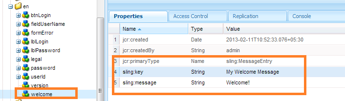

# Creating a new login screen{#creating-a-new-login-screen}

You can modify the login screen of all AEM Forms modules that use the AEM Forms login screen. For example, the modifications affect the login screen of, both, Forms Manager and AEM Forms workspace.

## Prerequisite {#prerequisite}

1. Log in at `/lc/crx/de` with Administrator permissions.
1. Perform the following actions:

   1. Replicate the hierarchical structure: of `/libs/livecycle/core/content` at `/apps/livecycle/core/content`. 
   
      Maintain the same (node/folder) properties and access control.

   1. Copy the content folder: 
   
      from: `/libs/livecycle/core` 
      
      to: `/apps/livecycle/core`.

   1. Delete the contents of `/apps/livecycle/core` folder.

1. Perform these actions:

   1. Replicate the hierarchical structure: of `/libs/livecycle/core/components/login` at `/apps/livecycle/core/components/login`. Maintain the same (node/folder) properties and access control.

   1. Copy the components folder: from `/libs/livecycle/core` to `/apps/livecycle/core`.

   1. Delete the contents of the folder: `/apps/livecycle/core/components/login`.

### Adding a new locale {#adding-a-new-locale}

1. Copy the `i18n` folder:

   * from `/libs/livecycle/core/components/login`
   * to `/apps/livecycle/core/components/login`

1. Delete all the folders inside `i18n` except one, say `en`.

1. On the folder `en`, perform these actions:

   1. Rename the folder to the locale name you wish to support. For example, `ar`.
   
   1. Change the property `jcr:language` value to `ar`(for the `ar` folder).

   >[!NOTE]
   >
   >If locale is a language-country code combination, say, `ar-DZ`, then change the folder name and property value to `ar-DZ`.

1. Copy `login.jsp`:

   * from `/libs/livecycle/core/components/login`
   * to `/apps/livecycle/core/components/login`

1. Modify the following snippet of code for `/apps/livecycle/core/components/login/login.jsp`:

***Locale is language code***

   ```jsp
   String browserLocale = "en";

       for(int i=0; i<locales.length; i++)
       {
           String prioperty = locales[i];
           if(prioperty.trim().startsWith("en")) {
               browserLocale = "en";
               break;
           }
           if(prioperty.trim().startsWith("de")){
               browserLocale = "de";
               break;
           }
           if(prioperty.trim().startsWith("ja")){
               browserLocale = "ja";
               break;
           }
           if(prioperty.trim().startsWith("fr")){
               browserLocale = "fr";
               break;
           }
       }
   ```

   To

   ```jsp
   String browserLocale = "en";
       for(int i=0; i<locales.length; i++)
       {
           String prioperty = locales[i];
           if(prioperty.trim().startsWith("ar")) {
               browserLocale = "ar";
               break;
           }
           if(prioperty.trim().startsWith("en")) {
               browserLocale = "en";
               break;
           }
           if(prioperty.trim().startsWith("de")){
               browserLocale = "de";
               break;
           }
           if(prioperty.trim().startsWith("ja")){
               browserLocale = "ja";
               break;
           }
           if(prioperty.trim().startsWith("fr")){
               browserLocale = "fr";
               break;
           }
       }
   ```

   ```jsp
   String browserLocale = "en";

       for(int i=0; i<locales.length; i++)
       {
           String prioperty = locales[i];
           if(prioperty.trim().startsWith("en")) {
               browserLocale = "en";
               break;
           }
           if(prioperty.trim().startsWith("de")){
               browserLocale = "de";
               break;
           }
           if(prioperty.trim().startsWith("ja")){
               browserLocale = "ja";
               break;
           }
           if(prioperty.trim().startsWith("fr")){
               browserLocale = "fr";
               break;
           }
       }
   ```

   To

   ```jsp
   String browserLocale = "en";
       for(int i=0; i<locales.length; i++)
       {
           String prioperty = locales[i];
           if(prioperty.trim().equalsIgnoreCase("ar-DZ")) {
               browserLocale = "ar-DZ";
               break;
           }
           if(prioperty.trim().startsWith("en")) {
               browserLocale = "en";
               break;
           }
           if(prioperty.trim().startsWith("de")){
               browserLocale = "de";
               break;
           }
           if(prioperty.trim().startsWith("ja")){
               browserLocale = "ja";
               break;
           }
           if(prioperty.trim().startsWith("fr")){
               browserLocale = "fr";
               break;
           }
       }
   ```

***To change Default locale***

```jsp

   String browserLocale = "en";
   for(int i=0; i<locales.length; i++)

   To

   String browserLocale = "ar";
   for(int i=0; i<locales.length; i++)

```

### Adding new text, or modifying existing text {#adding-new-text-or-modifying-existing-text}

1. Copy `i18n` folder:

   * from `/libs/livecycle/core/components/login`
   * to `/apps/livecycle/core/components/login`

1. Now modify the value of the property `sling:message` of the node (under the desired locale code folder) for which you wish to change the text. Translation is done via the key mentioned in the value of `sling:key` property of the node.

1. For adding new key-value pair, perform the following actions. Check an example in the screenshot that follows.

   1. Create a node of type `sling:MessageEntry`, or copy an existing node and rename it, under all the locale folders.
   1. Copy `login.jsp` :

      * from `/libs/livecycle/core/components/login`

      * to `/apps/livecycle/core/components/login`

   1. Modify `/apps/livecycle/core/components/login/login.jsp` to incorporate the newly added text.

   

   ```jsp

   div class="loginContent">

                       <span class="loginFlow"></code>
                       <span class="loginVersion"><%= i18n.get("Version: 11.0.0") %></code>
                       <span class="loginTitle"><%= i18n.get("Login") %></code>
                       <% if (loginFailed) {%>

   ```

   To

   ```jsp

   div class="loginContent">

                       <span class="loginFlow"></code>
                       <span class="loginVersion"><%= i18n.get("My Welcome Message") %></code>
                       <span class="loginVersion"><%= i18n.get("Version: 11.0.0") %></code>
                       <span class="loginTitle"><%= i18n.get("Login") %></code>
                       <% if (loginFailed) {%>

   ```

### Adding new style, or modifying existing style {#adding-new-style-or-modifying-existing-style}

1. Copy `login` node:

   * from `/libs/livecycle/core/content`
   * to `/apps/livecycle/core/content`

1. Delete files `login.js` and `jquery-1.8.0.min.js`, from the node `/apps/livecycle/core/content/login.`
1. Modify the styles in the CSS file.
1. To add new styles:

   1. Add new styles to `/apps/livecycle/core/content/login/login.css`
   1. Copy `login.jsp`

      * from `/libs/livecycle/core/components/login`

      * to `/apps/livecycle/core/components/login`

   1. Modify `/apps/livecycle/core/components/login/login.jsp` to incorporate the newly added styles.


For example:

* Add the following to `/apps/livecycle/core/content/login/login.css`.

```
css.newLoginContentArea {
    width: 700px;
    padding: 100px 0px 0px 100px;
   }
```

* Modify following in `/apps/livecycle/core/components/login.jsp`.


   ```jsp

   <div class="loginContentArea">


   ```

   To

   ```jsp

   <div class="newLoginContentArea">

   ```

>[!NOTE]
>
>If the existing images in `/apps/livecycle/core/content/login` (copied from `/libs/livecycle/core/content/login`) are removed, then remove the corresponding references in CSS.

### Add new images {#add-new-images}

1. Follow the steps of Adding new style, or modifying existing style (documented above).
1. Add new images in `/apps/livecycle/core/content/login`. To add image:

   1. Install WebDAV client.
   1. Navigate to `/apps/livecycle/core/content/login` folder, using webDAV client. For more information, see: [https://dev.day.com/docs/en/crx/current/how_to/webdav_access.html](https://experienceleague.adobe.com/docs/experience-manager-release-information/aem-release-updates/previous-updates/aem-previous-versions.html?lang=en).

   1. Add new images.

1. Add new styles in `/apps/livecycle/core/content/login/login.css,` corresponding to new images added in `/apps/livecycle/core/content/login`.
1. Use the new styles in `login.jsp` at `/apps/livecycle/core/components`.

For Example:


   ```css

   .newLoginContainerBkg {

    background-image: url(my_Bg.gif);
    background-repeat: no-repeat;
    background-position: left top;
    width: 727px;
   }
  
   ```


    * Modify following in /apps/livecycle/core/components/login.jsp.

   ```jsp

   <div class="loginContainerBkg">


   ```

   To

   ```jsp

   <div class="newLginContainerBkg">

   ```
