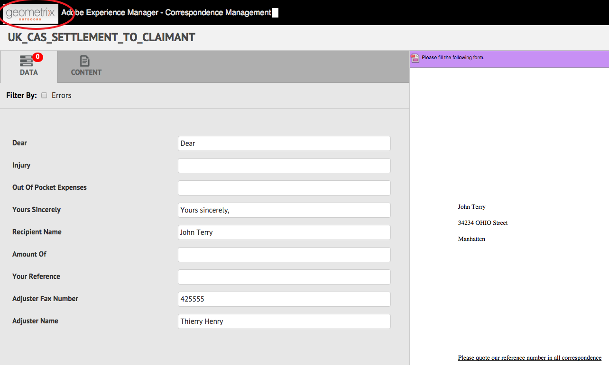

# Customize create correspondence UI{#customize-create-correspondence-ui}

## Overview {#overview}

Correspondence Management lets you rebrand its solution template for better brand value and to adhere to your organization's branding standards. Rebranding the user interface includes changing the organization logo, which is displayed at the upper-left corner of Create Correspondence UI.

You can change the logo in the Create Correspondence UI with your organization's logo.



The custom icon in the Create Correspondence UI

### Changing the logo in the Create Correspondence UI {#changing-the-logo-in-the-create-correspondence-ui}

To set up a logo image of your choice, do the following:

1. Create the appropriate [folder structure in CRX](#creatingfolderstructure). 
1. [Upload the new logo file](#uploadlogo) in the folder that you have created in CRX.   

1. [Set up the CSS](#createcss) on CRX to refer to the new logo.
1. Clear the browser history and [refresh the Create Correspondence UI](#refreshccrui).

## Creating the required folder structure {#creatingfolderstructure}

Create the folder structure, as explained below, for hosting the custom logo image and the style sheet. The new folder structure with the root folder /apps is similar to the /libs folder's structure.

For any customization, create a parallel folder structure, as explained below, in the /apps branch.

The `/apps` branch (folder structure):

* Ensures that your files are safe if there is an update to the system. If there is an upgrade, feature pack, or a hot fix, the `/libs` branch gets updated and if you host your changes in the `/libs` branch, they are overwritten.
* Helps to not disturb the present system/branch, which you can possibly unsettle by mistake if you use the default locations for storing the custom files.
* Helps your resources get a higher priority when AEM searches for resources. AEM is configured to search the `/apps` branch first and then the `/libs` branch to find a resource. This mechanism means that the system uses your overlay (and the customizations defined there).

Use the following steps to create the required folder structure in the `/apps` branch:

1. Go to `https://'[server]:[port]'/[ContextPath]/crx/de` and login as Administrator.
1. In the apps folder, create a folder named `css` with path/structure similar to the css folder (in the ccrui folder).   
  
   Steps for creating the css folder:

    1. Right-click the **css** folder at the following path and select **Overlay Node**: `/libs/fd/cm/ccr/gui/components/admin/clientlibs/ccrui/css`
    
       

    1. Ensure that the Overlay Node dialog has the following values:

       **Path:** `/libs/fd/cm/ccr/gui/components/admin/clientlibs/ccrui/css`

       **Overlay Location:** `/apps/`

       **Match Node Types:** Checked

       

       >[!NOTE]
       >
       >Do not change the `/libs` branch. Any changes you do make may be lost, because this branch is liable to any changes whenever you:
       >
       >    
       >    
       >    * Upgrade on your instance
       >    * Apply a hot fix
       >    * Install a feature pack
       >    
       >

    1. Click **OK**. The css folder is created in the specified path.

1. In the apps folder, create a folder named `imgs` with path/structure similar to the `imgs` folder (in the ccrui folder).

    1. Right-click the **imgs** folder at the following path and select **Overlay Node**: `/libs/fd/cm/ccr/gui/components/admin/clientlibs/ccrui/imgs`
    1. Ensure that the Overlay Node dialog has the following values:

       **Path:** /libs/fd/cm/ccr/gui/components/admin/clientlibs/ccrui/imgs

       **Overlay Location:** /apps/

       **Match Node Types:** Checked
    
    1. Click **OK**.

       >[!NOTE]
       >
       >You can also create the folder structure in the /apps folder manually.

1. Click **Save All** to save the changes on the server.

## Upload the new logo to CRX {#uploadlogo}

Upload your custom logo file to CRX. Standard HTML rules govern the rendering of the logo. The image file formats supported are according to the browser that you are using to access AEM Forms. All the browsers support JPEG, GIF, and PNG. For more information, see the browser-specific documentation on the supported image formats.

* The default dimensions of the logo image are 48 px &#42; 48 px. Ensure that your image is similar to this size or bigger than 48 px &#42; 48 px.
* If the height of your logo image is more than 50 px, the Create Correspondence user interface scales down the image to a maximum height of 50 px as this is the height of the header. While scaling the image down, the Create Correspondence user interface maintains the aspect ratio of your image. 
* The Create Correspondence User Interface does not scale up your image if it is small, so ensure you use a logo image at least 48 px in height and sufficient width for clarity.

Use the following steps to upload the custom logo file to CRX:

1. Go to `https://'[server]:[port]'/[contextpath]/crx/de`. If necessary, log in as Administrator.
1. In CRXDE, right-click the **imgs** folder at the following path and select **Create &gt; Create File**:

   `/apps/fd/cm/ccr/gui/components/admin/clientlibs/ccrui/imgs/`

   

1. In the Create File dialog, enter the name of the file as CustomLogo.png (or the name of your logo file).

   

1. Click **Save All**.

   Under the new file that you have created (here CustomLogo.png), jcr:content property appears.

1. Click jcr:content in the folder structure.

   jcr:content's properties appear. 

   

1. Double-click the **jcr:data** property.

   The Edit jcr:data dialog appears.

   Now click the newlogo.png folder, then double-click jcr:content (dim option) and set the type nt:resource. If it is not present, create a property with the name jcr:content.  

1. In the Edit jcr:data dialog, click **Browse** and select the image file you want to use as a logo (here CustomLogo.png).   
  
   The image file formats supported are according to the browser that you are using to access AEM Forms. All the browsers support JPEG, GIF, and PNG. For more information, see the browser-specific documentation on the supported image formats. 

   

   Example: CustomLogo.png to be used as the custom logo

1. Click **Save All**.

## Create the CSS for rendering the logo with the UI {#createcss}

The custom logo image requires an additional style sheet to be loaded in the content context.

Use the following steps to create the style sheet for rendering the logo with the UI:

1. Go to `https://'[server]:[port]'/[contextpath]/crx/de`. If necessary, log in as Administrator.
1. Create a file named customcss.css (you cannot use a different filename) in the following location:

   `/apps/fd/cm/ccr/gui/components/admin/clientlibs/ccrui/css/`

   Steps to create the customcss.css file:

    1. Right-click the **css** folder and select **Create &gt; Create File**.
    1. In the New File dialog, specify the name of the CSS as `customcss.css`(you cannot use a different filename), and click **OK**.
    1. Add the following code to the newly created css file. In content:url in the code, specify the image name you have uploaded to the imgs folder in CRXDE.

       ```css    
       .logo, .logo:after {
       content:url("../imgs/CustomLogo.png");
       }
       ```

    1. Click **Save All**.

## Refresh the Create Correspondence UI so you can see the custom logo {#refreshccrui}

Clear the browser cache, and then open the Create Correspondence UI instance in your browser so you can see your custom logo. 


The custom icon in the Create Correspondence UI
