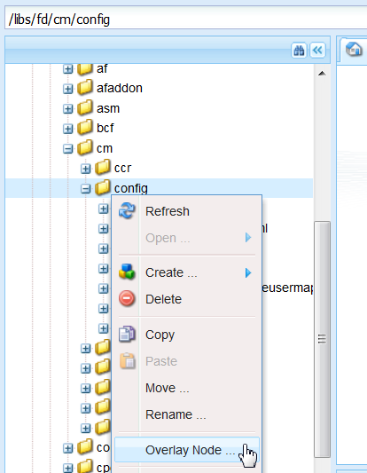
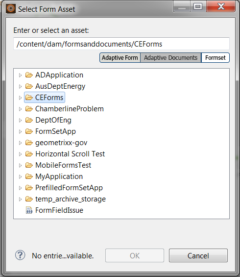
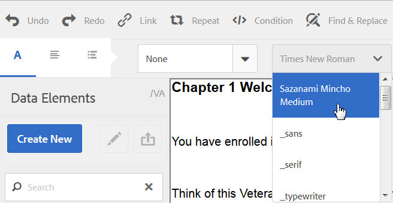

# Customize text editor{#customize-text-editor}

## Overview {#overview}

You can customize the text editor, in Manage Assets and Create Correspondence UI, to add more fonts and font sizes. These fonts include English and non-English, such as Japanese, fonts.

You can customize to change the following in font settings:

* Font family and size
* Properties such as height and letter spacing
* Default values of font family and size, height, letter spacing, and date format
* Bullet indents

Do the following:

1. [Customize fonts by editing the tbxeditor-config.xml file in CRX](#customizefonts)
1. [Add custom fonts to the client computer](#addcustomfonts)

## Customize fonts by editing the tbxeditor-config.xml file in&nbsp;CRX {#customizefonts}

To customize fonts by editing the tbxeditor-config.xml file, do the following:

1. Go to `https://'[server]:[port]'/[ContextPath]/crx/de` and login as Administrator.
1. In the apps folder, create a folder named config with path/structure similar to the config folder, which is at libs/fd/cm/config, using the following steps:

    1. Right-click the items folder at the following path and select **Overlay Node**:

       `/libs/fd/cm/config`
    
       

    1. Ensure that the Overlay Node dialog has the following values:

       **Path:** /libs/fd/cm/config

       **Location:** /apps/

       **Match Node Types:** Selected
    
       

    1. Click **OK**. The folder structure is created in the apps folder.  

    1. Click **Save All**.

1. Create a copy of the tbxeditor-config.xml file in the newly created config folder, using the following steps:

    1. Right-click the tbxeditor-config.xml file at libs/fd/cm/config and select **Copy**.
    1. Right-click the following folder and select **Paste:**

       `apps/fd/cm/config`
    
    1. The name of pasted file, by default, is `copy of tbxeditor-config.xml.` Rename the file to `tbxeditor-config.xml` and click **Save All**.

1. Open the tbxeditor-config.xml file at apps/fd/cm/config and then make the required changes.

    1. Double-click the tbxeditor-config.xml file at apps/fd/cm/config. The file opens.

       ```xml  
       <editorConfig>
          <bulletIndent>0.25in</bulletIndent>
           
          <defaultDateFormat>DD-MM-YYYY</defaultDateFormat>
           
          <fonts>
             <default>Times New Roman</default>
             <font>_sans</font>
             <font>_serif</font>
             <font>_typewriter</font>
             <font>Arial</font>
             <font>Courier</font>
             <font>Courier New</font>
             <font>Geneva</font>
             <font>Georgia</font>
             <font>Helvetica</font>
             <font>Tahoma</font>
             <font>Times New Roman</font>
             <font>Times</font>
             <font>Verdana</font>
          </fonts>
           
          <fontSizes>
             <default>12</default>
             <fontSize>8</fontSize>
             <fontSize>9</fontSize>
             <fontSize>10</fontSize>
             <fontSize>11</fontSize>
             <fontSize>12</fontSize>
             <fontSize>14</fontSize>
             <fontSize>16</fontSize>
             <fontSize>18</fontSize>
             <fontSize>20</fontSize>
             <fontSize>22</fontSize>
             <fontSize>24</fontSize>
             <fontSize>26</fontSize>
             <fontSize>28</fontSize>
             <fontSize>36</fontSize>
             <fontSize>48</fontSize>
             <fontSize>72</fontSize>
          </fontSizes>
           
          <lineHeights>
             <default>2</default>     
             <lineHeight>2</lineHeight>
             <lineHeight>3</lineHeight>
             <lineHeight>4</lineHeight>
             <lineHeight>5</lineHeight>
             <lineHeight>6</lineHeight>
             <lineHeight>7</lineHeight>
             <lineHeight>8</lineHeight>
             <lineHeight>9</lineHeight>
             <lineHeight>10</lineHeight>
             <lineHeight>11</lineHeight>
             <lineHeight>12</lineHeight>
             <lineHeight>13</lineHeight>
             <lineHeight>14</lineHeight>
             <lineHeight>15</lineHeight>
             <lineHeight>16</lineHeight>
          </lineHeights>
           
          <letterSpacings>
             <default>0</default>
             <letterSpacing>0</letterSpacing>
             <letterSpacing>1</letterSpacing>
             <letterSpacing>2</letterSpacing>
             <letterSpacing>3</letterSpacing>
             <letterSpacing>4</letterSpacing>
             <letterSpacing>5</letterSpacing>
             <letterSpacing>6</letterSpacing>
             <letterSpacing>7</letterSpacing>
             <letterSpacing>8</letterSpacing>
             <letterSpacing>9</letterSpacing>
             <letterSpacing>10</letterSpacing>
             <letterSpacing>11</letterSpacing>
             <letterSpacing>12</letterSpacing>
             <letterSpacing>13</letterSpacing>
             <letterSpacing>14</letterSpacing>
             <letterSpacing>15</letterSpacing>
             <letterSpacing>16</letterSpacing>
          </letterSpacings>
       </editorConfig>
       ```

    1. Make the required changes in the file so you can change the following in font settings:

        * Add or remove font family and size
        * Properties such as height and letter spacing
        * Default values of font family and size, height, letter spacing, and date format
        * Bullet indents

       For example, to add a Japanese font called Sazanami Mincho Medium, you must make the following entry in the XML file: `<font>Sazanami Mincho Medium</font>`. You must also have this font installed on the client machine used to access and work with the font customization. For more information, see [Add custom fonts to the client computer](#addcustomfonts).   
  
       You can also change the defaults for various aspects of text and, by removing the entries, remove the fonts from the text editor. 
    
    1. Click **Save All**.

## Add custom fonts to the client computer {#addcustomfonts}

When you access a font in the Correspondence Management text editor, it must be present in the client machine you are using to access Correspondence Management. To be able to use a custom font in the text editor, first you must install the same on the client machine.

For more information on installing fonts, see the following:

* [Install or uninstall fonts on Windows](https://windows.microsoft.com/en-us/windows-vista/install-or-uninstall-fonts)
* [Mac Basics: Font Book](https://support.apple.com/en-us/HT201749)

## Access font customizations {#access-font-customizations}

After you have changed fonts in the `tbxeditor-config.xml` file in CRX and installed the required fonts on the client machine used to access AEM Forms, the changes appear in the text editor.

For example, the Sazanami Mincho Medium font added in the [Customize fonts by editing the tbxeditor-config.xml file in CRX](#customizefonts) procedure appears in the text editor UI as following:



>[!NOTE]
>
>To see text in Japanese, you first must enter the text with Japanese characters. The application of a custom Japanese font only formats the text in a certain way. Application of a custom Japanese font does not change English or other characters to Japanese characters.
