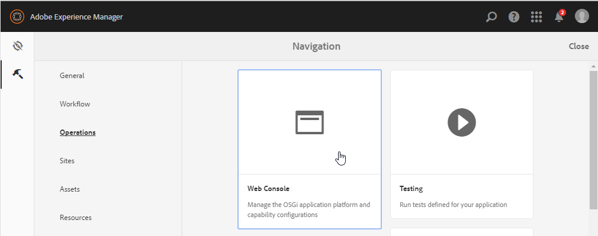
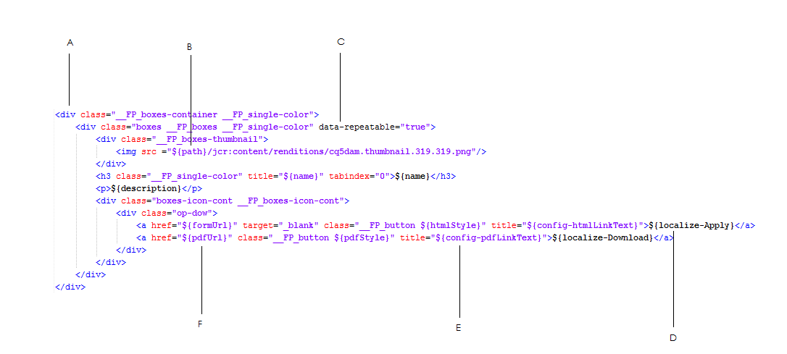

# Customizing templates for Forms Portal components{#customizing-templates-for-forms-portal-components}

## Prerequisites {#prerequisites}

[Managing form metadata](../../forms/using/manage-form-metadata.md)

Working knowledge of HTML and CSS

## Overview {#overview}

The AEM Forms user interface lets you add metadata to any form. Custom metadata can enhance user experience while listing and searching forms of your organization.

Forms Portal lets you use custom metadata in form listings. While creating custom templates for assets, you can modify their layout and use custom metadata with your CSS style set.

Do the following so you can create a custom template for various Forms Portal components.

## Creating a&nbsp;custom template {#creating-a-nbsp-custom-template}

1. Create a sling:Folder node under /apps

   Add a "fpContentType" property. Specify appropriate values for the property depending on the component for which you are defining the custom template.

    * Search & Lister component: "/libs/fd/fp/formTemplate"
    * Drafts & Submissions Component:

        * Drafts Section: /libs/fd/fp/draftsTemplate
        * Submissions Section: /libs/fd/fp/submissionsTemplate

    * Link Component: /libs/fd/fp/linkTemplate

   Add a title that you want displayed while selecting layout templates.

   >[!NOTE]
   >
   >The title can be different from the node name of sling:Folder you created.

   The following image depicts the configuration for the Search & Lister component.
   

1. Create a file template.html in this folder so it can serve as the custom template.
1. Write the custom template and use custom metadata as described below.

## Working example {#working-example}

The following is a sample implementation of a custom template where Forms Portal acquires a custom Geometrixx Gov Card Layout for the Search & Lister component.

```html
<div class="__FP_boxes-container __FP_single-color">
    <div class="boxes __FP_boxes __FP_single-color" data-repeatable="true">
 <div class="__FP_boxes-thumbnail">
     
        </div>
        <h3 class="__FP_single-color" title="${name}" tabindex="0">${name}</h3>
        <p>${description}</p>
        <div class="boxes-icon-cont __FP_boxes-icon-cont">
            <div class="op-dow">
                <a href="${formUrl}" target="_blank" class="__FP_button ${htmlStyle}" title="${config-htmlLinkText}">${localize-Apply}</a>
                <a href="${pdfUrl}" class="__FP_button ${pdfStyle}" title="${config-pdfLinkText}">${localize-Download}</a>
            </div>
        </div>
    </div>
</div>
```

## Technical specifications for custom templates {#technical-specifications-for-custom-templates}

A custom template for any Forms Portal component includes repeatable and non-repeatable entries. Repeatable entries are basic entities for listing. Examples of repeatable entries are Search & Lister, Drafts & Submissions, and Link components.

Forms Portal provides a syntax for place-holders to display custom/out-of-the-box metadata. The placeholders are populated after displaying the results of forms, drafts, or submissions.

To include a repeatable entry, configure the value of the attribute **data-repeatable** to **true**.

*In the example discussed, two Div elements are present at the top in the custom template. The first, with "__FP_boxes-container" CSS class, works as a container element for the forms that are listed. The second, with "__FP_boxes" CSS class, is a template for the basic entities, in this case a Form. The **data-repeatable** attribute present in the Div element has the value **true**.*

Each placeholder has an exclusive out-of-the-box metadata set. To display custom metadata at a particular place on the form, add the **${metadata_prop} property** at the place.

*In the example, the metadata property is used at multiple instances. For example, it is used in **description**, **name**, **formUrl**, **htmlStyle**, **pdfUrl**, **pdfStyle**, and **path** in the prescribed manner.*

## Out of the box metadata {#out-of-the-box-metadata}

Various Forms Portal components provide exclusive sets of out-of-the-box metadata that you can use for listing.

### Search &amp; Lister component {#search-amp-lister-component}

* **Title:** Title of the form
* **name**: Name of the form (mostly it is the same as the title)
* **description**: Description of the form
* **formUrl**: URL to render the form as HTML
* **pdfUrl**: URL to render the form as PDF
* **assetType**: Type of the asset. Valid values include **Form**, **PDF Form**, **Print Form**, and **Adaptive Form**

* **htmlStyle **& **pdfStyle**: Display style for HTML and PDF icons respectively used for rendering. Valid values are "**__FP_display_none**" or blank.

>[!NOTE]
>
>Remember to use the __FP_display_none class in your custom style sheet.
  
* **downloadUrl**: URL to download an asset.

Support for localization, sorting, and using configuration properties on the user interface (Search & Lister Only):

1. **Localization Support**: To localize any static text use the attribute `${localize-YOUR_TEXT}` and make the localized value available, if does not exist already.
   *In the example discussed, the attributes `${localize-Apply}` and `${localize-Download}` are used to localize the Apply and Download text.*

1. **Support for Sorting**: Click the HTML element to sort search results. To implement sorting in a table layout, add the "data-sortKey" attribute on the particular table header. In addition, add its value as the metadata for which you want to sort.
   For example, for the "Title" header in the grid view, the value of the "data-sortKey" header is "title". Click the heading so you can sort the values in a particular column.

1. **Using configuration properties**: The Search & Lister component has several configurations that you can use on the user interface. For example, to display HTML ToolTip text saved through the edit dialog, use the `${config-htmlLinkText}` attribute. **Similarly, for PDF tool tip text, use the** `${config-pdfLinkText}` attribute.

### Link component {#link-component}

* **Title:** Title of the form
* **formUrl**: URL to render the form as HTML
* **target**: Target attribute of the link. Valid values are "_blank" and "_self."
* **linkText**: Link caption

### Drafts &amp; Submissions component {#drafts-amp-submissions-component}

* **Path**: Path of the draft/submissions metadata node. Use it with the .HTML extension as a URL so you can open a draft or submission.
* **contextPath**: Context path of the AEM instance
* **firstLetter**: First letter (uppercase) of the title of the adaptive form, which was saved as Draft or submitted.
* **formName**: The title of the adaptive form, which was saved as Draft or submitted.
* **draftID**: ID for the draft that is listed (Use only in the template for the Draft section).
* **submitID**: ID for the submission that is listed (Use only in the template for the Submission section).
* **status**: Status of the submitted form. (Use only in the template for the Submission section).
* **description**: Description of the adaptive form associated with the draft or submission.
* **diffTime**: Difference between the current time and the last save action for the draft. Alternatively, the difference between the current time and the last submitted action for the submission.
* **iconClass**: CSS class used to display the first letter of the draft/submission. Forms Portal includes the following classes, which provide various colored backgrounds.
* **owner**: User who created the draft/submission.
* **Today**: Date of creation of draft or submission in `DD:MM:YYYY` format.
* **TimeNow**: Time of creation of draft or submission in `HH:MM:SS` 24-hour format

*Note:*

1. For the delete option in the Drafts section under the Drafts & Submissions component, name the CSS class "__FP_deleteDraft." In addition, include the attribute "draftID" with the value **${draftID}**, which is the draft id of corresponding draft.

1. While creating links to open drafts and submissions, you can specify **${path}.html** as the value of the **href** attribute for the anchor tag.



**A**. Container element

**B.** "path" metadata with a fixed hierarchy to obtain the thumbnail stored for each form.

**C.** Data-repeatable attribute used for the template section for each form

**D.** Localize "Apply" string

**E.** Using the configuration property pdfLinkText

**F.** Using the "pdfUrl" metadata

## Tips, tricks, and known issues {#tips-tricks-and-known-issues}

1. Do not use single quote (') in any custom template.
1. For custom metadata, store this property on the **jcr:content/metadata** node only. If you store it at any other place, Forms Portal cannot display the metadata.
1. Ensure that the name of any custom metadata or existing metadata does not include a colon ( : ). If it does, you cannot display it on the user interface.
1. **data-repeatable** does not have any significance for a **Link** component. Adobe recommends that you avoid using this property in the template for a Link component.

## Related Articles

* [Enable Forms Portal components](/help/forms/using/enabling-forms-portal-components.md)
* [Create Forms Portal page](/help/forms/using/creating-form-portal-page.md)
* [List forms on a web page using APIs](/help/forms/using/listing-forms-webpage-using-apis.md)
* [Use Drafts and submissions component](/help/forms/using/draft-submission-component.md)
* [Customize storage of drafts and submitted forms](/help/forms/using/draft-submission-component.md)
* [Sample for integrating drafts and submissions component with database](/help/forms/using/integrate-draft-submission-database.md)
* [Customizing templates for Forms Portal components](/help/forms/using/customizing-templates-forms-portal-components.md)
* [Introduction to publishing forms on a portal](/help/forms/using/introduction-publishing-forms.md)
