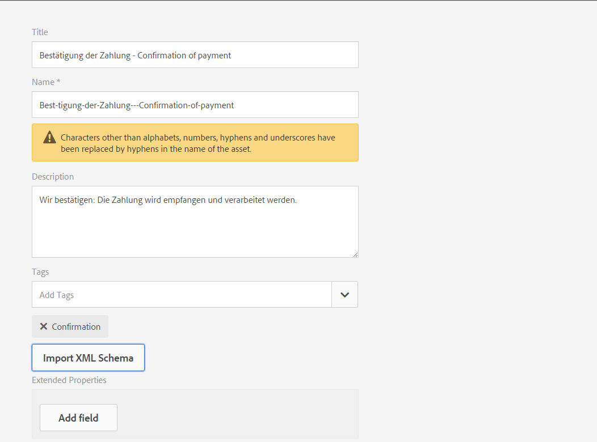
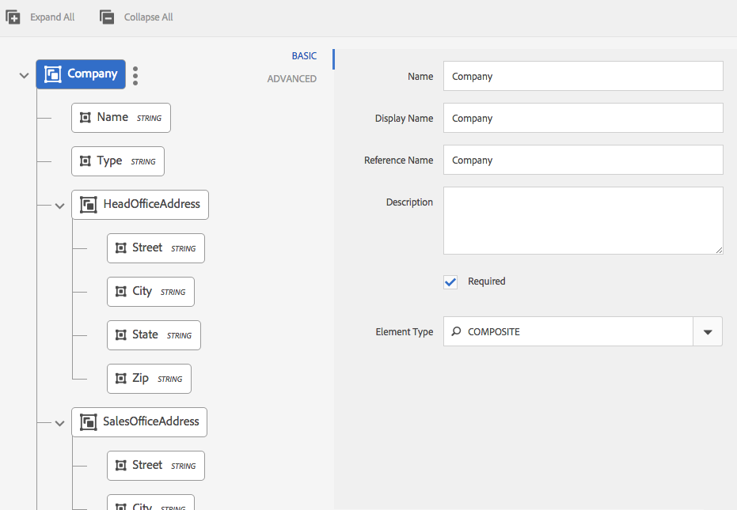
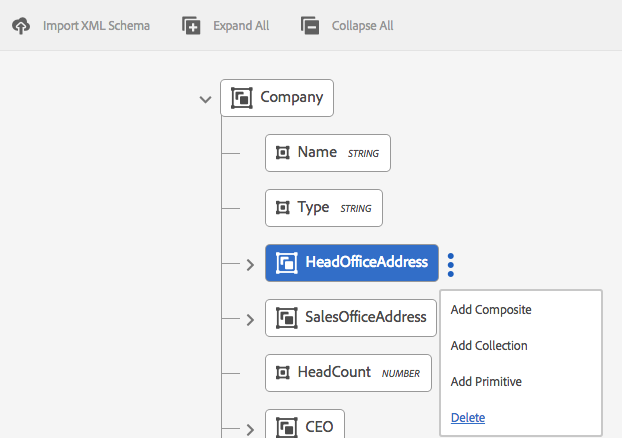
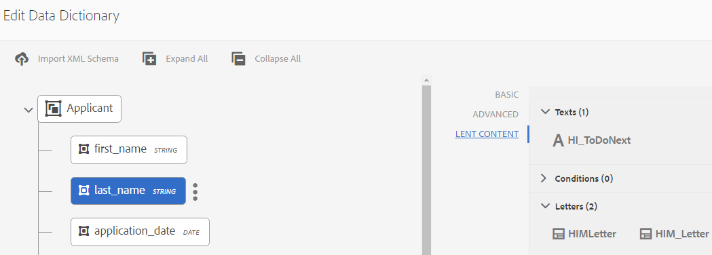

# Data Dictionary{#data-dictionary}

## Introduction {#introduction}

A data dictionary enables business users to use information from back-end data sources without knowing technical details about their underlying data models. A data dictionary is composed of data dictionary elements (DDEs). You use these data elements to integrate back-end data to the letters as input for use in a customer correspondence.

A data dictionary is an independent representation of metadata that describes underlying data structures and their associated attributes. A data dictionary is created using business vocabulary. It can be mapped to one or more underlying data models.

The data dictionary is made up of elements of three types: Simple, Composite, and Collection elements. Simple DDEs are primitive elements such as strings, numbers, dates, and Boolean values that hold information such as a city name. A Composite DDE contains other DDEs, which can be of type primitive, composite or collection. For example, an address, which consists of a street address, city, province, country, and postal code. A Collection is a list of similar Simple or Composite DDEs. For example, a customer with multiple locations, or different billing and shipping addresses.

Correspondence Management uses the back end, customer, or recipient-specific data stored according to the data dictionary's structure to create correspondence meant for different customers. For example, a document can be created with friendly names, such as "Dear {First Name}","Mr. {Last Name}".

Typically, business users do not require knowledge of metadata representations such as XSD (XML schema), and Java classes. However, they usually require access to these data structures and attributes to build solutions.

### Data Dictionary workflow {#data-dictionary-workflow}

1. An Author [creates the Data Dictionary](#createdatadictionary) by either uploading a schema or from scratch.
1. The Author creates letter and Interactive Communications based on the data dictionary and associates data dictionary elements in letter and Interactive Communications wherever required.
1. An author can download sample data XML file, which is based on a data dictionary's schema. The author can modify the sample data XML file, which can be associated as test data with the data dictionary. The same gets used during the letter preview.
1. While [previewing a letter](../../forms/using/create-letter.md#p-types-of-linkage-available-for-each-of-the-fields-p), an Author chooses to preview the letter with data (Custom Preview). The letter opens prepopulated with the data that Author provided. This opens in the create correspondence interface. The Agent who is previewing this letter can modify the content, data, and attachments in this letter and can submit the final letter. For more information on creating letters, see [Create correspondence](../../forms/using/create-letter.md).

## Prerequisite {#prerequisite}

Install the [Compatibility Package](compatibility-package.md) to view the **Data Dictionaries** option on the **Forms** page.

## Create a data dictionary {#createdatadictionary}

You use the Data Dictionary Editor to create a data dictionary or you can upload an XSD schema file to create a data dictionary based on that. You can then extend the data dictionary by adding more required information, including fields. Regardless of how the data dictionary was created, the business process owner does not need knowledge of the back-end systems. The business process owner only needs knowledge of the domain objects, and their definitions, for their process.

>[!NOTE]
>
>For multiple letters that require similar elements, you can create a common data dictionary. A large data dictionary with a large number of elements, however, may lead to performance issues while using the data dictionary and loading the elements, such as in letters and document fragments. If you run into performance issues, try to create separate data dictionaries for different letters.

1. Select **Forms** &gt; **Data Dictionaries**.
1. Select **Create Data Dictionary**.
1. In the Properties screen, add the following:

    * **Title:** (Optional) Enter the title for the data dictionary. Title do not need to be unique and can have special characters and non-english characters. Letters and other document fragments are referred with their title (when available), such as in thumbnails and asset properties. Data dictionaries are referenced with their names and not titles.
    * **Name:** The unique name for the data dictionary. In the Name field, you can enter only English language characters, numbers, and hyphens. The Name field is automatically populated based on the Title field and the special characters, spaces, numbers, and non-English characters entered in the Title field are replaced with hyphens. Although the value in the Title field is automatically copied to the Name, you can edit the value.

    * **Description**: (Optional) Description of the data dictionary.
    * **Tags:** (Optional) To create custom tag, enter value in text field and press Enter. You can see your tag below text field of tags. When you save this text, the newly added tags also get created.
    * **Extended Properties**: (Optional) Select **Add Field** to specify metadata attributes for your data dictionary. In the Property Name column, enter a unique property name. In the Value column, enter a value to associate with the property.

   

1. (Optional) To upload an XSD schema definition for your data dictionary, under the Data Dictionary Structure pane, select **Upload XML Schema**. Browse to XSD file, select it, and select **Open**. A Data Dictionary gets created based on the uploaded XML schema. You need to tweak display names and descriptions of the elements in the data dictionary. To do this, select the names of the elements by tapping them and edit their descriptions, display names, and other details in the fields in the right pane.

   For more information on Computed DD Elements, see [Computed Data Dictionary Elements](#computedddelements).

   >[!NOTE]
   >
   >You can skip uploading the schema file and build your data dictionary from scratch using the user interface. To do this, skip this step and continue with the next steps.

1. Select **Next**.
1. In the Add Properties screen, add the elements to the data dictionary. You can also add/delete elements and edit their details if you have uploaded a schema to get a basic structure of the data dictionary.

   You can select the three dots on the right side of an element and add an element to the data dictionary structure.

   

   Select either Composite Element, Collection Element, or Primitive Element.

    * A Composite DDE contains other DDEs, which can be of type primitive, composite, or collection. For example, an address, which consists of a street address, city, province, country, and postal code.
    * Primitive DDEs are elements such as strings, numbers, dates, and Boolean values that hold information such as a city name.
    * A Collection is a list of similar Simple or Composite DDEs. For example, a customer with multiple locations, or different billing and shipping addresses.

   Following are some rules for creating a data dictionary:

    * Only composite type is allowed as top-level DDE in a data dictionary.
    * Name, reference name, and element type are mandatory fields for a data dictionary and DDEs.
    * The reference name must be unique.
    * A parent DDE (composite) cannot have two children with the same name.
    * Enums only contain primitive String types.

   For more information on Composite, Collection, and Primitive elements and working with data dictionary elements, see [Mapping Data Dictionary Elements to XML Schema](#mappingddetoschema).

   For information on validations in Data Dictionary, see [Data Dictionary Editor validations](#ddvalidations).

   

1. (Optional) After selecting an element, in the Advanced tab you can add properties (attributes). You can also select **Add Field** and extend the properties of a DD element.

   

1. (Optional) You can remove any element by tapping the three dots on the right side of an element and selecting **Delete**.

   

   >[!NOTE]
   >
   >Deleting a composite/collection element with child nodes deletes its child nodes also.

1. (Optional) Select an element in the Data Dictionary Structure pane, and in the Field and Variable List panel. Change, or add any required attributes associated to the element.
1. Select **Save**.

### Create copies of one or more data dictionary {#create-copies-of-one-or-more-data-dictionary}

To quickly create one or more data dictionaries with properties and elements similar to existing data dictionaries, you can copy and paste them.

1. From the list of data dictionaries, select the appropriate data dictionaries. The UI displays the Copy icon.
1. Select Copy. The UI displays the Paste icon.
1. Select Paste. The Paste dialog appears. The system automatically assigns a names and titles to the new data dictionaries.
1. If necessary, edit the Title and Name with which you want to save the copy of the data dictionary.
1. Select Paste. The copy of the data dictionary is created. Now you can make the required changes in your newly created data dictionary.

## See the document fragments or documents that refer to a Data Dictionary element {#see-the-document-fragments-or-documents-that-refer-to-a-data-dictionary-element}

While editing or viewing a data dictionary, you can see which elements in the data dictionary are referred in which Texts, Conditions, Letters, and Interactive Communications.

1. Do one of the following to edit the data dictionary:

    * Hover over a data dictionary and select Edit.
    * Select a data dictionary and then select Edit in the header.
    * Hover over a data dictionary and select Select. Then select Edit in the header.

   Or select on a data dictionary to view it.

1. In the data dictionary, select a simple element to select it. Composite and collection elements do not have references.

   Along with Basic and Advanced properties of the element, Lent Content also appears.

1. Select Lent Content.

   The Lent Content tab appears with the following: Texts, Conditions, Letters, and Interactive Communications. Each of these headings also displays the number of references to the selected element.

1. Select a heading to see the name of the assets that refer to the element.

   

1. To view lent content for another element, select the element.
1. To display an asset that refers to the element, select on its name. The browser displays the asset, letter, or Interactive Communication.

## Working with test data {#working-with-test-data}

1. On the Data Dictionaries page, select **Select**.
1. Select a data dictionary for which you want to download test data and then select **Download Sample XML Data**.
1. Select **OK** in the alert message. An XML file gets downloaded.
1. Open the XML file with Notepad or another XML editor. The XML file has the same structure as the data dictionary and placeholder strings in the elements. Replace the placeholder strings with the data you want to test a letter with.

   ```xml
   <?xml version="1.0" encoding="UTF-8" standalone="no"?>
   <Company>
   <Name>string</Name>
   <Type>string</Type>
   <HeadOfficeAddress>
   <Street>string</Street>
   <City>string</City>
   <State>string</State>
   <Zip>string</Zip>
   </HeadOfficeAddress>
   <SalesOfficeAddress>
   <Street>string</Street>
   <City>string</City>
   <State>string</State>
   <Zip>string</Zip>
   </SalesOfficeAddress>
   <HeadCount>1.0</HeadCount>
   <CEO>
   <PersonName>
   <FirstName>string</FirstName>
   <MiddleName>string</MiddleName>
   <LastName>string</LastName>
   </PersonName>
   <DOB>string</DOB>
   <CurrAddress>
   <Street>string</Street>
   <City>string</City>
   <State>string</State>
   <Zip>string</Zip>
   </CurrAddress>
   <DOJ>14-04-1973</DOJ>
   <Phone>1.0</Phone>
   </CEO>
   </Company>
   ```

   >[!NOTE]
   >
   >In this example, XML creates space for three values to a collection element, but the number of values can be increased/decreased as per the requirement.

1. After making the data entries, you can use this XML file when you are previewing a letter with test data.

   You can add this test data with DD (Select DD and select Upload Test Data and upload this xml file)
   So after this when you preview letter normally (not custom), then this XML data is used in letter. You can also select Custom and then upload this XML.

## Samples {#samples}

The following code samples show implementation details for the Data Dictionary.

### Sample Schema that can be uploaded to the Data Dictionary {#sample-schema-that-can-be-uploaded-to-the-data-dictionary}

```xml
<?xml version="1.0" encoding="utf-8"?>
<xs:schema xmlns="DCT" targetNamespace="DCT" xmlns:xs="https://www.w3.org/2001/XMLSchema"
  elementFormDefault="qualified" attributeFormDefault="unqualified">
  <xs:element name="Company">
    <xs:complexType>
      <xs:sequence>
        <xs:element name="Name" type="xs:string"/>
        <xs:element name="Type" type="xs:anySimpleType"/>
        <xs:element name="HeadOfficeAddress" type="Address"/>
        <xs:element name="SalesOfficeAddress" type="Address" minOccurs="0"/>
        <xs:element name="HeadCount" type="xs:integer"/>
        <xs:element name="CEO" type="Employee"/>
        <xs:element name="Workers" type="Employee" maxOccurs="unbounded"/>
      </xs:sequence>
    </xs:complexType>
  </xs:element>
  <xs:complexType name="Employee">
    <xs:complexContent>
      <xs:extension  base="Person">
        <xs:sequence>
          <xs:element name="CurrAddress" type="Address"/>
          <xs:element name="DOJ" type="xs:date"/>
          <xs:element name="Phone" type="xs:integer"/>
        </xs:sequence>
      </xs:extension>
    </xs:complexContent>
  </xs:complexType>
  <xs:complexType name="Person">
    <xs:sequence>
      <xs:element name="PersonName" type="Name"/>
      <xs:element name="DOB" type="xs:dateTime"/>
    </xs:sequence>
  </xs:complexType>
  <xs:complexType name="Name">
    <xs:sequence>
      <xs:element name="FirstName" type="xs:string"/>
      <xs:element name="MiddleName" type="xs:string"/>
      <xs:element name="LastName" type="xs:string"/>
    </xs:sequence>
  </xs:complexType>
  <xs:complexType name="Address">
    <xs:sequence>
      <xs:element name="Street" type="xs:string"/>
      <xs:element name="City" type="xs:string"/>
      <xs:element name="State" type="xs:string"/>
      <xs:element name="Zip" type="xs:string"/>
    </xs:sequence>
  </xs:complexType>
</xs:schema>

```

## Common Attributes associated with a DDE {#common-attributes-associated-with-a-dde}

The following table details the common attributes associated with a DDE:

<table>
 <tbody>
  <tr>
   <td><strong>Attribute</strong></td>
   <td><strong>Type</strong></td>
   <td><strong>Description</strong></td>
  </tr>
  <tr>
   <td>Name</td>
   <td>String</td>
   <td>Required.<br /> Name of the DDE. It must be unique.</td>
  </tr>
  <tr>
   <td>Reference<br /> Name</td>
   <td>String</td>
   <td>Required. Unique Reference name for the DDE allowing for references to the DDE that are independent of changes to the hierarchy or structure of the data dictionary. Text modules are mapped using this name</td>
  </tr>
  <tr>
   <td>displayname</td>
   <td>String</td>
   <td>An optional user-friendly name of the DDE.</td>
  </tr>
  <tr>
   <td>description</td>
   <td>String</td>
   <td>Description of the DDE.</td>
  </tr>
  <tr>
   <td>elementType</td>
   <td>String</td>
   <td>Required. The type of DDE: STRING, NUMBER, DATE, Boolean, COMPOSITE, COLLECTION.</td>
  </tr>
  <tr>
   <td>elementSubType</td>
   <td>String</td>
   <td>The subtype for DDE: ENUM. Only allowed for STRING and NUMBER elementType.</td>
  </tr>
  <tr>
   <td>Key</td>
   <td>Boolean</td>
   <td>A Boolean field to indicate if a DDE is key element.</td>
  </tr>
  <tr>
   <td>Computed</td>
   <td>Boolean</td>
   <td>A Boolean field to indicate if a DDE is computed. A computed DDE value is a function of other DDE values. By default, jsp expressions are supported.</td>
  </tr>
  <tr>
   <td>expression</td>
   <td>String</td>
   <td>The expression for the "computed" DDE. The expression evaluation service shipped by default supports JSP EL expressions. You can replace the expression service with a custom implementation.</td>
  </tr>
  <tr>
   <td>valueSet</td>
   <td>List</td>
   <td>A set of allowed values for an Enum type DDE. For example, Account type can have (Saving, Current) values only.</td>
  </tr>
  <tr>
   <td>extendedProperties</td>
   <td>Object</td>
   <td>A Map of custom properties added to the DDE (user interface specific or any other information).</td>
  </tr>
  <tr>
   <td>Required</td>
   <td>Boolean</td>
   <td>The flag indicates that the source of instance data corresponding to the data dictionary must contain the value of this particular DDE.</td>
  </tr>
  <tr>
   <td>Binding</td>
   <td>BindingElement</td>
   <td>The XML or Java binding of the element.</td>
  </tr>
 </tbody>
</table>

### Computed Data Dictionary Elements {#computedddelements}

A data dictionary can also include computed elements. A computed data dictionary element is always associated with an expression. This expression is evaluated to get the value of a data dictionary element at runtime. A computed DDE value is a function of other DDE values or literals. By default JSP Expression Language (EL) expressions are supported. The EL expressions use the ${ } characters and valid expressions can include literals, operators, variables (data dictionary element references), and function calls. While referencing a data dictionary element in the expression, the reference name of the DDE is used. The reference name is unique for every data dictionary element within a data dictionary.

A computed DDE PersonFullName can be associated with an EL concatenation expression such as ${PersonFirstName} ${PersonLastName}.

## Data type mapping between XSD and data dictionary {#data-type-mapping-between-xsd-and-data-dictionary-br}

Exporting an XSD requires specific data mapping, which is detailed in the following table. The DDI column indicates the type of the DDE value as available in the DDI.

<table>
 <tbody>
  <tr>
   <td>XSD <br /> </td>
   <td><p>Data Dictionary <br /> </p> </td>
   <td>DDI (Instance Value Data Type)<br /> </p> </td>
  </tr>
  <tr>
   <td><p>xs:element of type - Composite Type<br /> </p> </td>
   <td>DDE of type - COMPOSITE<br /> </p> </td>
   <td>java.util.Map<br /> </td>
  </tr>
  <tr>
   <td><p>xs:element where maxOccurs &gt; 1<br /> </p> </td>
   <td>DDE of type - COLLECTION-<br /> A DDE node is created next to the COLLECTION DDE which captures information from the parent COLLECTION node. The same gets created for both collection of simple/composite data types. Whenever you have a COLLECTION of the type composite, the Data Dictionary tree captures the constituent fields in the children of the DDE created for capturing type information.<br /> - DDE (COLLECTION)<br /> - DDE(COMPOSITE for type info)<br /> - DDE(STRING) field1<br /> - DDE(STRING) field2<br /> <br /> </p> </td>
   <td>java.util.List<br /> </td>
  </tr>
  <tr>
   <td>Attribute of type - xs:id <br /> </p> </td>
   <td>DDE of type - STRING <br /> </td>
   <td>java.lang.String<br /> </td>
  </tr>
  <tr>
   <td>xs:attribute /xs:element of type - xs:string</p> </td>
   <td>DDE of type - STRING<br /> </td>
   <td>java.lang.String<br /> </td>
  </tr>
  <tr>
   <td>xs:attribute /xs:element of type - xs: boolean <br /> </td>
   <td>DDE of type - Boolean <br /> </td>
   <td>java.lang.Boolean<br /> </td>
  </tr>
  <tr>
   <td>xs:attribute /xs:element of type - xs:date </td>
   <td>DDE of type - DATE </td>
   <td>java.lang.String</td>
  </tr>
  <tr>
   <td>xs:attribute /xs:element of type - xs:integer </td>
   <td>DDE of type - NUMBER </td>
   <td>java.lang.Double</td>
  </tr>
  <tr>
   <td>xs:attribute /xs:element of type - xs:long</td>
   <td>DDE of type - NUMBER </td>
   <td>java.lang.Double</td>
  </tr>
  <tr>
   <td>xs:attribute /xs:element of type - xs:double</td>
   <td>DDE of type - NUMBER </td>
   <td>java.lang.Double</td>
  </tr>
  <tr>
   <td>Element of enum type and baseType - xs:string</td>
   <td>DDE of<br /> type - STRING<br /> subtype - ENUM<br /> valueSet - the allowed values for ENUM<br /> </td>
   <td>java.lang.String</td>
  </tr>
 </tbody>
</table>

## Download a sample data file from a data dictionary {#download-a-sample-data-file-from-a-data-dictionary}

Once you have created a data dictionary, you can download it as an XML sample data file to make text entries in it.

1. In the Data Dictionaries page, select **Select** and then select a data dictionary to select it.
1. Select **Download Sample XML Data**.
1. Select **OK** in the alert message.

   Correspondence Management creates an XML file based on the selected data dictionary's structure and downloads it to your computer with the name &lt;data-dictionary-name&gt;-SampleData. Now you can edit this file in an XML or text editor to make data entries while [creating a letter](../../forms/using/create-letter.md).

## Internationalization of meta data {#internationalization-of-meta-data}

When you want to send the same letter in different languages to your customers, you can localize the display name, description, and enum value sets of the Data Dictionary and Data Dictionary Elements.

### Localize data dictionary {#localize-data-dictionary}

1. On the Data Dictionaries page, select **Select** and then select a data dictionary to select it.
1. Select **Download Localization Data**.
1. Select **OK** in the alert. Correspondence Management downloads a zip file to your computer with the name DataDictionary-&lt;DDname&gt;.zip.
1. The Zip file contains a .properties file. This file defines the downloaded data dictionary. The contents of the property file are similar to the following:

   ```ini
   #Wed May 20 16:06:23 BST 2015
   DataDictionary.EmployeeDD.description=
   DataDictionary.EmployeeDD.displayName=EmployeeDataDictionary
   DataDictionaryElement.name.description=
   DataDictionaryElement.name.displayName=name
   DataDictionaryElement.person.description=
   DataDictionaryElement.person.displayName=person
   ```

   The structure of the properties file defines one line each for the description and the display name for the data dictionary and each data dictionary element in the data dictionary. In addition, the properties file defines one line for an enum value set for each data dictionary element. As with a data dictionary, the corresponding properties file can have multiple data dictionary elements definitions. In addition, the file can contain the definitions for one or more enum value sets.

1. To update the .properties file in a different locale, update the display name and description values in the file. Create more instances of the file for each language you want to localize in. Only French, German, Japanese, and English languages are supported.

1. Save the different updated properties files with the following names:

   _fr_FR.properties French

   _de_DE.properties German

   _ja_JA.properties Japanese

   _en_EN.properties English

1. Archive the .properties file (or files for multiple locales) into a single .zip file.

1. In the Data Dictionaries page, select **More** &gt; **Upload Localization Data** and select the zip file with localized properties files.
1. To view the localization changes, change your browser locale.

## Data Dictionary validations {#ddvalidations}

The Data Dictionary Editor enforces following validations when creating or updating a data dictionary.

* Only composite type is allowed as Top-level Element in a data dictionary.
* Composite and Collection elements are not allowed at leaf level. Only Primitive (String, Date, Number, Boolean) elements are allowed at leaf level. This validation ensures that there is no composite and collection element without a child DDE.
* While uploading an XSD file to create a data dictionary, the Data Dictionary Editor Prompts for a top-level element, if multiple exist, to create the data dictionary.
* The name is the only required parameter for a data dictionary.
* A parent DDE (composite) cannot have two children with the same name
* Ensures that a DDE is marked computed, only if it is not a required parameter. A required element cannot be computed and a computed element cannot be required. Also, Collection and Composite Element cannot be computed elements.
* Ensures that a DDE is marked required, only when it is not computed. It also ensures that it is not the "collectionElement" denoting the type of Collection (that is the only children of a collection Element).
* Empty keys or Duplicate keys are not allowed in extendedProperties for a data dictionary or DDE.
* Do not use the colon(:) or vertical bar(|) characters within the key or value of an extended property. There is no validation for the use of these prohibited characters.

Validations that are applied at the Data Dictionary Level

* The Data Dictionary name must not be null.
* The Data Dictionary name must only contain alphanumeric characters.
* The child element list in the Data Dictionary must not be null or empty.
* The Data Dictionary must not contain more than one top-level Data Dictionary Element.
* Only composite type is allowed as Top-level Element in a Data Dictionary.

Validations that are applied at the Data Dictionary Element Level.

* All DDE names must not be null and must not contain spaces.
* All DDEs must have a "not null/non null" element type.
* All DDE reference names must not be null.
* All DDE reference names must be unique.
* All DDE reference must only contain alphanumeric characters and "_".
* All DDE display names must only contain alphanumeric characters and "_".
* Composite and Collection elements are not allowed at leaf level. Only Primitive (String, Date, Number, Boolean) elements are allowed at leaf level. This validation ensures that there is no composite and collection element without a child DDE.
* A composite parent DDE must not have two child elements with the same name.
* The ENUM subtype is only used for String and Number elements.
* Collection and Composite elements cannot be computed.
* A DDE cannot be both computed and required.
* Computed DDEs must contain a valid expression.
* Computed DDEs must not have XML binding.
* A DDE that denotes the type for a Collection DDE cannot be computed or required.
* DDEs of subtype ENUM must not contain null or empty value sets.
* The XML binding of a collection DDE must not map to an attribute.
* The XML binding syntax must be valid, such as, only one @ appears, the @ is only allowed when followed by an attribute name.

## Mapping Data Dictionary Elements to XML schema {#mappingddetoschema}

You can create a data dictionary from an XML Schema or build it using the Data Dictionary user interface. All the Data Dictionary Elements (DDEs) within a data dictionary have an XML Binding field to store the binding of the DDE to an element in the XML schema. The binding in each DDE is relative to the parent DDE.

The following details sample models and code samples which show implementation details for the Data Dictionary.

## Mapping Simple (Primitive) Elements {#mapping-simple-primitive-elements}

A primitive DDE represents a field or attribute which is atomic in nature. Primitive DDEs defined outside the scope of a complex type (composite DDE) or a repeating element (collection DDE) can be stored in any location within the XML Schema. The location of the data corresponding to a primitive DDE is not dependent on the mapping of its parent DDE. Primitive DDE uses the mapping information from the XML Binding field to determine its value and the mappings translate into one of the following:

* an attribute
* an element
* a text context
* nothing (an ignored DDE)

The following example shows a simple schema.

```xml
<?xml version="1.0" encoding="UTF-8"?>
<xs:schema xmlns:xs="https://www.w3.org/2001/XMLSchema">
  <xs:element name='age' type='integer'/>
  <xs:element name='price' type='decimal'/>
</xs:schema>
```

| **Data Dictionary Element** |**Default XML Binding** |
|---|---|
| age |/age |
| price |/price |

### Mapping Composite Elements {#mapping-composite-elements}

Binding is not supported for Composite elements, if binding is provided, it is ignored. The binding for all the constituent child DDEs of primitive type, must be absolute. Allowing absolute mapping for child elements of a composite DDE provides more flexibility in terms of XPath Binding. Mapping a composite DDE to a complex type element in XML schema limits the scope of binding for its child elements.

The following example shows the schema for a note.

```xml
<xs:element name="note">
    <xs:complexType>
        <xs:sequence>
            <xs:element name="to" type="xs:string"/>
            <xs:element name="from" type="xs:string"/>
            <xs:element name="heading" type="xs:string"/>
            <xs:element name="body" type="xs:string"/>
        </xs:sequence>
    </xs:complexType>
</xs:element>
```

<table>
 <tbody>
  <tr>
   <td><strong>Data Dictionary Element</strong></td>
   <td><strong>Default XML Binding</strong></td>
  </tr>
  <tr>
   <td>note</td>
   <td>empty(null)<br /> </td>
  </tr>
  <tr>
   <td>to</td>
   <td>/note/to</td>
  </tr>
  <tr>
   <td>from</td>
   <td>/note/from</td>
  </tr>
  <tr>
   <td>heading</td>
   <td>/note/heading</td>
  </tr>
  <tr>
   <td>body</td>
   <td>/note/body</td>
  </tr>
 </tbody>
</table>

### Mapping Collection Elements {#mapping-collection-elements}

A collection element is only mapped to another collection element which has cardinality &gt; 1. The child DDEs of a collection DDE have relative(local) XML Binding with respect to its parent's XML Binding. Since the child DDEs of a collection element must have the same cardinality as that of parent, the relative binding is mandated to ensure the cardinality constraint so that the child DDEs do not point to a non-repeating XML Schema element. In the example below, the cardinality of "TokenID" must be same as "Tokens" which is its parent collection DDE.

When mapping a collection DDE to an XML Schema element:

* the binding for the DDE corresponding to Collection element must be the absolute XPath

* Provide no binding for the DDE representing the type of Collection element. If provided, the binding would be ignored.

* The binding for all the child DDEs of Collection element must be relative to the parent Collection element.

The XML Schema below declares an element with the name Tokens and a maxOccurs attribute of "unbounded". Thus, Tokens is a collection element.

```xml
<?xml version="1.0" encoding="utf-8"?>
<Root>
  <Tokens>
    <TokenID>string</TokenID>
    <TokenText>
      <TextHeading>string</TextHeading>
      <TextBody>string</TextBody>
    </TokenText>
  </Tokens>
  <Tokens>
    <TokenID>string</TokenID>
    <TokenText>
      <TextHeading>string</TextHeading>
      <TextBody>string</TextBody>
    </TokenText>
  </Tokens>
  <Tokens>
    <TokenID>string</TokenID>
    <TokenText>
      <TextHeading>string</TextHeading>
      <TextBody>string</TextBody>
    </TokenText>
  </Tokens>
</Root>
```

The Token.xsd associated to this sample would be:

```xml
<xs:element name="Root">
  <xs:complexType>
    <xs:sequence>
      <xs:element name="Tokens" type="TokenType" maxOccurs="unbounded"/>
    </xs:sequence>
  </xs:complexType>
</xs:element>

<xs:complexType name="TokenType">
  <xs:sequence>
    <xs:element name="TokenID" type="xs:string"/>
    <xs:element name="TokenText">
      <xs:complexType>
        <xs:sequence>
          <xs:element name="TextHeading" type="xs:string"/>
          <xs:element name="TextBody" type="xs:string"/>
        </xs:sequence>
      </xs:complexType>
    </xs:element>
  </xs:sequence>
</xs:complexType>
```

| **Data Dictionary Element** |**Default XML Binding** |
|---|---|
| Root |empty(null) |
| Tokens |/Root/Tokens |
| Composite |empty(null) |
| TokenID |TokenID |
| TokenText |empty(null) |
| TokenHeading |TokenText/TextHeading |
| TokenBody |TokenText/TextBody |
