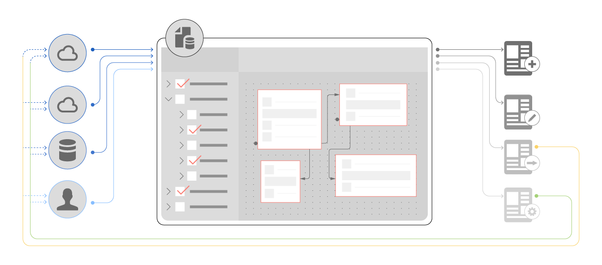

# [!DNL AEM Forms] Data Integration {#aem-forms-data-integration}

 

Enterprise infrastructures include disparate back-end systems or data sources like databases, web services, REST services, OData services, and CRM solutions. Put together, they make an information system that serves data to enterprise applications to perform day-to-day business. On the other hand, applications capture data and send it back to update data sources.

[!DNL AEM Forms] applications like adaptive forms and interactive communications require integration with data sources to fetch customer data while rendering forms and creating interactive communications. There are use cases when data is fetched from data sources based on user inputs in adaptive forms. In addition, the submitted adaptive form data can be written back to update the respective data sources.

While a distributed, modular system has its own benefits, the challenge lies in integrating and creating data associations across data sources. Data integration is the key to a functional and efficient enterprise infrastructure with disparate data sources connected to applications for exchange of business data.

## Data Integration overview {#data-integration-overview}

[!DNL AEM Forms] Data Integration allows configuring and connecting disparate data sources with [!DNL AEM Forms]. It provides an intuitive user interface to create a unified data representation schema of business entities and services across connected data sources. The unified representation is known as a form data model, an extension of JSON schema. The entities in a form data model are referred to as data model objects. A form data model lets you:

* Access data model objects, properties, and services from connected data sources.
* Create custom data model objects and properties
* Build associations between data model objects within and across data sources.
* Invoke data model object services to query or write data to and from data sources.

Once you have created a form data model, you can use it in various adaptive form and interactive communications workflows, such as:

* Create adaptive forms and interactive communications based on form data model
* Prefill adaptive forms and interactive communications from configured data sources
* Invoke data source services/operations using adaptive form rules
* Write submitted adaptive form data to data sources

## Get started with data integration {#get-started-with-data-integration}

The first step to implement data integration is to identify and configure data sources that store information you want to use in adaptive forms and interactive communications use cases. Next, you create a form data model that uses data model object, properties, and services from one or more data sources. You can create adaptive forms and interactive communications based on a form data model where adaptive form fields or placeholders in interactive communications are bound to respective data source properties.

[!DNL AEM Forms] also lets you create a form data model independent of data sources and associate or bind data model objects and properties in the form data model with data source later. It eliminates any dependencies on data sources while you work on a form data model.

Review the following to get started, understand, and implement data integration.

* [Configure data sources](../../forms/using/configure-data-sources.md)
* [Create form data model](../../forms/using/create-form-data-models.md)
* [Work with form data model](../../forms/using/work-with-form-data-model.md)
* [Use form data model](../../forms/using/using-form-data-model.md)
