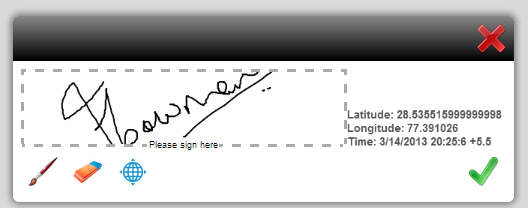

# Designing form templates for HTML5 forms{#designing-form-templates-for-html-forms}

The HTML5 forms component in AEM can render XFA form template to HTML5 format. Form designers can design form templates using [Forms Designer](https://www.adobe.com/go/learn_aemforms_designer_63) and use the HTML5 rendition capability. These form templates, along with their assets, can reside in AEM repository, file system, or exposed via http. However, if you plan to manage your forms using Forms Manager, the templates and assets should reside in the AEM repository.

Although HTML5 forms match the behavior of the PDF forms to a great extent, there are some features in both formats that are not be applicable to the other format. For example, how barcodes get applied on a PDF form in Adobe Reader varies from a Mobile form or how a form is digitally signed also varies between the formats. For more information on such variations, see [Feature differentiation between HTML5 forms and PDF Forms](../../forms/using/feature-differentiation-html5-forms-pdf-forms.md).

For common XFA features, see the following best practices and guidelines to design a form that works in both formats.

## Best practices {#best-practices}

Most steps around designing a form template, such as schema bindings or writing form logic are same. However, due to inherent differences between rendering and scripting engine of a thick client like Adobe Reader and browser-based forms, there are some recommendations described in the [best practices](/help/forms/using/design-accessible-html5-forms.md) article. These best practices help you design form templates to work as expected in both formats.

### Capabilities in AEM Forms Designer for HTML5 Forms {#capabilities-in-aem-forms-designer-for-html-forms}

#### Preview HTML {#preview-html}

The Preview HTML tab is added in the Design mode for Form Designers to preview forms in HTML5 format during the design process. For more information on how to enable and configure this capability in AEM Forms Designer, see [Preview HTML](../../forms/using/preview-xdp-forms-html.md).

#### Scribble signature {#scribble-signature}

The key target for HTML5 forms is touch devices. Therefore, a new scribble signature control is added in AEM Forms Designer. You can click or drag-and-drop the scribble signature control on your form template and configure it. It is rendered as a scribble field in HTML5 rendition and can be used to scribble signature on touch devices. On desktop machines, it can be used as a scribble field using mouse control. For more information on how to use this feature, see [XFA Scribble Field](../../forms/using/scribble-signature.md).

#### Rich text format {#rich-text-format}

You can convert a text field to a rich text field. It adds a list of formatting options to the text field. To convert, open the Forms Designer, select the text field in **[!UICONTROL Design View]**. In the **[!UICONTROL Field]** tab, select **[!UICONTROL Rich Text]** from the **[!UICONTROL Field Format]** drop-down list. Now, when the XFA form is rendered as an HTML5 Form, the field is rendered as a rich text field. Select  to view additional formatting options.
