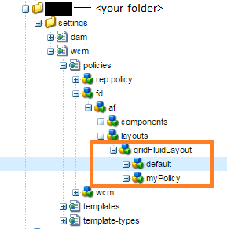
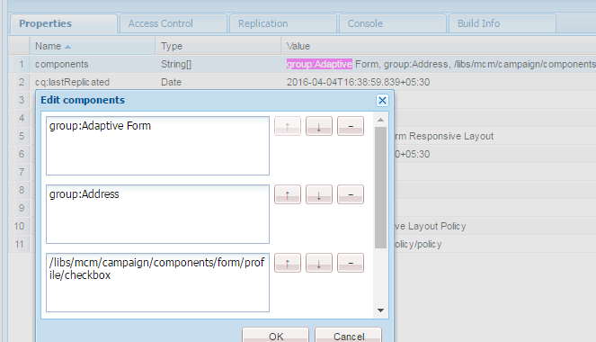

# Displaying components based on the template used{#displaying-components-based-on-the-template-used}

When a form author creates an adaptive form using a [template](../../forms/using/template-editor.md), the form author can see and use specific components based on template policy. You can specify a template content policy that lets you choose a group of components that the form author sees at the time of form authoring.

## Changing the content policy of a template {#changing-the-content-policy-of-a-template}

When you create a template, it is created under `/conf` in the content repository. Based on the folders you have created in the `/conf` directory, path to your template is: `/conf/<your-folder>/settings/wcm/templates/<your-template>`.   
  
Perform the following steps to show the components in the sidebar based on the content policy of a template:

1. Open CRXDE lite.   
   URL: `https://<server>:<port>/crx/de/index.jsp`
1. In CRXDE, navigate to the folder in which the template is created.

   For example: `/conf/<your-folder>/`

1. In CRXDE, navigate to: `/conf/<your-folder>/settings/wcm/policies/fd/af/layouts/gridFluidLayout/`

   To select a group of components, a new content policy is required. To create a policy, copy-paste the default policy, and rename it.

   Path to default content policy is: `/conf/<your-folder>/settings/wcm/policies/fd/af/layouts/gridFluidLayout/default`

   In the `gridFluidLayout` folder, copy-paste the default policy and rename it. For example, `myPolicy`.

   

1. Select the new policy you create, and select the **components** property in the right-side panel with type `string[]`.

   When you select and open the components property, you see the Edit components dialog. The Edit components dialog lets you add or remove component groups using the **+** and **-** buttons. You can add component group that includes components that form you want authors to use. 

   

   After you add a component group, click **OK** to update the list, and then click **Save All** above CRXDE address bar and refresh. 

1. In the template, change the content policy from default to the new policy you created. ( `myPolicy` in this example.)

   To change the policy, in CRXDE, navigate to `/conf/<your-folder>/settings/wcm/templates/<your-template>/policies/jcr:content/guideContainer/rootPanel/items`.

   In the `cq:policy` property, change `default` to the new policy name ( `myPolicy`).

   

   When you author a form you create using the template, you can see the added components in sidebar.
