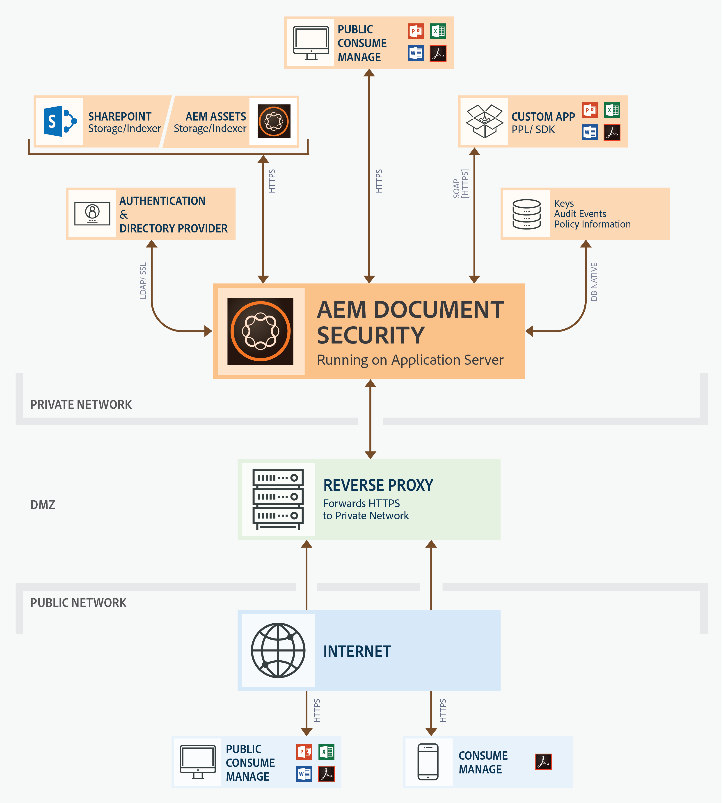

# Document security offerings{#document-security-offerings}

Adobe Experience Manager Forms document security ensures that only authorized users can use your documents. Using document security, you can safely distribute any information that you have saved in a supported format. Supported file formats include Adobe Portable Document Format (PDF) and Microsoft&reg; Word, Excel, and PowerPoint files.

You can protect documents by using policies. The confidentiality settings that you specify in a policy determine how a recipient can use a document to which you apply the policy. For example, you can specify whether recipients can print or copy text, edit text, or add signatures and comments to protected documents.

The policies are stored on the Document Security server; you apply the policies to documents through your client application. When you apply a policy to a document, the confidentiality settings specified in the policy protect the information that the document contains. You can distribute the policy-protected document to recipients who are authorized by the policy.

The following diagram shows the typical architecture for AEM Forms Document Security:

 

## Document Security clients {#document-security-clients}

Document Security provides various clients to protect documents, view and edit protected documents, and indexers to enable full-text search on protected documents. You can choose a client based on your requirements and the capabilities of the client.

The Document Security Server is the central component through which Document Security performs transactions such as user authentication, real-time management of policies, and application of confidentiality. The server also provides a central repository for policies, audit records, and other related information.

The Document Security server provides a web-based interface (web page) to create policies, manage policy-protected documents, and monitor events that are associated with policy-protected documents. Administrators can also configure global options such as user authentication, auditing, and messaging for invited users, and manage invited user accounts.

The server is included in the AEM Forms Document Security add-on offering. You can contact AEM Forms [sales team](https://business.adobe.com/request-consultation/experience-cloud.html?s_osc=70114000002JNwKAAW&s_iid=70114000002JHs3AAG) to purchase the Document Security add-on.

### Protect documents {#protect-documents}

AEM Forms Document Security provides various tools to apply security policies. You can choose a tool as per your requirements and specifications.

You can use Document Security SDK, Adobe Acrobat, Document Security Extension for Microsoft&reg; Office, or Portable Protection Library to apply and track the security policies:

* **Document Security SDK:** The SDK is a feature-rich client. You can use the Document Security SDK to access document server functionality, open policy-protected documents, and develop custom extensions, plug-ins, or applications. For example, you can develop extensions to protect custom file formats or integrate the SDK with Data Loss Prevention (DLP) solutions. Extensions, applications, and plug-ins developed using the Document Security SDK to send documents to the designated AEM Forms Server and the policies are applied on the server. The AEM Forms document security client SDK (CSDK) cannot unprotect the documents protected using the Portable Protection Library (PPL) and conversely.  
  
  The Document Security SDK is available for both Java&trade; and C++. Java&trade; SDK is included in the AEM Forms Document Security offering and it is installed on deploying AEM forms on JEE. Contact [AEM Customer Support](https://experienceleague.adobe.com/?support-solution=General&support-tab=home#support) to procure the C++ SDK. The C++ SDK can be compiled with Microsoft&reg; Visual Studio 2013. Visit the [Document Security API documentation](https://help.adobe.com/en_US/livecycle/11.0/Services/WS92d06802c76abadb76c48dfe12dbeb3e281-7ff0.2.html) site where you can learn and use features of the SDK.

* **Adobe Acrobat:** You can use Adobe Acrobat to apply security policy to PDF documents created using popular desktop applications, such as Microsoft&reg; Office, web browsers, or any application that supports printing in PDF format.  
  
  You can purchase and download Adobe Acrobat from the [Adobe Website](https://www.adobe.com/acrobat/free-trial-download.html). Adobe Acrobat article [setting up security policies for PDFs](https://helpx.adobe.com/acrobat/using/setting-security-policies-pdfs.html) provides detailed information about creating and applying policies in Adobe Acrobat.

* **Document Security Extension for Microsoft&reg; Office**: You can use the Document Security Extension for Microsoft&reg; Office to apply predefined policies to your Microsoft&reg; Office files from within the Microsoft&reg; Office programs. The extension ensures that only authorized people can use policy-protected Microsoft&reg; Word, Excel, and PowerPoint files. Only authorized users who have the plugin installed can use the policy-protected files.
  
  The Document Security extension is available as a Microsoft&reg; Office plug-in. Contact [AEM Customer Support](https://helpx.adobe.com/ca/marketing-cloud/contact-support.html) to procure the extension. Later on, you can visit [Document Security Extension for Microsoft&reg; Office](https://experienceleague.adobe.com/docs/experience-manager-document-security/using/download-installer.html?lang=en) help to learn about installing, configuring, and using the extension.

* **Portable Protection Library:** The PPL protects a document locally, without sending the document to the AEM Forms Server. Only security credentials and policy details travel over the network. PPL also lets you limit policy retrieval access to only logged-in users. You can fetch policies with the context of the user logged in AEM user.  
  
  Along with the above, the PPL has all the features of Document Security SDK. You can use the Document Security SDK to access document server functionality, open policy-protected documents, and develop custom extensions, plug-ins, or applications. The PPL cannot unprotect the documents protected using AEM Forms document security client SDK (CSDK) and conversely.  
  
  The PPL is available for Java&trade; and C++ languages in 32-bit and 64-bit versions. It is also available as an OSGi bundle for AEM Forms on OSGi. The C++ PPL can be compiled with Microsoft&reg; Visual Studio 2013. If you have licensed AEM Forms Document Security add-on, you can contact the [AEM Forms Document Security](https://experienceleague.adobe.com/?support-solution=General&support-tab=home#support) support team to procure the PPL. Later on, you can use PPL Help (bundled with the library) to set up and use the PPL.

### View or edit protected documents {#view-or-edit-protected-documents}

* For **PDF documents**, you can use Adobe Acrobat DC, Acrobat Reader, and Acrobat Reader Mobile to view protected PDF documents. Most users already have Acrobat Reader installed on their devices, so they do not need to obtain or learn additional software to view protected documents. You can also download the Acrobat Reader from the [Acrobat Reader download web site](https://get.adobe.com/reader/).

* For **Microsoft&reg; Office documents**, you require Microsoft&reg; Office and AEM Forms Document Security extension for Microsoft&reg; Office. The Document Security extension is available as a Microsoft&reg; Office plug-in. You can download the extension from the Adobe website.

### Index protected documents {#index-protected-documents}

Microsoft&reg; Windows full-text search engines (SharePoint Index server) and Adobe Experience Manager (AEM) can perform full-text search on commonly used document formats such as, plain-text files, Microsoft&reg; Office documents, and PDF documents. You can use Document Security indexers to enable fulltext search engines to search protected PDF documents:

* **iFilter indexer:** You can use the iFilter indexer to index protected PDF documents and enable Microsoft&reg; Windows full-text search engines (Desktop Indexing Service and SharePoint Index server) to search protected PDF documents. For detailed information, see [AEM SharePoint IFilter for Protected Documents](assets/sharepoint-ifilter-doc-security.pdf).  

* **AEM Forms Document Security Indexer:** You can use the AEM Forms Document Security indexer to index protected PDF documents and enable Adobe Experience Manager to search protected PDF documents. The indexers are part of the AEM Forms Document Security offering. These are included in AEM Forms on JEE installers.
