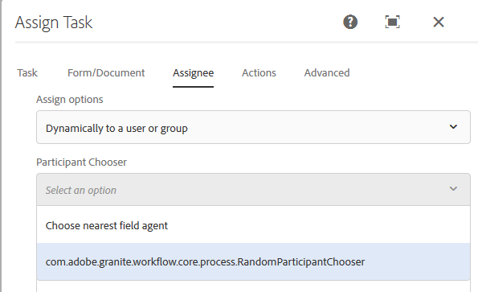

# Dynamically select a user or group for AEM Forms-centric workflow steps {#dynamically-select-a-user-or-group-for-aem-forms-centric-workflow-steps}

Learn how to select a user or group for an AEM Forms workflow at the runtime. 

In large organizations, there are requirements to dynamically select users for a process. For example, selecting a field agent to serve a customer based on the proximity of the agent to the customer. In such a scenario, the agent is selected dynamically.

Assign task and Adobe Sign steps of [Forms-centric workflows on OSGi](/help/forms/using/aem-forms-workflow.md) provide options to dynamically select a user. You can use ECMAScript or OSGi bundles to dynamically select an assignee for the Assign Task step or to select signers for the Sign Document step.

## Use ECMAScript to dynamically select a user or group {#use-ecmascript-to-dynamically-select-a-user-or-group}

ECMAScript is a scripting language. It is used for client-side scripting and server applications. Perform the following steps to dynamically select a user or a group using ECMAScript:

1. Open CRXDE Lite. The URL is `https://'[server]:[port]'/crx/de/index.jsp`
1. Create a file with extension .ecma at the following path. If the path (node structure) does not exist, create it:

    * (Path for Assign Task step) `/apps/fd/dashboard/scripts/participantChooser`
    * (Path for Signature step) `/apps/fd/workflow/scripts/adobesign`

1. Add ECMAScript that has the logic to dynamically select a user, to the .ecma file. Click **[!UICONTROL Save All]**.

   For sample scripts, see [Sample ECMAScripts for dynamically selecting a user or a group](/help/forms/using/dynamically-select-a-user-or-group-for-aem-workflow.md#sample-ecmascripts-to-dynamically-choose-a-user-or-a-group). 

1. Add display name of the script. This name is displayed in workflow steps. To specify the name:

    1. Expand the script node, right-click the **[!UICONTROL jcr:content]** node, and click **[!UICONTROL Mixins]**.
    1. Add the `mix:title` property in Edit Mixins dialog and click **OK**.
    1. Add the following property to the jcr:content node of script:

       |Name|Type|Value|
       |--- |--- |--- |
       |jcr:title|String|Specify the name of the script. For example, Choose nearest field agent. This name is displayed in Assign Task and Sign Document steps.|

    1. Click **Save All**. The script becomes available for selection in the components of AEM Workflow.
       
       

### Sample ECMAScripts to dynamically choose a user or a group {#sample-ecmascripts-to-dynamically-choose-a-user-or-a-group}

The following sample ECMAScript dynamically selects an assignee for the Assign Task step. In this script, a user is selected based on the path of the payload. Before using this script, ensure that all the users mentioned in the script exist in AEM. If the users mentioned in the script do not exist in AEM, the related process can fail.

```javascript
function getParticipant() {

var workflowData = graniteWorkItem.getWorkflowData();

if (workflowData.getPayloadType() == "JCR_PATH") { 

var path = workflowData.getPayload().toString(); 
     if (path.indexOf("/content/geometrixx/en") == 0) {
    return "user1";
    } 
   else {
              return "user2";
            }
}
}
```

The following sample ECMAScript dynamically selects an assignee for the Adobe Sign step. Before using the below script, ensure that the user information (email addresses and phone numbers) mentioned in the script is correct. If user information mentioned in the script is incorrect, the related process can fail.

>[!NOTE]
>
>On using ECMAScript for Adobe Sign, the script must be in crx-repository at /apps/fd/workflow/scripts/adobesign/, and should have a function named getAdobeSignRecipients to return a list of the users.

```javascript
function getAdobeSignRecipients() {

    var recipientSetInfos = new Packages.java.util.ArrayList();

    var recipientInfoSet = new com.adobe.aem.adobesign.recipient.RecipientSetInfo();
    var recipientInfoList = new Packages.java.util.ArrayList();
    var recipientInfo = new com.adobe.aem.adobesign.recipient.RecipientInfo();

    var email;
    var recipientAuthenticationMethod = com.adobe.aem.adobesign.recipient.RecipientAuthenticationMethod.PHONE;  
    //var recipientAuthenticationMethod = com.adobe.aem.adobesign.recipient.RecipientAuthenticationMethod.NONE;
    var securityOptions = null;

    var phoneNumber = "123456789";
    var countryCode = "+1";
    var recipientPhoneInfo = new Array();
    recipientPhoneInfo.push(new com.adobe.aem.adobesign.recipient.RecipientPhoneInfo(phoneNumber, countryCode));

     securityOptions = new com.adobe.aem.adobesign.recipient.RecipientSecurityOption(recipientAuthenticationMethod, recipientPhoneInfo , null);
    
    email = "example@example.com";
    
    recipientInfo.setEmail(email);
    recipientInfo.setSecurityOptions(securityOptions);
    
    recipientInfoList.add(recipientInfo);
    recipientInfoSet.setMemberInfos(recipientInfoList);
    recipientSetInfos.add(recipientInfoSet);

    return recipientSetInfos;

}

```

## Use Java interface to dynamically choose a user or group {#use-java-interface-to-dynamically-choose-a-user-or-group}

You can use the [RecipientInfoSpecifier](https://www.adobe.io/experience-manager/reference-materials/6-5/forms/javadocs/com/adobe/fd/workflow/adobesign/api/RecipientInfoSpecifier.html) Java interface to dynamically choose a user or a group for Adobe Sign and Assign Task steps. You can create an OSGi bundle that used the use the [RecipientInfoSpecifier](https://www.adobe.io/experience-manager/reference-materials/6-5/forms/javadocs/com/adobe/fd/workflow/adobesign/api/RecipientInfoSpecifier.html) Java interface and deploy it to the AEM Forms server. It makes the option available for selection in the Assign Task and Adobe Sign components of AEM Workflow.

You require [AEM Forms Client SDK](https://experienceleague.adobe.com/docs/experience-manager-release-information/aem-release-updates/forms-updates/aem-forms-releases.html) jar and [granite jar](https://repo1.maven.org/maven2/com/adobe/granite/com.adobe.granite.workflow.api/1.0.2/) files to compile the code sample listed below. Add these jar files as external dependencies to the OSGi bundle project. You can use any Java IDE to create an OSGi bundle. The following procedure provides steps to use Eclipse to create an OSGi bundle:

1. Open Eclipse IDE. Navigate to **[!UICONTROL File]**> **[!UICONTROL New Project]**.
1. On the Select a wizard screen, select **[!UICONTROL Maven Project]**, and click **[!UICONTROL Next]**.
1. On the New Maven project, keep defaults, and click **[!UICONTROL Next]**. Select an archetype and click **[!UICONTROL Next]**. For example, maven-archetype-quickstart. Specify **[!UICONTROL Group Id]**, **[!UICONTROL Artifact Id]**, **[!UICONTROL version]**, and **[!UICONTROL package]** for the project, and click **[!UICONTROL Finish]**. The project is created.
1. Open the pom.xml file for editing and replace all the contents of the file with the following:

   ```xml
   <project xmlns="https://maven.apache.org/POM/4.0.0" xmlns:xsi="https://www.w3.org/2001/XMLSchema-instance"
       xsi:schemaLocation="https://maven.apache.org/POM/4.0.0 https://maven.apache.org/xsd/maven-4.0.0.xsd">
       <modelVersion>4.0.0</modelVersion>
    
       <groupId>getAgent</groupId>
       <artifactId>assignToAgent</artifactId>
       <version>1.0</version>
       <packaging>bundle</packaging><!-- packaging type bundle is must -->
    
       <name>assignToAgent</name>
       <url>https://maven.apache.org</url>
       <repositories>
           <repository>
               <id>adobe</id>
               <name>Adobe Public Repository</name>
               <url>https://repo1.maven.org/maven2/com/adobe/</url>
               <layout>default</layout>
           </repository>
       </repositories>
       <pluginRepositories>
           <pluginRepository>
               <id>adobe</id>
               <name>Adobe Public Repository</name>
               <url>https://repo1.maven.org/maven2/com/adobe/</url>
               <layout>default</layout>
           </pluginRepository>
       </pluginRepositories>
    
       <dependencies>
           <dependency>
               <groupId>com.adobe.aemfd</groupId>
               <artifactId>aemfd-client-sdk</artifactId>
               <version>6.0.138</version>
           </dependency>
           <dependency>
               <groupId>com.adobe.granite</groupId>
               <artifactId>com.adobe.granite.workflow.api</artifactId>
               <version>1.0.0</version>
           </dependency>

           <dependency>
               <groupId>org.osgi</groupId>
               <artifactId>org.osgi.core</artifactId>
               <version>4.2.0</version>
               <scope>provided</scope>
           </dependency>
    
           <dependency>
               <groupId>org.apache.felix</groupId>
               <artifactId>org.apache.felix.scr.annotations</artifactId>
               <version>1.7.0</version>
    
           </dependency>
    
           <dependency>
               <groupId>org.apache.sling</groupId>
               <artifactId>org.apache.sling.api</artifactId>
               <version>2.2.0</version>
    
           </dependency>

       </dependencies>
    
       <!-- ====================================================================== -->
       <!-- B U I L D D E F I N I T I O N -->
       <!-- ====================================================================== -->
       <build>
           <plugins>
    
               <plugin>
                   <groupId>org.apache.felix</groupId>
                   <artifactId>maven-bundle-plugin</artifactId>
                   <extensions>true</extensions>
                   <configuration>
                       <instructions>
                           <Bundle-SymbolicName>com.aem.assigntoAgent-bundle</Bundle-SymbolicName>
                       </instructions>
                   </configuration>
               </plugin>
    
               <plugin>
                   <groupId>org.apache.felix</groupId>
                   <artifactId>maven-scr-plugin</artifactId>
                   <version>1.9.0</version>
                   <executions>
                       <execution>
                           <id>generate-scr-descriptor</id>
                           <goals>
                               <goal>scr</goal>
                           </goals>
                       </execution>
                   </executions>
               </plugin>
           </plugins>
       </build>
    
   </project>
   ```

1. Add source code that uses [RecipientInfoSpecifier](https://www.adobe.io/experience-manager/reference-materials/6-5/forms/javadocs/com/adobe/fd/workflow/adobesign/api/RecipientInfoSpecifier.html) Java interface to dynamically choose a user or a group for the Assign task step. For sample code, see [Sample for dynamically choosing a user or a group using Java interface](#-sample-scripts-for).
1. Open a command prompt and navigate to the directory containing the OSGi bundle project. Use the following command to create the OSGi bundle:

   `mvn clean install`

1. Upload the bundle to an AEM Forms server. You can use AEM Package Manager to import the bundle to AEM Forms server.

After the bundle is imported, the option to choose the Java interface for dynamically selecting a user or a group becomes available in for Adobe Sign and Assign Task steps.

### Sample Java code to dynamically choose a user or a group {#sample-java-code-to-dynamically-choose-a-user-or-a-group}

The following sample code dynamically chooses an assignee for the Adobe Sign step. You use the code in an OSGi bundle. Before using the below-listed code, ensure that the user information (email addresses and phone numbers) mentioned in the code is correct. If user information mentioned in the code is incorrect, the related process can fail.

```java

/*************************************************************************

 *
 * ADOBE CONFIDENTIAL
 * __________________
 *
 * Copyright 2016 Adobe Systems Incorporated
 * All Rights Reserved.
 *
 * NOTICE:  All information contained herein is, and remains
 * the property of Adobe Systems Incorporated and its suppliers,
 * if any.  The intellectual and technical concepts contained
 * herein are proprietary to Adobe Systems Incorporated and its
 * suppliers and are protected by trade secret or copyright law.
 * Dissemination of this information or reproduction of this material
 * is strictly forbidden unless prior written permission is obtained
 * from Adobe Systems Incorporated.
 **************************************************************************/
 
package com.aem.impl;

import java.util.ArrayList;
import java.util.List;

import com.adobe.aem.adobesign.recipient.RecipientAuthenticationMethod;
import com.adobe.aem.adobesign.recipient.RecipientInfo;
import com.adobe.aem.adobesign.recipient.RecipientPhoneInfo;
import com.adobe.aem.adobesign.recipient.RecipientSecurityOption;
import com.adobe.aem.adobesign.recipient.RecipientSetInfo;
import com.adobe.fd.workflow.adobesign.api.RecipientInfoSpecifier;
import com.adobe.granite.workflow.WorkflowException;
import com.adobe.granite.workflow.WorkflowSession;
import com.adobe.granite.workflow.exec.WorkItem;
import com.adobe.granite.workflow.metadata.MetaDataMap;
import org.apache.felix.scr.annotations.Component;
import org.apache.felix.scr.annotations.Service;

/**
 * <code>DummyRecipientInfoSpecifier implementation. A sample code to write implementation of RecipientInfoSpecifier to choose recipients/code>...
 */
@Service

@Component(metatype = false)
public class DummyRecipientChoser implements RecipientInfoSpecifier {
    public List<RecipientSetInfo> getAdobeSignRecipients(WorkItem workItem, WorkflowSession workflowSession, MetaDataMap args) throws WorkflowException {

        List<RecipientSetInfo> recipientSetInfos = new ArrayList<RecipientSetInfo>();

                //First Recipient

                RecipientSetInfo recipientInfoSet1 = new RecipientSetInfo();
                List<RecipientInfo> recipientInfoList = new ArrayList<RecipientInfo>();
                RecipientInfo recipientInfo1 = new RecipientInfo();//Member to first recipient

                String email;

                RecipientAuthenticationMethod recipientAuthenticationMethod = RecipientAuthenticationMethod.WEB_IDENTITY;
                RecipientSecurityOption securityOptions = null;

                String phoneNumber = "123456789";
                String countryCode = "+1";
                RecipientPhoneInfo[] recipientPhoneInfo = new RecipientPhoneInfo[1];  //if multiple phone numbers, size>1
                recipientPhoneInfo[0] = new RecipientPhoneInfo(phoneNumber, countryCode);
                securityOptions = new RecipientSecurityOption(recipientAuthenticationMethod, recipientPhoneInfo , null);
                 
                email = "example@example.com";

                recipientInfo1.setEmail(email);
                recipientInfo1.setSecurityOptions(securityOptions);

                recipientInfoList.add(recipientInfo1);  //Add member

                recipientInfoSet1.setMemberInfos(recipientInfoList);

                //Second Recipient

                RecipientSetInfo recipientInfoSet2 = new RecipientSetInfo();
                List<RecipientInfo> recipientInfoList2 = new ArrayList<RecipientInfo>();

                recipientAuthenticationMethod = RecipientAuthenticationMethod.PHONE;
                securityOptions = null;
                 
                phoneNumber = "987654321";//"0123456789";

                countryCode = "+1";
                RecipientPhoneInfo[] recipientPhoneInfo_1 = new RecipientPhoneInfo[1];
                recipientPhoneInfo_1[0] = new RecipientPhoneInfo(phoneNumber, countryCode);
                securityOptions = new RecipientSecurityOption(recipientAuthenticationMethod, recipientPhoneInfo_1 , null);
                 
                email = "example2@example.com";//"dummymail2@domain.com";

                RecipientInfo recipientInfo2  = new RecipientInfo();
                recipientInfo2.setEmail(email);
                recipientInfo2.setSecurityOptions(securityOptions);

                recipientInfoList2.add(recipientInfo2);  //Add member

                recipientInfoSet2.setMemberInfos(recipientInfoList2);

                //*********************************

                recipientSetInfos.add(recipientInfoSet1); 
                recipientSetInfos.add(recipientInfoSet2);

        return recipientSetInfos;

    }

}
```
