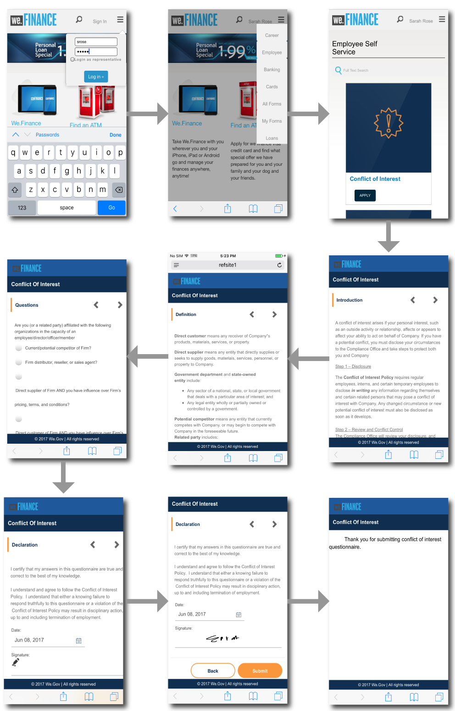
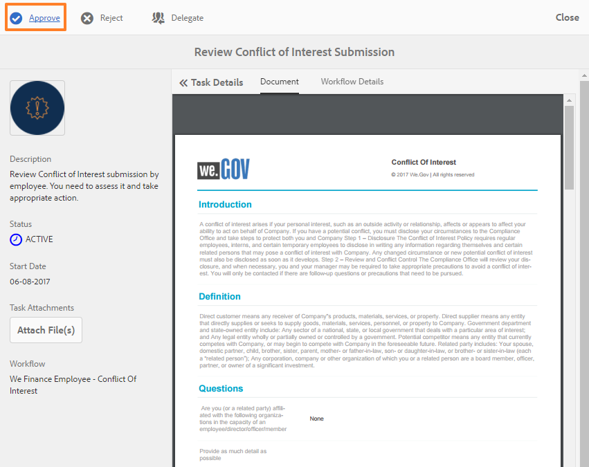
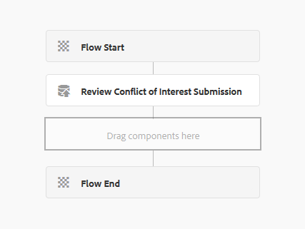
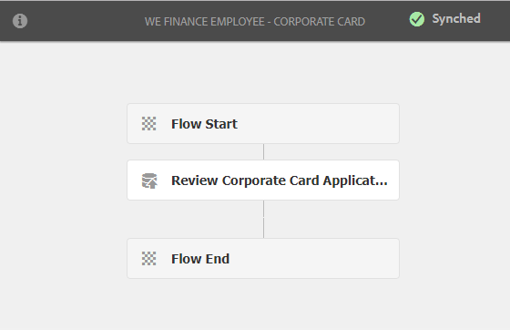
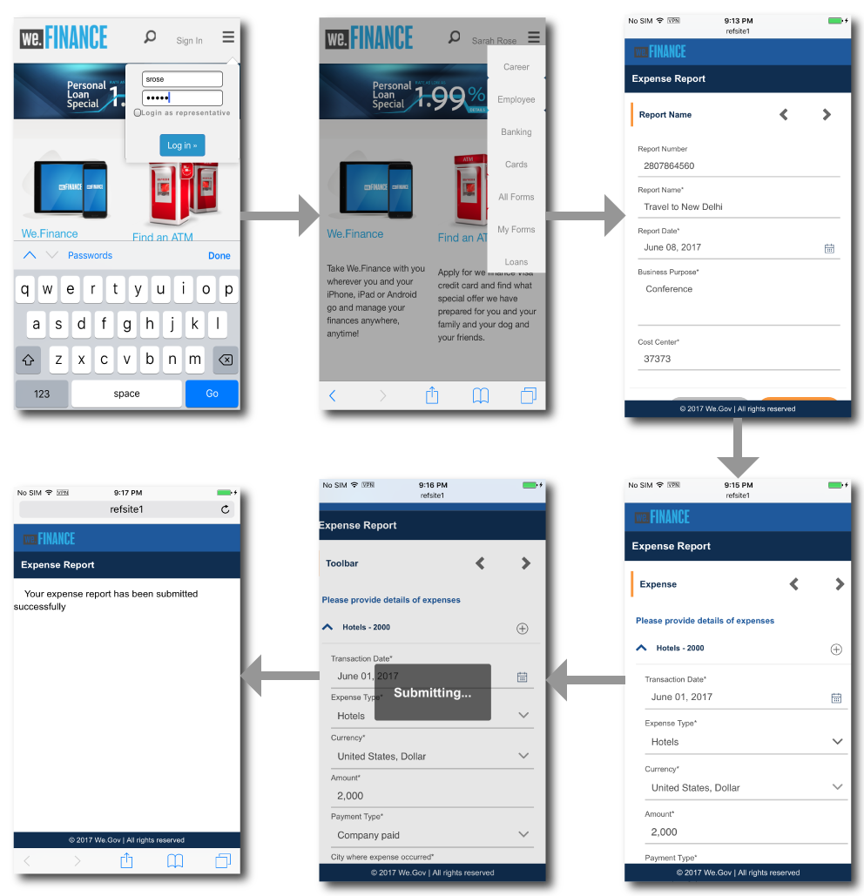
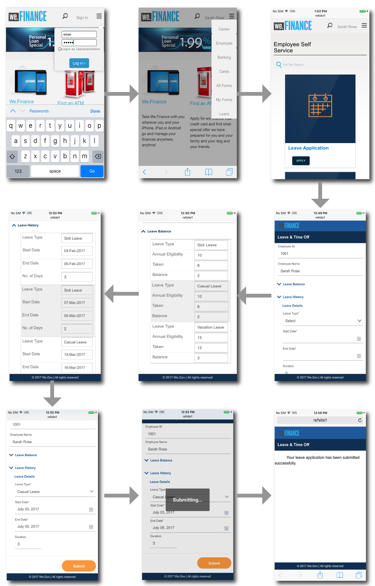
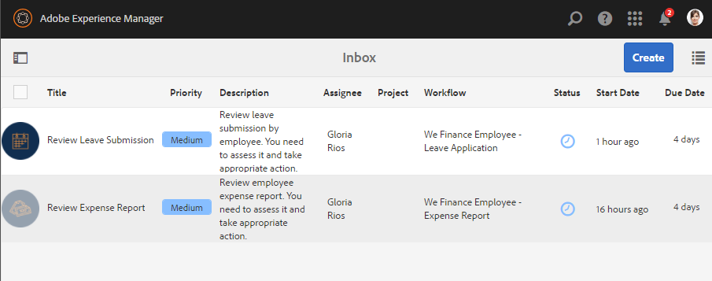
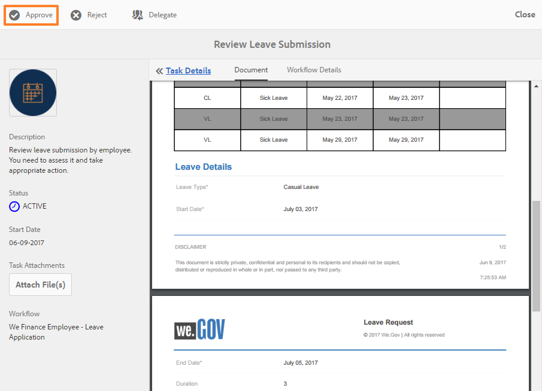

# Employee self-service reference site walkthrough {#employee-self-service-reference-site-walkthrough}

## Prerequisite {#prerequisite}

Set up the reference sites as described in [Set up and configure AEM Forms reference sites](/help/forms/using/setup-reference-sites.md).

## Overview {#overview}

Employee self-service systems, generally hosted on company's Intranet, give employees access to a host of information and services that they can avail from their desks. It empowers and gives complete control to employees to perform actions such as accessing their employment details, applying for leave, and submitting expense reports. On the other hand, it helps organizations improve process efficiencies and cut costs while keeping employees informed and engaged.

Employee self-service reference site showcases how you can leverage AEM Forms to implement employee self-services system in your organization.

>[!NOTE]
>
>Employee self-service use cases are available in both We.Finance and We.Gov reference sites. The examples, images, and descriptions used in the walkthroughs use We.Finance reference site. However, you can run these use cases and review artifacts using We.Gov as well. To do so, you must replace **we-finance** with **we-gov** in the mentioned URLs.

## Conflict of interest questionnaire walkthrough {#conflict-of-interest-questionnaire-walkthrough}

Organizations from time to time ask their employees to submit Conflict of Interest questionnaire identify outside activities or personal relationships of their employees that may potentially conflict with their organization.

The Compliance department at Sarah's organization has asked employees to submit the Conflict of Interest questionnaire.

### Sarah submits the Conflict of Interest questionnaire {#sarah-submits-the-conflict-of-interest-questionnaire}

Sarah goes to her organization's portal, logs in, and clicks Employee to access the employee dashboard. She finds Conflict of Interest questionnaire on the employee dashboard and clicks **[!UICONTROL Apply]**.

**Figure:** *Organization portal*

**Figure:** *Employee dashboard*

Sarah navigates the form using the Next button and reads through the Introduction and Definition sections. She responds to the questions in the Questions section. Finally, she signs and submits the questionnaire.

The organization portal and questionnaire are responsive and mobile-friendly. The following workflow shows how Sarah navigates through and submits the questionnaire on her mobile device.

**How it works**

The organization portal and the employee dashboard are AEM Sites pages. The dashboard lists several self-service options such as the Conflict of Interest questionnaire. The Apply button is linked to an adaptive form.

The adaptive form uses rules to show-hide information based on the answer provided in the Questions tab. Also, the form uses the Scribble component for signing in the Declaration tab. Review the adaptive form at `https://[authorHost]:[authorPort]/editor.html/content/forms/af/we-finance/employee/self-service/conflict-of-interest.html`.

**See it yourself**

Go to `https://[publishHost]:[publishPort]/content/we-finance/global/en/self-service-forms.html` and log in using `srose/srose` as username/password for Sarah. Click **[!UICONTROL Employee]** to access the dashboard and then click **[!UICONTROL Apply]** on Conflict of Interest questionnaire. Review and submit the questionnaire.

### Gloria reviews and approves the Conflict of Interest questionnaire submission {#gloria-reviews-and-approves-the-conflict-of-interest-questionnaire-submission}

The Conflict of Interest questionnaire submitted by Sarah is assigned to Gloria Rios for review. Gloria works as a Compliance Officer in the organization. Gloria logs in to her AEM Inbox and reviews the tasks assigned to her. She approves the questionnaire submitted by Sarah and completes the task.

**Figure:** *Gloria's inbox*

**Figure:** *Open task*

**How it works**

The submit action in the Conflict of Interest questionnaire triggers a workflow that creates a task in Gloria's inbox for approval. Review the Forms Workflow at `https://[authorHost]:[authorPort]/editor.html/conf/global/settings/workflow/models/we-finance/employee/self-service/we-finance-employee-conflict-of-interest.html`

**See it yourself**

Go to `https://[publishHost]:[publishPort]/content/we-finance/global/en/login.html?resource=/aem/inbox.html` and log in using `grios/password` as username/password for Gloria Rios. Open the task created for Conflict of Interest questionnaire and approve it.

## Corporate card application walkthrough {#corporate-card-application-walkthrough}

Sarah travels a lot for business and requires a corporate credit card to pay her bills on the move. She applies for a corporate card through her organization's employee portal.

### Sarah submits the Corporate Card application {#sarah-submits-the-corporate-card-application}

Sarah goes to her organization's portal, logs in, and clicks **[!UICONTROL Employee]** to access the employee dashboard. She finds Corporate Card application on the employee dashboard and clicks **[!UICONTROL Apply]**.

**Figure:** *Organization portal*

**Figure:** *Employee dashboard*

She clicks **[!UICONTROL Apply]** on the Corporate Card application. A single-page application opens. She fills all the details and clicks **[!UICONTROL Apply]** to submit the application.

**How it works**

The organization portal and the employee dashboard are AEM Sites pages. The dashboard lists several self-service options such as the corporate card application. The Apply button on the application is linked to an adaptive form.

The adaptive form for corporate card application is a simple, one-page, responsive adaptive form. It uses basic adaptive form components such as text, telephone, numeric box, and numeric stepper. Review the adaptive form at:   
`https://[authorHost]:[authorPort]/editor.html/content/forms/af/we-finance/employee/self-service/corporate-card.html`.

**See it yourself**

Go to `https://[publishHost]:[publishPort]/content/we-finance/global/en/self-service-forms.html` and log in using `srose/srose` as username/password for Sarah. Click **[!UICONTROL Employee]** to access the dashboard and then click **[!UICONTROL Apply]** on Corporate Card application. Fill in the details, and submit the application.

### Gloria reviews and approves the corporate card application {#gloria-reviews-and-approves-the-corporate-card-application}

The Corporate Card application submitted by Sarah is assigned to Gloria Rios for review. Gloria logs in to her AEM Inbox and reviews the tasks assigned to her. She approves the application submitted by Sarah and completes the task.

**Figure:** *Gloria's inbox*

**Figure:** *Open task*

**How it works**

The submission workflow in the Corporate Card application triggers a Forms workflow that creates a task in Gloria's inbox for approval. Review the Forms Workflow at `https://[authorHost]:[authorPort]/editor.html/conf/global/settings/workflow/models/we-finance/employee/self-service/we-finance-employee-corporate-card.html`

**See it yourself**

Go to `https://[publishHost]:[publishPort]/content/we-finance/global/en/login.html?resource=/aem/inbox.html` and log in using `grios/password` as username/password for Gloria Rios. Open the task created for Corporate Card application and approve it.

## Expense report submission walkthrough {#expense-report-submission-walkthrough}

As Sarah spends during business travels, she needs to submit expense reports for approval. The self-service option in her organization lets her submit the expense report online.

### Sarah submits the Expense Report application {#sarah-submits-the-expense-report-application}

Sarah goes to her organization's portal, logs in, and clicks **[!UICONTROL Employee]** to access the employee dashboard. She finds Expense Report application on the employee dashboard and clicks **[!UICONTROL Apply]**. 

**Figure:** *Organization portal*

**Figure:** *Employee dashboard*

She clicks **[!UICONTROL Apply]** on the Expense Report application. An application form opens, which has two tabs - Report Name and Report Details. The **+** icon in the Report Details tab allows her to add more than expenditures in one report.

The organization portal and applications are responsive and mobile-friendly. The following workflow shows how Sarah navigates through and submits the expense report on her mobile device.

**How it works**

The organization portal and the employee dashboard are AEM Sites pages. The dashboard lists several self-service options such as the Expense Report application. The Apply button is linked to an adaptive form.

The Report Name and Report Details tabs in the adaptive form are Panel components. The Report Details panel contains the Expense panel. It is a repeatable panel that allows adding multiple expenditures in the report. Review the adaptive form and its configurations at `https://[authorHost]:[authorPort]/editor.html/content/forms/af/we-finance/employee/expense-report.html`.

**See it yourself**

Go to `https://[publishHost]:[publishPort]/content/we-finance/global/en/self-service-forms.html` and log in using `srose/srose` as username/password for Sarah. Click **[!UICONTROL Employee]** to access the dashboard and then click **[!UICONTROL Apply]** on Expense Report application. Fill in the details and submit the application.

### Gloria reviews and approves the expense report {#gloria-reviews-and-approves-the-expense-report}

The expense report submitted by Sarah is assigned to Gloria Rios for review. Gloria logs in to her AEM Inbox and reviews the tasks assigned to her. She approves the application submitted by Sarah and completes the task.

**Figure:** *Gloria's inbox*

**Figure:** *Open task*

**How it works**

The submission workflow in the Expense Report application triggers a Forms workflow that creates a task in Gloria's inbox for approval. Review the Forms Workflow at `https://[authorHost]:[authorPort]/editor.html/conf/global/settings/workflow/models/we-finance/employee/self-service/we-finance-employee-expense-report-workflow.html`

**See it yourself**

Go to `https://[publishHost]:[publishPort]/content/we-finance/global/en/login.html?resource=/aem/inbox.html` and log in using `grios/password` as username/password for Gloria Rios. Open the task created for Expense Report application and approve it.

## Leave application walkthrough {#leave-application-walkthrough}

Sarah is planning a family vacation next month and wants to apply for a week's leave from work.

### Sarah submits the leave application {#sarah-submits-the-leave-application}

Sarah goes to her organization's portal, logs in, and clicks **[!UICONTROL Employee]** to access the employee dashboard. She finds leave application on the employee dashboard and clicks **[!UICONTROL Apply]**.

**Figure:** *Organization portal*

**Figure:** *Employee dashboard*

The leave application opens with Sarah's name and employee ID prefilled in the form. It also displays her leave balance and history. She fills in the leave details and submits the application for approval.

The organization portal and applications are responsive and mobile-friendly. The following workflow shows how Sarah navigates through and submits the application on her mobile device.

**How it works**

The organization portal and the employee dashboard are AEM Sites pages. The dashboard lists several self-service options such as the leave application. The Apply button is linked to an adaptive form.

The adaptive form for leave application is based on the Employee Leaves Form Data Model. In the Leave Balance section, the leave balance table is populated using the `getLeavesOf` Form Data Model service. The Start and End dates fields use rules to validate that the date values are equal or after the current date. The leave duration is calculated using the `calcBusinessDays` function.

You can review the adaptive form and the Form Data Model at the following locations:

`https://[authorHost]:[authorPort]/editor.html/content/forms/af/we-finance/employee/self-service/leave-application.html`

`https://[authorHost]:[authorPort]/aem/fdm/editor.html/content/dam/formsanddocuments-fdm/db`

**See it yourself**

Go to `https://[publishHost]:[publishPort]/content/we-finance/global/en/self-service-forms.html` and log in using `srose/srose` as username/password for Sarah. Click **[!UICONTROL Employee]** to access the dashboard and then click **[!UICONTROL Apply]** on Leave Application. Fill in the details and submit the application.

### Gloria reviews and approves the leave application {#gloria-reviews-and-approves-the-leave-application}

The leave application submitted by Sarah is assigned to Gloria Rios for review. Gloria logs in to her AEM Inbox and reviews the tasks assigned to her. She approves the application submitted by Sarah and completes the task.

**Figure:** *Gloria's inbox*

**Figure:** *Open task*

**How it works**

The submission workflow in the leave application triggers a Forms workflow that creates a task in Gloria's inbox for approval. Review the Forms Workflow at `https://[authorHost]:[authorPort]/editor.html/conf/global/settings/workflow/models/we-finance/employee/self-service/we-finance-employee-leave-application.html`

**See it yourself**

Go to `https://[publishHost]:[publishPort]/content/we-finance/global/en/login.html?resource=/aem/inbox.html` and log in using `grios/password` as username/password for Gloria Rios. Open the task created for leave application and approve it. 
