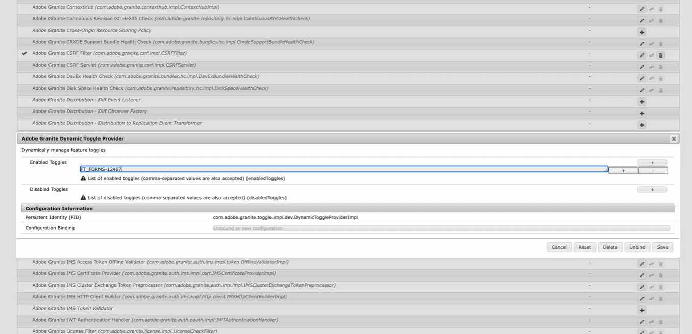
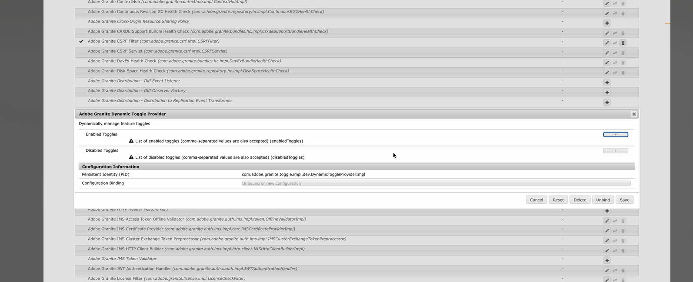

# Feature Toggle in Adobe Experience Manager (AEM) 6.5{#enable-feature-toggle-aem-forms-65}

Feature Toggle is a functionality in AEM that allows administrators to enable or disable specific features dynamically. This capability is particularly useful for managing **Early Adopter features** and **Prerelease features** without requiring major deployments or changes to the codebase. It ensures flexibility and control over which features are accessible in an AEM environment.

## Why Use Feature Toggles in a AEM 6.5 Setup?

When working in a AEM 6.5 setup, feature toggles help in:

* Testing experimental features safely.

* Rolling out new components in phases.

* Maintaining a single codebase across multiple environments.

* Reducing risk during deployments and upgrades.

## Prerequisites

Before enabling feature toggles in your AEM 6.5 setup, ensure the following:

* User is member of `forms-users` group.

* Navigate to `http://<author-instance-url>:portnumber/system/console/bundles` and check whether **(com.adobe.granite.toggle.impl.dev-1.1.8.jar)** bundle is present or not. In case it is not present [download the bundle from the link](https://experience.adobe.com/#/downloads/content/software-distribution/en/aem.html?package=%2Fcontent%2Fsoftware-distribution%2Fen%2Fdetails.html%2Fcontent%2Fdam%2Faem%2Fpublic%2Fadobe%2Fpackages%2Fcq650%2Fhotfix%2Fcom.adobe.granite.toggle.impl.dev-1.1.8.jar).

 

## Enable Feature Toggle {#enable-feature-toggle-65}

Feature Toggles for early adopters or new features can be configured through the **AEM Web Console** by following the steps below:

1. Log in to your AEM Forms instance.  
2. Navigate to `http://<author-instance-url>:portnumber/system/console/configMgr`.  
3. Search for **Adobe Granite Dynamic Toggle Provider** in the Configuration Manager.  
4. Click the icon .  
5. In the [!UICONTROL Enabled Toggles] section, click .  
6. Add the feature toggle id for the feature as shown in the image below. 
     
    
    >[!NOTE]
    >
    >You can find the feature toggle id in the document specific to the early adopter features.

7. Click Save.  

## Disable Feature Toggle {#disable-feature-toggle-65}

To disable the feature toggle(s) for features whose toggle(s) are enabled, follow the steps below:

1. Log in to your AEM Forms instance.  
2. Navigate to `http://<author-instance-url>:portnumber/system/console/configMgr`.  
3. Search for **Adobe Granite Dynamic Toggle Provider** in the Configuration Manager.  
4. Click the icon .  
5. In the [!UICONTROL Disabled Toggles] section, click .  
6. Add the toggle number for the feature to be disabled. 
      
7. Click Save.

## Technical Consideration

Feature Toggles are environment-specific and are managed at runtime, so they do not require a server restart. However, some features might require refreshing the relevant pages or clearing the cache to reflect changes. 
You can access the list of features enabled through feature toggle for your environment via `http://<author-instance-url>:4502/etc.clientlibs/toggles.json`.
