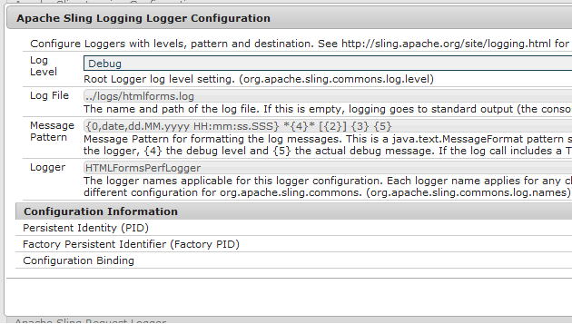
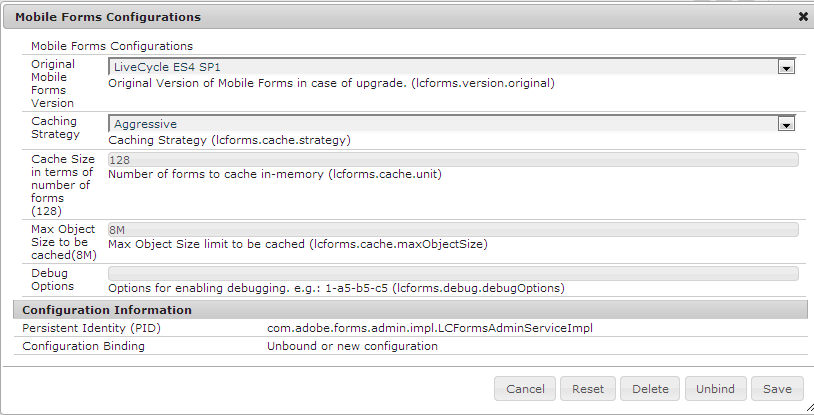
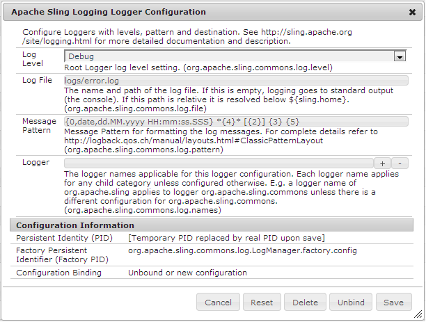

# Enable logging for HTML5 forms{#enable-logging-for-html-forms}

You can configure the logger utility to start creating logs for HTML5 forms. The logger utility has various levels, you can set a level as per your requirements. HTML5 forms has server and client components. You can configure logs for both the components.

## Configuring server-side logging {#configuring-server-side-logging}

Perform the following steps to configure server-side logs:

1. Go to `https://'[server]:[port]'/system/console/configMgr`. Locate and open the *Apace Sling logging logger configuration* option. A dialog box appears:

   

   Apace Sling logging logger configuration option

1. Change the **Log Level** to **Debug**.

1. Specify name and path of the **Log File**.

   >[!NOTE]
   >
   >To generate logs in the HTML5 forms log directory, add ../logs/ before the filename.

1. Change **Logger** to **HTMLFormsPerfLogger**. Click **Save**.

## Configuring client logging {#configuring-client-logging}

You can use the following methods to enable client-side logging in HTML5 forms:

* Using the request parameter named `log`
* Using CQ Configuration Manager

### Enabling logging using request parameter {#enabling-logging-using-request-parameter}

Using this method, you can generate logs for a particular request. The name of the request parameter is `log`. The log URL is as follows:

`https://<server>:<port>/content/xfaforms/profiles/test.html?contentRoot=<path of the folder containing form xdp>&template=<name of the xdp>&log=<log configuration>.`

The log configuration is made up of the log level and the logger category.

#### Log Destination {#log-destination}

<table>
 <tbody>
  <tr>
   <th><strong>Log Destination</strong></th>
   <th><strong>Description</strong></th>
  </tr>
  <tr>
   <td>1</td>
   <td>Logs are directed to the browser <strong>Console</strong></td>
  </tr>
  <tr>
   <td>2</td>
   <td>Logs are collected in a JavaScript object on client side and can be posted to <strong>Server</strong> </td>
  </tr>
  <tr>
   <td>3</td>
   <td>Both of the above options  </td>
  </tr>
 </tbody>
</table>

#### Log Levels {#log-levels}

<table>
 <tbody>
  <tr>
   <th>Log Level</th>
   <th>Description</th>
  </tr>
  <tr>
   <td>0</td>
   <td>OFF  </td>
  </tr>
  <tr>
   <td>1</td>
   <td>FATAL  </td>
  </tr>
  <tr>
   <td>2</td>
   <td>ERROR  </td>
  </tr>
  <tr>
   <td>3</td>
   <td>WARN  </td>
  </tr>
  <tr>
   <td>4</td>
   <td>INFO  </td>
  </tr>
  <tr>
   <td>5</td>
   <td>DEBUG  </td>
  </tr>
  <tr>
   <td>6</td>
   <td>TRACE  </td>
  </tr>
  <tr>
   <td>7</td>
   <td>ALL  </td>
  </tr>
 </tbody>
</table>

#### Logger Categories {#logger-categories}

<table>
 <tbody>
  <tr>
   <th>Log Category</th>
   <th>Description</th>
  </tr>
  <tr>
   <td>a</td>
   <td>xfa (Scripting engine-related logs)</td>
  </tr>
  <tr>
   <td>b</td>
   <td>xfaView (Layout engine-related logs)  </td>
  </tr>
  <tr>
   <td>c</td>
   <td>xfaPerf (Performance-related logs)  </td>
  </tr>
 </tbody>
</table>

#### Log Configuration {#log-configuration}

In the log URL, the log configuration query string parameter is defined as follows:

`{destination}-{a level}-{b level}-{c level}`

For example:

<table>
 <tbody>
  <tr>
   <th>Log Configuration</th>
   <th>Description</th>
  </tr>
  <tr>
   <td>2-a4-b5-c6  </td>
   <td>Destination: Server  xfa level: INFO  xfaView level: DEBUG  xfaPerf level: TRACE</td>
  </tr>
 </tbody>
</table>

>[!NOTE]
>
>The default log level for each log category a (xfa), b (xfaView), and c (xfaPerf) is 2 (ERROR). Accordingly, for log configuration: 2-b6, the log levels for different categories are:
>a (xfa): 2 (default level ERROR)
>b (xfaView): 6 (user specified TRACE)
>a (xfaPerf): 2 (default level ERROR)

### Enabling logging using Configuration Manager {#enabling-logging-using-configuration-manager}

If you use Configuration Manager for enabling logging, logs are generated for every render request until the logging is disabled again.

1. Log in to CQ Configuration Manager at `https://'[server]:[port]'/system/console/configMgr` and log in with admin credentials.
1. Search for and click **Mobile Forms Configurations**.
1. In the Debug Options text box, enter the log configurations as described in the previous section for example, **2-a4-b5-c6**

   

   Forms Configuration

## Uploading logs {#uploading-logs}

If the destination is set as 1, all client script log messages are directed to the console. If an administrator requires these logs along with server logs, set destination level to 2. At this level, all logs are collected in a JS object on client side and if form is rendered with default Profile then a **Send Logs** button appears to the left of **Highlight Existing Fields** button in toolbar. When user clicks the link, all collected logs are posted to the server and are logged in the configured error log file on the server.

By default, all the information is added to the error.log file at the /crx-repository/logs/ directory.

To change the location and name of the log file:

1. Log in to Configuration Manager as an administrator. The default URL of Configuration Manager is `https://'[server]:[port]'/system/console/configMgr`.
1. Click **Apache Sling Logging Logger Configuration**. A dialog box appears.

   

1. Change the **Log Level** to Debug.

1. Specify path and name of the **Log File**.

   >[!NOTE]
   >
   >To create logs in the same directory where other log files are kept, specify ../logs/&lt;filename&gt; in the Log Files property.

1. Change the **Logger** to **HTMLFormsPerfLogger** and click **Save**.
