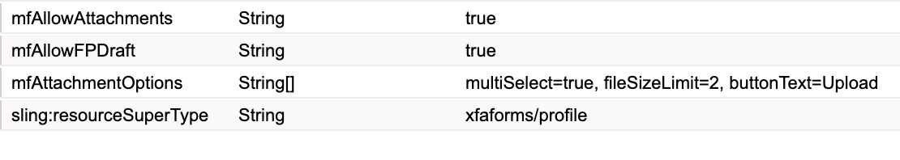

# Enabling attachments for an HTML5 form {#enabling-attachments-for-an-html-form}

You can upload, preview, and submit attachments with HTML5 forms. By default, the attachment support is disabled. To enable the attachment support:

1. Create a [custom profile](/help/forms/using/custom-profile.md) with a `mfAttachmentOptions` multiselect string property. Each string in the `mfAttachmentOptions` property must have a `property=value` format to configure options of the file attachment widget. The `property` and `value` can have any of the following values:

   | Property | Value |
   |--- |---|
   | multiSelect| true or false (true by default) |
   | fileSizeLimit | Number in MBs (2 MBs by default). For example, 5. |
   | buttonText | Button text for pop-up window ("Attach" by default)|
   | accept | comma-separated list of file types to accept ("audio/&ast;, video/&ast;, image/&ast;, text/&ast;, .pdf" by default)  |

   For example:

   

   As required, you can also specify more custom options for the `mfAttachmentOptions` property.

   >[!NOTE]
   >
   >In Microsoft Internet Explorer 9, users can attach files larger than the specified limit. It is a known issue.

1. Use the [metadata editor](/help/forms/using/manage-form-metadata.md) to select the custom profile that you have created above for HTML 5 forms.
1. Render your form template with custom profile and the attachments icon would appear on the forms toolbar.

   >[!NOTE]
   >
   >Out of the box, the forms portal provides a custom profile with drafts and attachments capability enabled. For more information about the **Save as Draft** profile, see [Saving HTML5 forms as a draft](/help/forms/using/saving-html5-form-draft.md).

1. Click the attachment icon, an attachment selection dialog box appears. Browse and select the attachment and click **Attach**.

   >[!NOTE]
   >
   >To preview an attachment, click the attachment name.

   >[!NOTE]
   >
   >The file preview option is not available for anonymous users.

## Attachment submission format {#attachment-submission-format}

When attachments are enabled, HTML5 form submits multipart data. The multi-part submission data has two parts **dataXml** and **attachments**.

>[!NOTE]
>
>For backward compatibility, if `mfAllowAttachments` option is turned off, then the HTML5 forms does not send the multi-part data. It sends simple data xml in **application/xml** format.

If the mfAllowAttachments flag is turned on, the [submit service proxy service](/help/forms/using/service-proxy.md) also posts multipart data with dataXml and attachments.
