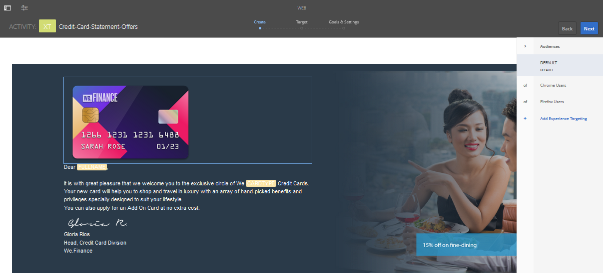

# Create targeted experiences in AEM Forms {#create-targeted-experiences-in-aem-forms}

## Integrate Adobe Target with AEM Forms {#integrate-adobe-target-with-aem-forms}

Adobe Target integrated with AEM lets you create experiences customized for a target audience. With Adobe Target, you can create A/B tests, measure user response, and generate customized web content for targeted users. You can integrate Adobe Target with AEM Forms to target image components of adaptive forms and interactive communications.

Configure Adobe Target in AEM to use it with adaptive forms and interactive communications, see [Creating a Target Configuration in AEM](/help/sites-administering/target.md) and [Add a Framework](/help/sites-administering/target.md).

>[!NOTE]
>
>Targeting works when your adaptive form or interactive communication is rendered using a host name or IP address. It fails when your adaptive form or interactive communication is rendered using localhost.

## Creating a Target Activity {#creating-a-target-activity}

1. Select **Adobe Experience Manager &gt; Personalization &gt; Activities**.

   `https://<hostname>:<port>/libs/cq/personalization/touch-ui/content/v2/activities.html`

1. In the Activities page, select **Create > Create Brand**.
1. You are asked to choose a template and enter properties.

   Select a template, select **Next.** Enter the title of your brand in the Properties section, and select **Create.**
   Your brand is now listed in the Activities page.

1. Select your brand in the Activities page.
1. In Master Area of your brand, select **Create** &gt; **Create Activity**.

   When you create an activity, you specify its details, target, and settings.

   The Details section includes name, targeting engine, and objective. When you select Adobe Target as the targeting engine, you get Target cloud configuration option enabled. Choose your Target cloud configuration, choose Activity type, provide the objective of the activity, and select **Next**. Interactive Communication supports only Experience Targeting Activity type.

   The Target section lets you add audience experience and name it. Click **Add Experience** to enable the **Select Audience** and **Name Experience** options. Select **Select Audience** to see a list of audiences and their source. Select an audience from the Audience Name list. Select **Add Experience** to name the experience, and select **Next**.

   The Goals & Settings section lets you schedule and prioritize your activity. Set the start date, end date, and priority of the activity, goal metric, additional metric and select **Save**.

   The activity is now listed in your brand page.

   >[!NOTE]
   >
   >You may ignore the error "Your activity was saved but it was not synchronized to Target. Reason: The following experience has no offers", if encountered on saving the activity.

1. To enable target, edit the .jsp file to include client libraries that your adaptive forms template uses.

   For example, in the out-of-the-box implementation, click **Tools** &gt;  **CRXDE Lite**.

   In the CRXDE Lite address bar, type /libs/fd/af/components/page/base/head.jsp to edit the head.jsp file.

   This implementation uses simpleEnrollment template. In this implementation, modify the head.jsp file to include the following client libraries:

   `<cq:include script="/libs/cq/cloudserviceconfigs/components/servicelibs/servicelibs.jsp"/>`

   `<cq:include path="clientcontext_optimized" resourceType="/libs/cq/personalization/components/clientcontext_optimized"/>`

   `<cq:include path="config" resourceType="cq/personalization/components/clientcontext_optimized/config"/>`

1. To enable target framework for adaptive forms, navigate to your form or interactive communication, and open it in edit mode.

   To open a form or interactive communication in edit mode, select **Select** and then select **Open**.

   Alternatively, four buttons appear when you move your pointer over the form or interactive communication icon without selecting it. You can select the **Edit** button that appears, to open the form in edit mode.

1. In the page toolbar, select **Page Information**  > **Open Properties**.
1. In the General tab, choose a configuration for the **Adobe Target** field. Select **Save & Close**.

## Applying created activity to an adaptive form image or an interactive communication image {#applying-created-activity-to-an-adaptive-form-image-or-an-interactive-communication-image}

1. Open the adaptive form and interactive communication for editing. If you are opening an interactive communication, open the Web Channel.

1. In the authoring mode of your interactive communication or adaptive form, add an image to be targeted.

   >[!NOTE]
   >
   >AEM Forms supports targeting only image components. Ensure that the panel hosting the image component does not contain any other component and the number of columns for the panel are set to 1.

1. Switch from **Edit** to **Targeting** mode. The option to switch modes is near the Top-Right corner.
1. Select a **BRAND**, select **ACTIVITY**, and select **Start Targeting**. The **Audiences** menu appears on right side of the editor.

   

1. Select an audience from the **Audiences** menu and select the image to target. A menu appears. In the menu, select **Target**. Select the image and select **Configure**. In the properties window, select the image to display for the selected audience. Repeat the step for all the audiences. The experience targeting is enabled for the image in the interactive communication or adaptive form.

## Check if the created activity syncs with the Target server {#check-if-the-created-activity-syncs-with-the-target-server}

An activity used for targeting syncs with the Target server. To check if your activity is in sync with the target server, check the status of your activity in your brand page.

Ensure that the status of the activity is Synced.

## Validate Target behavior {#validate-target-behavior}

To validate Target behavior:

* Use targeting with `wcmmode preview` in the author mode
* Use targeting with `wcmmode preview` and `wcmmode disabled` in the publish mode

## Monitor targeting for the image component {#monitor-targeting-for-the-image-component}

To monitor targeting for image components on your form, publish your images, activities, and adaptive form.

## Open Issues {#open-issues}

Visibility expression, set focus fail for targeted images on adaptive forms.
