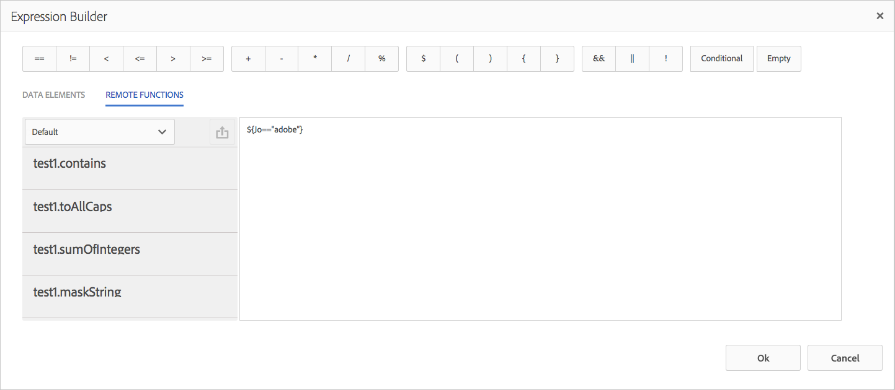

# Remote functions in Expression Builder{#remote-functions-in-expression-builder}

Using the Expression Builder, you can create expressions or conditions that perform computations on data values provided by the Data Dictionary or by end users. Correspondence Management uses the result of the expression evaluation to select assets such as text, images, lists, and conditions and insert them in the correspondence as required.

## Creating expressions and remote functions with expression builder {#creating-expressions-and-remote-functions-with-expression-builder}

The Expression Builder internally uses JSP EL libraries, so the expression adhere to JSPEL syntax. For more information, see [Example expressions](#exampleexpressions).

 

### Operators {#operators}

The operators that are available for use in expressions are available in the top bar of the expression builder.

### Example expressions {#exampleexpressions}

Here are a few commonly used JSP EL examples that you can use in your Correspondence Management solution:

* To add two numbers: ${number1 + number2}
* To concatenate two strings: ${str1} ${str2}
* To compare two numbers: ${age &lt; 18}

You can find more information in the [JSP EL specification](https://download.oracle.com/otn-pub/jcp/jsp-2.1-fr-spec-oth-JSpec/jsp-2_1-fr-spec-el.pdf). The client-side expression manager does not support certain variables and functions in the JSP EL specification, specifically:

* Collection indexes and map keys (using the [] notation) are not supported in variable names for expressions evaluated on the client-side.
* The following are the parameter types or return types of functions used in expressions:

    * java.lang.String  
    * java.lang.Character  
    * Char  
    * java.lang.Boolean  
    * Boolean  
    * java.lang.Integer  
    * Int  
    * java.util.list
    * java.lang.Short  
    * Short  
    * java.lang.Byte  
    * byte  
    * java.lang.Double  
    * Double  
    * java.lang.Long  
    * Long  
    * java.lang.Float  
    * Float  
    * java.util.Calendar  
    * java.util.Date  
    * java.util.List

### Remote function {#remote-function}

Remote functions provide the capability to use custom logic in expressions. You can write custom logic to be used in expression as a method in Java and same function can be used inside expressions. Available remote functions are listed under the "Remote Functions" tab on the left side of Expression Editor.

 

#### Adding custom remote functions {#adding-custom-remote-functions}

You can create a custom bundle to export your own remote functions for use inside expressions. To create a custom bundle to export your own remote functions, perform the following tasks. It demonstrates how to write a custom function that capitalizes its input string.

1. Define an interface for the OSGi service containing methods which are being exported for use by Expression Manager.
1. Declare methods on the interface A and annotate them with the @ServiceMethod annotation (com.adobe.exm.expeval.ServiceMethod). Expression Manager ignores any unannotated methods. The ServiceMethod annotation has the following optional attributes which can also be specified:

    1. **Enabled**: Determines if this method is enabled. Expression Manager ignores disabled methods.
    1. **familyId**: Specifies the method’s family (group). If empty, Expression Manager assumes that the method belongs to the default family. There is no registry of families (except for the default one) from which functions are chosen. Expression Manager dynamically creates the registry by taking a union of all family IDs specified by all the functions exported by the various bundles. Ensure that the ID they specify here is reasonably readable, since it displays in the expression authoring user interface as well.
    1. **displayName**: A human-readable name for the function. This name is used for display purposes in the authoring user interface. If empty, Expression Manager constructs a default name using the function's prefix and local-name.
    1. **Description**: A verbose description for the function. This description is used for display purposes in the authoring user interface. If empty, Expression Manager constructs a default description using the function's prefix and local-name.

   ```java
   package mergeandfuse.com;
   import com.adobe.exm.expeval.ServiceMethod;
   
   public interface RemoteFunction {
    @ServiceMethod(enabled=true,displayName="Returns_all_caps",description="Function to convert to all CAPS", familyId="remote")
    public String toAllCaps(String name);
    
   }
   
   ```

   The parameters of the methods can also be optionally annotated using the @ServiceMethodParameter annotation (com.adobe.exm.expeval.ServiceMethodParameter). This annotation is only used for specifying human-readable names and descriptions of method parameters for use in the authoring user interface. Ensure that the parameters and return-values of the interface methods belong to one of the following types:

    * java.lang.String
    * java.lang.Character
    * Char
    * java.lang.Boolean
    * Boolean
    * java.lang.Integer
    * Int
    * java.lang.Short
    * Short
    * java.lang.Byte
    * byte
    * java.lang.Double
    * Double
    * java.lang.Long
    * Long
    * java.lang.Float
    * Float
    * java.util.Calendar
    * java.util.Date
    * java.util.List

1. Define the implementation of the interface, configure it as an OSGI service and define the following service properties:

```jsp
@org.apache.felix.scr.annotations.Properties({
  @org.apache.felix.scr.annotations.Property(name = "connectors.jsoninvoker", boolValue = true),
  @org.apache.felix.scr.annotations.Property(name = "connectors.jsoninvoker.alias", value = "<service_id>"),
  @org.apache.felix.scr.annotations.Property(name = "exm.service", boolValue = true)})

```

The exm.service=true entry instructs Expression manager, that the service contains remote functions suitable for use in expressions. The &lt;service_id&gt; value must be a valid Java identifier (alphanumeric,$, _ with no other special characters). This value, prefixed with the REMOTE_ keyword, forms the prefix which is used inside expressions. For example, an interface with an annotated method bar() and the service ID foo in the service properties, can be referenced inside expressions using REMOTE_foo:bar().

```java
package mergeandfuse.com;

import org.apache.felix.scr.annotations.Component;
import org.apache.felix.scr.annotations.Service;

@Component(metatype = true, immediate = true, label = "RemoteFunctionImpl")
@Service(value = RemoteFunction.class)
@org.apache.felix.scr.annotations.Properties({
  @org.apache.felix.scr.annotations.Property(name = "connectors.jsoninvoker", boolValue = true),
  @org.apache.felix.scr.annotations.Property(name = "connectors.jsoninvoker.alias", value = "test1"),
  @org.apache.felix.scr.annotations.Property(name = "exm.service", boolValue = true)})
public class RemoteFuntionImpl implements RemoteFunction {

 @Override
 public String toAllCaps(String name) {
  System.out.println("######Got######"+name);
  
  return name.toUpperCase();
 }
 
}

```

Below are sample archives to use:

* **GoodFunctions.jar.zip** is the jar file with bundle containing a sample remote function definition. Download the GoodFunctions.jar.zip file and unzip it to get the jar file.
* **GoodFunctions.zip** is the package of source code for defining a custom remote function and creating a bundle for it.

GoodFunctions.jar.zip

[Get File](assets/goodfunctions.jar.zip)

GoodFunctions.zip

[Get File](assets/goodfunctions.zip)
