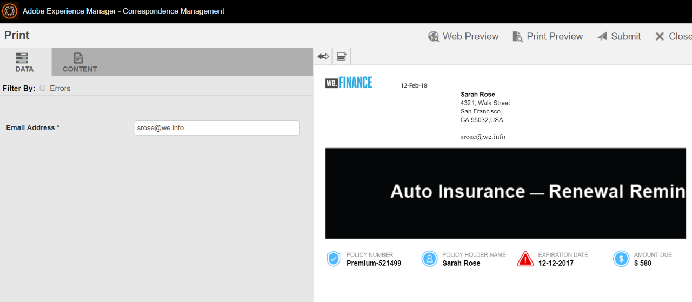

# We.Finance Auto Insurance Renewal reference site walkthrough{#we-finance-auto-insurance-renewal-reference-site-walkthrough}

## We.Finance Reference Site scenario  {#we-finance-reference-site-scenario}

We.Finance site is a financial services site designed to help you learn the interactive communications capabilities of AEM Forms.

Read a detailed walkthrough of a We.Finance Auto Insurance use case that showcases how AEM forms and its integration with Microsoft&reg; Dynamics helps personalize customer experience in a financial service company. The interactive walkthrough is designed to ease implementation of complex digital transactions and customer communication in a financial company.

**The journey starts with the use case:**

Sarah Rose is an existing We.Finance customer and has purchased an auto insurance policy. It is that time of the year for Sarah to renew her insurance policy. Gloria Rios is her insurance agent. We.Finance sends a reminder to Sarah about her policy renewal. Sarah follows the instructions provided in the email and successfully completes the process.

## Auto-Insurance application walkthrough {#auto-insurance-application-walkthrough}

The We.Finance Auto-Insurance application scenario is a visual narration for the user and is based on two personas:

* Sarah Rose, a We.Finance customer
* Gloria Rios, Insurance Agent, We.Finance

### Gloria sends an Insurance policy renewal communication from We.Finance {#gloria-sends-an-insurance-policy-renewal-communication-from-we-finance}

Gloria logs into AEM instance, clicks **Auto Insurance Renewal,** and then clicks **Open Agent UI**. The click prefills the insurance document with policy details of Sarah Rose. Gloria clicks **Submit** and a message is displayed on the screen "Submission Initiated" and then in a few seconds "Submitted Successfully".

Sarah receives an email with the subject "Your Auto Insurance Renewal".

 

#### See it yourself {#see-it-yourself}

Go to **Adobe Experience Manager** &gt; **Forms** &gt; **Forms & Documents** &gt; **We.Finance** &gt; **Auto Insurance**. Select the Auto Insurance Renewal **interactive communication** and click **Open Agent UI**. The interactive communication opens up in the Agent UI. Enter a valid email address so they can receive the email with the attached policy document and click Submit.

You can access and review the Auto Insurance Renewal interactive communication directly from `https://[authorHost]: authorPort]/aem/formdetails.html/content/dam/formsanddocuments/we-finance/autoinsurance/auto-insurance-renewal.`

### Sarah receives an insurance policy renewal communication from We.Finance and decides to renew {#sarah-receives-an-insurance-policy-renewal-communication-from-we-finance-and-decides-to-renew}

Sarah receives an email with an attachment from We.Finance, reminding Sarah that her Auto Insurance policy is about to expire. The attachment is the print version of Sarah's Auto Insurance letter.

Sarah clicks **Renew Now** and is directed to the web version of her Auto Insurance letter. On top of this letter, Sarah finds the amount of time left for her policy before it expires. The page provides Sarah a basic overview of her Insurance Policy details such as Policy Number, Amount Due, and other information such as discount offers and loyalty rewards. Sarah again clicks **Renew Now** at the bottom of the policy.

 

#### How it works {#how-it-works}

The web and print output of your Auto Insurance letter are created using the multi-channel capabilities of Interactive Communications.

The Renew Now button in the email is linked to the Auto Insurance Renew application, which is an Interactive communication on a publish instance.

#### See it yourself {#see-it-yourself-1}

You must have received an email with an attached PDF. The PDF is a print version of your Auto Insurance letter. Click **Renew Now** to reach to the web version of the policy. Check your personal information and policy details and click **Renew Now** which takes you to another Interactive Communication.

The **Renew Now** button in the email directs Sarah to the policy on the web. You can visit the following URL:

`https://[authorServer]:[authorPort]/content/document.html?schema=fdm&documentId=/content/forms/af/we-finance/autoinsurance/auto-insurance-renewal/channels/web.html&customerId=1`

You can check the detailed summary of your Auto Insurance Renewal and click **Renew Now** at the bottom of the page.

### Sarah reaches the payment page {#sarah-reaches-the-payment-page}

We.Finance takes Sarah to the Payment page. Sarah rechecks her Policy Number and Date of Expiration with her records. On the right side of the page, Sarah checks the Payment Summary of the renewal with a 10% premium discount on the total amount.

#### How it works {#how-it-works-1}

The Renew Now button directs Sarah to the payment page. The payment page is an adaptive form.

#### See it yourself {#see-it-yourself-2}

Click **Renew Now** to reach to the Payment page. Fill in your Credit Card information, and click **Make Payment**.

You can reach the payment page in the authoring instance at

`https://[authorServer]:[authorPort]/content/document.html?documentId=/content/forms/af/we-finance/credit-card/ccbillpayment.html&schema=fdm&customerId=1`

### Sarah makes the payment and completes the process {#sarah-makes-the-payment-and-completes-the-process}

Sarah fills her Credit Card details and clicks **Make Payment**.

#### How it works {#how-it-works-2}

When Sarah fills the credit card details and clicks Submit, her credit card payment is processed and a thank you message configured in the adaptive form appears on the screen.

#### See it yourself {#see-it-yourself-3}

You can view the confirmation message after clicking Make Payment at

`https://[authorServer]:[authorPort]/content/forms/af/we-finance/credit-card/ccbillpayment/jcr:content/guideContainer.guideThankYouPage.html?owner=admin&status=Submitted`
