# We.Finance reference site walkthrough {#we-finance-reference-site-walkthrough}

## Pre-requisites {#pre-requisites}

Set up the reference sites as described in [Set up and configure AEM Forms reference sites](/help/forms/using/setup-reference-sites.md).

## We.Finance Reference site scenarios {#we-finance-reference-site-scenarios}

We.Finance is a leading organization in Financial Services domain that offers comprehensive and personalized financial solutions to suit the requirements of diverse customer profiles. They offer credit cards, home mortgage, and home insurance services.

Their goal is to reach out to existing and prospective customers on their preferred device, explain the benefits of their services, and help them enroll in their services. In addition, they are looking to pitch for more financial products like add-on cards that customers may find interesting.

Read on for detailed walkthroughs of We.Finance use cases and understand how AEM Forms helps financial organizations achieve their objectives. The following walkthroughs are covered:

* [Credit card application walkthrough](#credit-card-application-walkthrough)
* [Home mortgage application walkthrough](#home-mortgage-application-walkthrough)
* [Home Mortgage application walkthrough with Microsoft Dynamics](#home-mortgage-application-walkthrough-with-microsoft-dynamics)
* [Home insurance application walkthrough](#home-insurance-application-walkthrough)
* [Wealth management walkthrough](#wealthmanagementwalkthrough)
* [Auto insurance application walkthrough](#autoinsuranceapplicationwalkthrough)

## Credit card application walkthrough {#credit-card-application-walkthrough}

The We.Finance credit card application scenario involves the following personas:

* Sarah Rose, a We.Finance customer
* Gloria Rios, Head of Credit Card and Mortgage, We.Finance

The following infographic depicts step-by-step workflow of the credit card application.

Let’s look at the reference site scenario in detail to understand how the AEM Forms helps We.Finance achieve their objectives.

### Sarah receives a newsletter from We.Finance and applies for a credit card {#sarah-receives-a-newsletter-from-we-finance-and-applies-for-a-credit-card}

Sarah Rose is an existing We.Finance customer. She receives a newsletter from We.Finance about new credit cards on offer. She finds the offers exciting and decides to apply for a credit card. She clicks the Apply Now button in the newsletter, which takes her to the credit card application on We.Finance portal. 

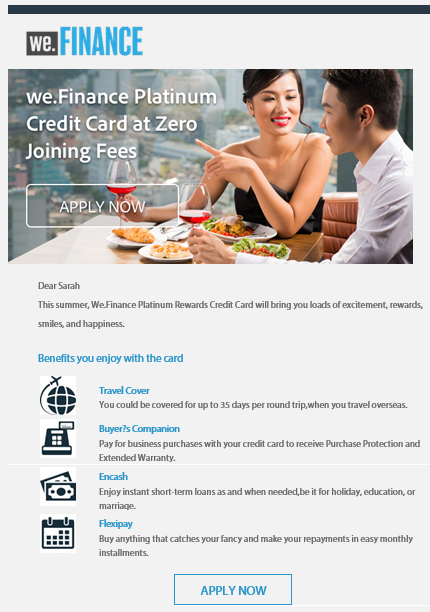 

#### How it works {#how-it-works}

The newsletter sent to Sarah is a custom implementation that triggers an email to the specified email ID. The Apply Now button in the email is linked to the credit card application, which is an adaptive form on a publish instance.

#### See it yourself {#see-it-yourself}

Open the following URL on the publish instance to trigger a newsletter email. Ensure that you replace `[emailID]` with a valid email account to receive the newsletter. Open the newsletter and click **[!UICONTROL Apply Now]** to go to the credit card application.

`https://[publishServer]:[publsihPort]/content/campaigns/we-finance/start.html?app=cc&email=[emailID]&givenName=Sarah&familyName=Rose`

### Sarah finds the offer interesting and chooses to apply {#sarah-finds-the-offer-interesting-and-chooses-to-apply}

Sarah decides to apply for the credit card and taps **[!UICONTROL Apply Now]** button on the email. It takes Sarah to the credit card application on We.Finance portal. The application form is organized in sections using a card layout.

Sarah selects a credit card from the available options and clicks **[!UICONTROL Continue]**.

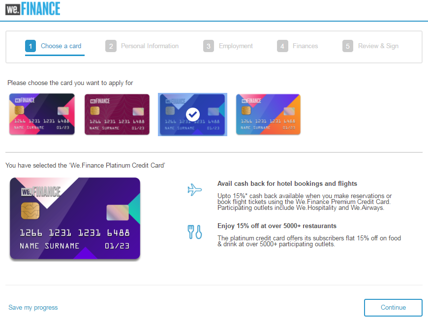

On the Personal Information page, as Sarah provides her Social Security Number, she gets a prompt to log in with her credentials.

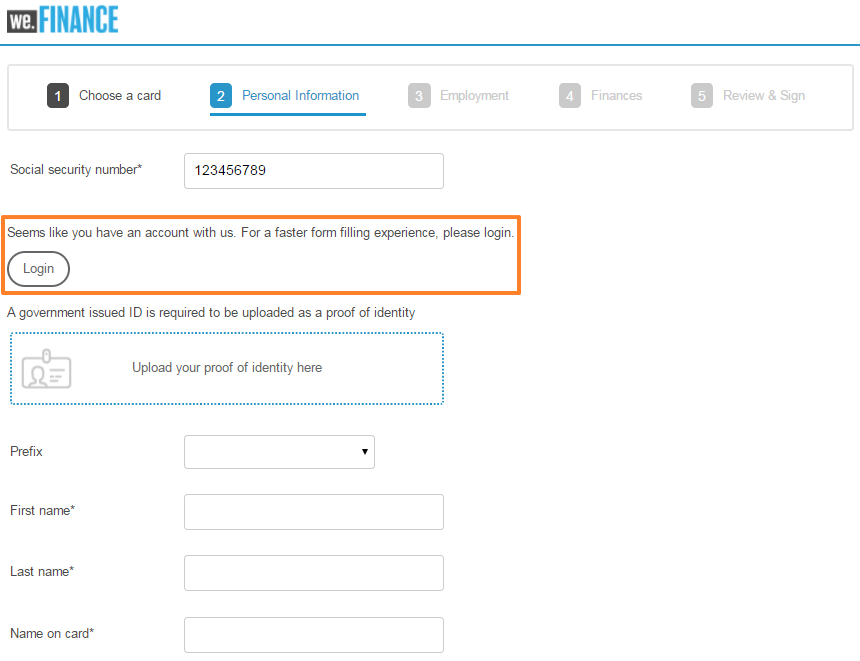

Sarah is an existing We.Finance customer. She logs in with her We.Finance account credentials and her personal details are auto-populated in the form. Sarah continues to fill the application form and that’s when a reminder pops up for a meeting she must attend. She clicks **[!UICONTROL Save my progress]** on the application form. It saves all the information Sarah has filled in so far and a dialog pops up to confirm if she would like to receive an email with a link to her draft application to complete later.

Sarah clicks **[!UICONTROL Send mail]**. She receives an email with a link to resume her credit card application.

 

<!--Theses sections used to be an accordion until converted to straight Markdown. When accordions are enabled, revert-->

### Sarah accesses the credit card application from her mobile device {#a-sarah-access}

If Sarah is accessing the credit card application from her mobile device, the responsive application opens in a view optimized for mobile devices. In this view, the application form is renders as one section at a time. It allows Sarah to view and provide information progressively as she navigates the application.

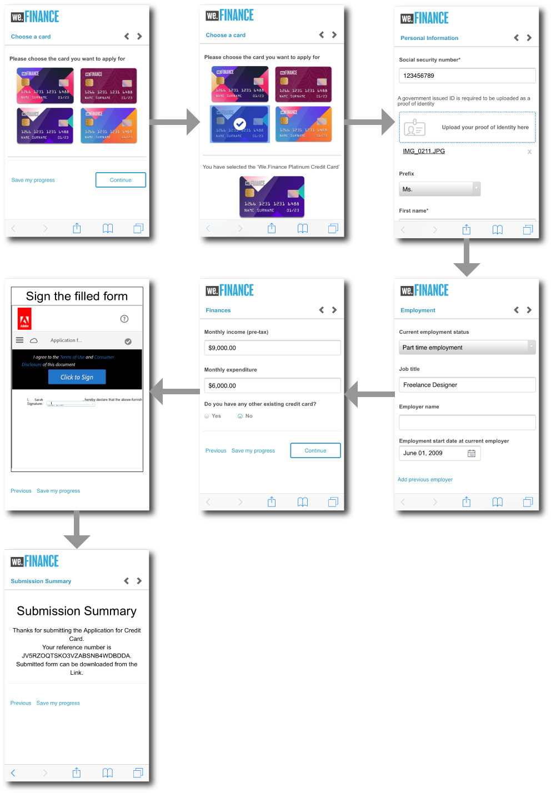

### How it works {#a-how-it-works}

The **[!UICONTROL Apply Now]** button directs Sarah to the credit card application. The application is an adaptive form, which you can review in the authoring instances at `https://[host]:[Port]/editor.html/content/forms/af/we-finance/cc-app.html`.

Some of the key features you can review in the adaptive form are:

* It is based on an XSD schema.
* It is built using We Finance Theme A for styling and We.Finance template for layout. Also, it uses Layout without panel titles in the form header layout for mobile navigation. It displays a progressive mobile layout when opened from a mobile device. You can review the template at `https://[host]:[Port]/libs/wcm/core/content/sites/templates.html/conf/we-finance` and the theme at `https://[host]:[Port]/editor.html/content/dam/formsanddocuments-themes/we-finance/we-finance-theme-a/jcr:content`.
* It includes adaptive form rules to invoke Form Data Model services to prefill user details of logged in user. It also invokes services to prefill information by social security number or email address provided in the form. You can review the Form Data Models and their services at `https://[host]:[Port]/aem/forms.html/content/dam/formsanddocuments-fdm`.
* It uses various adaptive form components to capture inputs and adapts to user responses. It also uses components like Email that support HTML5 input types.
* It uses the Signature Step component to display the completed form and allows electronic signature on the form.
* The Save my progress button generates a unique ID for the user and saves the partially-filled application as a draft in a node in AEM repository. Also, it displays a dialog seeking permission to send an email with a link to the node containing the draft application. The Send mail button on the confirmation dialog triggers an email with a link to the node containing the draft.
* It uses the Invoke AEM Workflow submit action to trigger the credit card approval workflow. You can review the workflow used in this form at `https://[host]:[Port]/editor.html/conf/global/settings/workflow/models/we-finance-credit-card-workflow.html`

It is recommended to review the form to understand the schema, components, rules, Form Data Models, forms workflow, and submit action used to build the form.

Also, see the following documentation for more information about features used in the credit card application adaptive form:

* [Introduction to authoring adaptive forms](/help/forms/using/introduction-forms-authoring.md)
* [Creating adaptive forms using XML Schema](/help/forms/using/adaptive-form-xml-schema-form-model.md)
* [Rule Editor](/help/forms/using/rule-editor.md)
* [Themes](/help/forms/using/themes.md)
* [Data Integration](/help/forms/using/data-integration.md)
* [Using Adobe Sign in adaptive forms](/help/forms/using/working-with-adobe-sign.md)
* [Forms-centric workflow on OSGi](/help/forms/using/aem-forms-workflow.md)

### See it yourself {#a-see-it-yourself}

When logged in as Sarah Rose, click the **[!UICONTROL Apply now]** button on the credit card application. Fill in some details, explore various adaptive form components, and click **[!UICONTROL Save my progress]** to receive an email with a **[!UICONTROL Resume]** button that links to the draft application. Ensure that you specify your email ID in the application form to receive the email.

Review the We.Finance Theme available at:

`https://<host>:<AuthorPort>/editor.html/content/dam/formsanddocuments-themes/we-Finance/we-Finance-Theme-A/jcr:content`

You can review the We.Finance Template at:

`https://<host>:<AuthorPort>/editor.html/conf/we-finance/settings/wcm/templates/we-finance-template/structure.html`

### Sarah resumes and submits the application {#sarah-resumes-and-submits-the-application}

Sarah comes back later and finds an email from We.Finance. She clicks the **[!UICONTROL Resume]** button in the email that takes her to her draft credit card application. The information that she filled earlier comes prepopulated. She fills the remaining application form, signs the application, and submits it.

Alternatively, she can access her draft application under **[!UICONTROL My Forms]** on We.Finance home page.

 

#### How it works {#how-it-works-1}

The Resume button in the email redirects Sarah to the node containing her draft application.

#### See it yourself {#see-it-yourself-1}

You must have received an email with a link to the draft application on your email ID that you specified while filling the application form. Go ahead, fill in the remaining sections in the application, and submit it.

### We.Finance receives and approves the application {#approving-the-application}

We.Finance receives the credit card application submitted by Sarah. A task is assigned to Gloria Rios. She reviews the task in her AEM Inbox and approves it.

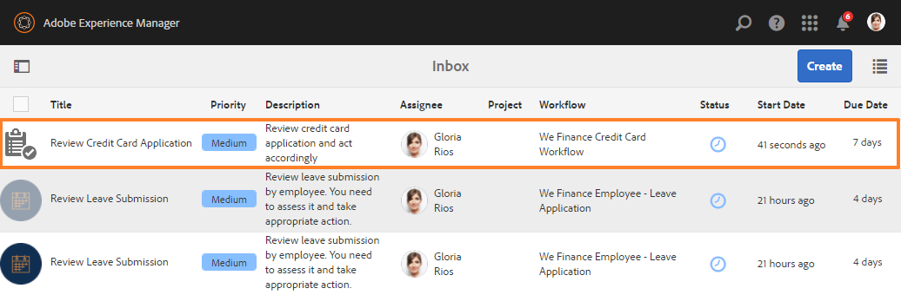 

#### How it works {#how-it-works-2}

When Sarah fills and submits the credit card application, a Forms Workflow triggers and a task is created in Gloria's AEM inbox.

AEM Forms on OSGi provides forms-centric workflows that allow you to build adaptive forms-based workflows. These workflows can be used for review and approvals, business process flows, to start document services, integrate with Adobe Sign signature workflow, and so on. For more information, see [Forms-centric workflow on OSGi](/help/forms/using/aem-forms-workflow.md).

The following image depicts the AEM workflow that processes the credit card application and generates a PDF output of the application.

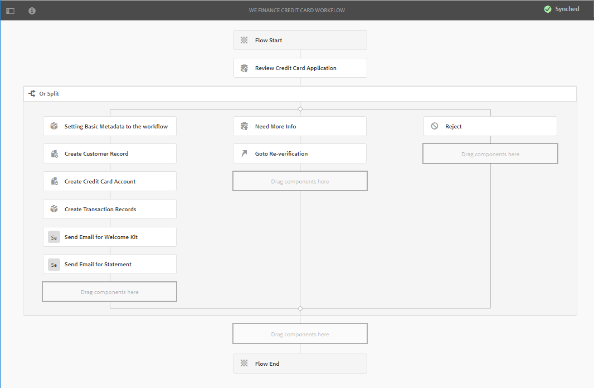 

#### See it yourself {#see-it-yourself-2}

You can access AEM inbox for the we.finance site at https://<*hostname*>:<*PublishPort*>/content/we-finance/global/en.html. On the page, tap **[!UICONTROL Sign In]**, select the **[!UICONTROL Login as representative]** checkbox, log in to the AEM inbox using `grios/password` as the username/password for Gloria Rios, and approve the credit card application. For information about using AEM Inbox for forms-centric workflow tasks, see [Manage Forms applications and tasks in AEM Inbox](/help/forms/using/manage-applications-inbox.md).

When you approve the application, Sarah receives an email with the welcome kit.

### Sarah receives the welcome kit and applies for an add-on card {#sarah-receives-the-welcome-kit-and-applies-for-an-add-on-card}

As Sarah's credit card application gets approved, she receives an email with a link to the Welcome kit. She opens the Welcome kit, which includes her credit card account details. The Welcome kit also displays promotional offers personalized for Sarah. As she scrolls down, the Welcome kit contains an embedded form to apply for an add-on card. Sarah quickly filled in the required details from within the Welcome kit and applies for the add-on card. A confirmation dialog for the add-on card application appears.

The welcome kit is personalized for Sarah and shows information relevant to her. It provides her an option to download a PDF version of the welcome kit. 

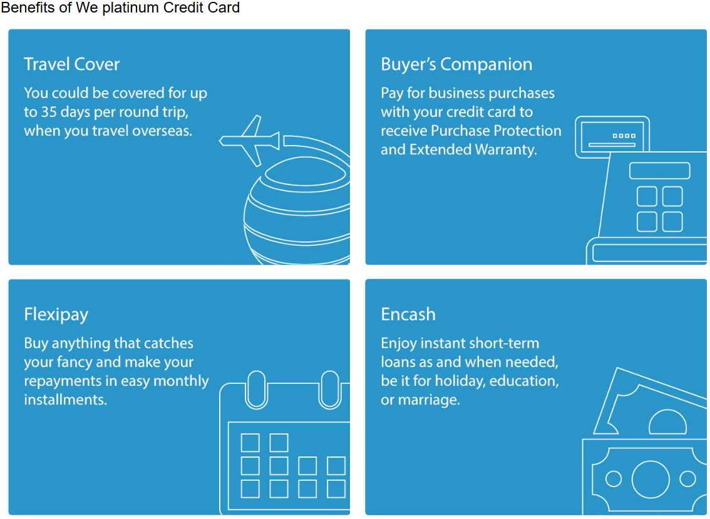

The welcome kit includes another application form that Sarah can fill and submit to apply for an add-on card from within the welcome kit without visiting the We.Finance portal.

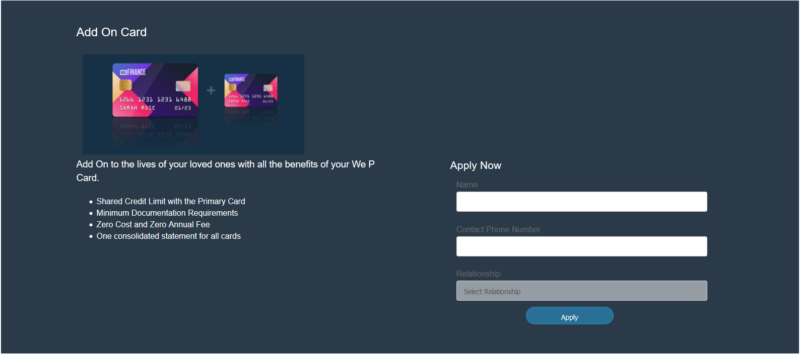 

#### How it works {#how-it-works-3}

The welcome kit is an interactive communication included in the `cq-we-finance-content-pkg.zip` package. The interactive cards in the desktop version to showcase the benefits of the credit card in the welcome kit is a custom layout created using the default card layout of a document fragment.

The add-on card application is an embedded adaptive form in the welcome kit interactive communication.

#### See it yourself {#see-it-yourself-3}

Click the **[!UICONTROL Resume]** button in the email that you received in the previous step. It opens the draft application. Fill in all the details and submit the application. You will then receive a welcome kit. Review the welcome kit.

You can also view the welcome kit at the following URL:

https://&lt;*host*&gt;:&lt;*port*&gt;/content/aemforms-refsite/doclink.html?document=/content/forms/af/we-finance/credit-card/creditcardwelcomekit&customerId=197&channel=web

You can access it on author and publish instances.

### Sarah receives a credit card statement {#sarah-receives-a-credit-card-statement}

As Sarah begins to use the credit card, she receives another email from We.Finance that includes her credit card statement. The following images show the email with a link to the credit card statement on mobile.

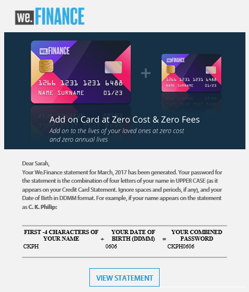

Sarah clicks View Statement in the email to view the credit card statement. The statement is an interactive communication. It has both Web and Print (PDF) versions. The statement integrates with Forms Data Model to retrieve data, specific to the customer, from the database. The interactive statement constitutes various elements:

* Statement summary
* Detailed expense report
* Graphical expense analysis
* Option to make a payment for the due amount from within the statement
* Download the payment receipt

Sarah doesn’t need to go to the portal or search through her emails for PDF version of the credit card statement for offline archival. She just clicks the Download Statement to download a PDF version of the statement.

The detailed statement is laid out in a responsive table. The statement also provides option to pay a part or the entire due amount from within the statement.

Sarah schedules payment from within the statement. Sarah can also use the Flexi Pay option to divide payment into equal parts.

#### How it works {#how-it-works-4}

The credit card statement is an interactive communication. The detailed expense table in the statement is a responsive table. The graphic for expense analysis is a chart component and reads the expense table and generates the pie chart.

#### See it yourself {#see-it-yourself-4}

You can review the interactive credit card statement at the following URL:

https://&lt;*hostname*&gt;:&lt;*port*&gt;/content/aemforms-refsite/doclink.html?document=/content/forms/af/we-finance/credit-card/credit-card-statement&customerId=197&channel=web

You can access it on author and publish instances.

The credit card statement displays promotional offers towards the end of statement. You can integrate Adobe Target with AEM Forms Interactive Communication to deliver promotional targeted offers based on specific customer segments. To configure your interactive communication to use Adobe Target for customized and targeted offers, see [create targeted experiences](/help/forms/using/experience-targeting-forms.md).

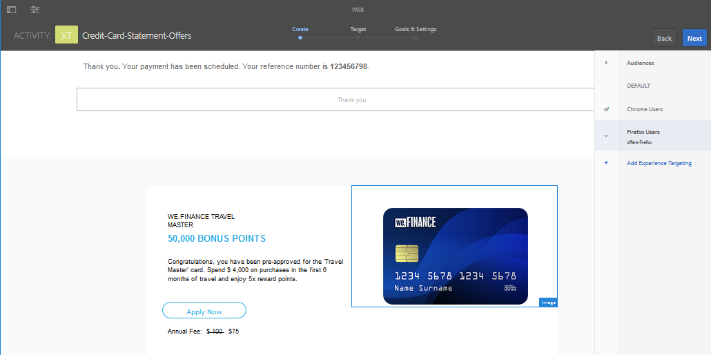 

### We.Finance analyzes the performance of the credit card application {#we-finance-analyzes-the-performance-of-the-credit-card-application}

We.Finance, from time to time, reviews the performance of their credit card application to check for any issues that customers might be facing. They use this analysis to take informed decisions about the changes required in the credit card application to enhance the user experience, reduce abandonment rate of forms, and thereby improve conversion. They leverage the integration of AEM Forms with Adobe Analytics for their analysis. The following image depicts their analytics dashboard.

For more information about how to interpret the analytics dashboard, see [Viewing and understanding AEM Forms analytics reports](/help/forms/using/view-understand-aem-forms-analytics-reports.md).

 

#### How it works {#how-it-works-5}

The performance metrics for the credit card application form are tracked using Adobe Analytics. For more information about configuring Adobe Analytics and viewing reports, see [Configuring analytics for forms and documents](/help/forms/using/configure-analytics-forms-documents.md).

#### See it yourself {#see-it-yourself-br}

For you to view and explore the analytics report, we are providing seed data for the credit card application in the reference site. Before you use seed data, see [Configure Analytics](/help/forms/using/setup-reference-sites.md#configureanalytics). Perform the following steps in author instance to view the report with the seed data:

1. Go to **[!UICONTROL Forms & Documents]** UI at https://&lt;*hostname*&gt;:&lt;*AuthorPort*&gt;/aem/forms.html/content/dam/formsanddocuments.

1. Click to open the **[!UICONTROL We.Finance]** Folder.
1. Select **[!UICONTROL Application for Credit Card]** adaptive form, and then in the toolbar, click **[!UICONTROL Enable Analytics]**.

1. Select the adaptive form again and click **[!UICONTROL Analytics Report]** in the toolbar to generate the report. You will see a a blank report initially.

To generate analytics report with seed data:

1. In the address browser of CRXDE lite, type: `/apps/we-finance/demo-artifacts/analyticsTestData/Credit card Analytics Test Data`
1. The test data is selected in the left side directory structure. 
1. Double click the selected file to open its content in the right side panel. 
1. Copy all the content in the seed data file. 
1. In CRXDE, navigate to: `/content/dam/formsanddocuments/we-finance/cc-app/jcr:content/analyticsdatanode/lastsevendays`
1. In the **[!UICONTROL analyticsdata]** field under **[!UICONTROL Properties]**, paste the copied content of the seed data file. 

1. Select **Application for Credit Card** adaptive form and click **[!UICONTROL Analytics Report]** in the toolbar to generate the report with seed data.

**A/B testing of the credit card application**

In addition to analyzing performance of the credit card application and constantly improving it, We.Finance leverages integration of AEM Forms with Target to create A/B tests. It allows them to serve different experiences of the credit card application form and identify the experience that causes better conversion rate in terms of form completion and submission.

To configure Target in AEM Forms server, see [Set up and integrate Target in AEM Forms](/help/forms/using/ab-testing-adaptive-forms.md#set%20up%20and%20integrate%20target%20in%20aem%20forms).

Perform the following steps to experience the creation of A/B test for We.Finance credit card application form:

1. Go to **[!UICONTROL Forms & Documents]** at https://&lt;*hostname*&gt;:&lt;*AuthorPort*&gt;/aem/forms.html/content/dam/formsanddocuments.

1. Click to open the **[!UICONTROL We.Finance]** folder.
1. Select **[!UICONTROL Application for Credit Card]** adaptive form.
1. Click **[!UICONTROL More]** in toolbar and select **[!UICONTROL Configure A/B Testing]**. The Configure A/B testing page opens.  

1. Specify an **[!UICONTROL Activity Name]**.
1. From the Audience drop-down list, select an audience to whom you want to serve different experiences of the form. For example, **Visitors Using Chrome**.
1. In the **[!UICONTROL Experience Distribution]** fields for experiences A and B, specify the distribution, in terms of percentage, to determine the distribution of experiences among the total audience. For example, if you specify 40, 60 for experiences A and B, respectively, the experience A will be served to the 40% of the audience and the remaining 60% will see the experience B.
1. Click **Configure**. A dialog appears to confirm the creation of the A/B test.
1. Click **Done**.
1. Select the **Application for Credit Card** form and click **Edit**. It gives the option to open one of the experiences. Click **Experience B**. The form opens in the edit mode.

1. Modify the form as desired to create a different experience than the default experience A.
1. Go to the Forms and Documents UI, select the form, click **More**, and select **Start A/B Testing**.

1. Now open the form in chrome browser several times using the following url:

   https://&lt;*hostname*&gt;:&lt;*port*&gt;/content/dam/formsanddocuments/we-finance/cc-app/jcr:content?wcmmode=disabled 
   Note: Remove the cookie with the name **mbox** from browser’s cookie persistence before opening the form next time.* 
   You will see experience A and B of the form at random.

1. Select the form, click **More**, and click **A/B Testing Report**. You won’t find much data in the report as you have just started the testing. Let’s now provide some seed data to see how A/B Testing report looks like.

1. Open CRXDE Lite and take a back-up of the following file: /libs/fd/fmaddon/gui/components/admin/targetreport/clientlibs/targetreport/js/targetreport.js
1. Replace the definition of function `onReportLoadSuccess` in the above mentioned file with the function definition in the following file: /apps/we-finance/demo-artifacts/targetreport.js

   **Note:** These changes are only for the demo purpose. Ensure that you restore the file contents after completing this procedure.

1. Refresh the report that you generated, and you will see something like the following. Review the reporting dashboard.

To end the A/B test, click **End A/B test** button on the reporting dashboard. At this time, a dialog prompts you to declare an experience. Choose a winner and confirm to end the A/B test.

If you choose experience A as the winner, the A/B test will be put to an end, and going forward, only Experience A will be served to all audiences, including those on Chrome.

## Home mortgage application walkthrough {#home-mortgage-application-walkthrough}

The We.Finance home mortgage scenario involves the following personas:

* Sarah Rose, a We.Finance customer
* Gloria Rios, Head of Credit Card and Mortgage, We.Finance
* John Doe, Customer Care Representative, We.Finance

The following infographic depicts step-by-step workflow of a home mortgage application.

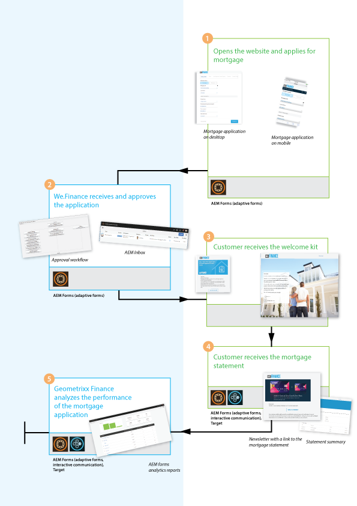

Let’s now look in detail the steps in the reference site scenario to see how the AEM Forms helps We.Finance achieve their objectives.

### Sarah visits We.Finance website and applies for home mortgage {#sarah-visits-we-finance-website-and-applies-for-home-mortgage}

Sarah Rose is planning to buy a home and looking for a home mortgage plans. She is a We.Finance customer and therefore visits the We.Finance portal to explore home mortgage offers. She goes to the Loans section and finds a mortgage calculator on the portal. She fills in the details and clicks Calculate my mortgage, which returns a mortgage plan.

 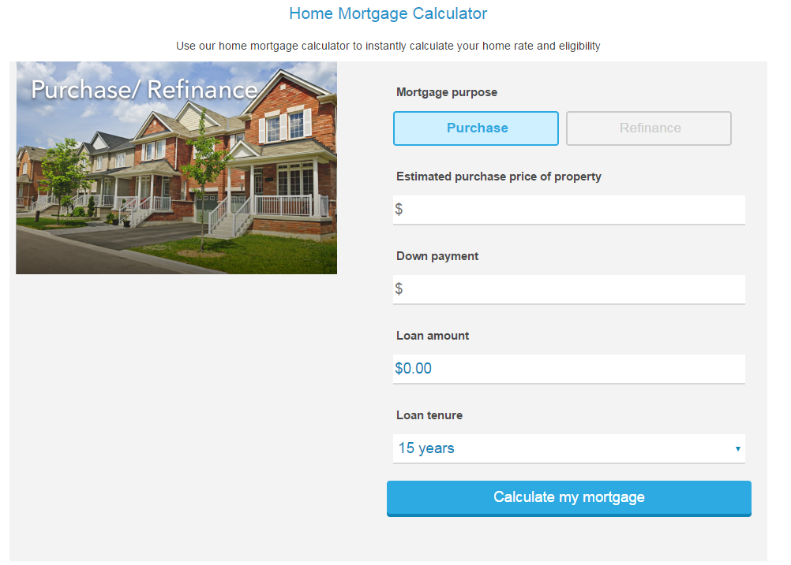
**Figure:** *Mortgage calculator*

**Figure:** *Mortgage calculator result*

#### How it works {#how-it-works-6}

The home mortgage calculator on the Loans page is an embedded adaptive form in AEM Sites page. You can review the Loans page in edit mode at `https://[authorHost]:[authorPort]/editor.html/content/we-finance/global/en/loan-landing-page.html`.

The embedded mortgage calculator, which is an adaptive form, uses rules to calculate the EMI amount based on the loan details provided in the calculator fields. You can review the adaptive form at `https://[authorHost]:[authorPort]/editor.html/content/forms/af/we-finance/hm-calc.html`.

#### See it yourself {#see-it-yourself-5}

Go to We.Finance portal at `https://<publishHost>:<publishPort>/content/we-finance/global/en.html` and click **[!UICONTROL Loans]**. Provide details in the mortgage calculator and see the results.

### Sarah finds the offer interesting and chooses to apply {#sarah-finds-the-offer-interesting-and-chooses-to-apply-1}

Sarah chooses to apply for home mortgage and clicks **[!UICONTROL Apply Now]** on home mortgage calculator results. It opens the application for home mortgage.

If Sarah is accessing the home mortgage application from her mobile device, the application form opens in a view optimized for viewing on a mobile device. In this view, the application form renders one section at a time. It allows Sarah to view and provide information progressively as she navigates the application form.

The following images show the workflow as Sarah navigates through the home mortgage application on her mobile device.

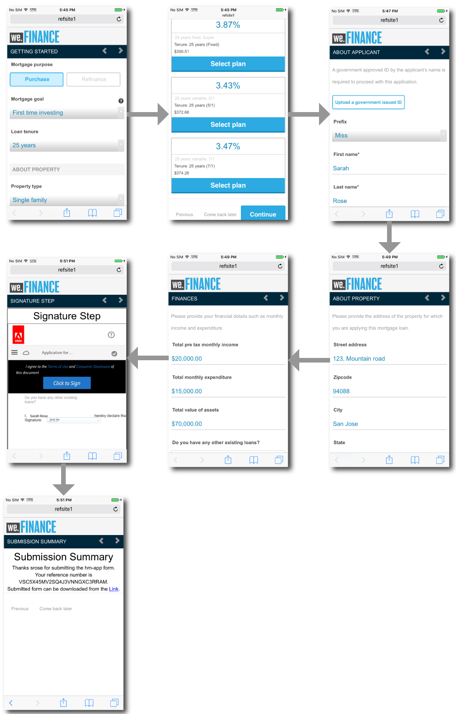

If Sarah clicks **Apply now** from her desktop, the mortgage application form opens as follows. The information Sarah provided in the mortgage calculator is prefilled in the application form. Sarah fills in the remaining details and clicks **Continue**.

Based on the information Sarah filled in the mortgage calculator, she is presented with a few mortgage plans. She chooses the plan that suits her requirements and continues to fill the application. She finally signs and submits the application.

The submitted application goes to We.Finance for approval.

 

#### How it works {#how-it-works-7}

The **Apply now** button directs Sarah to the home mortgage application. The application is an adaptive form, which you can review in the authoring instances at `https://[host]:[Port]/editor.html/content/forms/af/we-finance/hm-app.html`.

Some of the key features you can review in the adaptive form are:

* It is based on an XSD schema, `homeMortgageApplication.xsd`.
* It is built using We Finance Theme B for styling and We.Finance template for layout. Also, it uses Layout without panel titles in the form header layout for mobile navigation. It displays a progressive mobile layout when opened from a mobile device. You can review the template and the theme used in the adaptive form at the following locations on your AEM author instance:

    * `https://[host]:[Port]/libs/wcm/core/content/sites/templates.html/conf/we-finance`
    * `https://[host]:[Port]/editor.html/content/dam/formsanddocuments-themes/we-finance/we-finance-theme-b/jcr:content`

* The first tab, Getting Started, in the application is a dynamic mortgage calculator that displays options based on user selection. For example, the fields and values are different for Purchase and Refinance options. This functionality is achieved using show-hide rules. In addition, when you click Continue and the Plans tab is initialized, it invokes a web service configured in a Form Data Model to fetch and display mortgage plans. You can review the Form Data Models and configured services at `https://[host]:[Port]/aem/forms.html/content/dam/formsanddocuments-fdm`.
* It uses various adaptive form components to capture inputs and adapts to user responses. It also uses components like Email that support HTML5 input types.
* It uses the Signature Step component to display the completed form and allows electronic signature on the form.
* It uses the Invoke AEM Workflow submit action to trigger the We Finance Home Mortgage AEM workflow. You can review the workflow used in this form at `https://[host]:[Port]/editor.html/conf/global/settings/workflow/models/we-finance-home-mortgage-workflow.html`

It is recommended to review the form to understand the schema, components, rules, Form Data Models, forms workflow, and submit action used to build the form.

Also, see the following documentation for more information about features used in the home mortgage application adaptive form:

* [Introduction to authoring adaptive forms](/help/forms/using/introduction-forms-authoring.md)
* [Creating adaptive forms using XML Schema](/help/forms/using/adaptive-form-xml-schema-form-model.md)
* [Rule Editor](/help/forms/using/rule-editor.md)
* [Themes](/help/forms/using/themes.md)
* [Data Integration](/help/forms/using/data-integration.md)
* [Using Adobe Sign in adaptive forms](/help/forms/using/working-with-adobe-sign.md)
* [Forms-centric workflow on OSGi](/help/forms/using/aem-forms-workflow.md)

#### See it yourself {#see-it-yourself-6}

Go to `https://[server]:[port]/content/we-finance/global/en/all-forms.html` and click the **Apply now** button on Home Mortgage Application. Fill in the details in the Getting Started tab, try different options, and submit the application.

Ensure that you specify a valid email ID in the application to receive an acknowledgement mail in your inbox.

### We.Finance receives the application {#approving_the_application-1}

We.Finance receives the mortgage application submitted by Sarah. The task to approve or reject the application is assigned to Gloria Rios. She reviews the application and finds that Sarah's government ID is missing.

Gloria opens the task and clicks Need More Info and puts a comment about missing government ID.

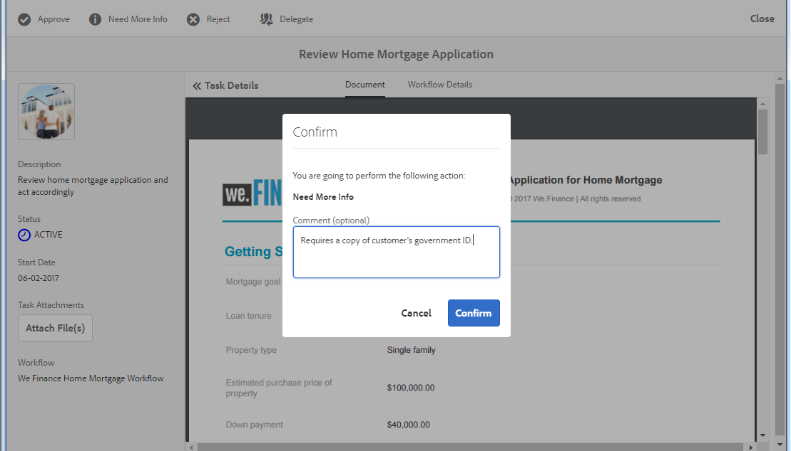

The task is now assigned to John Doe, a customer care representative with We.Finance. He opens the task and reviews Gloria's comment. He contacts Sarah and asks her to send a copy of her ID. After he received a copy of Sarah's ID, he attaches it to the task and submits the application for re-evaluation.

The task is reassigned to Gloria. She reviews the attached ID and approves the application.

#### How it works {#how-it-works-8}

When Sarah fills and submits the home mortgage application, a Forms Workflow triggers and a task is created in Gloria's AEM inbox. As Gloria reviews the application and requests for more information, the task is assigned to John Doe. When John Doe attaches the ID and resubmits the application, it is assigned to Gloria. This is defined in the AEM Workflow associated with the mortgage application.

AEM Forms on OSGi provides forms-centric workflows that allow you to build adaptive forms-based workflows. These workflows can be used for review and approvals, business process flows, to start document services, integrate with Adobe Sign signature workflow, and so on. For more information, see [Forms-centric workflow on OSGi](/help/forms/using/aem-forms-workflow.md).

The following image depicts the AEM workflow associated with the mortgage application.

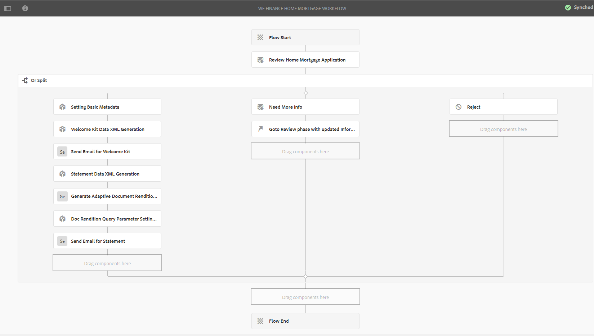 

#### See it yourself {#see-it-yourself-7}

You can access the AEM inbox at https://<***hostname***>:<***AuthorPort***>/content/we-finance/global/en/login.html?resource=/aem/inbox.html. Log in to the AEM inbox using `grios/password` as the username/password for Gloria Rios and `jdoe/jdoe` for John Doe, and explore the home mortgage application workflow.

For information about using AEM Inbox for forms-centric workflow tasks, see [Manage Forms applications and tasks in AEM Inbox](/help/forms/using/manage-applications-inbox.md).

### Sarah receives the welcome kit {#sarah-receives-the-welcome-kit}

As Sarah's mortgage application gets approved, she receives an email with a link to the Welcome kit. She opens the Welcome kit, which includes a carousel displaying promotional offers personalized for Sarah. 

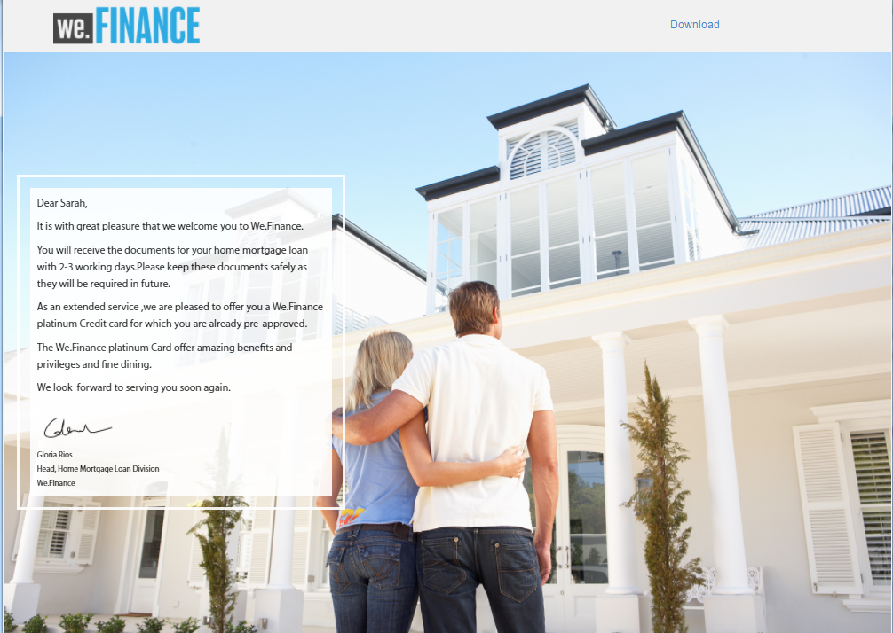

The welcome kit is personalized for Sarah and shows information relevant to her. It provides her an option to download a PDF version of the welcome kit. The arrow button at the bottom allows Sarah to scroll down and navigate through other sections in the welcome kit.

#### How it works {#how-it-works-9}

The welcome kit is an interactive communication included in the `cq-we-finance-content-pkg.zip` package. The promotional offers in the welcome kit are served by Adobe Target server. The offers are customized and targeted for specific customer segments. The welcome kit fetches offers from a preconfigured Adobe Target server for an audience segment of female customers.

The interactive cards in the desktop version of the welcome kit use a custom layout created using the default card layout of a document fragment.

#### See it yourself {#see-it-yourself-8}

If you provided your email ID when filling the mortgage application, you should have received an email containing link to the welcome kit. Check your inbox and review the welcome kit.

You can view it in AEM publish instance at the following URL:

`https://[host]:[port]/content/forms/af/we-finance/mortgage-loan-welcome-kit.html`

### Sarah receives an account statement {#sarah-receives-an-account-statement}

As Sarah avails the loan and starts paying the installments, she receives another email from We.Finance that includes her monthly account statement. 

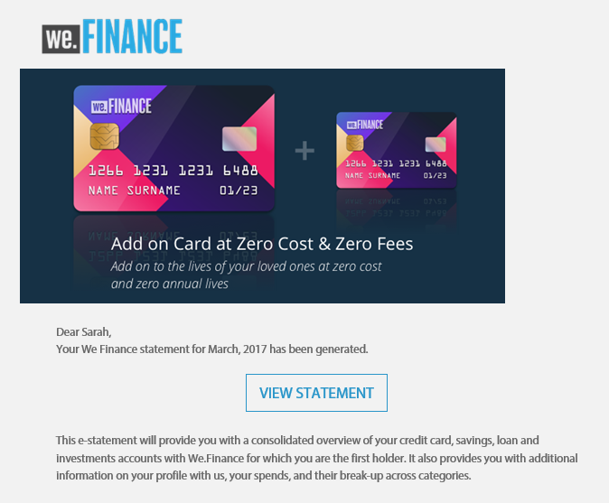

Sarah clicks View Statement in the email to view the mortgage account statement. The interactive statement constitutes various elements:

* Statement summary
* Statement Details

The following image shows different part of the account statement on Desktop. 

The detailed statement is laid out in a responsive table and provides an option to pay a part or the entire due amount from within the statement.

#### How it works {#how-it-works-10}

The mortgage statement is an interactive communication. It is generated using the JSON batching process. The detailed expense table in the statement is a responsive table.

#### See it yourself {#see-it-yourself-9}

You can review the interactive mortgage account statement at the following URL:

https://&lt;*hostname*&gt;:&lt;*port*&gt;/content/forms/af/we-finance/mortgage-account-statement.html?wcmmode=disabled

You can access it on author and publish instances.

### We.Finance analyzes the performance of the mortgage application {#we-finance-analyzes-the-performance-of-the-mortgage-application}

We.Finance, from time to time, reviews the performance of their mortgage application to check for any issues that customers might be facing. They use this analysis to take informed decisions about the changes required in the mortgage application to enhance the user experience, reduce abandonment rate of forms, and thereby improve conversion. They leverage the integration of AEM Forms with Adobe Analytics for their analysis. The following image depicts their analytics dashboard.

For more information about how to interpret the analytics dashboard, see [Viewing and understanding AEM Forms analytics reports](/help/forms/using/view-understand-aem-forms-analytics-reports.md).

 

#### How it works {#how-it-works-11}

The performance metrics for the mortgage application form are tracked using Adobe Analytics. For more information about configuring Adobe Analytics and viewing reports, see [Configuring analytics for forms and documents](/help/forms/using/configure-analytics-forms-documents.md).

#### See it yourself {#see-it-yourself-br-1}

For you to view and explore the analytics report, we are providing seed data for the mortgage application in the reference site. Before you use seed data, see [Configure Analytics](/help/forms/using/setup-reference-sites.md#configureanalytics). Perform the following steps in author instance to view the report with the seed data:

1. Go to **Forms & Documents** UI at https://&lt;*hostname*&gt;:&lt;*AuthorPort*&gt;/aem/forms.html/content/dam/formsanddocuments.

1. Click to open the **we-finance** Folder.
1. Select **[!UICONTROL Application for Home Mortgage]** adaptive form, and then in the toolbar, click **[!UICONTROL Enable Analytics]**.  

1. Select the form again and click **[!UICONTROL Analytics Report]** in the toolbar to generate the report. You will see a blank report initially.

To generate analytics report with seed data:

1. In the address browser of CRXDE lite, type the following: `/apps/we-finance/demo-artifacts/analyticsTestData/HomeMortgageAnalyticsTestData`
1. The test data is selected in the left side directory structure. 
1. Double-click the selected file to open its content in the right side panel. 
1. Copy all the content in the seed data file. 
1. In CRXDE, navigate to: `/content/dam/formsanddocuments/we-finance/hm-app/jcr:content/analyticsdatanode/lastsevendays`
1. In the analyticsdata field under Properties, paste the copied content of the seed data file. 
1. Now generate the analytics report again for Home Mortgage Application Form. You will see the the report with seed data.

**A/B testing of the mortgage application**

In addition to analyzing performance of the mortgage application and constantly improving it, We.Finance leverages integration of AEM Forms with Target to create A/B tests. It allows them to serve different experiences of the application form and identify the experience that causes better conversion rate in terms of form completion and submission.

To configure Target in AEM Forms server, see [Set up and integrate Target in AEM Forms](/help/forms/using/ab-testing-adaptive-forms.md#set%20up%20and%20integrate%20target%20in%20aem%20forms).

Perform the following steps in the author instance to experience the creation of A/B test for We.Finance mortgage application form:

1. Go to **Forms & Documents** at https://&lt;*hostname*&gt;:&lt;*AuthorPort*&gt;/aem/forms.html/content/dam/formsanddocuments.

1. Click to open the **We.Finance** folder.
1. Select **Application for Home Mortgage **adaptive form.
1. Click **More** in toolbar and select **Configure A/B Testing**. The Configure A/B testing page opens.  

1. Specify an **Activity Name**.
1. From the Audience drop-down list, select an audience to whom you want to serve different experiences of the form. For example, **Visitors Using Chrome**.
1. In the **Experience Distribution** fields for experiences A and B, specify the distribution, in terms of percentage, to determine the distribution of experiences among the total audience. For example, if you specify 40, 60 for experiences A and B, respectively, the experience A will be served to the 40% of the audience and the remaining 60% will see the experience B.
1. Click **Configure**. A dialog appears to confirm the creation of the A/B test.
1. Click **Done**.
1. Select the **Application for Home Mortgage** adaptive form and click **Edit**. It gives the option to open one of the experiences. Click **Experience B**. The form opens in the edit mode.

1. Modify the form as desired to create a different experience than the default experience A.
1. Go to the Forms and Documents UI, select the form, click **More**, and select **Start A/B Testing**.

1. Now open the form in chrome browser several times using the following url:

   https://&lt;*hostname*&gt;:&lt;*port*&gt;/content/dam/formsanddocuments/we-finance/hm-app/jcr:content?wcmmode=disabled** 
   **Note:** Remove the cookie with the name **mbox **from browser’s cookie persistence before opening the form next time.* 
   You will see experience A and B of the form at random.

1. Select the form, click **More**, and click **A/B Testing Report**. You won’t find much data in the report as you have just started the testing. Let’s now provide some seed data to see how A/B Testing report looks like.

1. Open CRXDE Lite and take a back-up of the following file: /libs/fd/fmaddon/gui/components/admin/targetreport/clientlibs/targetreport/js/targetreport.js
1. Replace the definition of the `onReportLoadSuccess` function in the above mentioned file with the function definition in the following file: /apps/we-finance/demo-artifacts/targetreport.js
   **Note:** These changes are only for the demo purpose. Ensure that you restore the file contents after completing this procedure.

1. Refresh the report that you generated, and you will see something like the following. Review the reporting dashboard.

To end the A/B test, click **End A/B test** button on the reporting dashboard. At this time, a dialog prompts you to declare an experience. Choose a winner and confirm to end the A/B test.

If you choose experience A as the winner, the A/B test will be put to an end, and going forward, only Experience A will be served to all audiences, including those on Chrome.

## Home Mortgage application walkthrough with Microsoft Dynamics {#home-mortgage-application-walkthrough-with-microsoft-dynamics}

The We.Finance home mortgage with Microsoft Dynamics scenario involves the following personas:

* Sarah Rose, a We.Finance customer
* The Administrator of the We.Finance Microsoft Dynamics instance

The Home Mortgage application walkthrough with Microsoft Dynamics demonstrates how a We.Finance customer can use the site to apply for a home mortgage when the reference site uses the Microsoft Dynamics for data integration. The walkthrough ends with the data filled in by the user being received by Microsoft Dynamics. Before you proceed with this scenario, you need to complete the [Microsoft Dynamics 365 configuration for the home mortgage workflow of the We.Finance reference site](/help/forms/using/ms-dynamics-configuration-home-mortgage.md).

### Sarah visits We.Finance website and applies for home mortgage {#sarah-visits-we-finance-website-and-applies-for-home-mortgage-1}

Sarah Rose is planning to buy a home and looking for a home mortgage plans. She is a We.Finance customer and therefore visits the We.Finance portal to explore home mortgage offers. She goes to the Loans section and finds a mortgage calculator on the portal. She fills in the details and clicks Calculate my mortgage, which returns a mortgage plan.

 
**Figure:** *Mortgage calculator*

**Figure:** *Mortgage calculator result*

#### How it works {#how-it-works-12}

The home mortgage calculator on the Loans page is an embedded adaptive form in AEM Sites page. You can review the Loans page in edit mode at `https://[authorHost]:[authorPort]/editor.html/content/we-finance/global/en/loan-landing-page.html`.

The embedded mortgage calculator, which is an adaptive form, uses rules to calculate the EMI amount based on the loan details provided in the calculator fields. You can review the adaptive form at `https://[authorHost]:[authorPort]/editor.html/content/forms/af/we-finance/ms-dynamics/home-mortgage-calculator.html`.

#### See it yourself {#see-it-yourself-10}

Go to We.Finance portal at `https://<publishHost>:<publishPort>/content/we-finance/global/en.html` and click **[!UICONTROL Loans]**. Provide details in the mortgage calculator and see the results.

### Sarah finds the offer interesting and chooses to apply {#sarah-finds-the-offer-interesting-and-chooses-to-apply-2}

Sarah chooses to apply for home mortgage and clicks **[!UICONTROL Apply Now]** on home mortgage calculator results. It opens the application for home mortgage.

If Sarah is accessing the home mortgage application from her mobile device, the application form opens in a view optimized for viewing on a mobile device. In this view, the application form renders one section at a time. It allows Sarah to view and provide information progressively as she navigates the application form.

The following images show the workflow as Sarah navigates through the home mortgage application on her mobile device.

If Sarah clicks **Apply now** from her desktop, the mortgage application form opens as follows. The information Sarah provided in the mortgage calculator is prefilled in the application form. Sarah fills in the remaining details and clicks **Continue**.

Based on the information Sarah filled in the mortgage calculator, she is presented with a few mortgage plans. She chooses the plan that suits her requirements and continues to fill the application. She finally signs and submits the application.

The submitted application goes to We.Finance for approval.

 

#### How it works {#how-it-works-13}

The **Apply now** button directs Sarah to the home mortgage application. The application is an adaptive form, which you can review in the authoring instances at `https://[host]:[Port]/editor.html/content/forms/af/we-finance/ms-dynamics/application-for-home-mortgage.html`.

Some of the key features you can review in the adaptive form are:

* It is based on an XSD schema, `homeMortgageApplication.xsd`.
* It is built using We Finance Theme B for styling and We.Finance template for layout. Also, it uses Layout without panel titles in the form header layout for mobile navigation. It displays a progressive mobile layout when opened from a mobile device. You can review the template and the theme used in the adaptive form at the following locations on your AEM author instance:

    * `https://[host]:[Port]/libs/wcm/core/content/sites/templates.html/conf/we-finance`
    * `https://[host]:[Port]/editor.html/content/dam/formsanddocuments-themes/we-finance/we-finance-theme-b/jcr:content`

* The first tab, Getting Started, in the application is a dynamic mortgage calculator that displays options based on user selection. For example, the fields and values are different for Purchase and Refinance options. This functionality is achieved using show-hide rules. In addition, when you click Continue and the Plans tab is initialized, it invokes a web service configured in a Form Data Model to fetch and display mortgage plans. You can review the Form Data Models and configured services at `https://[host]:[Port]/aem/forms.html/content/dam/formsanddocuments-fdm`.
* It uses various adaptive form components to capture inputs and adapts to user responses. It also uses components like Email that support HTML5 input types.
* It uses the Signature Step component to display the completed form and allows electronic signature on the form.

It is recommended to review the form to understand the schema, components, rules, Form Data Models, forms workflow, and submit action used to build the form.

### The administrator views the submitted data in the Microsoft Dynamics instance {#the-administrator-views-the-submitted-data-in-the-microsoft-dynamics-instance}

We.Finance receives the mortgage application submitted by Sarah on the Microsoft Dynamics instance. The administrator taps entry in the lead column to go to the lead record created for Sarah Rose.

 

## Home insurance application walkthrough {#home-insurance-application-walkthrough}

The We.Finance home insurance scenario involves the following personas:

* Sarah Rose, a We.Finance customer
* Gloria Rios, Head of Credit Card and Mortgage, We.Finance
* Frank De Costa, Insurance Agent, We.Finance

The following infographic depicts step-by-step workflow of a home insurance application scenario.

Let’s now look in detail the steps in the reference site scenario to see how the AEM Forms helps We.Finance achieve their objectives.

### Sarah receives a newsletter from We.Finance and applies for home insurance {#sarah-receives-a-newsletter-from-we-finance-and-applies-for-home-insurance}

Sarah Rose is a home mortgage customer of We.Finance and looking for a good deal on home insurance. She visits the We.Finance portal and explores home insurance plans. We.Finance identified her as an existing customer and sends her a targeted newsletter on her email. The newsletter contains home insurance offers.

 

#### How it works {#how-it-works-14}

The newsletter sent to Sarah is a custom implementation that triggers an email to the specified email ID. The Apply Now button in the newsletter is linked to home insurance application, which is an adaptive form on a publish instance.

#### See it yourself {#see-it-yourself-11}

Open the following URL to trigger a newsletter email. Ensure that you replace `[emailID]` with a valid email account to receive the newsletter. Open the newsletter and click **[!UICONTROL Apply Now]** to go to the home insurance application.

`https://[authorServer]:[authorPort]/content/campaigns/we-finance/start.html?app=ins&email=[emailID]&givenName=Sarah&familyName=Rose`

### Sarah finds the home insurance offer interesting and chooses to apply {#sarah-finds-the-home-insurance-offer-interesting-and-chooses-to-apply}

Sarah likes the home insurance plan in the newsletter and decides to apply for it. She clicks Apply Now on the newsletter, which opens the home insurance application on We.Finance portal. The application form is organized in sections using a card layout.

On the Personal Information page, as Sarah provides her Social Security Number, she gets a prompt to log in with her credentials.

Sarah is an existing We.Finance customer. She logs in with her We.Finance account credentials and her personal details are auto-populated in the form. She continues to fill and submit the application.

If Sarah submitted the application on a mobile device, she would go through the following screens.

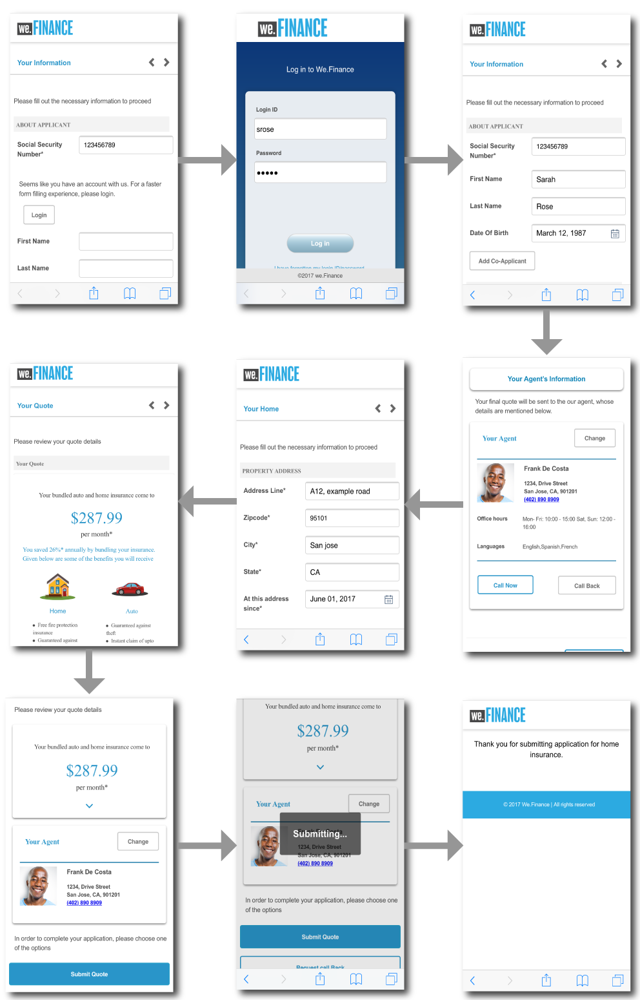 

#### How it works {#how-it-works-15}

The **Apply Now** button on the newsletter directs Sarah to the home insurance application on We.Finance portal. The application is an adaptive form, which you can review in the authoring instance at `https://[host]:[Port]/editor.html/content/forms/af/we-finance/insurance/application-for-insurance.html`.

Some of the key features you can review in the adaptive form are:

* It is based on an XSD schema, `insurance.xsd`.
* It is built using Insurance theme for styling and uses Layout without panel titles in the form header layout for mobile navigation. It displays a progressive mobile layout when opened from a mobile device. You can review the template at `https://[host]:[Port]/libs/wcm/core/content/sites/templates.html/conf/we-finance` and the theme at `https://[host]:[Port]/editor.html/content/dam/formsanddocuments-themes/we-finance/insurance/jcr:content`.

* It includes adaptive form rules to invoke Form Data Model services to prefill user details of logged in user. It also invokes services to prefill information by social security number or email address provided in the form. You can review the Form Data Models and their services at `https://[host]:[Port]/aem/forms.html/content/dam/formsanddocuments-fdm`.
* It uses various adaptive form components to capture inputs and adapts to user responses. It also uses components like Email that support HTML5 input types.
* The Save my progress button generates a unique ID for the user and saves the partially-filled application as a draft in a node in AEM repository. Also, it displays a dialog seeking permission to send an email with a link to the node containing the draft application. The Send mail button on the confirmation dialog triggers an email with a link to the node containing the draft.
* It uses the Invoke AEM Workflow submit action to trigger the home insurance approval workflow. You can review the workflow used in this form at `https://[host]:[Port]/editor.html/conf/global/settings/workflow/models/we-finance-insurance-workflow.html`

It is recommended to review the form to understand the schema, components, rules, Form Data Models, forms workflow, and submit action used to build the form.

Also, see the following documentation for more information about features used in the home insurance application adaptive form:

* [Introduction to authoring adaptive forms](/help/forms/using/introduction-forms-authoring.md)
* [Creating adaptive forms using XML Schema](/help/forms/using/adaptive-form-xml-schema-form-model.md)
* [Rule Editor](/help/forms/using/rule-editor.md)
* [Themes](/help/forms/using/themes.md)
* [Data Integration](/help/forms/using/data-integration.md)
* [Using Adobe Sign in adaptive forms](/help/forms/using/working-with-adobe-sign.md)
* [Forms-centric workflow on OSGi](/help/forms/using/aem-forms-workflow.md)

#### See it yourself {#see-it-yourself-12}

Click **Apply now** button on the newsletter you would have received on your email. Alternatively, go to `https://[publishHost]:[publishPort]/content/we-finance/global/en/all-forms.html` and click **[!UICONTROL Apply]** on the insurance application. Specify `123456789` in the Social Security Number field. When prompted, log in using `srose/srose` as the username/password.

Fill in details, explore various adaptive form components, and submit the application. You can review the adaptive form at `https://[authorHost]:[authorPort]/editor.html/content/forms/af/we-finance/insurance/application-for-insurance.html`.

### We.Finance approves the application and a contract is signed {#we-finance-approves-the-application-and-a-contract-is-signed}

We.Finance receives the home insurance application submitted by Sarah. A task is assigned to Gloria Rios. She reviews the application in her AEM Inbox and approves it.

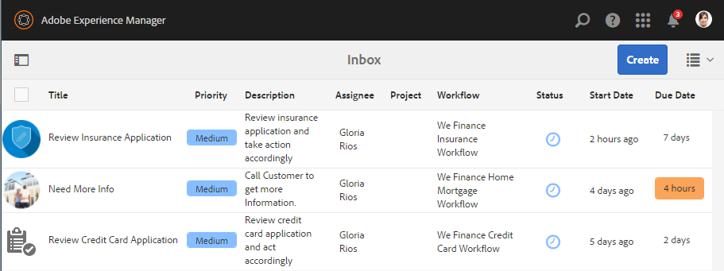

As Gloria approves Sarah's home insurance application, a task gets created in Frank De Costa's AEM Inbox. Frank reviews the task. He prepares a home insurance policy contract for Sarah, attaches the contract to her application, and sends it to Sarah for signing the contract. The contract, displayed below in the Agent UI, is Print version of the interactive communication. 

Sarah receives an email with a link to the home insurance policy contract for signing. Sarah reviews and signs the contract.

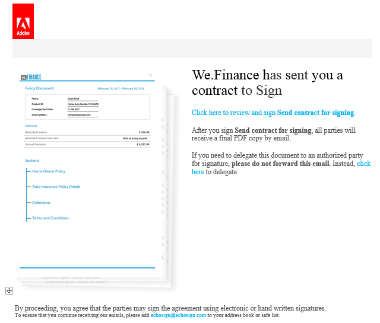 

#### How it works {#how-it-works-16}

When Sarah submits the home insurance application, a Forms Workflow triggers and a task is created in Gloria's AEM inbox. As Gloria reviews the application and approves it, the task is assigned to Frank De Costa. The flow of tasks from one persona to another is defined in the AEM Workflow associated with the insurance application. For more information about workflows, see [Forms-centric workflow on OSGi](/help/forms/using/aem-forms-workflow.md).

The following image depicts the AEM workflow associated with the insurance application.

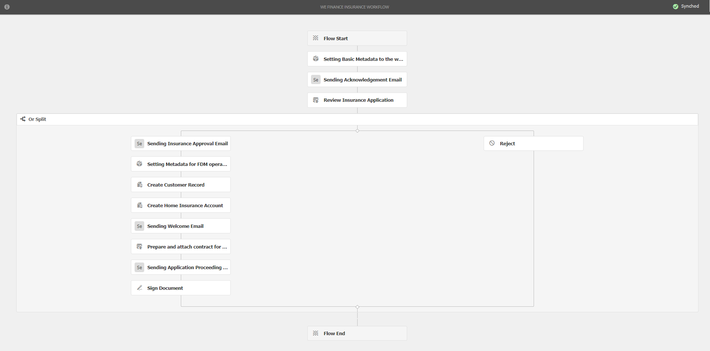

Frank uses correspondence management to prepare a home insurance policy contract. He downloads the contract PDF and attaches it to the Sarah's application and clicks Send Contract. The workflow triggers a mail to Sarah with home insurance policy contract for signing.

#### See it yourself {#see-it-yourself-13}

Do the following:

1. Go to AEM Inbox, `https://[publishHost]:[publishPort]/content/we-finance/global/en/login.html?resource=/aem/inbox.html`, and log in with `grios/grios` as username password for Gloria's persona. Approve the task for Sarah's home insurance application.

1. Next, log into AEM Inbox with `fdcosta/password` as username password for Frank's persona. View the task.
1. Now, go to `https://[authorHost]:[authorPort]/aem/forms.html/content/dam/formsanddocuments/we-finance/insurance` and preview the letter template for HomeInsuranceWelcomeKit. 
1. Specify information in the Data panel. Click **[!UICONTROL Preview]** and then download the PDF to your local filesystem. Ensure that the PDF file is saved with contract.pdf filename.
1. Go to Frank's AEM Inbox, open the task, attach the downloaded contract PDF, and click **[!UICONTROL Send Contract]**.
1. Open the email with contract and sign the document.

### Sarah receives a welcome kit {#sarah-receives-a-welcome-kit}

As Sarah's signs the home insurance contract, she receives an email with policy details. 

Shortly, she receives another email from We.Finance with a welcome kit for her insurance policy. From the welcome kit, Sarah can access her policy documents and view statements.

 

#### See it yourself {#see-it-yourself-14}

If you specified you email ID in the application, you would have received an email with a link to the welcome kit. Click **[!UICONTROL My Welcome Kit]** to open the welcome kit.

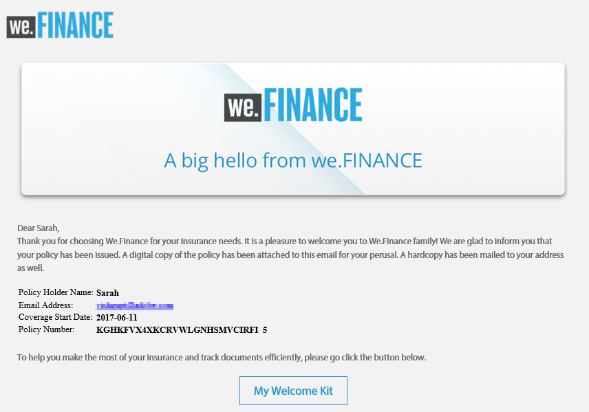 

## Wealth management prospectus walkthrough {#wealth-management-prospectus-walkthrough}

The We.Finance Wealth Management scenario involves the following persona:

* Sarah Rose, a We.Finance customer

The Wealth Management walkthrough demonstrates how a We.Finance customer can use the site to learn about a mutual fund, the Blue Chip Growth Fund. The reference site uses an interactive communication to display information about the fund. The information is available in both web and PDF formats. The walkthrough ends with customer emailing the PDF version of the information to her brother.

The following image displays workflow of the wealth management walkthrough:

 

### Sarah visits We.Finance website and opens the Blue Chip Growth Fund prospectus {#sarah-visits-we-finance-website-and-opens-the-blue-chip-growth-fund-prospectus}

Sarah Rose is planning to invest in a mutual fund. She is an existing We.Finance customer and therefore visits the We.Finance portal to explore available mutual funds. She goes to the Wealth Management section and opens the We.Finance Blue Chip Growth Fund page. The page contains links to prospectus which contain details about the current and historical prices, monthly performance, sector-wise diversification, expenses, fees, tax, and more information about the funds.

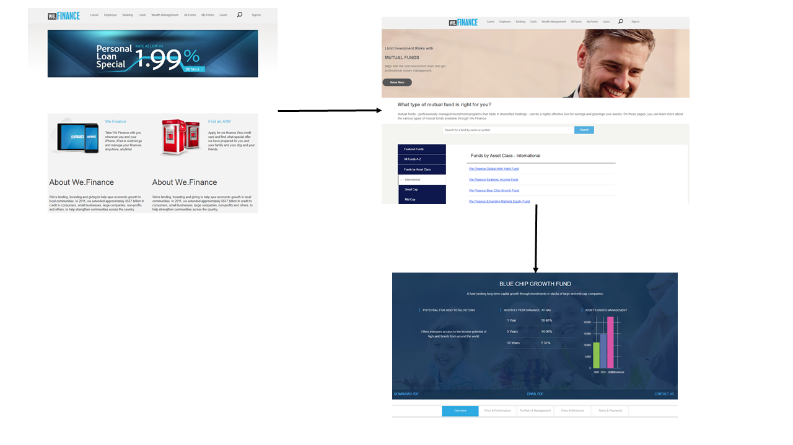 

#### How it works {#how-it-works-17}

The Blue Chip Growth Fund prospectus is an interactive communication. It uses texts, images, charts, and table components (document fragments) to display product summary, stock style, fund performance, fund details and other related information. You can review the interactive communication in the edit mode at https://[authorHost]:[ authorPort]/editor.html/content/forms/af/we-finance/wealth-management/wealth-management/channels/web.html

The charts and tables retrieve data from a form data model. The form data model connects to configured datasources, a database in this walkthrough, to retrieve information specific to the fund. You can review the form data model at https://[authorHost]:[authorPort]/aem/fdm/editor.html/content/dam/formsanddocuments-fdm/we-finance/wealth-management

#### See it yourself  {#see-it-yourself-15}

Go to We.Finance portal at https://[publishHost]:[publishPort]/wefinance, tap Wealth Management, expand Funds by Asset Class, and tap We.Finance Blue Chip Growth Fund. The We.Finance Blue Chip Growth Fund prospectus opens.

### Sarah explores the Blue Chip Growth Fund prospectus to learn about the fund {#sarah-explores-the-blue-chip-growth-fund-prospectus-to-learn-about-the-fund}

Sarah explores the Overview, Price & Performance, Portfolio Management, Fees & Minimum, and Taxes and Payment tabs of the prospectus to learn current and historical prices, historical growth, comparison with S&P 500 index, sector-wise diversification, persons managing the fund, and expenses related to the fund. The related information is segregated into different tabs. The prospectus is an interactive communication. The interactive communications have a responsive design. She can open the interactive communication on a device of any screen size and the interactive communication reflows the design to suit the underlying device.

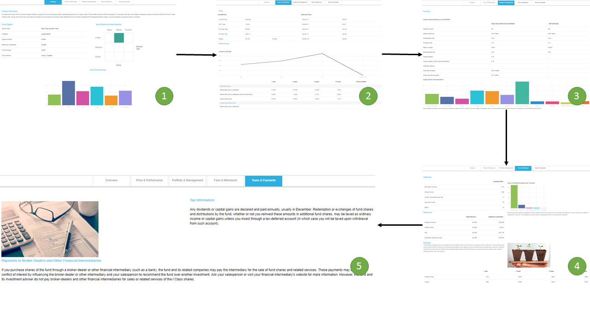 

#### How it works {#how-it-works-18}

The Blue Chip Growth Fund interactive communication uses parent and child panels to segregate related information into different sections. The parent panel organizes all the child panels into tabs.

The layout of the parent tab is set to Tabs on Top to convert all the child panels to tabs. You can review the panels of the interactive communication in the edit mode at https://[authorHost]:[ authorPort]/editor.html/content/forms/af/we-finance/wealth-management/wealth-management/channels/web.html.

#### See it yourself  {#see-it-yourself-16}

Go to the Blue Chip Growth Fund interactive communication at https://[publishHost]:[ publishPort]/content/forms/af/we-finance/wealth-management/wealth-management/channels/web.html?wcmmode=disabled. Explore all the tabs.

### Sarah views and emails the PDF version of the Blue Chip Growth Fund page {#sarah-views-and-emails-the-pdf-version-of-the-blue-chip-growth-fund-page}

Sarah is traveling to the countryside on the weekend. She plans to discuss the Blue Chip Growth Fund with her elder brother. Her elder brother works with a bank and helps her in decisions related to finance. Sarah downloads a copy of PDF version of the Blue Chip Growth Fund page on her laptop for offline reading. She also emails a copy of PDF version to her brother. 

 

#### How it works {#how-it-works-19}

The Blue Chip Growth Fund prospectus is an interactive communication. It has a web and PDF channel. The interactive communication integrates with AEM Workflows to send the PDF version over an email. You can review the workflow model at https://[authorHost]:[ authorPort]/editor.html/conf/global/settings/workflow/models/wealthmanagement.html.

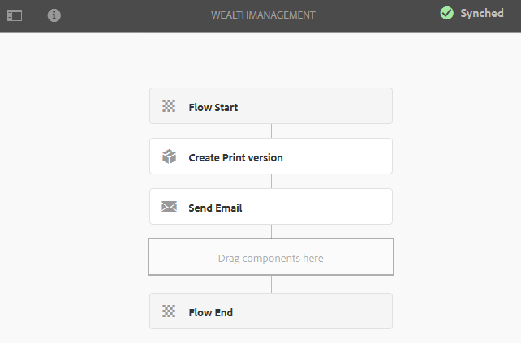 

#### See it yourself  {#see-it-yourself-17}

To download the PDF version, go to the Blue Chip Growth Fund interactive communication https://[publishHost]:[ publishPort]/content/forms/af/we-finance/wealth-management/wealth-management/channels/web.html, tap Download PDF.

To send PDF on email, go to the Blue Chip Growth Fund interactive communication https://[publishHost]:[ publishPort]/content/forms/af/we-finance/wealth-management/wealth-management/channels/web.html, tap EMAIL PDF. Specify **Full Name** and **Email Address**. Click **Send Email**.

## Auto insurance application walkthrough {#auto-insurance-application-walkthrough}

The We.Finance auto insurance application scenario involves the following persona:

* Sarah Rose, a We.Finance customer
* Conrad Simms, Insurance Agent, We.Finance

Sarah Rose is an existing We.Finance customer and has purchased an auto insurance policy. Now it’s the time of the year for renewal of her insurance policy. Conrad Simms, Insurance Agent, We.Finance sends a reminder to Sarah about her policy renewal. The reminder email contains a PDF containing policy renewal details and a link to the web version of the interactive communication. The interactive communications has a mobile friendly and responsive design. She can open the interactive communication on any device and the interactive communication reflows to suit the screen-size of the underlying device. The PDF version of the interactive communication, attached to email, is helpful for offline reading.  

Sarah follows the instructions provided in the email and successfully renews the process. The following image displays workflow of the auto insurance application walkthrough:  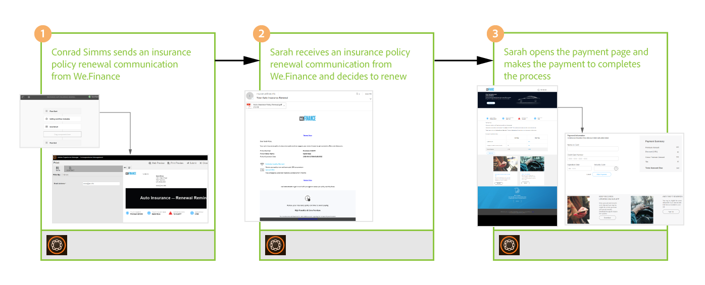 

### Conrad sends an insurance policy renewal communication from We.Finance {#conrad-sends-an-insurance-policy-renewal-communication-from-we-finance}

Conrad logs into AEM instance, opens the Auto Insurance dashboard specifies Sarah's **Customer ID**, and clicks **Renew Policy**. The **Agent UI** opens with policy details of Sarah Rose already filled-in. Conrad specified email address of Sarah and clicks** Submit**. Sarah receives an email with the subject **Your Auto Insurance Renewal**.

 

#### How it works {#how-it-works-20}

Insurance policy renewal communication is an interactive communication. Conrad Simms uses Agent UI to send the insurance policy renewal communication to Sarah. The communication includes Print (PDF) and link to the Web channel of the interactive communication. The interactive communication uses AEM Workflow to send the email. You can see the workflow at https://[authorHost]:[ authorPort]/editor.html/conf/global/settings/workflow/models/we-finance-auto-insurance-renewal.html

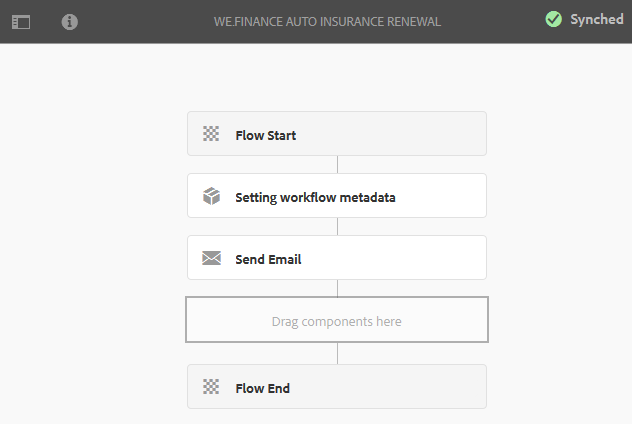 

#### See it yourself  {#see-it-yourself-18}

Log in to** We.Finance Auto Insurance Dashboard** as Conrad Simms (csimms/password). The URL is https://[publishhost]:[publishport]/content/we-finance/global/en/login.html?resource=/content/we-finance/ccdashboard.html. Specify the **Customer ID**. Customer ID of Sarah Rose is 900001. Click **Renew Policy**. The interactive communication opens up in the Agent UI. In the Agent UI, enter a valid email address to send the email with policy document attached and click **Submit**. A message, Submission Initiated, is displayed on the screen and then in few seconds another message, Submitted Successfully, is displayed. An email with the subject **Your Auto Insurance Renewal** and is sent at the specified email address. The policy offered to Sarah Rose is a premium policy.

The auto insurance walkthrough also contains another customer, Alison Jones. Customer ID of Alison Jones is 900002. When you send the interactive communication to Alison Jones, a standard policy is sent. The difference between standard and premium policy are:

* The premium policy has a banner image and standard policy has only text beneath the address block.
* The standard policy costs less than the premium policy.
* The premium policy has anti-theft reward and standard policy has smart ride reward

Both the policies use same interactive communication. The sections in the policy are changed or hidden based on the policy-type condition. You can access and review the auto insurance renewal interactive communication directly from https://[authorHost]: authorPort]/aem/formdetails.html/content/dam/formsanddocuments/we-finance/autoinsurance/auto-insurance-renewal

**Using Microsoft Dynamics as a data source **

The reference site also provides an interactive communication which uses Microsoft Dynamics as a data source for the form data model. Perform the following steps to configure the interactive communication for the auto insurance walkthrough:

1. Log in to https://[author]:[port]/crx/de as an administrator. 
1. Open the `/apps/we-finance/components/ccrui/ccrui.jsp`file.
1. Set the value of `FormFieldRequestParameter`to `/content/dam/formsanddocuments/we-finance/autoinsurance/auto-insurance-renewal-dynamics`
1. Tap **Save All**. The reference site is configured to use interactive communication which uses MS Dynamics as a data source.

Now, Log in to** We.Finance Auto Insurance Dashboard** as Conrad Simms (csimms/password). The URL is https://[publishhost]:[publishport]/content/we-finance/global/en/login.html?resource=/content/we-finance/ccdashboard.html. Specify the **Customer ID**. Customer ID of Sarah Rose is 900001. Click **Renew Policy**. The interactive communication opens up in the Agent UI. In the Agent UI, enter a valid email address to send the email with policy document attached and click **Submit**. A message, Submission Initiated, is displayed on the screen and then in few seconds another message, Submitted Successfully, is displayed. An email with the subject **Your Auto Insurance Renewal** is sent at the specified email address.

>[!NOTE]
>
>When you use the interactive communication which uses Microsoft Dynamics as a data source, the links in the emails sent to Sarah point to interactive communication that does not use Microsoft Dynamics. To fix the issue, manually change the links in email templates.

 

### Sarah receives an insurance policy renewal communication from We.Finance and decides to renew {#sarah-receives-an-insurance-policy-renewal-communication-from-we-finance-and-decides-to-renew}

Sarah receives an email with an attachment from We.Finance which reminds her that her auto insurance policy is about to expire. The attachment is the print version of her auto insurance policy renewal details.

Sarah clicks **Renew Now** and is directed to the web version of her auto insurance letter. On top of this letter, Sarah finds a number of days left for her policy to expire. The page provides Sarah an overview of her insurance policy details such as Policy Number, Amount Due, and other information such as discount offers and loyalty rewards. Sarah again clicks **Renew Now** at the bottom of the policy.

 

#### How it works  {#how-it-works-21}

The web and print outputs of your auto insurance letter are created using the multi-channel capabilities of Interactive Communications. The** Renew Now** button in the email is linked to the auto insurance renew application, which is an interactive communication on a publish instance.

 

#### See it yourself  {#see-it-yourself-19}

You must have received an email with an attached PDF. The PDF is a print version of your auto insurance letter. Click **Renew Now** to reach to the web version of the policy. Check your personal information and policy details and click **Renew Now**. It takes you to an adaptive form for payment.

The **Renew Now** button in the email directs Sarah to the web version of the policy. You can visit the following URL:

https://[publishServer]:[publishPort]/content/document.html?schema=fdm&documentId=/content/forms/af/we-finance/autoinsurance/auto-insurance-renewal/channels/web.html&customerId=900001

You can check the detailed summary of your auto insurance renewal and click **Renew Now** at the bottom of the page.

### Sarah opens the payment page and makes the payment and completes the process {#sarah-opens-the-payment-page-and-makes-the-payment-and-completes-the-process}

When Sarah clicks** Renew Now** on the web version of the interactive communication, the payments page opens. Sarah rechecks her Policy Number and Date of Expiration with her records. On the right side of the page, she checks the Payment Summary of her renewal with 10% premium discount on the total amount. Sarah fills her Credit Card details and clicks **Make Payment**.

 

#### How it works  {#how-it-works-22}

The Renew Now button directs Sarah to the payment page. The payment page is an adaptive form. Sarah fills the credit card details and clicks **Submit**. Her credit card payment is processed and a thank you message configured in the adaptive form appears on the screen.

#### See it yourself  {#see-it-yourself-20}

Click **Renew Now **to reach to the Payment page. Fill in your Credit Card information, and click **Make Payment. **You can reach the payment page in the authoring instance at:

https://[authorServer]:[authorPort]/content/document.html?documentId=/content/forms/af/we-finance/credit-card/ccbillpayment.html&schema=fdm&customerId=900001

The thank you message appears after the Make Payment button is clicked. 
