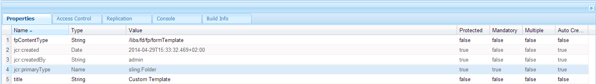
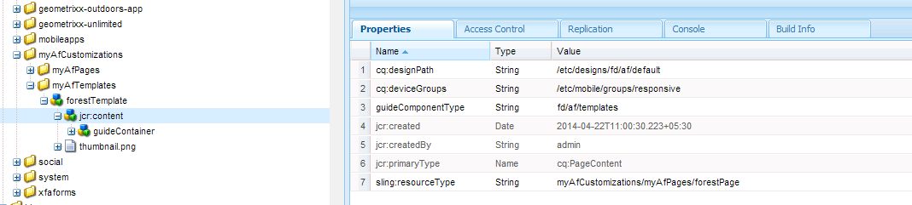

# Working with Formsets in AEM Forms workspace{#working-with-formsets-in-aem-forms-workspace}

A formset is a collection of HTML5 forms grouped and presented as a single set of forms to end users. When end users start filling a formset, they are seamlessly transitioned from one form to another. The set of forms can then be submitted in just one click. For more info on formsets and how to set them up, see [Formset in AEM Forms](../../forms/using/formset-in-aem-forms.md).

AEM Forms workspace supports formsets. With formsets, multiple forms related to a service or process can be grouped to automate a business process and presented to the end users. In such a scenario, the users can fill the whole set as one and there is no need to file, submit, and track individual forms or processes.

## Attaching a formset to startpoint in an AEM Forms workspace app {#attaching-a-formset-to-startpoint-in-an-aem-forms-workspace-app-br}

1. Create the business process workflow in Workbench. For more information, see [Workbench help](https://www.adobe.com/go/learn_aemforms_workbench_63).
1. From the process properties of the startpoint, select **Use A CRX Asset** in Presentation & Data.

   

1. Click  (Browse) next to the CRX asset path. The Select Form Asset dialog appears.

   

1. Click the **Formset** tab, select the relevant formset from the list, and then click **OK**.

1. Deploy the application after updating other relevant process properties.

## Using formset in&nbsp;AEM Forms workspace {#using-formset-in-nbsp-aem-forms-workspace}

Once a formset is attached to a startpoint, the startpoint can be invoked, as any other startpoint is invoked, from the AEM Forms workspace.

The operations supported on formset through the AEM Forms workspace are:

* Save as draft
* Lock
* Abandon
* Submit
* Add Attachments
* Add Notes
* Move between forms in a formset using Back or Next buttons

>[!NOTE]
>
>For performance improvement during the movement from previous and next forms in a formset, all the workspace buttons (Back, Next, Save, Submit, and ... (More)) are disabled until the relevant form renders fully.
