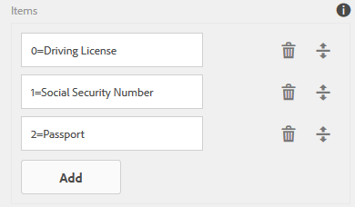
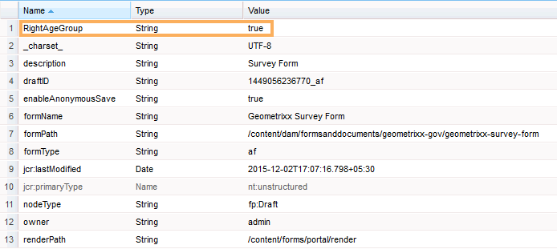

# Adding information from user data to form submission metadata{#adding-information-from-user-data-to-form-submission-metadata}

 Adobe recommends using the modern and extensible data capture [Core Components](https://experienceleague.adobe.com/docs/experience-manager-core-components/using/adaptive-forms/introduction.html) for [creating new Adaptive Forms](/help/forms/using/create-an-adaptive-form-core-components.md) or [adding Adaptive Forms to AEM Sites pages](/help/forms/using/create-or-add-an-adaptive-form-to-aem-sites-page.md). These components represent a significant advancement in Adaptive Forms creation, ensuring impressive user experiences. This article describes older approach to author Adaptive Forms using foundation components. 

You can use values entered in an element of your form to compute metadata fields of a draft or a form submission. Metadata lets you filter content based on user data. For example, a user enters John Doe in the name field of your form. You can use this information to compute metadata that can categorize this submission under the initials JD.

To compute metadata fields with user entered values, add elements of your form in the metadata. When a user enters a value in that element, a script uses the value to compute information. This information is added in the metadata. When you add an element as a metadata field, you provide a key for it. The key is added as a field in the metadata, and the computed information is logged against it.

For example, a health insurance firm publishes a form. In this form, a field captures age of the end users. The customer wants to check all the submissions in a particular age range after several users submit the form. Instead of going through all the data that gets complicated with increasing number of forms, additional metadata helps the customer. The form author can configure which properties/data filled by the end user is stored at the top-level so that search is easiest. Additional metadata is user filled information stored at the top-level of the metadata node, as author configured it.

Consider another example of a form that captures email id and phone number. When a user visits this form anonymously and abandons the form, the author can configure the form to auto-save email id and phone number. This form is auto-saved, and the phone number and email id is stored in the metadata node of draft. A use-case of this configuration is lead management dashboard.

## Adding form elements to metadata {#adding-form-elements-to-metadata}

Perform the following steps to add an element in the metadata:

1. Open your adaptive form in edit mode.  
   To open your form in edit mode, in the forms manager, select your form and select **Open**.
1. In the edit mode, select a component, select  &gt; **Adaptive Form Container**, and then select .
1. In the sidebar, click **Metadata**.
1. In the Metadata section, click **Add**.
1. Use the Value field of the Metadata tab to add scripts. The scripts you add collect data from elements on the form and compute values that are fed to the metadata.

   For example, **true** is logged in the metadata if age entered is greater than 21, and **false** is logged if it is less than 21. You enter the following script in the Metadata tab:

   `(agebox.value >= 21) ? true : false`

   

   Script entered in the Metadata tab

1. Click **OK**.

After a user enters data in the element selected as a metadata field, the computed information is logged in the metadata. You can see the metadata in the repository you configured to store metadata.

## Seeing updated form&nbsp;submission metadata: {#seeing-updated-form-nbsp-submission-metadata}

For the example above, the metadata is stored in the CRX repository. The metadata looks like:

If you add a check box element in the metadata, selected values are stored as a comma separated string. For example, you add a check box component in your form, and specify its name as `checkbox1`. In the check box component properties, you add the items Driving License, Social Security Number, and Passport for values 0, 1, and 2.

You select adaptive form container, and in the form properties you add a metadata key `cb1` which stores `checkbox1.value`, and publish the form. When a customer fills the form, the customer selects Passport and Social Security Number options in the check box field. The values 1 and 2 are stored as 1, 2 in the cb1 field of the submission metadata.

>[!NOTE]
>
>The above example is for learning purpose only. Ensure that you look for metadata in the correct location as configured in your AEM Forms implementation.
