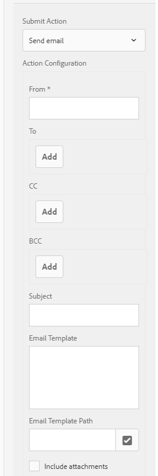

# Sending a form submission acknowledgement via email {#sending-a-form-submission-acknowledgement-via-email}

## Adaptive form data submission {#adaptive-form-data-submission}

Adaptive forms provides several out-of-the-box [submit actions](../../forms/using/configuring-submit-actions.md) workflows for submitting the form data to different endpoints.

For example, the **[!UICONTROL Send email]** submit action sends an email on successful submission of an adaptive form. It can also be configured to send the form data and the PDF in the email.

This article details the steps to enable the Email action on an adaptive form and different configurations it provides.

>[!NOTE]
>
>You can also use the **[!UICONTROL Send PDF via email]** option to send the completed form by email as a PDF attachment. The configuration options available for this action are the same as the options available for the **[!UICONTROL Send email]** action. The Email PDF action is available only for XFA-based adaptive forms

## Send email action {#email-action}

The Send email action enables an author to send email automatically to one or more recipients on the successful submission of an adaptive form.

>[!NOTE]
>
>To use the Send email action, you need to configure the AEM mail service as described in [Configuring the mail service](/help/sites-administering/notification.md#configuring-the-mail-service).

### Enabling Send email action on an adaptive form {#enabling-email-action-on-an-adaptive-form}

1. Open an adaptive form in **[!UICONTROL edit]** mode.

1. In the **[!UICONTROL Content]** tab, select **[!UICONTROL Form Container]** and select  to view the adaptive form properties.  

1. In the **[!UICONTROL Submission]** section, select **[!UICONTROL Send email]** from the **[!UICONTROL Submit Action]** drop-down list.  

   

1. Specify valid email IDs in the **[!UICONTROL To]**, **[!UICONTROL CC]**, and **[!UICONTROL BCC]** fields.

   Specify the subject and the body of the email in the **[!UICONTROL Subject]** and **[!UICONTROL Email Template]** fields, respectively.

   You can also specify variable placeholders in the fields, in which case, the values of the fields are processed when the form is successfully submitted by an end user. For more information, see [Using adaptive form field names to dynamically create email content](../../forms/using/form-submission-receipt-via-email.md#p-using-adaptive-form-field-names-to-dynamically-create-email-content-p).

   Select **[!UICONTROL Include attachments]** if the form includes file attachments and you want to attach these files in the email.

   >[!NOTE]
   >
   >If you choose the **[!UICONTROL Send PDF via Email]** option, you must select the Include attachments option.

1. Click  to save the changes.

### Using adaptive form field names to dynamically create email content {#using-adaptive-form-field-names-to-dynamically-create-email-content}

The field names in an adaptive form are called placeholders that are replaced with the value of that field after a user submits the form.

In the **[!UICONTROL Send email]** action, you can use placeholders that are processed when the action is performed. It implies that the headers of the email (such as **[!UICONTROL To]**, **[!UICONTROL CC]**, **[!UICONTROL BCC]**, **[!UICONTROL Subject]**) are generated when the user submits the form.

To define a placeholder, specify `${<field name>}` in a field after selecting **[!UICONTROL Send email]** as the Submit Action.

For example, if the form contains the **[!UICONTROL Email address]** field, named `email_addr`, for capturing the email ID of a user, you can specify the following in the **[!UICONTROL To]**, **[!UICONTROL CC]**, or **[!UICONTROL BCC]** fields.

`${email_addr}`

When a user submits the form, an email is sent to the email ID entered in the `email_addr` field of the form.

>[!NOTE]
>
>You can find the name of a field in the **[!UICONTROL Edit]** dialog for the field.

Variable placeholders can also be used in the **[!UICONTROL Subject]** and **[!UICONTROL Email Template]** fields.

For example:

`Hi ${first_name} ${last_name},`

`Your form has been received by our department. It usually takes ten business days to process the request.`

`Regards`

`Administrator`

>[!NOTE]
>
>Fields in repeatable panels cannot be used as variable placeholders.
