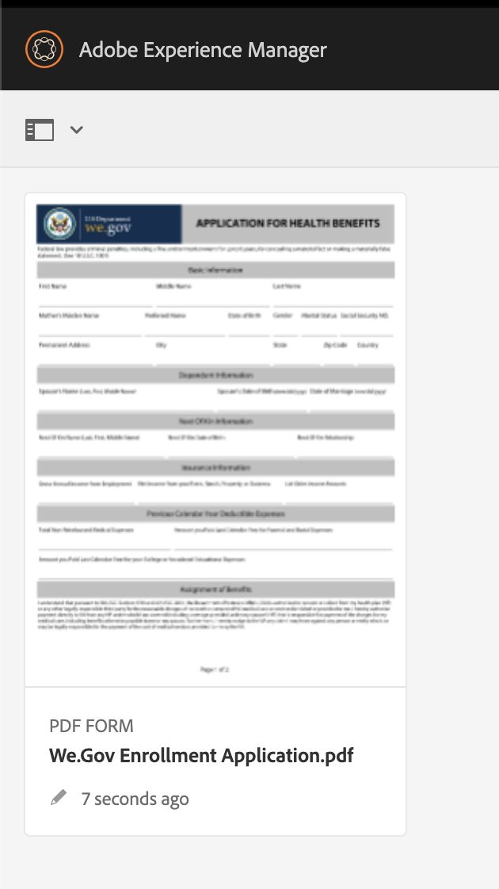
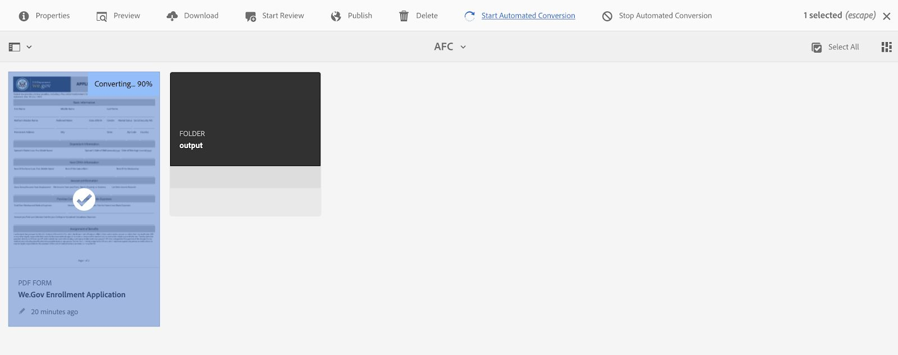
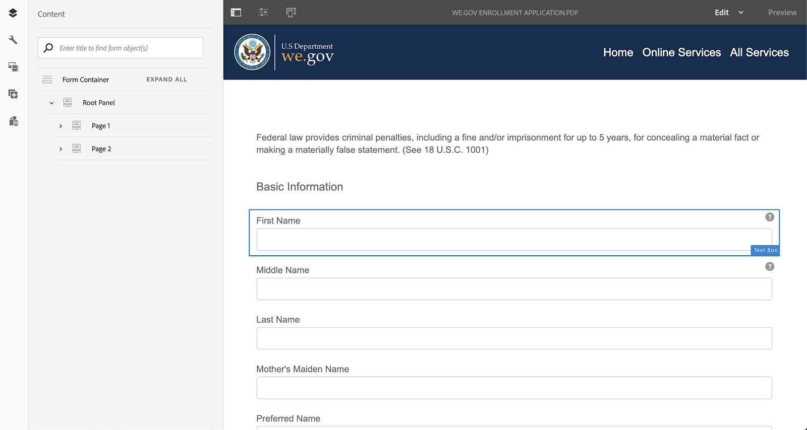
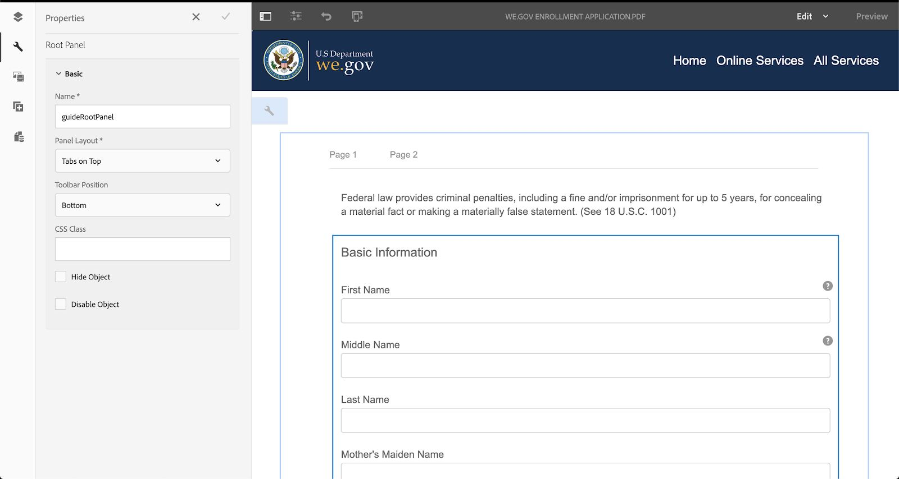
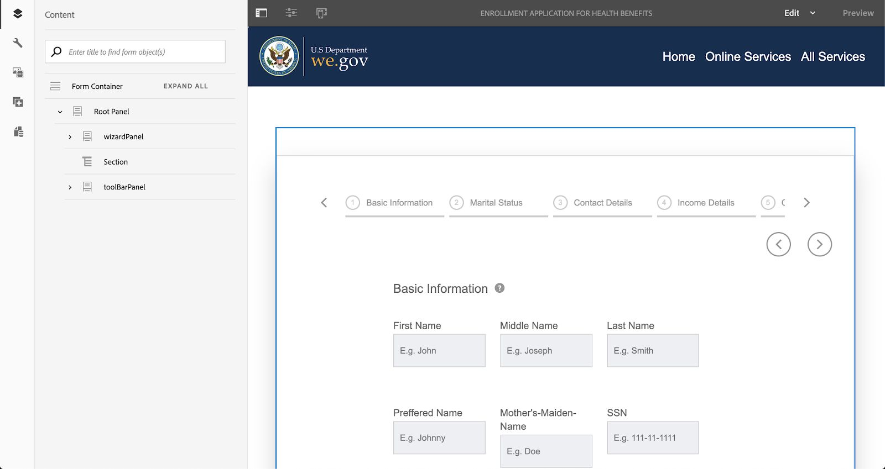
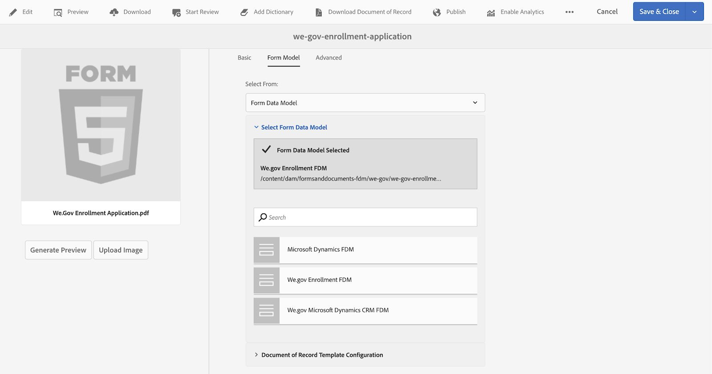
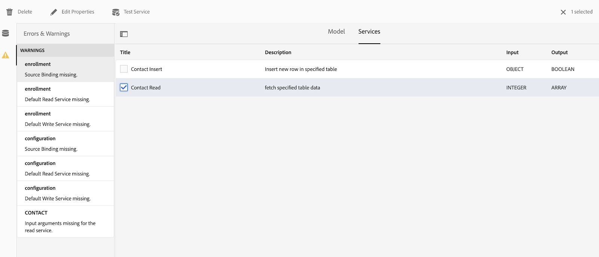
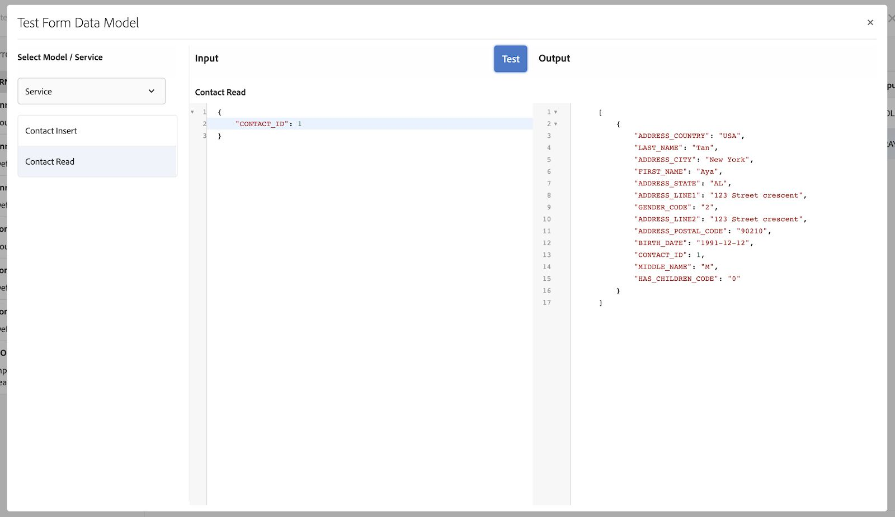

# We.Gov and We.Finance reference site walkthrough {#we-gov-reference-site-walkthrough}

## Pre-requisites {#pre-requisites}

Set up the reference site as described in [Set up and configure We.Gov and We.Finance reference site](../../forms/using/forms-install-configure-gov-reference-site.md).

## User Story {#user-story}

* AEM Forms

  * Automated Forms Conversion
  * Authoring
  * Form Data Models/Data Sources

* AEM Forms

  * Data Capture
  * (Optional) Data Integration (MS&reg; Dynamics)
  * (Optional) Adobe Sign

* Workflow
* Email Notifications
* (Optional) Customer Communications

  * Print Channel
  * Web Channel

* Adobe Analytics
* Data Source Integrations

### Fictitious users and groups {#fictitious-users-and-groups}

The We.Gov demo package comes with the following built-in fictitious users:

* **Aya Tan**: Citizen eligible for a Service from a Government agency


* **George Lang**: We.Gov agency Business Analyst


* **Camila Santos**: We.Gov Agency CX Lead


The following groups are also included:

* **We.Gov Forms Users**

    * George Lang (member)
    * Camila Santos (member)

* **We.Gov Users**

    * George Lang (member)
    * Camila Santos (member)
    * Aya Tan (member)

### Demo overview terms legend {#demo-overview-terms-legend}

1. **Impersonate**: Defined Users & Groups in AEM demo.
1. **Button**: Colored rectangle or circled arrow for navigating.
1. **Click**: To run an action in the user story.
1. **Links**: At the top of the main menu in We.Gov site.
1. **User Instructions**: A set of numerical steps to follow when navigating through the user's story.
1. **Forms Portal**: *https://&lt;aemserver&gt;:&lt;port&gt;/content/we-gov/formsportal.html*
1. **Mobile View**:We.Gov user to replicate a mobile view with a resized browser.
1. **Desktop View**: We.gov user to view demo on a laptop or desktop.
1. **Pre-screener Form**: Form on the Home page of the We.Gov site.
1. **Adaptive Form**: Enrollment application form for We.gov demo.

   *https://&lt;aemserver&gt;:&lt;port&gt;/content/forms/af/adobe-gov-forms/enrollment-application-for-health-benefits.html*

1. **Adobe We.Gov Site**: *https://&lt;aemserver&gt;:&lt;port&gt;/content/we-gov/home.html*
1. **Adobe Inbox**: Located top menu bar [Bell icon](assets/bell.svg) in AEM backend.

   *https://&lt;aemserver&gt;:&lt;port&gt;/aem/start.html*

1. **Email Client**: Preferred way to view your emails (Gmail, Outlook)
1. **CTA**: Call to action
1. **Navigate**: To locate a specific reference point on the browser page.
1. **AFC**: Automated Forms Conversion

## Automated Forms Conversion (Camila) {#automated-forms-conversion}

**This section**: Camila the CX Lead has an existing PDF based form that was used as part of a paper-based process. As part of a modernization effort Camila wants to use this PDF form to automatically create a modern Adaptive Forms.

### Automated Forms Conversion - We.Gov (Camila) {#automated-forms-conversion-wegov}

1. Navigate to *https://&lt;aemserver&gt;:&lt;port&gt;/aem/start.html*

1. Login with:
   * **User**: camila.santos
   * **Password**: password
1. From the main page, select Forms > Forms & Documents > AEM Forms We.gov Forms > AFC.
1. Camila uploads the PDF to AEM Forms.

    

1. Camilla then selects the PDF form and clicks **Start Automated Conversion** to start the conversion process. You may need to click **Overwrite conversion** if you have converted the form.

   >[!NOTE]
   >
   >The settings in AFC are preconfigured for the end user which means that they should not be altered.

   * **Optional**: If you wish to use the Accessible Ultramarine theme, simply click the Specify an adaptive form theme and select the Accessible-Ultramarine theme that appears in the list of options.

   

    

   The percentage complete status displays during conversion. Once the status displays **Converted**, click the **output** folder, select the adaptive form and click **Edit** to open the converted form.

1. Camilla then reviews the form and makes certain that all fields are present

    

1. Camilla then starts to edit the form and selects Root Panel > Edit (the wrench) > selects Tabs on Top from the Panel Layout dropdown menu > selects the Check box.

   

1. Camilla then adds all the necessary CSS and field alterations to produce the final product.

   

### Form Data Model & Data Sources (Camila) {#data-sources}

**This section**: After the document is converted and produces an Adaptive Form, Camila must connect the Adaptive Form to a datasource.

1. Camila opens the Properties on the form that was converted in [Automated Forms Conversion - We.Gov](#automated-forms-conversion-wegov).

1. Camila then selects Form Model > Selects Form Data Model from Select From dropdown > Selects We.gov Enrollment FDM from the list of option.

1. Click Save & Close.

    

1. Camila clicks the **output** folder, selects the adaptive form, and clicks **Edit** to open the completed We.Gov form.
1. Camila selects an adaptive form field and clicks  and creates binding with the form data model entities using the **Bind Reference** field. Camila repeats this step for all fields in the adaptive form.

### Form Accessibility Testing (Camila) {#form-accessibility-testing}

Camila also validates that the created content is built correctly and fully accessible according to corporate standards.

1. Camila clicks the **output** folder, selects the adaptive form, and clicks **Preview** to open the completed We.Gov form.

1. Opens the Audit tab within the Chrome Developer Tool.

1. Performs an Accessibility check to validate the adaptive form.

    

## Adaptive Form Mobile View Demo (Aya) {#mobile-view-demo}

**This section must be performed ahead of the demonstration.**

**User Instructions:**

1. Navigate to: *https://&lt;aemserver&gt;:&lt;port&gt;/content/we-gov/home.html*
1. Login with:

    1. **User**: aya.tan
    1. **Password**: password

1. Resize the browser window or use the browser's emulator to replicate a mobile device size.

### We.Gov Website (Aya) {#aya-user-story-we-gov-website}


**This section**: Aya is a citizen and hears from a friend that she may be eligible to receive a Service from a government agency. Aya navigates to the We.Gov website from her mobile phone to learn more about services she is eligible for.

### We.Gov Pre-Screener (Aya) {#aya-user-story-we-gov-pre-screener}

Aya answers a few questions to confirm her eligibility by filling out a short adaptive form on her mobile phone.

**User Instructions:**

1. Make a selection in each dropdown field.

   >[!NOTE]
   >
   >If the user earns more than $200,000/year, they are not eligible.  

1. Click **Am I Eligible?**.
1. Click **Apply Now** to proceed.

   

### We.Gov Adaptive Form (Aya) {#aya-user-story-we-gov-adaptive-form}

Aya finds out she is eligible and begins filling her application to request service on her mobile device.

Aya must review some documents at home before she can complete the service request application. She saves and exits the application from her mobile device.

**User Instructions:**

1. Fill out the Basic information fields, the following are required fields and dropdowns:

    1. Basic Information

        1. First Name
        1. Last Name
        1. DOB
        1. Email

1. Use the following **dynamic logic** to demonstrate dynamic feature using the **Family Status** dropdown:

    1. **Single**: Show next of kin panel
    1. **Married**: Show marital dependant panel
    1. **Divorced**: Show next of kin panel
    1. **Widowed**: Show next of kin panel
    1. **Do you have Children?**: (Yes/No) radio button to show child dependant panel.

        1. (Add/Remove) button to add/remove multiple child dependant panels.

1. Click the right arrow in the gray menu bar.
1. Click the Save button at the bottom.

   

## Desktop demo {#desktop-demo}

**This section:** Back at home, Aya has found the information she needed and resumes the application from her desktop. Aya navigates to the online Forms Portal to resume her application. With some simple customization, agencies can also automatically generate and email a link to resume the application.

### Continued Adaptive Form (Aya) {#aya-user-story-continued-adaptive-form}

**User Instructions:**

1. Navigate to *https://&lt;aemserver&gt;:&lt;port&gt;/content/we-gov/home.html*
1. From the navigation bar, select **Online Services**.
1. From the "Draft Forms" panel, select the existing "Enrollment Application For Health Benefits".

   

   The look and feel are the same, and she does not need to reenter any data.

   **User Instructions:**

1. Right-click Circle CTA to move to the next section.

   

   The form is populated up to the point of Aya's last entry. Aya has entered all her information and is ready to submit.

   

   >[!NOTE]
   >
   >When Aya fills out the phone number field, she must fill it as a continuous 11-digit number with no dashes, spaces, or hyphens.

   After submitting, Aya receives a Thank You page. Optionally, Aya also receives an email that she can open to sign the document of record electronically with Adobe Sign.

### Optional: Adobe Sign (Aya) {#adobe-sign}

**User Instructions:**

1. Navigate to your Email Client and find the Adobe Sign email.
1. Click the link to Adobe Sign.

   

**User Instructions:**

1. Check **I agree**.
1. Click **Accept**.
1. Scroll to the bottom of the reviewed document.
1. Click the highlighted yellow tab so you can sign the document.

    

## Government agent (George) {#government-agent-george}


**This section:** George is a business analyst at the government agency Aya is a requesting a service from. George has a single dashboard where he can see all service request applications that have been assigned to him for review.

### AEM Inbox (George) {#george-user-story-aem-inbox}

**User Instructions:**

1. Navigate to *https://&lt;aemserver&gt;:&lt;port&gt;/aem/start.html*
1. Click the user icon (top right-hand corner) and use the **Sign Out**, or the **Impersonate as** menu option if you are currently logged in with an administrative user.

    1. Login with:

        1. **User:** george.lang
        1. **Password:** password

    1. Or Impersonate:

        1. Type `George` in the **Impersonate as** field.

        1. Click okay to impersonate.

1. From the top-right corner, click the Notification (bell) Icon.
1. Click **View All** to navigate to the Inbox.
1. From the Inbox, open the latest **Health Benefits Application Review** task.

   

### Optional: AEM Inbox & MS&reg; Dynamics (George) {#george-user-story-aem-inbox-and-ms-dynamics}

Thanks to data integrations and automated workflows, Aya's application appears, along with a CRM record that has automatically been generated when the data was submitted.

**User Instructions:**

1. Open and inspect the read-only adaptive form.
1. Click **Open MS&reg; Dynamics** to open the MS&reg; Dynamics record in a new window.
1. In the CRM, you see all information that can be updated.

    1. Optionally, add some review notes directly in Dynamics.

1. Close and return to AEM Inbox.

   

### Back to AEM Inbox (George) {#george-user-story-back-to-aem-inbox}

George approves Aya's application, and thanks to an existing automated workflow a confirmation email is also sent to Aya.

**User Instructions:**

1. Navigate to the top-left corner and click **Approve** to approve the application.
1. In the modal, you can leave a message for the CX lead.
1. Click Done.
1. (Citizen role) Open up your email client to view the email sent to Aya.

   

## CX Lead (Camila) {#cx-lead-camila}


**This section:** Camila the CX Lead sets up a welcome phone call with Aya to explain how to use government services that she is approved for.

### (Optional) AEM Inbox & MS&reg; Dynamics {#camila-user-story-aem-inbox-ms-dynamics}

**User Instructions:**

1. Navigate to *https://&lt;aemserver&gt;:&lt;port&gt;/aem/start.html*
1. Click the user icon (top right-hand corner) and use the **Sign Out**, or the **Impersonate as** menu option if you are currently logged in with an administrative user.

    1. Login with:

        1. **User**: camila.santos
        1. **Password**: password

    1. Or Impersonate:

        1. Type `Camila` in the **Impersonate as** field.

        1. Click okay to impersonate.

1. From the top-right corner, click the Notification (bell) icon.
1. Click **View All** to navigate to the Inbox.
1. From the Inbox, open the latest **New Contact Approval** task.


   **(Optional) User Instructions:**

1. Open and inspect the read-only adaptive form.
1. Click **Open MS&reg; Dynamics** to open the MS&reg; Dynamics record in a new window.
1. In the CRM you can see all information that can be updated.

    1. Optionally, add a call activity directly in Dynamics.
    1. Open the **Activities** section.
    1. Click **New Phone Call**.
    1. Add phone call details.
    1. Save and close the window.

1. Back in AEM, navigate to the top-left corner and click **Submit** to submit the application.
1. In the modal, you can leave a message.
1. Click Done.

    

## (Optional) Welcome Kit Citizen (Aya) {#welcome-kit-citizen-aya}

**This section:** Aya receives an email contains a link to an interactive communication which summarizes her benefits and also includes form fields to fill. With PDF benefits statement attached and link to interactive communication letter in the mail (with the same theme/branding as the interactive communication).

### Email Client Notification (Aya) {#aya-user-story-email-client}

**User Instructions:**

1. Locate and open the Welcome Kit email.
1. Scroll to PDF attachment at the bottom of the page.
1. Click to open the PDF attachment.
1. Scroll back up in your email client and click **View welcome kit online**.

    1. This opens the web channel version of the same document.

1. For a quick reference to PDF directly:

   *https://&lt;aemserver&gt;:&lt;port&gt;/aem/formdetails.html/content/dam/formsanddocuments/adobe-gov-forms/welcome-handbook/we-gov-welcome-handbook*

1. For a quick reference to IC directly:

   *https://&lt;aemserver&gt;:&lt;port&gt;/content/dam/formsanddocuments/adobe-gov-forms/welcome-handbook/we-gov-welcome-handbook/jcr:content?channel=web&mode=preview&wcmmode=disabled*

    

## Renewal Reminder citizen (Aya) {#renewal-reminder-citizen-aya}

**This section:** Camila also schedules a communication reminder so one year later. (Workflow Step that automates/executes and email).

### Email Client Notification (Aya) {#aya-user-story-email-client-updated}

**User Instructions:**

1. Navigate to your email client.
1. Locate and open the Renewal Reminder email.
1. Click **Submit a new application** so you can open the adaptive form.

    1. This section is intentionally left empty to support data pre-fill in phase 2.

   

## (Optional) Form Data Model (Camila) {#form-data-model}

**This section**: Camila navigates to AEM Forms Data Integrations where she can run a quick test to see that the information sent to the external data source via Form Data Model integration is indeed present.

### Form Data Model (Camila) {#form-data-model-camila}

**This section**: Camila navigates to the Data Sources page to validate the data that the server has replicated within the Derby database.

1. After the user experience is complete and the user submission is completed, Camila navigates to the Data Sources tab within AEM Forms (**Forms** > **Data Integrations**)

1. Camila then selects AEM Forms We.gov FDM and then edits the **We.gov Enrollment FDM**.

1. Camila then selects the **Contact** > **Read Service** to be tested.

   

1. Camila then provides the test service with a contact id and then clicks **Test**. For example, 1 or 2, if you submitted the form. If you have not submitted the form, no data is returned.

   

1. Camila can then validate that the data has successfully been inserted into the datasource.

   * The data within the Derby DS resembles the following format:

   ```xml
      [
         {
         "ADDRESS_COUNTRY": "USA",
         "LAST_NAME": "Tan",
         "ADDRESS_CITY": "New York",
         "FIRST_NAME": "Aya",
         "ADDRESS_STATE": "AL",
         "ADDRESS_LINE1": "123 Street crescent",
         "GENDER_CODE": "2",
         "ADDRESS_LINE2": "123 Street crescent",
         "ADDRESS_POSTAL_CODE": "90210",
         "BIRTH_DATE": "1991-12-12",
         "CONTACT_ID": 1,
         "MIDDLE_NAME": "M",
         "HAS_CHILDREN_CODE": "0"
         }
   ]
   ```

## (Optional) Analytics (Camila) {#analytics-cx-lead-camila}

**This section:** Camila navigates to a dashboard where she can see across the agency KPIs such as % of citizens who start filling a service request form and abandon, the average length of time from request submission to approval/denial response, and engagement statistics for the benefits handbooks she has sent to citizens.

### Adobe Analytics Sites Reporting (Camila) {#camila-reviews-sites-reporting-we-gov-adobe-analytics}

1. Navigate to *https://&lt;aemserver&gt;:&lt;port&gt;/sites.html/content*
1. Select **AEM Forms We.Gov Site** to view the site pages.
1. Select one of the site pages (for example, Home), and choose **Analytics & Recommendations**.

   

1. On this page, you see fetched information from Adobe Analytics which pertains to the AEM Sites page (NOTE: by design this information is periodically refreshed from Adobe Analytics and is not displayed in real time).

   

1. Back on the page view page (accessed in step 3.), you can also view the page view information by changing the display setting to view items in **List View**.
1. Locate the **View** drop-down menu and select **List View**.

   

1. From the same menu, select **View Setting** and select the columns you wish to display from the **Analytics** section.

   

1. Click **Update** to make the new columns available.

   

### Adobe Analytics Forms Reporting (Camila) {#camila-reviews-forms-reporting-we-gov-adobe-analytics}

1. Navigate to

   *https://&lt;aemserver&gt;:&lt;port&gt;/aem/forms.html/content/dam/formsanddocuments/adobe-gov-forms*

1. Select the **Enrollment Application For Health Benefits** adaptive form and select the **Analytics Report** option.

   

1. Wait for the page to load, and view the Analytics report data.

   
