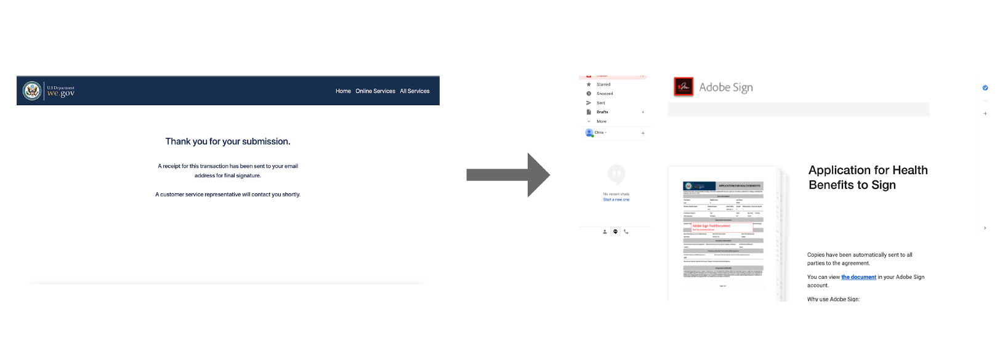
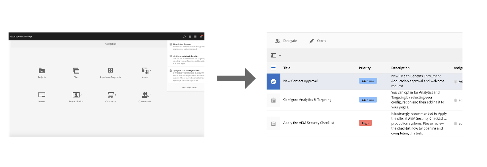
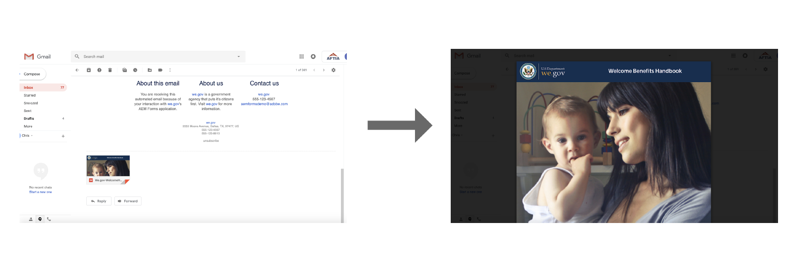
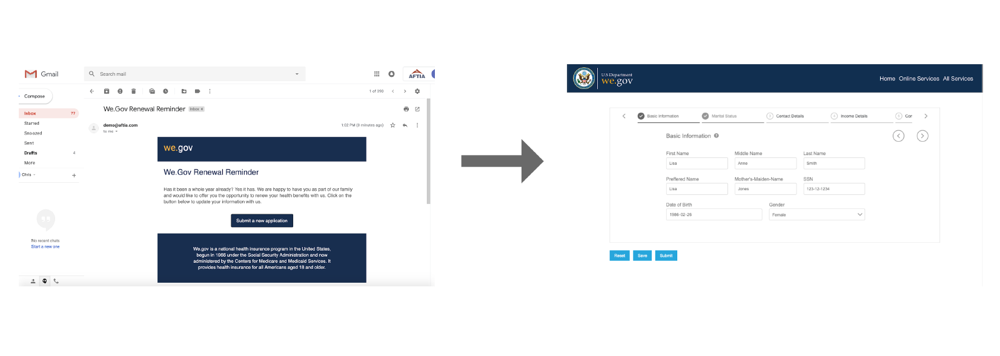

# We.Gov reference site walkthrough{#we-gov-reference-site-walkthrough}

## Pre-requisites {#pre-requisites}

Set up the reference site as described in [Set up and configure We.Gov reference site](../../forms/using/forms-install-configure-gov-reference-site.md).

## User Story {#user-story}

* AEM Forms

    * Data Capture
    * Data Integration (MS Dynamics)
    * Adobe Sign

* Workflow
* Customer Communications

    * Print Channel
    * Web Channel

* Adobe Analytics

### Fictitious users and groups {#fictitious-users-and-groups}

The We.Gov demo package comes with the following built-in fictitious users:

* **Aya Tan**: Citizen eligible for a Service from a Government agency

* **George Lang**: We.Gov agency Business Analyst

* **Camila Santos**: We.Gov Agency CX Lead

The following groups are also included:

* **We.Gov Forms Users**

    * George Lang (member)
    * Camila Santos (member)

* **We.Gov Users**

    * George Lang (member)
    * Camila Santos (member)
    * Aya Tan (member)

### Demo overview terms legend {#demo-overview-terms-legend}

1. **Impersonate**: Defined Users & Groups in AEM demo.
1. **Button**: Colored rectangle or circled arrow for navigating.
1. **Click**: To execute an action in the user story.
1. **Links**: Located at the top of the main menu in We.Gov site.
1. **User Instructions**: A set of numerical steps to follow when navigating through the user's story.
1. **Forms Portal**: *http://&lt;aemserver&gt;:&lt;port&gt;/content/we-gov/formsportal.html*

1. **Mobile View**:* *We.Gov user to replicate a mobile view with a re-sized browser*.*

1. **Desktop View**: W*e.gov user to view demo on a laptop or desktop.*

1. **Pre-screener Form**:* Form on the Home page of the We.Gov site.*

1. **Adaptive Form**: Enrollment application form for We.gov demo.  
   *http://&lt;aemserver&gt;:&lt;port&gt;/content/forms/af/adobe-gov-forms/enrollment-application-for-health-benefits.html*

1. **Adobe We.Gov Site**:* http://&lt;aemserver&gt;:&lt;port&gt;/content/we-gov/home.html*

1. **Adobe Inbox**: Located top menu bar [Bell icon] in AEM backend.* 
   http://&lt;aemserver&gt;:&lt;port&gt;/aem/start.html*

1. ***E*****mail Client**: Preferred way to view your emails (Gmail, Outlook)

1. **CTA**: Call to action
1. **Navigate**: To locate a specific reference point on the browser page.

## Mobile view demo {#mobile-view-demo}

**This section must be performed ahead of the demonstration.**

**User Instructions:**

1. Navigate to: *http://&lt;aemserver&gt;:&lt;port&gt;/content/we-gov/home.html*
1. Login with:

    1. **User**: aya.tan
    1. **Password**: password

1. Re-size the browser window or use the browser’s emulator to replicate a mobile device size.

### Aya User Story (We.Gov website)  {#aya-user-story-we-gov-website}

**This section**: Aya is a citizen. She hears from a friend that she may be eligible to receive a Service from a government agency. Aya navigates to the We.Gov website from her mobile phone to learn more about services she is eligible for.

### Aya User Story (We.Gov pre-screener) {#aya-user-story-we-gov-pre-screener}

Aya answers a few questions to confirm her eligibility by filling out a short adaptive form on her mobile phone.

**User Instructions:**

1. Make a selection in each dropdown field.

    1. Note: If the user earns more than $200,000/yr, they aren’t eligible.

1. Click the “**Am I Eligible?**” button.
1. Click the “**Apply Now**” button to proceed.

   

### Aya User Story (We.Gov adaptive form) {#aya-user-story-we-gov-adaptive-form}

Aya finds out she is eligible and begins filling her application to request service on her mobile device.

Aya needs to review some documents at home before she can complete the service request application. She saves and exits the application.

**User Instructions:**

1. Fill out the Basic information fields, the following are required fields and dropdowns:

    1. Basic Information

        1. First Name
        1. Middle Name
        1. Last Name
        1. Preferred Name
        1. DOB
        1. Gender

    1. Contact Information

        1. Street Address
        1. City
        1. Telephone Number
        1. Zip Code
        1. Email
        1. State

    1. Martial Status

        1. Family Status

1. Use the following **dynamic logic** to demonstrate dynamic feature using the **Family Status** dropdown:

    1. **Single**: Show next of kin panel
    1. **Married**: Show marital dependant panel
    1. **Divorced**: Show next of kin panel
    1. **Widowed**: Show next of kin panel
    1. **Do you have Children?**: (Yes/No) radio button to show child dependant panel.

        1. (Add/Remove) button to add/remove multiple child dependant panels.

1. Click the right arrow in the gray menu bar.
1. Click the Save button at the bottom.

   

## Desktop demo {#desktop-demo}

**This section:** Back at home, Aya has found the information she needed and resumes the application from her desktop. Aya navigates to the online forms portal to resume her application. With some simple customization, agencies can also automatically generate and email a link to resume the application.

### Aya User Story (continued adaptive form) {#aya-user-story-continued-adaptive-form}

**User Instructions:**

1. Navigate to *http://&lt;aemserver&gt;:&lt;port&gt;/content/we-gov/home.html*
1. From the navigation bar, select click on “**Online Services**”.
1. From the “Draft Forms” panel, select the existing “Enrollment Application For Health Benefits".

   

   The look and feel are the same, and she does not need to re-enter any data.

   **User Instructions:**

1. Click right Circle CTA to move to the next section.

   

   The form is populated up to the point of Aya’s last entry. Aya has entered all her information and is ready to submit.

   

   After submitting Aya receives an email that she opens and is ready to sign electronically with Adobe Sign.

**User Instructions:**

1. After Submission a Thank you page will be displayed.
1. Navigate to your Email Client and find the Adobe Sign email.
1. Click on the link to Adobe Sign.

   

**User Instructions:**

1. Check the “**I agree**” box.
1. Click “Accept”.
1. Scroll to the bottom of the reviewed document.
1. Click on the highlighted yellow tab to sign the document.

    

## Government agent (George) {#government-agent-george}

**This section:** George is a business analyst at the government agency Aya is a requesting a service from. George has a single dashboard where he can see all service request applications that have been assigned to him for review.

### George User Story (AEM inbox) {#george-user-story-aem-inbox}

**User Instructions:**

1. Navigate to *http://&lt;aemserver&gt;:&lt;port&gt;/aem/start.html*
1. Click on the user icon (top right-hand corner) and use the “**Sign Out**”, or the “**Impersonate as**” menu option if you are currently logged in with an administrative user.

    1. Login with:

        1. **User:** george.lang
        1. **Password:** password

    1. Or Impersonate:

        1. Type “**George**” in the “**Impersonate as**” field.
        
        1. Click okay to impersonate.

1. From the top right corner, click the Notification (bell) Icon.
1. Click “**View All**” to navigate to the Inbox.
1. From the Inbox, open the latest “**Health Benefits Application Review**” task.

   

### George User Story (AEM inbox and MS Dynamics) {#george-user-story-aem-inbox-and-ms-dynamics}

Thanks to data integrations and automated workflows, Aya’s application appears, along with a CRM record that has automatically been generated when the data was submitted.

**User Instructions:**

1. Open and inspect the read-only adaptive form.
1. Click on the “**Open MS Dynamics**” button to open the MS Dynamics record in a new window.
1. In the CRM you can see all information can be updated

    1. Optionally, add some review notes directly in Dynamics.

1. Close and return to AEM Inbox.

   

### George User Story (back to AEM inbox) {#george-user-story-back-to-aem-inbox}

George approves Aya’s application, and thanks to an existing automated workflow a confirmation email is also sent to Aya.

**User Instructions:**

1. Navigate to the top left corner and click “**Approve**” to approve the application.
1. In the modal, you can leave a message for the CX lead.
1. Click Done.
1. (Citizen role) Open up your email client to view the email sent to Aya.

   

## CX Lead (Camila) {#cx-lead-camila}

**This section:** Camila the CX Lead sets up a welcome phone call with Aya to explain how to make use of the government services she has been approved for.

### Camila User Story (AEM inbox & MS Dynamics) {#camila-user-story-aem-inbox-ms-dynamics}

**User Instructions:**

1. Navigate to *http://&lt;aemserver&gt;:&lt;port&gt;/aem/start.html*
1. Click on the user icon (top right-hand corner) and use the “**Sign Out**”, or the “**Impersonate as**” menu option if you are currently logged in with an administrative user.

    1. Login with:

        1. **User**: camila.santos
        1. **Password**: password

    1. Or Impersonate:

        1. Type “**Camila**” in the “**Impersonate as**” field.
        
        1. Click okay to impersonate.

1. From the top right corner, click the Notification (bell) icon.
1. Click “**View All**” to navigate to the Inbox.
1. From the Inbox, open the latest “**New Contact Approval**” task.

   

   **User Instructions:**

1. Open and inspect the read-only adaptive form.
1. Click on the “**Open MS Dynamics**” button to open the MS Dynamics record in a new window.
1. In the CRM you can see all information can be updated

    1. Optionally, add a new call activity directly in Dynamics.
    1. Open the “**Activities**” section.
    1. Click on the “**New Phone Call**” option.
    1. Add phone call details.
    1. Save and close the window.

1. Back in AEM, navigate to the top left corner and click “**Submit**” to submit the application.
1. In the modal, you can leave a message.
1. Click Done.

    

## Welcome Kit citizen (Aya) {#welcome-kit-citizen-aya}

**This section: **Aya receives an email contains a link to an interactive communication which summarizes her benefits and also includes form fields to fill. With PDF benefits statement attached and link to interactive communication letter in the mail (with the same theme/branding as the interactive communication).

### Aya User Story (Email client) {#aya-user-story-email-client}

**User Instructions:**

1. Locate and open the Welcome Kit email.
1. Scroll to PDF attachment at the bottom of the page.
1. Click to open the PDF attachment.
1. Scroll back up in your email client and click on “**View welcome kit online**”.

    1. This will open the web channel version of the same document.

1. &#42;For a quick reference to PDF directly:

   *http://&lt;aemserver&gt;:&lt;port&gt;/aem/formdetails.html/content/dam/formsanddocuments/adobe-gov-forms/welcome-handbook/we-gov-welcome-handbook*

1. &#42;For a quick reference to IC directly:

   *http://&lt;aemserver&gt;:&lt;port&gt;/content/dam/formsanddocuments/adobe-gov-forms/welcome-handbook/we-gov-welcome-handbook/jcr:content?channel=web&mode=preview&wcmmode=disabled*

    

## Renewal Reminder citizen (Aya) {#renewal-reminder-citizen-aya}

**This section: **Camila also schedules a communication reminder so one year later. (Workflow Step that** **automates/executes and email).

### Aya User Story (Email client) {#aya-user-story-email-client-1}

**User Instructions:**

1. Navigate to your email client.
1. Locate and open the Renewal Reminder email.
1. Click on the “**Submit a new application**” button to open the adaptive form.

    1. This section is intentionally left empty to support data pre-fill in phase 2.

   

## Analytics CX Lead (Camila) {#analytics-cx-lead-camila}

**This section: **Camila navigates to a dashboard where she can see across the agency KPI’s such as % of citizens who start filling a service request form and abandon, the average length of time from request submission to approval/denial response, and engagement statistics for the benefits handbooks she has sent to citizens.

### Camila reviews Sites reporting (We.Gov Adobe Analytics) {#camila-reviews-sites-reporting-we-gov-adobe-analytics}

1. Navigate to *http://&lt;aemserver&gt;:&lt;port&gt;/sites.html/content*
1. Select the “**AEM Forms We.Gov Site**” to view the site pages.
1. Select one of the site page (e.g. Home), and choose “**Analytics & Recommendations**”.

   

1. On this page, you will see fetched information from Adobe Analytics which pertains to the AEM Sites page (NOTE: by design this information is periodically refreshed from Adobe Analytics and is not displayed in real-time).

   

1. Back on the page view page (accessed in step 3.), you can also view the page view information by changing the display setting to view items in the “**List View**”.
1. Locate the “**View**” dropdown menu and select “**List View**”.

   

1. From the same menu, select “**View Setting**” and select the columns you wish to display from the “**Analytics**” section.

   

1. Click “**Update**” to make the new columns available.

   

### Camila reviews Forms reporting (We.Gov Adobe Analytics) {#camila-reviews-forms-reporting-we-gov-adobe-analytics}

1. Navigate to

   *http://&lt;aemserver&gt;:&lt;port&gt;/aem/forms.html/content/dam/formsanddocuments/adobe-gov-forms*

1. Select the “**Enrollment Application For Health Benefits**” adaptive form and select the “**Analytics Report**” option.

   

1. Wait for the page to load, and view the Analytics report data.

   

