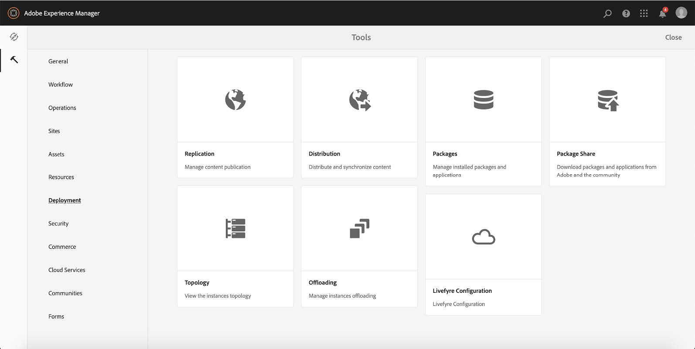
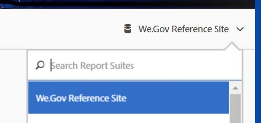

# Set up and configure We.Gov reference site{#set-up-and-configure-we-gov-reference-site}

## Demo package details {#demo-package-details}

### Installation Prerequisites {#installation-prerequisites}

This package was created for **AEM Forms 6.4 OSGI Author**, has been tested, and is therefore supported on the following platform versions:

| AEM VERSION |AEM FORMS PACKAGE VERSION |STATUS |
|---|---|---|
| 6.4 |5.0.86 |**Supported** |
| 6.5 |6.0.80 |**Supported** |

This package contains cloud configuration which support the following platform versions:

| CLOUD PROVIDER |SERVICE VERSION |STATUS |
|---|---|---|
| Adobe Sign |v5 API |**Supported** |
| Microsoft Dynamics 365 |1710 (9.1.0.3020) |**Supported** |

**Package Installation considerations:**

* The package is expected to be installed on a clean server, free of other demo packages or older demo package versions
* The package is expected to be installed on an OSGI server, running in Author mode

### What does this package include {#what-does-this-package-include}

The AEM Forms We.Gov demo package ( **we-gov-forms.pkg.all-&lt;version&gt;.zip **) comes as a package which includes several other subpackages and services. The package includes the following modules:

* **we-gov-forms.pkg.all-&lt;version&gt;.zip** -* Complete demo package*

    * **we-gov-forms.ui.apps-&lt;version&gt;.zip** *- Contains all components, client libraries, samples users, workflow models, etc.*

        * **we-gov-forms.core-&lt;version&gt;.jar*** - Contains all OSGI services, custom workflow step implementation, etc.*
        
        * **core.wcm.components.all-2.0.4.zip** - *Collection of sample WCM components*
        
        * **grid-aem.ui.apps-1.0-SNAPSHOT.zip** - *AEM Sites Grid layout package for Sites page column control*

    * **we-gov-forms.ui.content-&lt;version&gt;.zip*** - Contains all of the content, pages, images, *forms, interactive communication assets, etc.
    
    * **we-gov-forms.config.public-&lt;version&gt;.zip** - *Contains all of the default configuration nodes including placeholder cloud configurations to help avoid forms data model, and service binding issues.*

The assets included in this package include:

* AEM Site Pages with Editable Templates
* AEM Forms Adaptive Forms
* AEM Forms Interactive Communications (Print and Web Channel)
* AEM Forms XDP Document of Record
* AEM Forms MS Dynamics Forms Data Model
* Adobe Sign Integration
* AEM Workflow Model
* AEM Assets Sample Images

## Configuration options {#configuration-options}

This section includes details on configuration options. At this time, this section is intentionally empty.

## Demo package installation {#demo-package-installation}

This section contains information on installing the demo package.

### From package share {#from-package-share}

1. Navigate to *https://&lt;aemserver&gt;:&lt;port&gt;/crx/packageshare/*

   Or in AEM, click on Deployment and navigate to Package Share Icon.

   

1. Log in using your Adobe ID.
1. Search and locate the **we-gov-forms.pkg.all-&lt;version&gt;** package.
1. Select the “Download” option and accept the Terms and Conditions.
1. Once downloaded, select the “Downloaded” option to locate the package in the Package Manager.
1. Select the “Install” option to install the package.

   

1. Allow the installation process to complete.
1. Navigate to *https://&lt;aemserver&gt;:&lt;port&gt;/content/we-gov/home.html?wcmmode=disabled* to ensure the installation was successful.

### From a local ZIP file {#from-a-local-zip-file}

1. Download and locate the **we-gov-forms.pkg.all-&lt;version&gt;.zip** file.
1. Navigate to *https://&lt;aemserver&gt;:&lt;port&gt;/crx/packmgr/index.jsp*.
1. Select the “Upload Package” option.

   

1. Use the file browser to navigate to and select the downloaded ZIP file.
1. Click “Open” to upload.
1. Once uploaded, select the “Install” option to install the package.

   

1. Allow the installation process to complete.
1. Navigate to *https://&lt;aemserver&gt;:&lt;port&gt;/content/we-gov/home.html?wcmmode=disabled* to ensure the installation was successful.

### Installing new package versions {#installing-new-package-versions}

To install new package version, follow the steps defined in 4.1 and 4.2. Installing a newer package version while another older package is already installed is possible, but it is recommended to uninstall the older package version first. To do so, follow the steps below.

1. Navigate to *https://&lt;aemserver&gt;:&lt;port&gt;/crx/packmgr/index.jsp*
1. Locate the older **we-gov-forms.pkg.all-&lt;version&gt;.zip** file.
1. Select the “More” option.
1. From the dropdown, select the “Uninstall” option.

   

1. On confirmation, select “Uninstall” again, and allow the uninstallation process to complete.

## Demo package configuration {#demo-package-configuration}

This section contains details and instructions on the post-deployment configuration of the demo package before presentation.

### Fictional user configuration {#fictional-user-configuration}

1. Navigate to *https://&lt;aemserver&gt;:&lt;port&gt;/libs/granite/security/content/groupadmin.html*
1. Search for “**workflow**”.
1. Select the “**workflow-users**” group and click on “Properties”.
1. Navigate to the “Members” tab.
1. Type in **wegov** in “Select User or Group” field.
1. Select from the dropdown “**We.Gov Form Users**”.

   

1. Click “Save & Close” in the menu bar.
1. Repeat steps 2-7 by searching for “**analytics**”, selecting the “**Analytics Administrators**” group, and adding the “**We.Gov Form Users**” group as a member.
1. Repeat steps 2-7 by searching for “**forms users**”, selecting the “**forms-power-users**” group, and adding the “**We.Gov Form Users**” group as a member.
1. Repeat steps 2-7 by searching for “**forms users**”, selecting the “**forms-users**” group, and this time adding the “** We.Gov Users** ” group as a member.

### Email server configuration {#email-server-configuration}

1. Review setup documentation [Configuring Email Notification](/help/sites-administering/notification.md)

1. Navigate to *https://&lt;aemserver&gt;:&lt;port&gt;/system/console/configMgr*
1. Locate and click on the **Day CQ Mail Service **service to configure.

   

1. Configure the service to connect to the SMTP server of your choice:

    1. **SMTP Server hostname**: e.g (smtp.gmail.com)
    1. **Server Port**: e.g (465) for gmail using SSL
    1. **SMTP User:** demo@ &lt;companyname&gt; .com
    1. **“From” Address**: aemformsdemo@adobe.com

   

1. Click “Save” to save the configuration.

### AEM SSL Configuration {#aemsslconfig}

This section contains details on configuring SSL on the AEM instance in order to be able to configure the Adobe Sign Cloud configuration.

**References:**

1. [SSL By Default](/help/sites-administering/ssl-by-default.md)

**Notes:**

1. Navigate to https://&lt;aemserver&gt;:&lt;port&gt;/aem/inbox where you will be able to complete the process explained in the reference documentation link above.
1. The **we-gov-forms.pkg.all-&lt;version&gt;.zip** package includes a sample SSL key and certificate that can be accessed by extracting the **we-gov-forms.pkg.all-&lt;version&gt;.zip/ssl** folder that is part of the package.

1. SSL certificate and key details:

    1. issued to “CN=localhost”
    1. 10yr validity
    1. password value of “password”

### Adobe Sign cloud configuration {#adobe-sign-cloud-configuration}

This section contains details and instructions on the Adobe Sign Cloud Configuration.

**References:**

1. [Integrate Adobe Sign with AEM Forms](adobe-sign-integration-adaptive-forms.md)

#### Cloud configuration {#cloud-configuration}

1. **Review the prerequisites. See [AEM SSL Configuration](../../forms/using/forms-install-configure-gov-reference-site.md#aemsslconfig) for required SSL configuration.**
1. Navigate to:

   *https://&lt;aemserver&gt;:&lt;port&gt;/libs/adobesign/cloudservices/adobesign.html/conf/we-gov*

   >[!NOTE]
   >
   >The URL used to access the AEM server should match the URL configured in the Adobe Sign OAuth Redirect URI to avoid configuration issues (e.g. *https://&lt;aemserver&gt;:&lt;port&gt;/mnt/overlay/adobesign/cloudservices/adobesign/properties.html*)

1. Select the “We.gov Adobe Sign” configuration.
1. Click on “Properties”.
1. Navigate to the “Settings” tab.
1. Enter the oAuth URL e.g.: [https://secure.na1.echosign.com/public/oauth](https://secure.na1.echosign.com/public/oauth)
1. Provide the configured Client Id and Client Secret from the configured Adobe Sign instance.
1. Click “Connect to Adobe Sign”.
1. After successful connection, click “Save & Close” to complete the integration.

### MS Dynamics cloud configuration {#ms-dynamics-cloud-configuration}

This section contains details and instructions on the MS Dynamics Cloud Configuration.

**References:**

1. [Microsoft Dynamics OData configuration](https://docs.adobe.com/content/help/en/experience-manager-64/forms/form-data-model/ms-dynamics-odata-configuration.html)
1. [Configuring Microsoft Dynamics for AEM Forms](https://helpx.adobe.com/experience-manager/kt/forms/using/config-dynamics-for-aem-forms.html)

#### MS Dynamics OData cloud service {#ms-dynamics-odata-cloud-service}

1. Navigate to:

   https://&lt;aemserver&gt;:&lt;port&gt;/libs/fd/fdm/gui/components/admin/fdmcloudservice/fdm.html/conf/we-gov

    1. Ensure that you are accessing the server using the same redirect URL as configured in the MS Dynamics application registration.

1. Select the “Microsoft Dynamics OData Cloud Service” configuration.
1. Click “Properties”.

   

1. Navigate to the “Authentication Settings” tab.
1. Enter the following details:

    1. **Service Root:** e.g https://msdynamicsserver.api.crm3.dynamics.com/api/data/v9.1/
    1. **Authentication Type:** OAuth 2.0
    1. **Authentication Settings** (see [MS Dynamics cloud configuration settings](../../forms/using/forms-install-configure-gov-reference-site.md#dynamicsconfig) to collect this information):

        1. Client Id - also referred to as Application ID
        1. Client Secret
        1. OAuth URL - e.g. [https://login.windows.net/common/oauth2/authorize](https://login.windows.net/common/oauth2/authorize)
        1. Refresh Token URL - e.g. [https://login.windows.net/common/oauth2/token](https://login.windows.net/common/oauth2/token)
        1. Access Token URL - e.g. [https://login.windows.net/common/oauth2/token](https://login.windows.net/common/oauth2/token)
        1. Authorization Scope - **openid**
        1. Authentication Header - **Authorization Bearer**
        1. Resource - e.g [https://msdynamicsserver.api.crm3.dynamics.com](https://msdynamicsserver.api.crm3.dynamics.com)

    1. Click “Connect to OAuth”.

1. After successful authentication, click “Save & Close” to complete the integration.

#### MS Dynamics cloud configuration settings {#dynamicsconfig}

The steps detailed in this section are included to help you locate the Client Id, Client Secret and details from your MS Dynamics Cloud instance.

1. Navigate to [https://portal.azure.com/](https://portal.azure.com/) and login.
1. From the left hand menu select “All Services”.
1. Search for or navigate to “App Registration”.
1. Create, or select an existing application registration.
1. Copy the **Application ID** to be used as the OAuth **Client Id** in the AEM cloud configuration
1. Click on “Settings” or “Manifest” to configure the **Reply URLs.**

    1. This URL must match the URL used to access your AEM server when configuring the OData service.

1. From the Setting view, click “Keys” to view create new key (this is used as the Client Secret in AEM ).

    1. Make sure to keep a copy of the key as you will not be able to view it later in Azure or AEM.

1. To locate the Resource URL/Service Root URL, navigate to the MS Dynamics instance dashboard.
1. In the top navigation bar, click “Sales” or your own instance type and “Select Settings”.
1. Click on “Customizations” and “Developer Resources” near the bottom right.
1. There you’ll find the Service Root URL: e.g

* [https://msdynamicsserver.api.crm3.dynamics.com/api/data/v9.1/](https://msdynamicsserver.api.crm3.dynamics.com/api/data/v9.1/)*

1. Details on the Refresh and Access Token URL are available here:

* [https://docs.microsoft.com/en-us/rest/api/datacatalog/authenticate-a-client-app](https://docs.microsoft.com/en-us/rest/api/datacatalog/authenticate-a-client-app)*

#### Testing the form data model {#testing-the-form-data-model}

Once the cloud configuration is complete, you may want to test the form data model.

1. Navigate to

   *https://&lt;aemserver&gt;:&lt;port&gt;/aem/forms.html/content/dam/formsanddocuments-fdm/we-gov*

1. Select the “We.gov Microsoft Dynamics CRM FDM” and select “Properties”.

   

1. Navigate to the “Update Source” tab.
1. Ensure that the “Context-Aware Configuration” is set to “/conf/we-gov” and that the configured data source is “ms-dynamics-odata-cloud-service”.

   

1. Edit the Form Data Model.

   >[!NOTE]
   >
   >Ensure that you click **Cancel** instead of **Save & Close** to avoid issues that require reinstallation.

1. Test the services to ensure they successfully connect to the configured Data Source.

   >[!NOTE]
   >
   >It has been reported that an AEM Server restart was required for the Data Source to successfully bind to the FDM.

### Adobe Analytics configuration {#adobe-analytics-configuration}

This section contains details and instructions on the Adobe Analytics Cloud Configuration.

**References:**

1. [https://helpx.adobe.com/experience-manager/6-5/help/sites-administering/adobeanalytics.html](https://helpx.adobe.com/experience-manager/6-5/help/sites-administering/adobeanalytics.html)
1. [https://helpx.adobe.com/experience-manager/6-5/help/sites-administering/adobeanalytics-connect.html](https://helpx.adobe.com/experience-manager/6-5/help/sites-administering/adobeanalytics-connect.html)
1. [https://helpx.adobe.com/experience-manager/6-5/help/sites-authoring/pa-using.html](https://helpx.adobe.com/experience-manager/6-5/help/sites-authoring/pa-using.html)
1. [https://helpx.adobe.com/experience-manager/6-5/forms/using/configure-analytics-forms-documents.html](https://helpx.adobe.com/experience-manager/6-5/forms/using/configure-analytics-forms-documents.html)
1. [https://helpx.adobe.com/experience-manager/6-5/forms/using/view-understand-aem-forms-analytics-reports.html](https://helpx.adobe.com/experience-manager/6-5/forms/using/view-understand-aem-forms-analytics-reports.html)

### Adobe Analytics cloud service configuration {#adobe-analytics-cloud-service-configuration}

This package comes pre-configured to connect to Adobe Analytics. The steps below are provided to allow this configuration to be updated.

1. Navigate to *https://&lt;aemserver&gt;:&lt;port&gt;/libs/cq/core/content/tools/cloudservices.html*
1. Locate the Adobe Analytics section, and select “Show Configurations” link.
1. Select the “We.Gov Adobe Analytics (Analytics Configuration)” configuration.

   

1. Click on the “Edit” button to update the Adobe Analytics configuration (you will need to provide the Shared Secret). Click on “Connect to Analytics” to connect, and “OK” to complete.

   

1. From the same page, click “We.Gov Adobe Analytics Framework (Analytics Framework)” if you wish to update the framework configurations (see [Enable AEM authoring](../../forms/using/forms-install-configure-gov-reference-site.md#enableauthoring) to enable Authoring).

### Adobe Analytics reporting {#adobe-analytics-reporting}

#### View Adobe Analytics sites reporting {#view-adobe-analytics-sites-reporting}

1. Navigate to *https://&lt;aemserver&gt;:&lt;port&gt;/sites.html/content*
1. Select the “AEM Forms We.Gov Site” to view the site pages.
1. Select one of the site page (e.g. Home), and choose “Analytics & Recommendations”.

   

1. On this page, you will see fetched information from Adobe Analytics which pertains to the AEM Sites page (note: by design this information is periodically refreshed from Adobe Analytics and is not displayed in real-time).

   

1. Back on the page view page (accessed in step 3.), you can also view the page view information by changing the display setting to view items in the “List View”.
1. Locate the “View” dropdown menu and select “List View”.

   

1. From the same menu, select “View Setting” and select the columns you wish to display from the “Analytics” section.

   

1. Click “Update” to make the new columns available.

   

#### View Adobe Analytics forms reporting {#view-adobe-analytics-forms-reporting}

1. Navigate to

   *https://&lt;aemserver&gt;:&lt;port&gt;/aem/forms.html/content/dam/formsanddocuments/adobe-gov-forms*

1. Select the “Enrollment Application For Health Benefits” adaptive form and select the “Analytics Report” option.

   

1. Wait for the page to load, and view the Analytics Report data.

   

#### View Adobe Analytics reporting {#view-adobe-analytics-reporting}

Optionally, you can navigate to Adobe Analytics directly to see the analytics data.

1. Navigate to [https://my.omniture.com/login/](https://my.omniture.com/login/)
1. Login using your credentials:

    1. **Company:** AEM Forms Demo
    1. **User:** &lt;available upon request&gt;
    1. **Password:** &lt;available upon request&gt;

1. Select the “We.Gov Reference Site” from the Report Suites.

   

1. Select one of the available report to display the analytics data of that report.

   

## Demo package customizations {#demo-package-customizations}

This section includes instructions on customization of the demo.

### Enable AEM authoring {#enableauthoring}

This demo package includes an OSGI service configuration file which controls the behavior of the WCM Filter service on the target Author server. This configuration makes the server operate in a disabled author mode (equivalent to ?wcmmode=disabled) in order to allow demonstration. To update this configuration and to enable authoring, perform the following steps:

1. Navigate to *https://&lt;aemserver&gt;:&lt;port&gt;/system/console/configMgr*
1. Locate and click on the **Day CQ WCM Filter **Service service to configure.

   

1. Set the value of “**WCM Mode**” to “**Edit**”.
1. Click “**Save**” to apply the configuration.

### Templates customization {#templates-customization}

Editable Templates can be found at the following location:

*https://&lt;aemserver&gt;:&lt;port&gt;/libs/wcm/core/content/sites/templates.html/conf/we-gov*

These templates include the AEM Site, Adaptive Form, and Interactive Communications templates, created and assembled with components that can be found at:

*https://&lt;aemserver&gt;:&lt;port&gt;/crx/de/index.jsp#/apps/we-gov/components*

#### Style system {#customizetemplates}

This site also features client-libraries, one of which imports Bootstrap 4 ( [https://getbootstrap.com/](https://getbootstrap.com/) ). This client library is available at

*https://&lt;aemserver&gt;:&lt;port&gt;/crx/de/index.jsp#/apps/we-gov/clientlibs/clientlib-base/css/bootstrap*

The editable templates included in this package also come preconfigured with template/page policies that use the Bootstrap 4 CSS classes for pagination, styling, etc. Not all classes have been added to the template policies, but any class that is supported by Bootstrap 4 can be added to the policies. See the getting started page for a list of available classes:

[https://getbootstrap.com/docs/4.1/getting-started/introduction/](https://getbootstrap.com/docs/4.1/getting-started/introduction/)

Templates included in this package also support the Style System:

[https://helpx.adobe.com/ca/experience-manager/6-5/help/sites-authoring/style-system.html](https://helpx.adobe.com/ca/experience-manager/6-5/help/sites-authoring/style-system.html)

#### Template logos {#template-logos}

Project DAM Assets also include We.Gov logos and images. These assets are available at:

*https://&lt;aemserver&gt;:&lt;port&gt;/assets.html/content/dam/we-gov*

When editing the Page and Form Templates, one may choose to update brand logos by editing the Navigation and Footer components. These components offer a configurable brand and logo dialog that can be used to update logos:

See Editing Page Content for more information:

[https://helpx.adobe.com/ca/experience-manager/6-5/help/sites-authoring/editing-content.html#main-pars_title_32](https://helpx.adobe.com/ca/experience-manager/6-5/help/sites-authoring/editing-content.html#main-pars_title_32)

### Sites pages customization {#sites-pages-customization}

All site pages are available from: *https://&lt;aemserver&gt;:&lt;port&gt;/sites.html/content/we-gov*

These site pages also make use of the AEM Grid package to control the layout of a few components.

#### Style system {#style-system}

Pages included in this package also support the Style System:

[https://helpx.adobe.com/ca/experience-manager/6-5/help/sites-authoring/style-system.html](https://helpx.adobe.com/ca/experience-manager/6-5/help/sites-authoring/style-system.html)

You can also refer to [Templates customization style system](../../forms/using/forms-install-configure-gov-reference-site.md#customizetemplates) for documentation on supported styles.

### Adaptive forms customization {#adaptive-forms-customization}

All adaptive forms are available from:

*https://&lt;aemserver&gt;:&lt;port&gt;/aem/forms.html/content/dam/formsanddocuments/adobe-gov-forms*

These forms can be customized to fit certain use cases. Note that certain fields, and submission logic should not be modified to ensure that the form continues to function correctly. This includes:

**Enrollment Application For Health Benefits:**

* contact_id - Hidden field used to receive the MS Dynamics contact ID during submission
* Submit - Submit button logic required customization to support callbacks. Customization is documented, but a large script was required to submit the form while performing both a POST and GET operation to MS Dynamics via the Forms Data Model.
* Root Panel - Initialize event is used to add an MS Dynamics button to the AEM Inbox in the least intrusive way possible since all AEM Inbox Granite UI components are non-modifiable.

#### Adaptive form styling {#adaptive-form-styling}

Adaptive forms can also be styled using the Style Editor or Theme editor:

* [https://helpx.adobe.com/experience-manager/6-5/forms/using/inline-style-adaptive-forms.html](https://helpx.adobe.com/experience-manager/6-5/forms/using/inline-style-adaptive-forms.html)
* [https://helpx.adobe.com/ca/experience-manager/6-5/forms/using/themes.html](https://helpx.adobe.com/ca/experience-manager/6-5/forms/using/themes.html)

### Workflow customization {#workflow-customization}

The Enrollment Adaptive Form submit to an OSGI workflow for processing. This workflow can be found at* https://&lt;aemserver&gt;:&lt;port&gt;/conf/we-gov/settings/models/we-gov-process.html*.

Due to certain limitations, this workflow contains several scripts and custom OSGI workflow process steps. These workflow steps were created as generic steps and have not been created with configuration dialogues. At this time, configuration of the workflow steps relies on process arguments.

All workflow step Java code is contained in the **we-gov-forms.core-&lt;version&gt;.jar** bundle.

## Demo considerations and known issues {#demo-considerations-and-known-issues}

This section contains information on demo features and design decisions that may require special considerations during the demonstration process.

### Demo considerations {#demo-considerations}

* As per AGRS-159, ensure that the name (first, middle, and last) of the contact used in the Enrollment Adaptive Form is unique.
* The enrollment adaptive form will send the Adobe Sign email to the email specified in the form’s email field. That email address cannot be the same email address as the email used to configure the Adobe Sign cloud configuration.
* By default, the demo package includes several OSGI service configuration to control the overall behavior of the target server hosting the demo. These configuration include a WCM Filter service configuration which by default makes the server operate in a **disabled author** mode (equivalent to ?wcmmode=disabled). See [Enable AEM authoring](../../forms/using/forms-install-configure-gov-reference-site.md#enableauthoring) to allow page authoring.

### Known issues {#known-issues}

* (AGRS-120) The Site Navigation component currently does not support nested child pages that are more than 2 levels deep.
* (AGRS-159) The current MS Dynamics FDM needs to perform 2 operations to first, POST the Enrollment Adaptive Form data to Dynamics, and then fetch the user record in order to retrieve the Contact ID. In its current state, fetching the Contact ID will fail if more than two users with the same name are present in Dynamics, which will not allow the Enrollment Adaptive Form to submit.

## Next Steps {#next-steps}

Now you are all set to explore the We.Gov reference site. For more information about We.Gov reference site workflow and steps, see [We.Gov reference site walkthrough](../../forms/using/forms-gov-reference-site-user-demo.md).
