# Set up and configure We.Gov and We.Finance reference site {#set-up-and-configure-we-gov-reference-site}

## Demo package details {#demo-package-details}

### Installation Prerequisites {#installation-prerequisites}

This package was created for **AEM Forms 6.4 OSGI Author**, has been tested, and is therefore supported on the following platform versions:

| AEM VERSION |AEM FORMS PACKAGE VERSION |STATUS |
|---|---|---|
| 6.4 |5.0.86 |**Supported** |
| 6.5 |6.0.80 |**Supported** |
| 6.5.3 |6.0.122 |**Supported** |

This package contains cloud configuration which support the following platform versions:

| CLOUD PROVIDER |SERVICE VERSION |STATUS |
|---|---|---|
| Adobe Sign |v5 API |**Supported** |
| Microsoft Dynamics 365 |1710 (9.1.0.3020) |**Supported** |
| Adobe Analytics |v1.4 Rest API |**Supported** |
**Package Installation considerations:**

* The package is expected to be installed on a clean server, free of other demo packages or older demo package versions
* The package is expected to be installed on an OSGI server, running in Author mode

### What does this package include {#what-does-this-package-include}

The [AEM Forms We.Gov demo package](https://experience.adobe.com/#/downloads/content/software-distribution/en/aem.html?package=/content/software-distribution/en/details.html/content/dam/aem/public/adobe/packages/cq650/featurepack/we-gov-forms.pkg.all-2.0.2.zip) (**we-gov-forms.pkg.all-&lt;version&gt;.zip**) comes as a package which includes several other subpackages and services. The package includes the following modules:

* **we-gov-forms.pkg.all-&lt;version&gt;.zip** - *Complete demo package*

    * **we-gov-forms.ui.apps-&lt;version&gt;.zip** *- Contains all components, client libraries, samples users, workflow models, etc.*

        * **we-gov-forms.core-&lt;version&gt;.jar** - *Contains all OSGI services, custom workflow step implementation, etc.*

        * **we-gov-forms.derby&lt;version&gt;.jar** - *Contains all OSGI services, database schema, etc.*
        
        * **core.wcm.components.all-2.0.4.zip** - *Collection of sample WCM components*
        
        * **grid-aem.ui.apps-1.0-SNAPSHOT.zip** - *AEM Sites Grid layout package for Sites page column control*

    * **we-gov-forms.ui.content-&lt;version&gt;.zip** - *Contains all of the content, pages, images, forms, interactive communication assets, etc.*

    * **we-gov-forms.ui.analytics-&lt;version&gt;.zip** - *Contains all We.Gov Forms Analytics data to be stored within the repository.*
    
    * **we-gov-forms.config.public-&lt;version&gt;.zip** - *Contains all of the default configuration nodes including placeholder cloud configurations to help avoid forms data model, and service binding issues.*

The assets included in this package include:

* AEM Site Pages with Editable Templates
* AEM Forms Adaptive Forms
* AEM Forms Interactive Communications (Print and Web Channel)
* AEM Forms XDP Document of Record
* AEM Forms MS Dynamics Forms Data Model
* Adobe Sign Integration
* AEM Workflow Model
* AEM Assets Sample Images
* Sample (In-Memory) Apache Derby Database
* Apache Derby Data Source (for use with Form Data Model)

## Demo package installation {#demo-package-installation}

This section contains information on installing the demo package.

### From Software Distribution {#from-software-distribution}

1. Open [Software Distribution](https://experience.adobe.com/downloads). You require an Adobe ID to log in to the Software Distribution.
1. Tap **[!UICONTROL Adobe Experience Manager]** available in the header menu.
1. In the **[!UICONTROL Filters]** section:
   1. Select **[!UICONTROL Forms]** from the **[!UICONTROL Solution]** drop-down list.
   2. Select the version and type for the package. You can also use the **[!UICONTROL Search Downloads]** option to filter the results.
1. Tap the **we-gov-forms.pkg.all-&lt;version&gt;.zip** package name, select **[!UICONTROL Accept EULA Terms]**, and tap **[!UICONTROL Download]**.
1. Open [Package Manager](https://experienceleague.adobe.com/docs/experience-manager-65/administering/contentmanagement/package-manager.html)  and click **[!UICONTROL Upload Package]** to upload the package.
1. Select the package and click **[!UICONTROL Install]**.

   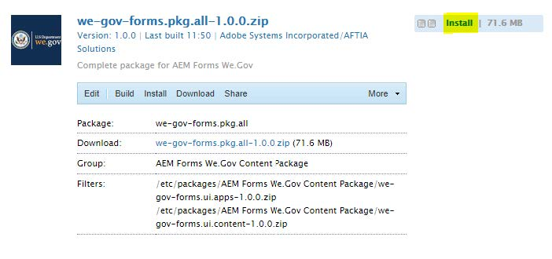

1. Allow the installation process to complete.
1. Navigate to *https://&lt;aemserver&gt;:&lt;port&gt;/content/we-gov/home.html?wcmmode=disabled* to ensure the installation was successful.

### From a local ZIP file {#from-a-local-zip-file}

1. Download and locate the **we-gov-forms.pkg.all-&lt;version&gt;.zip** file.
1. Navigate to *https://&lt;aemserver&gt;:&lt;port&gt;/crx/packmgr/index.jsp*.
1. Select the "Upload Package" option.

   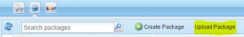

1. Use the file browser to navigate to and select the downloaded ZIP file.
1. Click "Open" to upload.
1. Once uploaded, select the "Install" option to install the package.

   

1. Allow the installation process to complete.
1. Navigate to *https://&lt;aemserver&gt;:&lt;port&gt;/content/we-gov/home.html?wcmmode=disabled* to ensure the installation was successful.

### Installing new package versions {#installing-new-package-versions}

To install new package version, follow the steps defined in 4.1 and 4.2. Installing a newer package version while another older package is already installed is possible, but it is recommended to uninstall the older package version first. To do so, follow the steps below.

1. Navigate to *https://&lt;aemserver&gt;:&lt;port&gt;/crx/packmgr/index.jsp*
1. Locate the older **we-gov-forms.pkg.all-&lt;version&gt;.zip** file.
1. Select the "More" option.
1. From the dropdown, select the "Uninstall" option.

   

1. On confirmation, select "Uninstall" again, and allow the uninstallation process to complete.

## Demo package configuration {#demo-package-configuration}

This section contains details and instructions on the post-deployment configuration of the demo package before presentation.

### Fictional user configuration {#fictional-user-configuration}

1. Navigate to *https://&lt;aemserver&gt;:&lt;port&gt;/libs/granite/security/content/groupadmin.html*
1. Login as an administrator in order to perform the tasks below.
1. Scroll down to the end of the page to load all user groups.
1. Search for "**workflow**".
1. Select the "**workflow-users**" group and click on "Properties".
1. Navigate to the "Members" tab.
1. Type in **wegov** in "Select User or Group" field.
1. Select from the dropdown "**We.Gov Forms Users**".

   

1. Click "Save & Close" in the menu bar.
1. Repeat steps 2-7 by searching for "**analytics**", selecting the "**Analytics Administrators**" group, and adding the "**We.Gov Forms Users**" group as a member.
1. Repeat steps 2-7 by searching for "**forms users**", selecting the "**forms-power-users**" group, and adding the "**We.Gov Forms Users**" group as a member.
1. Repeat steps 2-7 by searching for "**forms-users**", selecting the "**forms-users**" group, and this time adding the "**We.Gov Users**" group as a member.

### Email server configuration {#email-server-configuration}

1. Review setup documentation [Configuring Email Notification](/help/sites-administering/notification.md)
1. Login as administrator to perform this task.
1. Navigate to *https://&lt;aemserver&gt;:&lt;port&gt;/system/console/configMgr*
1. Locate and click on the **Day CQ Mail Service** service to configure.

   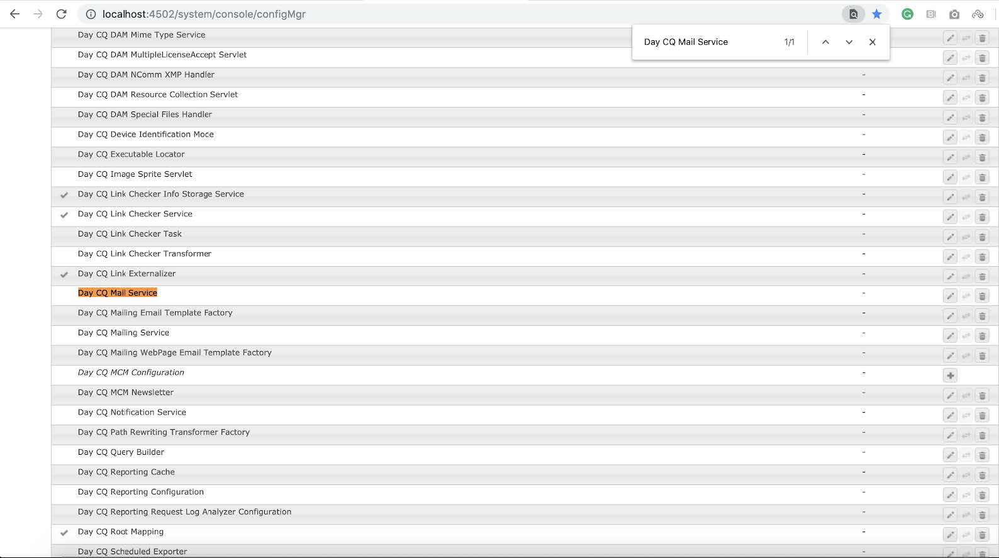

1. Configure the service to connect to the SMTP server of your choice:

    1. **SMTP Server hostname**: e.g (smtp.gmail.com)
    1. **Server Port**: e.g (465) for gmail using SSL
    1. **SMTP User:** demo@ &lt;companyname&gt; .com
    1. **"From" Address**: aemformsdemo@adobe.com

   

1. Click "Save" to save the configuration.

### (Optional) AEM SSL Configuration {#aemsslconfig}

This section contains details on configuring SSL on the AEM instance in order to be able to configure the Adobe Sign Cloud configuration.

**References:**

1. [SSL By Default](/help/sites-administering/ssl-by-default.md)

**Notes:**

1. Navigate to https://&lt;aemserver&gt;:&lt;port&gt;/aem/inbox where you will be able to complete the process explained in the reference documentation link above.
1. The `we-gov-forms.pkg.all-[version].zip` package includes a sample SSL key and certificate that can be accessed by extracting the `we-gov-forms.pkg.all-[version].zip/ssl` folder that is part of the package.

1. SSL certificate and key details:

    1. issued to "CN=localhost"
    1. 10yr validity
    1. password value of "password"
1. Private key is the *localhostprivate.der*.
1. Certificate is the *localhost.crt*.
1. Click Next.
1. HTTPS Hostname should be set to *localhost*.
1. Port should be set to a port that the system has exposed.

### (Optional) Adobe Sign cloud configuration {#adobe-sign-cloud-configuration}

This section contains details and instructions on the Adobe Sign Cloud Configuration.

**References:**

1. [Integrate Adobe Sign with AEM Forms](adobe-sign-integration-adaptive-forms.md)

#### Cloud configuration {#cloud-configuration}

1. Review the prerequisites. See [AEM SSL Configuration](../../forms/using/forms-install-configure-gov-reference-site.md#aemsslconfig) for required SSL configuration.
1. Navigate to:

   *https://&lt;aemserver&gt;:&lt;port&gt;/libs/adobesign/cloudservices/adobesign.html/conf/we-gov*

   >[!NOTE]
   >
   >The URL used to access the AEM server should match the URL configured in the Adobe Sign OAuth Redirect URI to avoid configuration issues (e.g. *https://&lt;aemserver&gt;:&lt;port&gt;/mnt/overlay/adobesign/cloudservices/adobesign/properties.html*)

1. Select the "We.gov Adobe Sign" configuration.
1. Click on "Properties".
1. Navigate to the "Settings" tab.
1. Enter the oAuth URL e.g.: [https://secure.na1.echosign.com/public/oauth](https://secure.na1.echosign.com/public/oauth)
1. Provide the configured Client Id and Client Secret from the configured Adobe Sign instance.
1. Click "Connect to Adobe Sign".
1. After successful connection, click "Save & Close" to complete the integration.

### (Optional) MS Dynamics cloud configuration {#ms-dynamics-cloud-configuration}

This section contains details and instructions on the MS Dynamics Cloud Configuration.

**References:**

1. [Microsoft Dynamics OData configuration](/help/forms/using/ms-dynamics-odata-configuration.md)
1. [Configuring Microsoft Dynamics for AEM Forms](https://experienceleague.adobe.com/docs/experience-manager-learn/forms/adaptive-forms/using-ms-dynamics-with-aem-forms.html)

#### MS Dynamics OData cloud service {#ms-dynamics-odata-cloud-service}

1. Navigate to:

   https://&lt;aemserver&gt;:&lt;port&gt;/libs/fd/fdm/gui/components/admin/fdmcloudservice/fdm.html/conf/we-gov

    1. Ensure that you are accessing the server using the same redirect URL as configured in the MS Dynamics application registration.

1. Select the "Microsoft Dynamics OData Cloud Service" configuration.
1. Click "Properties".

   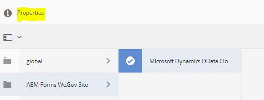

1. Navigate to the "Authentication Settings" tab.
1. Enter the following details:

    1. **Service Root:** e.g `https://msdynamicsserver.api.crm3.dynamics.com/api/data/v9.1/`
    1. **Authentication Type:** OAuth 2.0
    1. **Authentication Settings** (see [MS Dynamics cloud configuration settings](../../forms/using/forms-install-configure-gov-reference-site.md#dynamicsconfig) to collect this information):

        1. Client Id - also referred to as Application ID
        1. Client Secret
        1. OAuth URL - e.g. [https://login.windows.net/common/oauth2/authorize](https://login.windows.net/common/oauth2/authorize)
        1. Refresh Token URL - e.g. [https://login.windows.net/common/oauth2/token](https://login.windows.net/common/oauth2/token)
        1. Access Token URL - e.g. [https://login.windows.net/common/oauth2/token](https://login.windows.net/common/oauth2/token)
        1. Authorization Scope - **openid**
        1. Authentication Header - **Authorization Bearer**
        1. Resource - e.g `https://msdynamicsserver.api.crm3.dynamics.com`

    1. Click "Connect to OAuth".

1. After successful authentication, click "Save & Close" to complete the integration.

#### MS Dynamics cloud configuration settings {#dynamicsconfig}

The steps detailed in this section are included to help you locate the Client Id, Client Secret and details from your MS Dynamics Cloud instance.

1. Navigate to [https://portal.azure.com/](https://portal.azure.com/) and login.
1. From the left hand menu select "All Services".
1. Search for or navigate to "App Registration".
1. Create, or select an existing application registration.
1. Copy the **Application ID** to be used as the OAuth **Client Id** in the AEM cloud configuration
1. Click on "Settings" or "Manifest" to configure the **Reply URLs.**

    1. This URL must match the URL used to access your AEM server when configuring the OData service.

1. From the Setting view, click "Keys" to view create new key (this is used as the Client Secret in AEM ).

    1. Make sure to keep a copy of the key as you will not be able to view it later in Azure or AEM.

1. To locate the Resource URL/Service Root URL, navigate to the MS Dynamics instance dashboard.
1. In the top navigation bar, click "Sales" or your own instance type and "Select Settings".
1. Click on "Customizations" and "Developer Resources" near the bottom right.
1. There you'll find the Service Root URL: e.g

   *`https://msdynamicsserver.api.crm3.dynamics.com/api/data/v9.1/`

1. Details on the Refresh and Access Token URL are available here:

   *[https://docs.microsoft.com/en-us/rest/api/datacatalog/authenticate-a-client-app](https://docs.microsoft.com/en-us/rest/api/datacatalog/authenticate-a-client-app)*

#### Testing the Forms Data Model (Dynamics) {#testing-the-form-data-model}

Once the cloud configuration is complete, you may want to test the form data model.

1. Navigate to

   *https://&lt;aemserver&gt;:&lt;port&gt;/aem/forms.html/content/dam/formsanddocuments-fdm/we-gov*

1. Select the "We.gov Microsoft Dynamics CRM FDM" and select "Properties".

   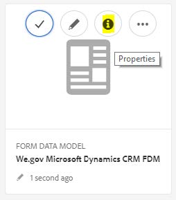

1. Navigate to the "Update Source" tab.
1. Ensure that the "Context-Aware Configuration" is set to "/conf/we-gov" and that the configured data source is "ms-dynamics-odata-cloud-service".

   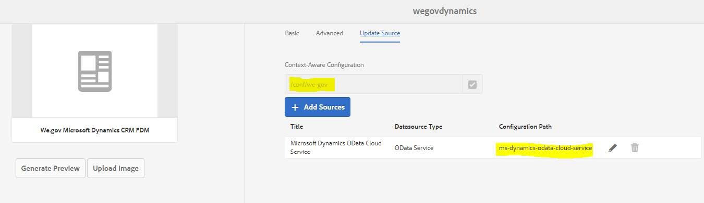

1. Edit the Form Data Model.   

1. Test the services to ensure they successfully connect to the configured Data Source.

   >[!NOTE]
   >
   >After testing the services, click **Cancel** to ensure that involuntary changes are not propagated to the Form Data Model.

   >[!NOTE]
   >
   >It has been reported that an AEM Server restart was required for the Data Source to successfully bind to the FDM.

#### Testing the Forms Data Model (Derby) {#test-fdm-derby}

Once the cloud configuration is complete, you may want to test the forms data model.

1. Navigate to *https://&lt;aemserver&gt;:&lt;port&gt;/aem/forms.html/content/dam/formsanddocuments-fdm/we-gov*

1. Select the **We.gov Enrollment FDM** and select **Properties**.

   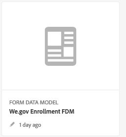

1. Navigate to the **Update Source** tab.

1. Ensure that the **Context-Aware Configuration** is set to `/conf/we-gov` and that the configured data source is **We.Gov Derby DS**.

   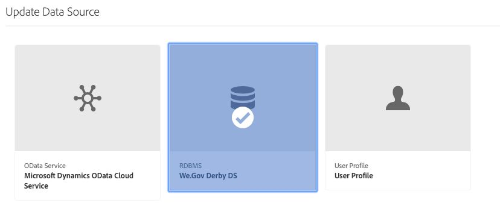

1. Click on **Save and Close**.

1. [Test the services](work-with-form-data-model.md#test-data-model-objects-and-services) to ensure they successfully connect to the configured Data Source

   * To test the connection select the **HOMEMORTGAGEACCOUNT** and give it a get service. Test the service and system administrators can see data being retrieved.

### Adobe Analytics configuration (Optional) {#adobe-analytics-configuration}

This section contains details and instructions on the Adobe Analytics Cloud Configuration.

**References:**

* [Integrating with Adobe Analytics](../../sites-administering/adobeanalytics.md)

* [Connecting to Adobe Analytics and Creating Frameworks](../../sites-administering/adobeanalytics-connect.md)

* [Seeing Page Analytics Data](../../sites-authoring/pa-using.md)

* [Configuring analytics and reports](configure-analytics-forms-documents.md)

* [View and understand AEM Forms analytics reports](view-understand-aem-forms-analytics-reports.md)

### Adobe Analytics cloud service configuration {#adobe-analytics-cloud-service-configuration}

This package comes pre-configured to connect to Adobe Analytics. The steps below are provided to allow this configuration to be updated.

1. Navigate to *https://&lt;aemserver&gt;:&lt;port&gt;/libs/cq/core/content/tools/cloudservices.html*
1. Locate the Adobe Analytics section, and select "Show Configurations" link.
1. Select the "We.Gov Adobe Analytics (Analytics Configuration)" configuration.

   

1. Click on the "Edit" button to update the Adobe Analytics configuration (you will need to provide the Shared Secret). Click on "Connect to Analytics" to connect, and "OK" to complete.

   

1. From the same page, click "We.Gov Adobe Analytics Framework (Analytics Framework)" if you wish to update the framework configurations (see [Enable AEM authoring](../../forms/using/forms-install-configure-gov-reference-site.md#enableauthoring) to enable Authoring).

#### Adobe Analytics Locating User Credentials {#analytics-locating-user-credentials}

In order to locate the user credentials for a Adobe Analytics account the account administrator must perform the following tasks.

1. Navigate to the Adobe Experience Cloud portal.
   * Login with your administrator credentials
1. Select the Adobe Analytics icon in the main dashboard.
    
1. Navigate to the Admin tab and select the User Management (Legacy) item
   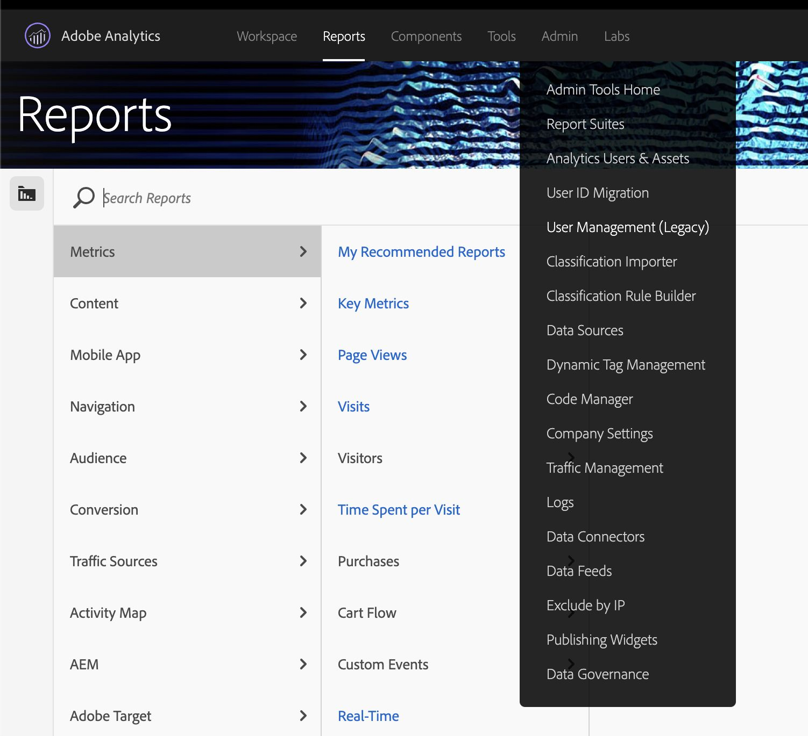
1. Select the **Users** tab.
   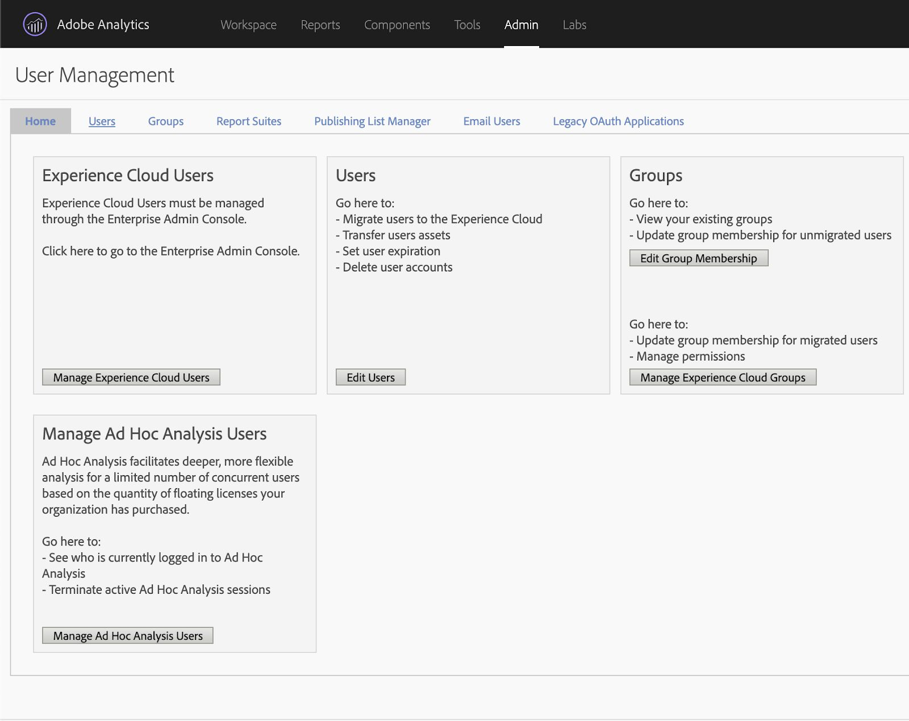
1. Select the desired user from the list of users.
1. Scroll to the bottom of the page and the users authentication information will appear at the bottom of the page.
   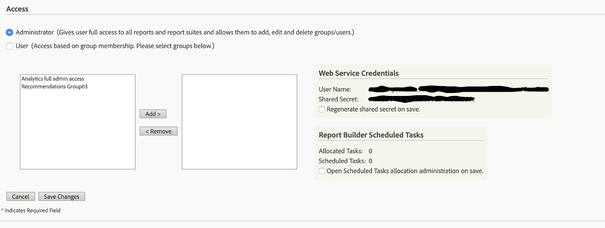
1. The username and shared secret information will appear on the right side of the permissions box.
1. Note that the username will have a colon within the name all of the information on the left of the colon is the username, and all of the information on the right of the colon will be the company name.
   * Here is an example of that: *username : company name*

#### Setup user authentication in Adobe Analytics {#setup-user-authentication}

Administrators can provide users with AEM analytics permissions by performing the following actions.

1. Navigate to the Adobe Admin Console.

1. Click on the Analytics instance that is exposed to the Admin console.

   * This is located on the main page of the admin page.

1. Select Analytics full admin access.

1. Add a user to the Profile.

   

1. Click the permissions tab once the user id has been mapped into the profile.

1. Make sure all the permissions are mapped over to the profile.

   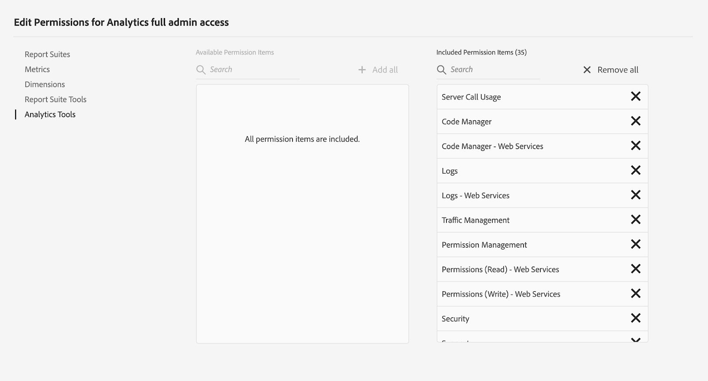

1. Note that once the permissions have been mapped over the ability for a user to login may take a few hours.

### Adobe Analytics reporting {#adobe-analytics-reporting}

#### View Adobe Analytics sites reporting {#view-adobe-analytics-sites-reporting}

>[!NOTE]
>
>AEM Forms Analytics data is available while offline or without an Adobe Analytics cloud configuration if the `we-gov-forms.ui.analytics-<version>.zip` package is installed, but AEM Sites data requires an active cloud configuration.

1. Navigate to *https://&lt;aemserver&gt;:&lt;port&gt;/sites.html/content*
1. Select the "AEM Forms We.Gov Site" to view the site pages.
1. Select one of the site page (e.g. Home), and choose "Analytics & Recommendations".

   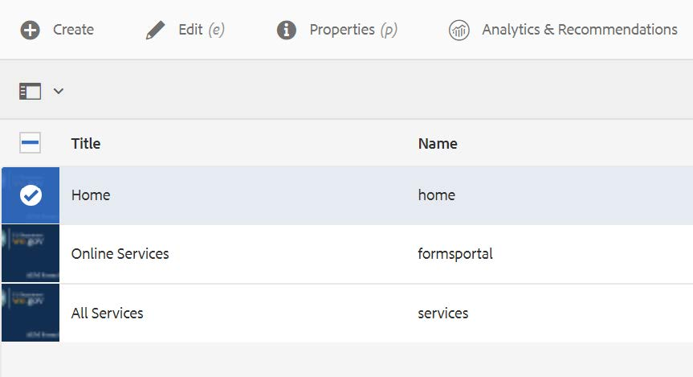

1. On this page, you will see fetched information from Adobe Analytics which pertains to the AEM Sites page (note: by design this information is periodically refreshed from Adobe Analytics and is not displayed in real-time).

   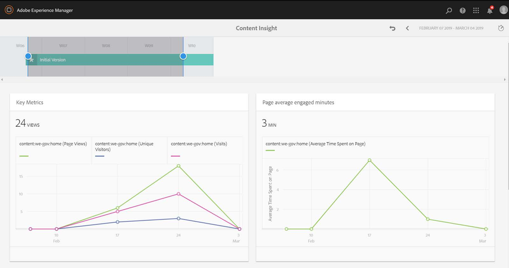

1. Back on the page view page (accessed in step 3.), you can also view the page view information by changing the display setting to view items in the "List View".
1. Locate the "View" dropdown menu and select "List View".

   

1. From the same menu, select "View Setting" and select the columns you wish to display from the "Analytics" section.

   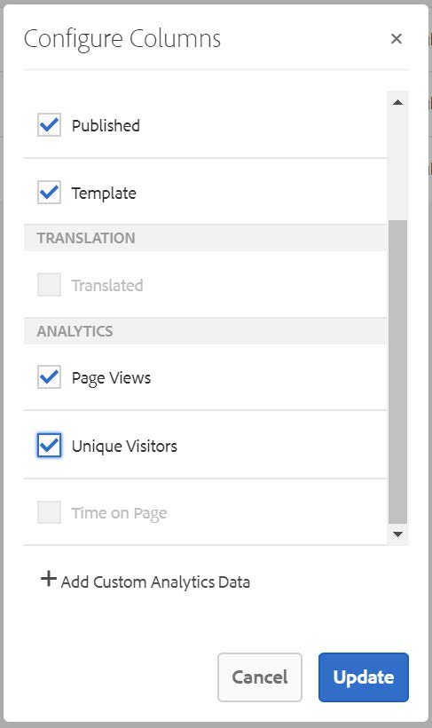

1. Click "Update" to make the new columns available.

   

#### View Adobe Analytics forms reporting {#view-adobe-analytics-forms-reporting}

>[!NOTE]
>
>AEM Forms Analytics data is available while offline or without an Adobe Analytics cloud configuration if the `we-gov-forms.ui.analytics-<version>.zip` package is installed, but AEM Sites data requires an active cloud configuration.

1. Navigate to

   *https://&lt;aemserver&gt;:&lt;port&gt;/aem/forms.html/content/dam/formsanddocuments/adobe-gov-forms*

1. Select the "Enrollment Application For Health Benefits" adaptive form and select the "Analytics Report" option.

   

1. Wait for the page to load, and view the Analytics Report data.

   

### Adobe Automated Forms Configuration Enablement {#automated-forms-enablement}

In order to install and configure AEM Forms with the Adobe Forms, Conversion tool users must have the following.

1. Access to Adobe I/O.

1. Permission to create an integration with Adobe Forms Conversion service.

1. Adobe AEM 6.5 latest service pack running as an Author.

Please review the following prior to reading further instructions:

* [Configure the Automated Forms Conversion service](https://experienceleague.adobe.com/docs/aem-forms-automated-conversion-service/using/configure-service.html)

#### Creating an IMS Configuration Part 1 {#creating-ims-config}

In order to configure the service to correctly communicate with the forms conversion tool users must configure the Identity Management System (IMS) service to be able to register with Adobe I/O.

1. Navigate to https://&lt;aemserver&gt;:&lt;port&gt; > Click Adobe Experience
Manager on the top left > Tools > Security >Adobe IMS Configuration.

1. Click Create.

1. Perform the actions in the image below.

    

1. Make sure to download the certificate.

1. Do not proceed with the remainder of the configuration - review section [Creating Integration in Adobe I/O](#create-integration-adobeio)

>[!NOTE]
>
>The certificate created in this section is going to be used to create the integration service in Adobe I/O. Once users have created in the integration service users can use that information from Adobe I/O to finish the configuration.

#### Creating Integration in Adobe I/O {#create-integration-adobeio}

Make sure you have the ability to create an integration within your Adobe domain if you do not contact your system administrator in order to do so.

1. Navigate to the [Adobe I/O Console](https://console.adobe.io/).

1. Click Create Integration.

1. Select Access an API.

1. Make sure you are in the correct group (top right dropdown list).

1. In the Experience Cloud section select the Forms Conversion Tool.

1. Click Continue.

1. Enter the name and description of your integration.

1. Using the Public Key from Section 2.1 place it within the integration of the key.

1. Select a profile for your automated forms conversion.

   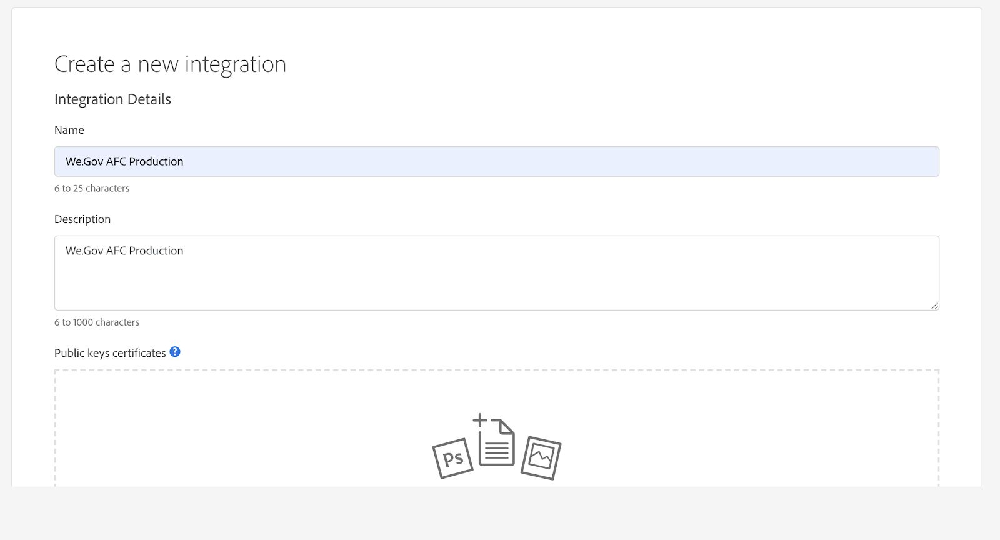

#### Creating IMS Configuration Part 2 {#create-ims-config-part-next}

Now that you have created an integration let us complete the installation of the IMS configuration.

1. Click on your integration within Adobe I/O in order to expose the connection details.

1. Navigate to your IMS configuration within AEM (Tools > Security > IMS)

1. Click Next on the IMS Configuration screen.

1. Enter the Authorization server (value displayed in the screenshot).

1. Enter the API key.

1. Enter the client Secret (must click expose on the Integration in Adobe I/O for it to be revealed).

1. Click on the JWT tab in Adobe I/O in order to get the JWT payload and paste it in the payload of the IMS configuration.

    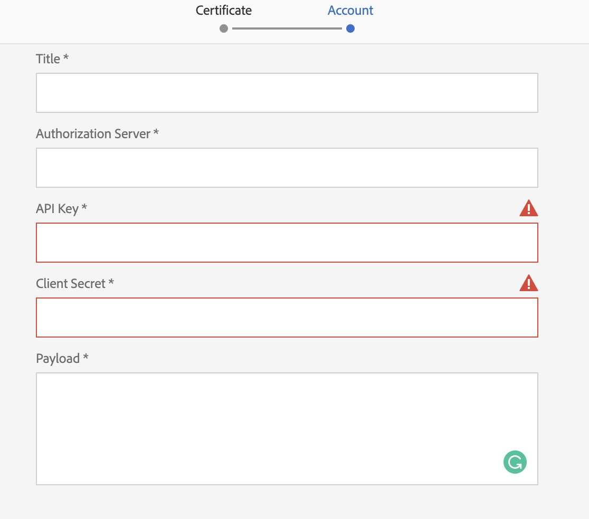

1. Once created click on the IMS Configuration and select Health Check, users should see the following result.

   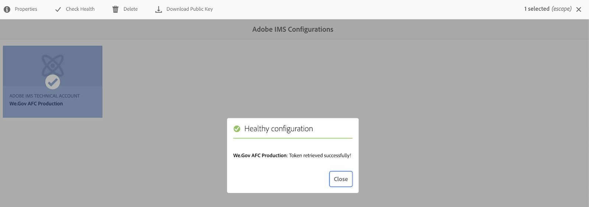

#### Configure Cloud Configuration (We.Gov AFC Production) {#configure-cloud-configuration}

Once the IMS configuration is complete then we can proceed to review the cloud configuration in AEM. If the configuration do not exist, use the following steps to create the cloud configuration in AEM:

1. Open your browser and navigate to the system URL  https://&lt;domain_name&gt;:&lt;system_port&gt;

1. Click Adobe Experience Manager on the top left corner of the screen > Tools > Cloud Services > Automated Forms Conversation Configuration.

1. Select the configuration folder you would like to place the configuration in.

1. Click Create.

1. Enter the information in the screenshot below.

   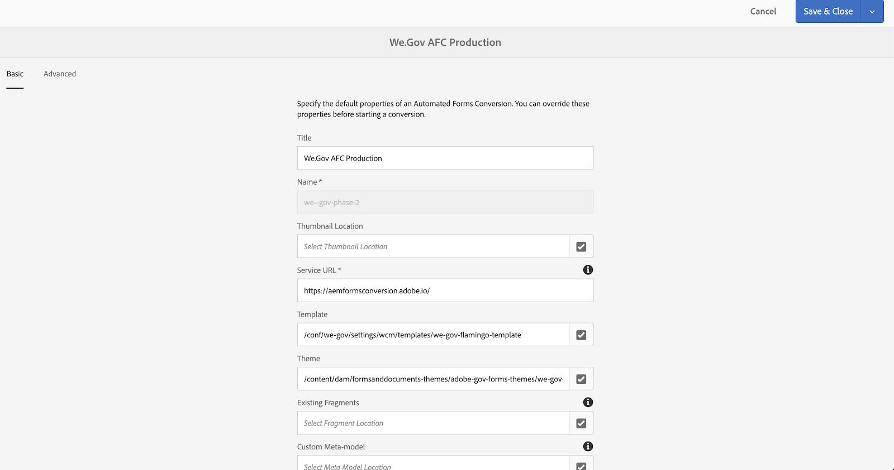

1. Provide the configuration with a Title and a Name.

1. The service URL for the system is set to https://aemformsconversion.adobe.io/.

1. Template URL */conf/we-gov/settings/wcm/templates/we-gov-flamingo-template*.

1. Theme URL: */content/dam/formsanddocuments-themes/adobe-gov-forms-themes/we-gov-theme*

1. Click Next.

1. For this configuration, we left the two checkbox values empty.

   * To understand more about these options, see [Configure the cloud service](https://experienceleague.adobe.com/docs/aem-forms-automated-conversion-service/using/configure-service.html#configure-the-cloud-service).

#### Configure Cloud Configuration (We.Finance AFC Production) {#configure-cloud-configuration-wefinance}

Once the IMS configuration is complete then we can proceed to create the cloud configuration in AEM.

1. Open your browser and navigate to the system URL  https://&lt;domain_name&gt;:&lt;system_port&gt;

1. Click Adobe Experience Manager on the top left corner of the screen > Tools > Cloud Services > Automated Forms Conversation Configuration.

1. Select the configuration folder you would like to place the configuration in.

1. Click Create.

1. Enter the information in the screenshot below.

   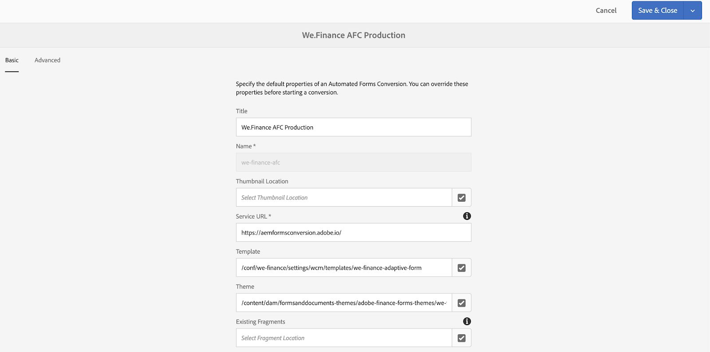

1. Provide the configuration with a Title and a Name.

1. The service URL for the system is set to https://aemformsconversion.adobe.io/

1. Template URL: */conf/we-finance/settings/wcm/templates/we-finance-adaptive-form*

1. Theme URL: */content/dam/formsanddocuments-themes/adobe-finance-forms-themes/we-finance-theme*

1. Click Next.

1. For this configuration, we left the two checkbox values empty.

   * To understand more about these options, see [Configure the cloud service](https://experienceleague.adobe.com/docs/aem-forms-automated-conversion-service/using/configure-service.html#configure-the-cloud-service).

#### Testing the forms Conversion (We.Gov Enrollment Application) {#test-forms-conversion}

Once the configuration is set up users can test it by uploading a PDF document.

1. Navigate to the AEM system https://&lt;domain_name&gt;:&lt;system_port&gt;

1. Click on Forms > Forms & Documents > AEM Forms We.gov Forms > AFC.

1. Select the We.Gov Enrollment Application PDF.

1. Click on the **Start Automated Conversion** button in the top right corner.

1. Users should be able to see the option as shown below.

    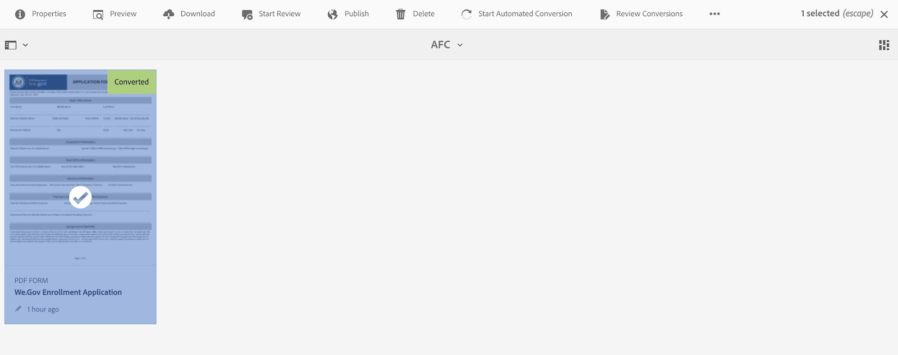

1. Once the button has been selected then users will be presented with the following options

   * Make sure users select the *We.Gov AFC Production* configuration

   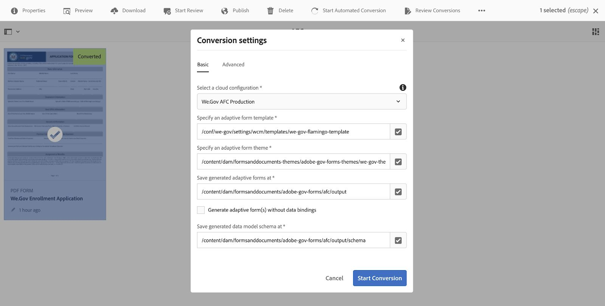

   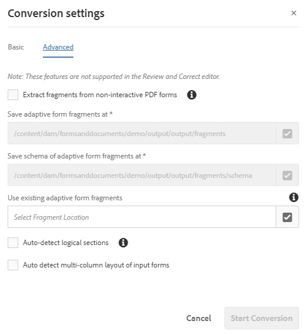

1. Select start conversion once you have configured all of the options that you would like to use.  

1. As the conversion process begins then users should see the following screen:

   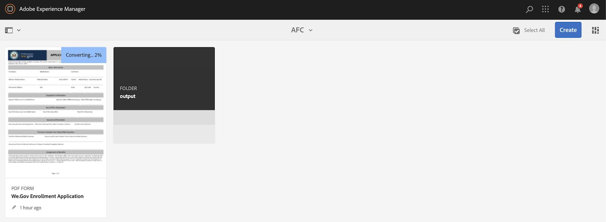

1. When the conversion is complete then users will see the following screen:

   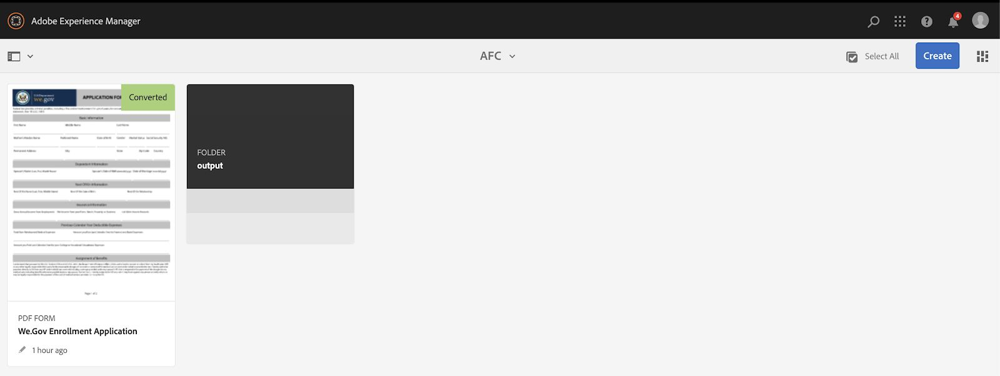

   Click the **Output** folder to view the generated adaptive form.

#### Known Issues & Notes {#known-issues-notes}

The Automated Forms Conversion service includes certain [best practices, known complex patterns](https://experienceleague.adobe.com/docs/aem-forms-automated-conversion-service/using/styles-and-pattern-considerations-and-best-practices.html), and [known issues](https://experienceleague.adobe.com/docs/aem-forms-automated-conversion-service/using/known-issues.html). Review these before you begin using AEM Forms Automated Forms Conversion service.

1. Generate the Form with Generate adaptive form(s) without data bindings enabled if you would like to bind the form to an FDM after conversion.

1. Make sure the template folder has jcr:read for everyone permission enabled or else the service user will not be able to read the template from the repository and the conversion will fail.

## Demo package customizations {#demo-package-customizations}

This section includes instructions on customization of the demo.

### Templates customization {#templates-customization}

Editable Templates can be found at the following location:

*https://&lt;aemserver&gt;:&lt;port&gt;/libs/wcm/core/content/sites/templates.html/conf/we-gov*

These templates include the AEM Site, Adaptive Form, and Interactive Communications templates, created and assembled with components that can be found at:

*https://&lt;aemserver&gt;:&lt;port&gt;/crx/de/index.jsp#/apps/we-gov/components*

#### Style system {#customizetemplates}

This site also features client-libraries, one of which imports Bootstrap 4 ( [https://getbootstrap.com/](https://getbootstrap.com/) ). This client library is available at

*https://&lt;aemserver&gt;:&lt;port&gt;/crx/de/index.jsp#/apps/we-gov/clientlibs/clientlib-base/css/bootstrap*

The editable templates included in this package also come preconfigured with template/page policies that use the Bootstrap 4 CSS classes for pagination, styling, etc. Not all classes have been added to the template policies, but any class that is supported by Bootstrap 4 can be added to the policies. See the getting started page for a list of available classes:

[https://getbootstrap.com/docs/4.1/getting-started/introduction/](https://getbootstrap.com/docs/4.1/getting-started/introduction/)

Templates included in this package also support the Style System:

[Style System](../../sites-authoring/style-system.md)

#### Template logos {#template-logos}

Project DAM Assets also include We.Gov logos and images. These assets are available at:

*https://&lt;aemserver&gt;:&lt;port&gt;/assets.html/content/dam/we-gov*

When editing the Page and Form Templates, one may choose to update brand logos by editing the Navigation and Footer components. These components offer a configurable brand and logo dialog that can be used to update logos:

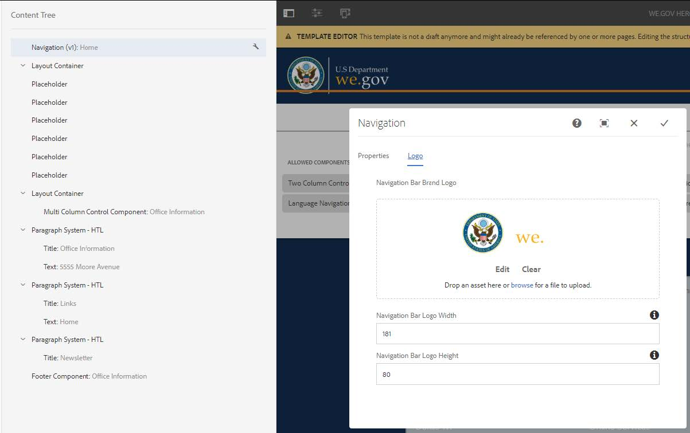

See Editing Page Content for more information:

[Editing Page Content](../../sites-authoring/editing-content.md)

### Sites pages customization {#sites-pages-customization}

All site pages are available from: *https://&lt;aemserver&gt;:&lt;port&gt;/sites.html/content/we-gov*

These site pages also make use of the AEM Grid package to control the layout of a few components.

#### Style system {#style-system}

Pages included in this package also support the Style System:

[Style System](../../sites-authoring/style-system.md)

You can also refer to [Templates customization style system](../../forms/using/forms-install-configure-gov-reference-site.md#customizetemplates) for documentation on supported styles.

### Adaptive forms customization {#adaptive-forms-customization}

All adaptive forms are available from:

*https://&lt;aemserver&gt;:&lt;port&gt;/aem/forms.html/content/dam/formsanddocuments/adobe-gov-forms*

These forms can be customized to fit certain use cases. Note that certain fields, and submission logic should not be modified to ensure that the form continues to function correctly. This includes:

**Enrollment Application For Health Benefits:**

* contact_id - Hidden field used to receive the MS Dynamics contact ID during submission
* Submit - Submit button logic required customization to support callbacks. Customization is documented, but a large script was required to submit the form while performing both a POST and GET operation to MS Dynamics via the Forms Data Model.
* Root Panel - Initialize event is used to add an MS Dynamics button to the AEM Inbox in the least intrusive way possible since all AEM Inbox Granite UI components are non-modifiable.

#### Adaptive form styling {#adaptive-form-styling}

Adaptive forms can also be styled using the Style Editor or Theme editor:

* [Inline styling of adaptive form components](inline-style-adaptive-forms.md)
* [Creating and using themes](themes.md)

### Workflow customization {#workflow-customization}

The Enrollment Adaptive Form submit to an OSGI workflow for processing. This workflow can be found at *https://&lt;aemserver&gt;:&lt;port&gt;/conf/we-gov/settings/models/we-gov-process.html*.

Due to certain limitations, this workflow contains several scripts and custom OSGI workflow process steps. These workflow steps were created as generic steps and have not been created with configuration dialogues. At this time, configuration of the workflow steps relies on process arguments.

All workflow step Java code is contained in the **we-gov-forms.core-&lt;version&gt;.jar** bundle.

## Demo considerations and known issues {#demo-considerations-and-known-issues}

This section contains information on demo features and design decisions that may require special considerations during the demonstration process.

### Demo considerations {#demo-considerations}

* As per AGRS-159, ensure that the name (first, middle, and last) of the contact used in the Enrollment Adaptive Form is unique.
* The enrollment adaptive form will send the Adobe Sign email to the email specified in the form's email field. That email address cannot be the same email address as the email used to configure the Adobe Sign cloud configuration.

### Known issues {#known-issues}

* (AGRS-120) The Site Navigation component currently does not support nested child pages that are more than 2 levels deep.
* (AGRS-159) The current MS Dynamics FDM needs to perform 2 operations to first, POST the Enrollment Adaptive Form data to Dynamics, and then fetch the user record in order to retrieve the Contact ID. In its current state, fetching the Contact ID will fail if more than two users with the same name are present in Dynamics, which will not allow the Enrollment Adaptive Form to submit.

## Configuring Accessibility Testing {#configure-accessibility-testing}

### Enabling Accessibility Testing Chrome Add On {#enable-chrome-add-on}

To perform accessibility testing, install the Chrome plugin found here at `https://chrome.google.com/webstore/detail/accessibility-developer-t/fpkknkljclfencbdbgkenhalefipecmb?hl=en`. <!-- This URL is a 404. As such, please fix and update this entire topic. We ought not to be writing about third-party software that we have no control over to avoid these 404s. Consider making this topic entirely generic and leaving it up to the user to choose their own Accessibility Testing add-on. -->

After it is installed, load the page that you want to test within the Chrome Browser (Note: Having multiple tabs open may affect your score, it is preferable to only have one tab open). Once the page is loaded
**right click** on the page and select **Audits** tab . There developers can select the type of audit to be performed by the Accessibility plugin. After all the desired options are selected, the user can click the Generate Report button. This will generate a PDF document that shows the overall accessibility rating and what can be used to increase accessibility rating overall.

After the report is run, users can expect to see the following:

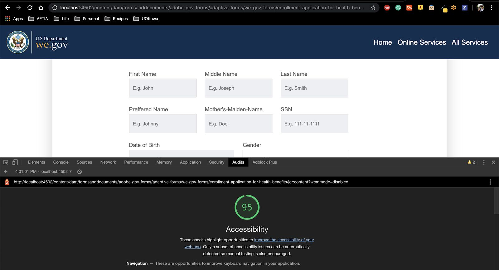

The number displayed in front of users is the overall accessibility rating that they have acquired. There is also a description of how this was calculated following the score.

If users wish to export this they can click on the three buttons on the right of the screen and select from the further options that the plugin offers.

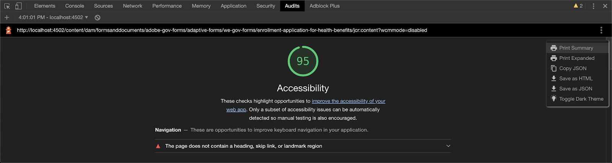

### Ultramarine Theme {#ultramarine-theme}

The publicly available Ultramarine theme maintained by Adobe is built into the
`we-gov-forms.pkg.all-<version>.zip` installable ZIP file. Once this package is installed using CRX.

Package Manager, users can access the Ultramarine theme in AEM Forms by navigating to **Forms** > **Themes** > **Reference Themes** > **Ultramarine-Accessible**.

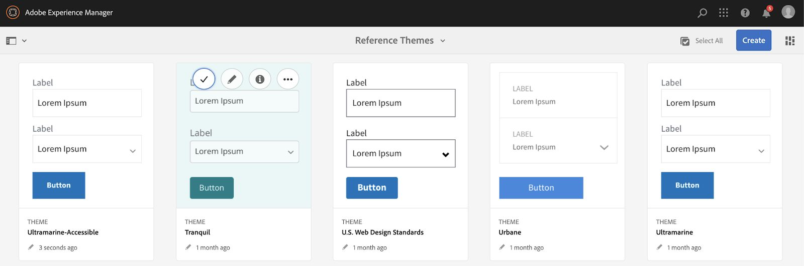

## Configuration options {#configuration-options}

Users have the ability to configure various workflow service options which include the following:

1. Microsoft Dynamics Entry
1. Adobe Sign
1. AEM Custom Communication Management
1. Adobe Analytics

In order to configure them to be enabled within the Workflow users need to perform the following tasks.

1. Navigate to https://'[server]:[port]'/system/console/configMgr.

1. Locate the *WeGov Configurations*.

1. Open the service definition and enable the selected services to be invoked within the workflow.

   >[!NOTE]
   >
   >Just because a user enables the service within the Configuration Manager page, users are still required to setup a service configuration in order to communicate with the external services requested.

   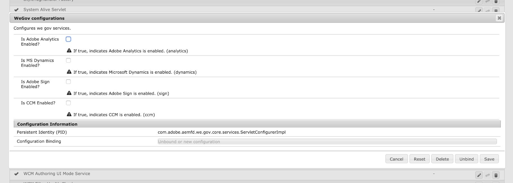  

1. Once completed click on the Save button in order to save the settings.

## Next Steps {#next-steps}

Now you are all set to explore the We.Gov reference site. For more information about We.Gov reference site workflow and steps, see [We.Gov reference site walkthrough](../../forms/using/forms-gov-reference-site-user-demo.md).
