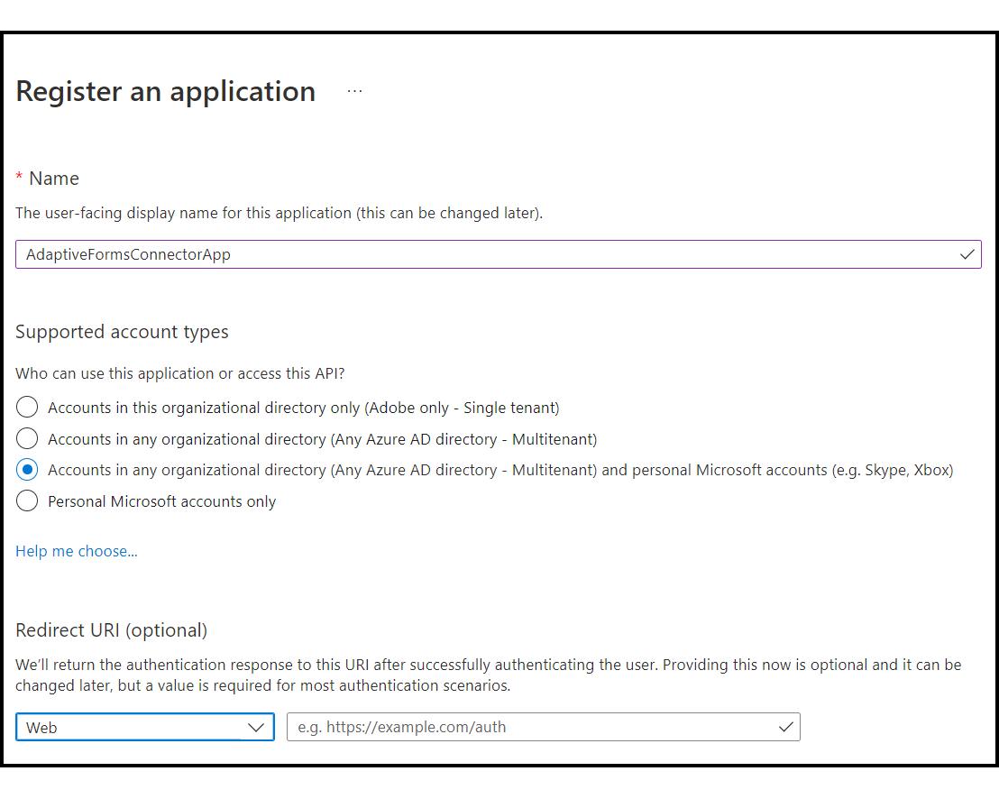
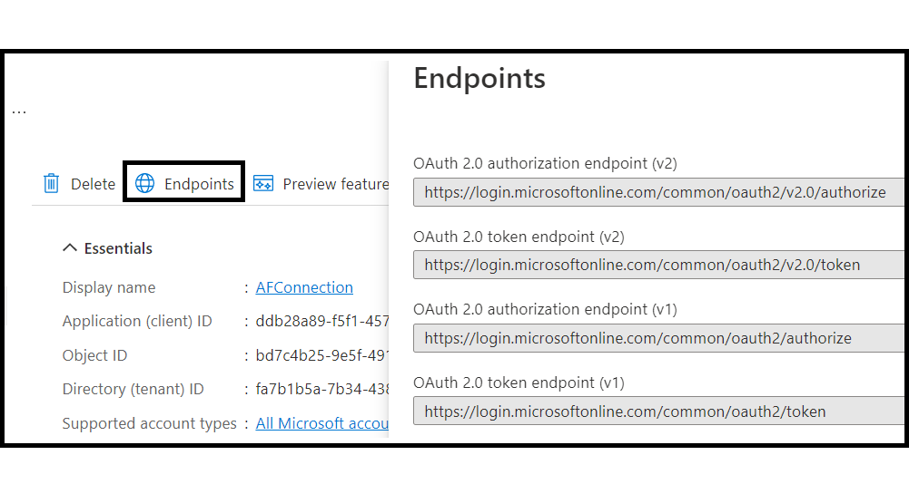
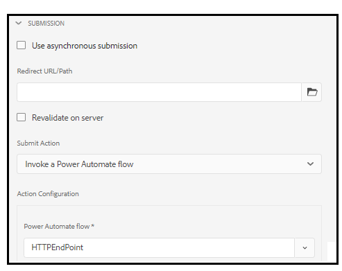

# Connect and submit Adaptive Form data to Microsoft&reg; Power Automate {#connect-adaptive-form-with-power-automate}

| Version | Article link |
| -------- | ---------------------------- |
| AEM 6.5  |    This article                  |
| AEM as a Cloud Service     | [Click here](https://experienceleague.adobe.com/en/docs/experience-manager-cloud-service/content/forms/integrate/set-submit-action/forms-microsoft-power-automate-integration)            |

You can configure an Adaptive Form to run a Microsoft&reg; Power Automate Cloud Flow on submission. The configured Adaptive Form sends captured data, attachments, and Document Of Record to Power Automate Cloud Flow for processing. It helps you build custom data capture experience while harnessing the power of Microsoft&reg; Power Automate to build business logics around captured data and automate customer workflows. Here are a few examples of what you can do after integrating an Adaptive Form with Microsoft&reg; Power Automate: 

* Use Adaptive Forms data in a Power Automate business processes
* Use Power Automate to send captured data to more than 500 data sources or any publicly available API  
* Perform complex calculations on captured data
* Save Adaptive Forms data to storage systems at a predefined schedule

Adaptive Forms editor provides the **Invoke a Microsoft&reg; Power Automate flow** submit action to send adaptive forms data, attachments, and Document Of Record are sent to Power Automate Cloud Flow. To use the Submit action to send captured data to Microsoft&reg; Power Automate, [Connect your AEM Forms Author instance with Microsoft&reg; Power Automate](#connect-your-aem-forms-instance-with-microsoft&reg;-power-automate)  

## Prerequisites

The following are required to connect an Adaptive Form with Microsoft&reg; Power Automate: 

* Microsoft&reg; Power Automate Premium license
* Microsoft&reg; [Power Automate flow](https://docs.microsoft.com/en-us/power-automate/create-flow-solution) with the `When an HTTP request is received` trigger to accept Adaptive Form submit data
* An Experience Manager user with [Forms Author](/help/forms/using/forms-groups-privileges-tasks.md) and [Forms Admin](/help/forms/using/forms-groups-privileges-tasks.md) privileges
* Account used to connect to Microsoft&reg; Power Automate is owner of the Power Automate flow configured to receive data from Adaptive Form


## Connect your AEM Forms instance with Microsoft&reg; Power Automate {#connect-forms-server-with-power-automate}

Perform the following actions to connect your AEM Forms Author instance with Microsoft&reg; Power Automate:

1. [Create a Microsoft&reg; Azure Active Directory Application](#ms-power-automate-application)
1. [Create Microsoft&reg; Power Automate Dataverse Cloud Configuration](#microsoft-power-automate-dataverse-cloud-configuration)
1. [Create Microsoft&reg; Power Automate Flow Service Cloud Configuration](#create-microsoft-power-automate-flow-cloud-configuration)
1. [Publish Microsoft&reg; Power Automate Dataverse and Microsoft&reg; Power Automate Flow Service Cloud Configurations](#publish-microsoft-power-automate-dataverse-cloud-configuration)

### Create Microsoft&reg; Azure Active Directory Application {#ms-power-automate-application}

1. Log in to [Azure Portal](https://portal.azure.com/).
1. Select [!UICONTROL Azure Active Directory] from the left navigation.
1. On the Default directory page, select [!UICONTROL App registrations] from the left panel.
1. On the App registrations page, click New Registrations.
1. Specify Name, Supported account types, and Redirect URI on the page. In the Redirect URI, specify the following and click Save.
    * `https://[AEM Forms Author instance]/libs/fd/powerautomate/content/dataverse/config.html`
    * `https://[AEM Forms Author instance]/libs/fd/powerautomate/content/flowservice/config.html`

    

    >[!NOTE]
    >You can also specify additional Redirect URIs, if necessary, from the Authentication page.
    > For supported account types, select single tenant, multiple tenants, or personal Microsoft&reg; Account depending on your use case


1. On the Authentication page, enable the following options, and click Save.


    * Access tokens (used for implicit flows)
    * ID tokens (used for implicit and hybrid flows)

1. On the API permissions page, click Add a permission. 
1. Under Microsoft&reg; APIs, select the Flow Service, and select the following permissions. 
    * Flows.Manage.All
    * Flows.Read.All

    Click Add permissions to save the permissions.
1. On the API permissions page, click Add a permission. Select APIs my organization uses and search `DataVerse`.
1. Enable user_impersonation and Click Add permissions.
1. (Optional) On the Certificates & secrets page, click New client secret. On the Add a Client Secret screen, provide a description and time period for the secret to expire, and click Add. A secret string is generated. 
1. Keep a note of your organization-specific [Dynamics environment URL](https://docs.microsoft.com/en-us/power-automate/web-api#compose-http-requests).

### Create Microsoft&reg; Power Automate Dataverse Cloud Configuration {#microsoft-power-automate-dataverse-cloud-configuration}

1. On AEM Forms author instance, navigate to **[!UICONTROL Tools]**  &gt; **[!UICONTROL General]** &gt; **[!UICONTROL Configuration Browser]**.
1. On the **[!UICONTROL Configuration Browser]** page, select **[!UICONTROL Create]**.
1. In the **[!UICONTROL Create Configuration]** dialog, specify a **[!UICONTROL Title]** for the configuration, enable **[!UICONTROL Cloud Configurations]**, and select **[!UICONTROL Create]**. It creates a configuration container to store  Cloud Services. Ensure that the folder name does not contain any space.
1. Navigate to **[!UICONTROL Tools]**  &gt; **[!UICONTROL Cloud Services]** &gt; **[!UICONTROL Microsoft&reg;&reg; Power Automate Dataverse]** and open the configuration container you created in the previous step.

   >[!NOTE]
   >
   >When you create an Adaptive Form, specify the container name in the **[!UICONTROL Configuration Container]** field.  

1. On the configuration page, select **[!UICONTROL Create]** to create [!DNL Microsoft&reg;&reg; Power Automate Flow Service] configuration in AEM Forms.
1. On the **[!UICONTROL Configure Dataverse Service for Microsoft&reg;&reg; Power Automate]** page, Specify the **[!UICONTROL Client ID]** (also referred to as Application ID), **[!UICONTROL Client Secret]**, **[!UICONTROL OAuth URL]** and **[!UICONTROL Dynamic Environment URL]**. Use the Client ID, Client Secret, OAuth URL, and Dynamic Environment URL of [Microsoft&reg; Azure Active Directory Application](#ms-power-automate-application) you created in the previous section. Use Endpoints option in Microsoft&reg; Azure Active Directory application UI to find OAuth URL

     

1. Select **[!UICONTROL Connect]** . If asked, login to your Microsoft&reg; Azure Account. Select **[!UICONTROL Save]**.

### Create Microsoft&reg; Power Automate Flow Service Cloud Configuration {#create-microsoft-power-automate-flow-cloud-configuration}

1. Navigate to **[!UICONTROL Tools]**  &gt; **[!UICONTROL Cloud Services]** &gt; **[!UICONTROL Microsoft&reg;&reg; Power Automate Flow Service]** and open the configuration container you created in the previous section.

   >[!NOTE]
   >
   >When you create an Adaptive Form, specify the container name in the **[!UICONTROL Configuration Container]** field.  
1. On the configuration page, select **[!UICONTROL Create]** to create [!DNL Microsoft&reg;&reg; Power Automate Flow Service] configuration in AEM Forms.
1. On the **[!UICONTROL Configure Dataverse for Microsoft&reg;&reg; Power Automate]** page, Specify the **[!UICONTROL Client ID]** (also referred to as Application ID), **[!UICONTROL Client Secret]**, **[!UICONTROL OAuth URL]** and **[!UICONTROL Dynamic Environment URL]**. Use the Client ID, Client Secret, OAuth URL, and Dynamics Environment ID. Use Endpoints option in Microsoft&reg; Azure Active Directory application UI to find OAuth URL. Open the [My flows](https://us.flow.microsoft.com) link and select My Flows use the ID listed in URL as Dynamics Environment ID.
1. Select **[!UICONTROL Connect]**. If asked, log in to your Microsoft&reg; Azure Account. Select **[!UICONTROL Save]**.

### Publish both the Microsoft&reg; Power Automate Dataverse and Microsoft&reg; Power Automate Flow Service Cloud Configurations {#publish-microsoft-power-automate-dataverse-cloud-configuration}

1. Navigate to **[!UICONTROL Tools]**  &gt; **[!UICONTROL Cloud Services]** &gt; **[!UICONTROL Microsoft&reg;&reg; Power Automate Dataverse]** and open the configuration container you created in the previous [Create Microsoft&reg; Power Automate Dataverse Cloud Configuration](#microsoft-power-automate-dataverse-cloud-configuration) section.
1. Select the `dataverse` configuration and select **[!UICONTROL Publish]**. 
1. On the Publish page, select **[!UICONTROL All Configurations]** and select **[!UICONTROL Publish]**. Publish both Power Automate Dataverse and Power Automate Flow Service Cloud Configurations.

Your AEM Forms Author instance is now connected with Microsoft&reg; Power Automate. You can now send Adaptive Forms data to a Power Automate flow. 

## Use the Invoke a Microsoft&reg; Power Automate flow submit action to send data to a Power Automate Flow {#use-the-invoke-microsoft-power-automate-flow-submit-action}

After you [Connect your AEM Forms Author instance with Microsoft&reg; Power Automate](#connect-forms-server-with-power-automate), perform the following action to configure your adaptive form to send captured data to a Microsoft&reg; flow on form submission.

1. Log in to your Author instance, select your Adaptive Form and click **[!UICONTROL Properties]**.
1. In the Configuration Container, browse and select the container created in section [Create Microsoft&reg; Power Automate Dataverse Cloud Configuration](#microsoft-power-automate-dataverse-cloud-configuration), and select **[!UICONTROL Save and Close]**.
1. Open the Adaptive Form for editing and navigate to **[!UICONTROL Submission]** section of the Adaptive Form Container properties.
1. In the properties container, for **[!UICONTROL Submit Actions]** select the **[!UICONTROL Invoke a Power Automate flow]** option. A list of available Power Automate flows becomes available under the **[!UICONTROL Power Automate flow]** option. Select the required flow and Adaptive Forms data is submitted to it on submission.    

     

>[!NOTE]
>
> Before submitting the Adaptive Form, ensure that the `When an HTTP Request is received` trigger with below JSON Schema is added to your Power Automate flow.  

```

        {
            "type": "object",
            "properties": {
                "attachments": {
                    "type": "array",
                    "items": {
                        "type": "object",
                        "properties": {
                            "filename": {
                                "type": "string"
                            },
                            "data": {
                                "type": "string"
                            },
                            "contentType": {
                                "type": "string"
                            },
                            "size": {
                                "type": "integer"
                            }
                        },
                        "required": [
                            "filename",
                            "data",
                            "contentType",
                            "size"
                        ]
                    }
                },
                "templateId": {
                    "type": "string"
                },
                "templateType": {
                    "type": "string"
                },
                "data": {
                    "type": "string"
                },
                "document": {
                    "type": "object",
                    "properties": {
                        "filename": {
                            "type": "string"
                        },
                        "data": {
                            "type": "string"
                        },
                        "contentType": {
                            "type": "string"
                        },
                        "size": {
                            "type": "integer"
                        }
                    }
                }
            }
        }

```

## See also,

* [Create an Adaptive Form](create-an-adaptive-form-core-components.md)
* [Configure a Submit Action](configuring-submit-actions.md)
* [Adobe Experience Manager Connector for Microsoft&reg; Power Automate](https://learn.microsoft.com/en-us/connectors/adobeexperiencemanag/)
