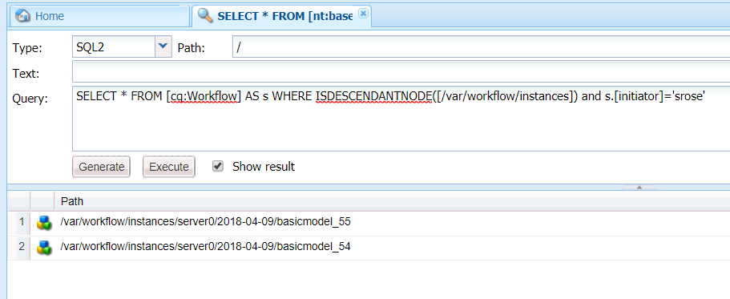
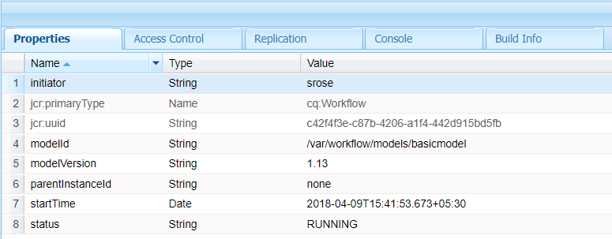

# Forms-centric workflows on OSGi | Handling user data {#forms-centric-workflows-on-osgi-handling-user-data}

Forms-centric AEM workflows enable you to automate real-world Forms-centric business processes. Workflows consist of a series of steps that execute in an order specified in the associated workflow model. Each step performs a specific action such as assigning a task to a user or sending an email message. Workflows can interact with assets in the repository, user accounts, and services. Therefore, workflows can coordinate complicated activities that involve any aspect of Experience Manager.

A forms-centric workflow can be triggered or launched through any of the following methods:

* Submitting an application from AEM Inbox
* Submitting an application from AEM [!DNL Forms] App
* Submitting an adaptive form
* Using a watched folder
* Submitting an interactive communication or a letter

For more information about Forms-centric AEM workflows and capabilities, see [Forms-centric workflow on OSGi](/help/forms/using/aem-forms-workflow.md).

## User data and data stores {#user-data-and-data-stores}

When a workflow is triggered, a payload is auto-generated for the workflow instance. Each workflow instance is assigned a unique instance ID and an associated payload ID. The payload contains the repository locations for user and form data associated with a workflow instance. In addition, drafts and historical data for a workflow instance are also stored in the AEM repository.

The default repository locations where payload, drafts, and history of a workflow instance reside are as follows:

>[!NOTE]
>
>You can configure different locations to store payload, draft, and history data when creating a workflow or application. To identify the locations where a workflow or application stored data, review the workflow.

<table>
 <tbody>
  <tr>
   <td> </td>
   <td><b>AEM 6.4 [!DNL Forms]</b></td>
   <td><b>AEM 6.3 [!DNL Forms]</b></td>
  </tr>
  <tr>
   <td><strong>Workflow   instance</strong></td>
   <td>/var/workflow/instances/[server_id]/&lt;date&gt;/[workflow-instance]/</td>
   <td>/etc/workflow/instances/[server_id]/[date]/[workflow-instance]/</td>
  </tr>
  <tr>
   <td><strong>Payload</strong></td>
   <td>/var/fd/dashboard/payload/[server_id]/[date]/  [payload-id]/</td>
   <td>/etc/fd/dashboard/payload/[server_id]/[date]/  [payload-id]/</td>
  </tr>
  <tr>
   <td><strong>Drafts</strong></td>
   <td>/var/fd/dashboard/instances/[server_id]/  [date]/[workflow-instance]/draft/[workitem]/</td>
   <td>/etc/fd/dashboard/instances/[server_id]/  [date]/[workflow-instance]/draft/[workitem]/</td>
  </tr>
  <tr>
   <td><strong>History</strong></td>
   <td>/var/fd/dashboard/instances/[server_id]/  [date]/[workflow_instance]/history/</td>
   <td>/etc/fd/dashboard/instances/[server_id]/  [date]/[workflow_instance]/history/</td>
  </tr>
 </tbody>
</table>

## Access and delete user data {#access-and-delete-user-data}

You can access and delete user data from a workflow instance in the repository. To achieve this, you must know the instance ID of the workflow instance associated with the user. You can find instance ID of a workflow instance by using the user name of the user who initiated the workflow instance or who is the current assignee of the workflow instance.

However, you cannot identify or the results may be ambiguous when identifying workflows associated with an initiator in the following scenarios:

* **Workflow triggered through a watched folder**: A workflow instance cannot be identified using its initiator if the workflow is triggered by a watched folder. In this case, the user information is encoded in the stored data.
* **Workflow initiated from publish AEM instance**: All workflow instances are created using a service user when adaptive forms, interactive communications, or letters are submitted from AEM publish instance. In these cases, the user name of the logged-in user is not captured in the workflow instance data.

### Access user data {#access}

To identify and access user data stored for a workflow instance, perform the following steps:

1. On AEM author instance, go to `https://'[server]:[port]'/crx/de` and navigate to **[!UICONTROL Tools > Query]**.

   Select **[!UICONTROL SQL2]** from the **[!UICONTROL Type]** drop-down.

1. Depending on the available information, execute one of the following queries:

    * Execute the following if the workflow initiator is known:

   `SELECT &ast; FROM [cq:Workflow] AS s WHERE ISDESCENDANTNODE([path-to-workflow-instances]) and s.[initiator]='*initiator-ID*'`

    * Execute the following if the user whose data you are finding is the current workflow assignee:

   `SELECT &ast; FROM [cq:WorkItem] AS s WHERE ISDESCENDANTNODE([path-to-workflow-instances]) and s.[assignee]='*assignee-id*'`

   The query returns the location of all workflow instances for the specified workflow initiator or the current workflow assignee.

   For example, the following query returns two workflow instances path from the `/var/workflow/instances` node whose workflow initiator is `srose`.

   

1. Go to a workflow instance path returned by the query. The status property displays the current status of the workflow instance.

   

1. In the workflow instance node, navigate to `data/payload/`. The `path` property stores the path to the payload for the workflow instance. You can navigate to the path to access data stored in the payload.

   

1. Navigate to the locations for drafts and history for the workflow instance.

   For example:

   `/var/fd/dashboard/instances/server0/2018-04-09/_var_workflow_instances_server0_2018-04-09_basicmodel_54/draft/`

   `/var/fd/dashboard/instances/server0/2018-04-09/_var_workflow_instances_server0_2018-04-09_basicmodel_54/history/`

1. Repeat steps 3 - 5 for all workflow instances returned by the query in step 2.

   >[!NOTE]
   >
   >AEM [!DNL Forms] app also stores data in offline mode. It is possible that data for a workflow instance is locally stored on individual devices and gets submitted to the [!DNL Forms] server when the app synchronizes with the server.

### Delete user data {#delete-user-data}

You must be an AEM administrator to delete user data from workflow instances by performing the following steps:

1. Follow the instructions in [Access user data](/help/forms/using/forms-workflow-osgi-handling-user-data.md#access) and take note of the following:

    * Paths to workflow instances associated with the user
    * Status of the workflow instances
    * Paths to payloads for the workflow instances
    * Paths to drafts and history for the workflow instances

1. Perform this step for workflow instances in **RUNNING**, **SUSPENDED**, or **STALE** status:

    1. Go to `https://'[server]:[port]'/aem/start.html` and log in with administrator credentials.
    1. Navigate to **[!UICONTROL Tools > Workflow> Instances]**.
    1. Select relevant workflow instances for the user and tap **[!UICONTROL Terminate]** to terminate running instances.

       For more information about working with workflow instances, see [Administering Workflow Instances](/help/sites-administering/workflows-administering.md).

1. Go to [!DNL CRXDE Lite] console, navigate to the payload path for a workflow instance, and delete the `payload` node.
1. Navigate to the drafts path for a workflow instance, and delete the `draft` node.
1. Navigate to the history path for a workflow instance, and delete the `history` node.
1. Navigate to the workflow instance path for a workflow instance, and delete the `[workflow-instance-ID]` node for the workflow.

   >[!NOTE]
   >
   >Deleting the workflow instance node will remove the workflow instance for all workflow participants.

1. Repeat steps 2 - 6 for all workflow instances identified for a user.
1. Identify and delete offline draft and submission data from AEM [!DNL Forms] app outbox of workflow participants to avoid any submission to the server.

You can also use APIs to access and remove nodes and properties. See the following docs for more information.

* [How to programmatically access the AEM JCR](/help/sites-developing/access-jcr.md)
* [Removing Nodes and Properties](https://developer.adobe.com/experience-manager/reference-materials/spec/jcr/2.0/10_Writing.html#10.9%20Removing%20Nodes%20and%20Properties)
* [API reference](https://helpx.adobe.com/experience-manager/6-3/sites-developing/reference-materials/javadoc/overview-summary.html)
