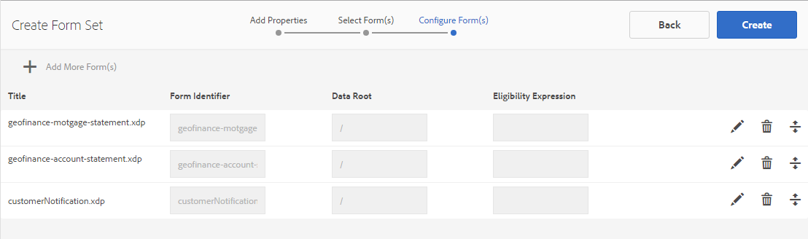

# Form set in AEM Forms{#form-set-in-aem-forms}

## Overview {#overview}

Your customers are often required to submit multiple forms to apply for a service or benefit. It involves finding all relevant forms; and filling, submitting, and tracking them separately. Also, they are required to fill in common details multiple times across forms. The entire process becomes cumbersome and error-prone if it involves large number of forms. The forms set feature of AEM Forms can help simplify the user experience in such scenarios.

A form set is a collection of HTML5 forms grouped together and presented as a single set of forms to end users. When end users start filling a form set, they are seamlessly transitioned from one form to another. At the end, they can submit all forms in just one click.

AEM Forms provides form authors an intuitive user interface to create, configure, and manage form sets. As an author, you can order forms in a particular sequence you want end users to follow. Also, you can apply conditions or eligibility expressions on individual forms to control their visibility based on user inputs. For example, you can configure the spouse details form to appear only when the marital status specifies as Married.

In addition, you can configure common fields in different forms to share common data bindings. With proper data bindings in place, end users are required to fill common information only once that gets auto-filled in subsequent forms.

Form sets are also supported in AEM Forms app, allowing your field workforce to take a form set offline, visit customers, input data, and synchronize later with the AEM Forms server to submit forms data to business processes.

## Creating and Managing Form set {#creating-and-managing-form-set}

You can associate several XDPs or Form Templates, created using Designer, into a form set. Form sets can then be used selectively render the XDPs based on values entered by the users in initial forms and their profiles.

Use [AEM Forms user interface](../../forms/using/introduction-managing-forms.md) to manage all your forms, form sets, and related assets.

### Create a form set {#create-a-form-set}

To create a form set, do the following:

1. Select Forms &gt; Forms and Documents.
1. Select Create &gt; Form Set.

1. In the Add Properties page, add the following details and click Next.

    * Title: Specifies the title of the document. The title helps you identify the form set in the AEM Forms user interface.
    * Description: Specifies the detailed information about the document.
    * Tags: Specifies tags to uniquely identify the form set. Tags help in searching the form set. To create tags, type new tag names in the Tags box.
    * Submit URL: Specifies the URL where submitted data is posted for the case of stand-alone rendition of form set (Non-AEM Forms app use case). Data is submitted to this endpoint as multipart/formdata with following request parameter:
    * dataXML: This parameter contains an XML representation of submitted form set data. If all forms in the form set use a common schema, the XML is generated as per that schema. Otherwise, XML root tag contains a child tag for each filled form in the form set that contains data for the form attachments.
    * formsetPath: The path of the formset in CRXDE, which has been submitted.
    * HTML Render Profile: You can configure certain options such as floating fields, attachments, and draft support (For stand-alone form set rendition) to customize appearance, behavior, and interactions of the form set. You can customize or extend the existing profile to change any HTML Form profile settings.

   

1. The Select Form(s) screen displays the available XDP forms or XDP files. Search and select the forms to include in the form set and then click Add To Form set. If necessary, search again for forms to add. After adding all forms to the form set, click Next.

   >[!NOTE]
   >
   >Ensure that the field names in XDP forms do not contain the dot character. Otherwise, any scripts trying to resolve the fields, which have dot characters, are unable to resolve them.

1. In the Configure Form(s) page, you can do the following:

    * Form Order: Drag-and-drop the forms to reorder them. The form order defines the order in which forms are shown to end user in AEM Forms app and stand-alone rendition.
    * Form Identifier: Specifies a unique identity for the forms to be used in eligibility expressions.
    * Data root: For each form in form set, Author can configure the XPATH where the data of that particular form is positioned in submitted XML. By default, the value is /. If all the forms in form set are schema bound and share the same XML schema, you can change this value. It is recommended that every field in form has proper data binding specified in the XDP. If two fields in two different forms share the common data binding, then the field in the second form shows prefilled values from the first form. Do not bind two subforms with the same internal contents to the same XML node. For more information the XML structure of form set, see [Prefill XML for Form set](../../forms/using/formset-in-aem-forms.md#p-prefill-xml-for-form-set-p).
    * Eligibility expression: Specifies a JavaScript expression that evaluates a Boolean value and indicates whether a form in form set is eligible for filling. If false, user is not asked or even shown the form to fill. Typically, the expression is based on the values of the fields that are captured before this form. Expressions also contain calls to the form set API fs.valueOf to extract the values filled in by the user in a field of a form of the form set:

   *fs.valueOf(&lt;Form Identifier&gt;, &lt;fieldSom expression&gt;) &gt; &lt;value&gt;*

   For example, if you have two forms in the form set: business expense and travel expense, you can add a JavaScript snippet in the Eligibility Expression field for both of these forms to check user input for type of expense in a form. If the user chooses Business Expense, the Business Expense form is rendered to the end user. Or if the user chooses travel expense a different form is rendered to the end user. For more information, see Eligibility Expression.

   Additionally, the Author may also choose to remove a form from the form set using the Delete icon present at the right corner of each row or add another set of forms using the '**+**' icon in the toolbar. This '**+**' icon directs the user back to the previous step in the wizard, that was used to 'Select Form(s)'. The existing selections are maintained and any additional selection made must be added to the form set using the Add To form Set icon on that page.

   

   >[!NOTE]
   >
   >All the forms that are used in form set are managed by AEM Forms user interface.

### Managing a form set {#managing-a-form-set}

Once a form set is created, you can perform following actions on that form set:

* Single-click: When form set is created and listed on main asset page, you can single-click the form set to view it. A form set opens and displays all form templates (XDPs) in that form set.
* Edit: On clicking Edit after selecting a form set, the Configure Form (s) screen that is shown above in Steps to create a Form set opens. You can carry out all the functionalities that are described in point there.
* Copy + Paste: This lets you copy the entire form set from one location and paste it at same or any other location or folder.
* Download: You can download the form set with all its dependencies.
* Start/Manage Review: Once form set is created, you can set up its review by clicking Start Review. Once review has been started for a form set, Manage Review option is displayed to user. On Manage review screen, you can update/end the review. For the reviews you added, you can check the review and add comments, if necessary.
* Delete: Deletes the complete form set. The forms in the deleted form set remain in the repository.
* Publish/Unpublish: This publishes/unpublishes the form set along with the all the forms it contains and the related assets of these forms.
* Preview: Preview provides two options: Preview as HTML (without data) and custom preview with sample data.
* View/Edit Properties: You can view/edit the metadata properties of a selected form set.


### Edit a form set {#edit-a-form-set}

To edit a form set, do the following:

1. Select Forms &gt; Forms and Documents.
1. Locate the form set you want to edit. Hover over it and select Edit ( ).
1. In the Configure Form(s) page, you can edit the following:

    * Form Order
    * Form Identifier
    * Data root
    * Eligibility expression

   You can also click the relevant Delete icon to delete the form from the form Set.

## Form set in Process Management {#form-set-in-process-management}

Once you have created a form set using AEM Forms Management user interface, you can use the form set in a Start Point or Assign Task activity using Workbench.

### Using Form set in Task or Start point {#using-form-set-in-task-or-start-point}

1. When designing a process, under the Presentation & Data section of Assign Task/Start Point, select **use a CRX asset**. CRX Asset browser appears.

   

1. Select form set to filter the form set in AEM repository (CRX).

   

1. Selects a form set and click OK.

## Eligibility Expressions {#eligibility-expressions}

Eligibility expressions in a form set are used to define and dynamically control forms that are displayed to a user. For example, to display a particular form only if the user belongs to a particular age group. Specify and edit an eligibility expression using forms manager.

An eligibility expression can be any valid JavaScript statement that returns a Boolean value. The last statement in the JavaScript code snippet is treated as a Boolean value that determines the eligibility of the form based on the processing in the rest (previous lines) of the JavaScript code snippet. If the value of the expression is true, the form is eligible to be displayed to the user. Such forms are known as eligible forms.

>[!NOTE]
>
>Eligibility expression for the first form in form set is not executed. The first form is always displayed regardless of its eligibility expression.

In addition to the standard JavaScript functions, form set also exposes the fs.valueOf API that provides access to the value of a field of a form in a form set. Use this API to access the value of a form field in a form set. The API syntax is fs.valueOf (formUid, fieldSOM), where:

* formUid (string): A unique ID of a form in the form set. You can specify it while creating the form set in the forms manager user interface. By default, it’s the form name.
* fieldSOM (string): A SOM expression of the field in the form specified by the formUid. SOM expression or Scripting Object Model expression is used to reference values, properties, and methods within a particular document object model (DOM). You can view it in Form Designer under the Scripts tab while the field is selected.

>[!NOTE]
>
>Both formUid and fieldSOM parameters must be string literal.

### Examples {#examples}

Valid usage of the API:

`fs.valueOf("form1", "xfa.form.form1.subform1.field1")`

Invalid usage of the API:

```javascript
var formUid = "form1";
 var fieldSOM = "xfa.form.form1.subform1.field1"; fs.valueOf(formUid, fieldSOM);
```

## Prefill XML for Form set {#prefill-xml-for-form-set}

Form set is a collection of multiple HTML5 forms that have common or different schemas. Form set supports prepopulating of form fields using an XML file. You can associate an XML file with a form set, so that when you open a form in the form set, some of the fields in the form get prepolulated.

Prefill XML file is specified using the dataRef parameter of the URL of the form set. The dataRef parameter specifies absolute path of the data XML file that is merged with the form set.

For example, you have three forms (form1, form2, and form3), in the form set with the following structure:

form1

field
form1field

form2

field
form2field

form3

field
form3field

Each form has a common named field, named "field" and a uniquely named field called "form&lt;i&gt;field".

You can prefill this form set using an XML with the following structure:

```xml
<?xml version="1.0" encoding="UTF-8" ?>
<formSetRootTag>
 <field>common field value</field>
 <form1field>value1</form1field>
 <form2field>value2</form2field>
 <form3field>value3</form3field>
</formSetRootTag>
```

>[!NOTE]
>
>The XML root tag can have any name, but the element tags corresponding to the fields must have the same name as the field. The hierarchy of the XML must mimic the hierarchy of the form, which means the XML must have corresponding tags for wrapping subforms.

The above XML snippet shows that the prefill XML for the form set is a union of the prefill XML snippets of the individual forms. If certain fields in the different forms have data hierarchy/schema similar to each other, the fields are prefilled with the same values. In this example all three forms are prefilled with the same value for the common field, "field". This is a simple way to carry data forward from one form to the next. This can also be achieved by binding the fields to the same schema or data ref. If you want to segregate the form set data based on the forms' schema. This can be achieved by specifying the "data root" attribute of the form, during form set creation (the default value is "/", which maps to the form set root tag).

In the previous example, if you specify the data roots: "/form1", "/form2", and "/form3" respectively for the three forms, you need to use a prefill XML of the following structure:

```xml
<?xml version="1.0" encoding="UTF-8" ?>
<formSetRootTag>
 <form1>
  <field>field value1</field>
  <form1field>value1</form1field>
 </form1>
 <form2>
  <field>field value2</field>
  <form2field>value2</form2field>
 </form2>
 <form3>
  <field>field value3</field>
  <form3field>value3</form3field>
 </form3>
</formSetRootTag>
```

In a form set, the XML defined an XML schema with the following syntax:

```xml
<formset>
 <fs_data>
  <xdp:xdp xmlns:xdp="https://ns.adobe.com/xdp/">
  <xfa:datasets xmlns:xfa="https://www.xfa.org/schema/xfa-data/1.0/">
   <xfa:data>
   <rootElement>
    ... data ....
   </rootElement>
   </xfa:data>
  </xfa:datasets>
  </xdp:xdp>
 </fs_data>
 <fs_draft>
  ... private data...
 </fs_draft>
</formset>
```

>[!NOTE]
>
>If there are two forms with overlapping data roots, or the element hierarchy of one form overlaps with the data root hierarchy of another form, in the prefill xml, the overlapped elements' values are merged. The submit XML has similar structure as the prefill XML, but submit XML has more wrapper tags and some form set context data tags appended at the end.

### Prefill XML elements description {#prefill-xml-elements-description}

Syntax rules for creating a prefill XML file:

* parent elements: element(s) which can be its parent, where null indicates that the element can be at the root of the XML.
* cardinality: depicts the number of times the element can be used inside its parent element.
* submitXML: indicates whether the element is always present(P) or optional(O) in submit XML.
* prefillXML: indicates whether the element is required(R) or optional(O) in prefill XML.
* children: indicates which elements can be its children.

### FORMSET {#formset}

`parent elements:`

`null`

`cardinality: [0,1]`

`submitXML: P`

`prefillXML: O`

`children: fs_data`

The root element of the form set XML. It is advised to not use this word as the name of the rootSubform of any form in the form set.

### FS_DATA {#fs-data}

`parent elements:`

`formset`

cardinality: [1]

submitXML: P

prefillXML: O

`children: xdp:xdp/rootElement`

The subtree indicates the data of the forms in the form set. The element is optional in prefill XML only if the form set element is not present

### XDP:XDP {#xdp-xdp}

`parent elements: fs_data/null`

`cardinality: [0,1]`

`submitXML: O`

`prefillXML: O`

`children: xfa:datasets`

This tag indicates the start of HTML5 Form XML. This is added in the submit XML if it is present in the prefill XML or there is no prefill XML. This tag can be removed from the prefill XML.

### XFA:DATASETS {#xfa-datasets}

`parent elements: xdp:xdp`

`cardinality: [1]`

`submitXML: O`

`prefillXML: O`

`children: xfa:data`

### XFA:DATA {#xfa-data}

`parent elements: xfa:datasets`

`cardinality: [1]`

`submitXML: O`

`prefillXML: O`

`children: rootElement`

### ROOTELEMENT {#rootelement}

`parent elements: xfa:datasets/fs_data/null`

`cardinality: [0,1]`

`submitXML: P`

`prefillXML: O`

`children: controlled by the Forms in Form set`

The name rootElement is just a placeholder. The actual name is picked from the forms used in the form set. The subtree that starts with rootElement contains the data of the fields and subforms inside the Forms in the form set. There are multiple factors that determine the structure of the rootElement and its children.

In prefill XML, this tag is optional, but if it’s missing, the entire XML is ignored.

NAME OF THE ROOT ELEMENT TAG

In case there is a root element in the prefill XML, the name of that element is taken in the submit XML as well. In cases where there is no prefill xml, the name of the rootElement is the name of the Root Subform of the first form in the form set that has a dataRoot property set to "/". If there is no such form, then the rootElement name is **fs_dummy_root**, which is a reserved keyword.

## Form set in&nbsp;AEM Forms app {#formset-in-workspace-app}

AEM Forms app allows field workers to synchronize their mobile devices with an AEM Forms server and work on their tasks. The application works even when the device is offline by saving data locally on the device. Using annotation features, such as photographs, field workers can provide accurate information to integrate into the business processes.

<!-- Update link as it is a 404 - For more information on AEM Forms app, see [AEM Forms app overview](/help/forms/using/mobile-workspace-overview.md).-->

## Known limitations - patterns not fully supported in Form set {#known-limitations-patterns-not-fully-supported-in-form-set}

The following data patterns are not fully supported in Form set:

<table>
 <tbody>
  <tr>
   <td><strong>Pattern not fully supported in Form set</strong></td>
   <td><strong>Example</strong></td>
  </tr>
  <tr>
   <td>Input size and pattern size mismatch</td>
   <td><p>When pattern= num{z,zzz}</p> <p>And input=</p> <p>12,345 or</p> <p>1,23</p> </td>
  </tr>
  <tr>
   <td>Picture Clause Patterns with brackets "(" ")"</td>
   <td>num{(zz,zzz)}</td>
  </tr>
  <tr>
   <td>Multiple data patterns</td>
   <td>num{zz,zzz} | num{z,zzz,zzz}</td>
  </tr>
  <tr>
   <td>Shorthand patterns </td>
   <td><p>num.integer{},</p> <p>num.decimal{},</p> <p>num.percent{}, or</p> <p>num.currency{}</p> </td>
  </tr>
 </tbody>
</table>
