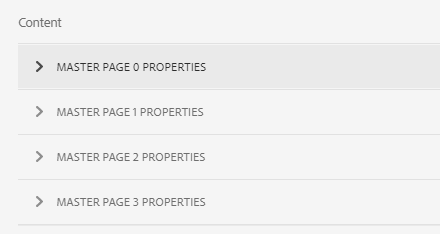
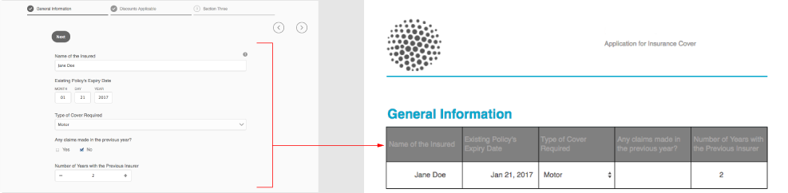
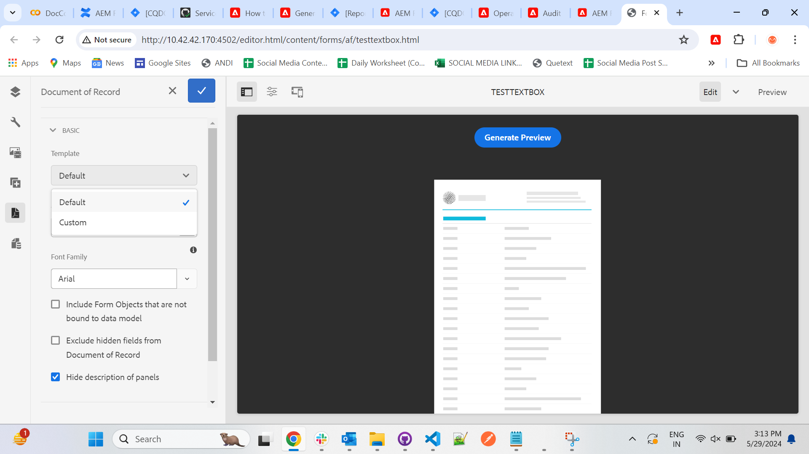

# Generate Document of Record for adaptive forms or adaptive form fragments {#generate-document-of-record-for-adaptive-forms}

<span class="preview"> Adobe recommends using the modern and extensible data capture [Core Components](https://experienceleague.adobe.com/docs/experience-manager-core-components/using/adaptive-forms/introduction.html) for [creating new Adaptive Forms](/help/forms/using/create-an-adaptive-form-core-components.md) or [adding Adaptive Forms to AEM Sites pages](/help/forms/using/create-or-add-an-adaptive-form-to-aem-sites-page.md). These components represent a significant advancement in Adaptive Forms creation, ensuring impressive user experiences. This article describes older approach to author Adaptive Forms using foundation components. </span>

| Version | Article link |
| -------- | ---------------------------- |
| AEM as a Cloud Service |    [Click here](https://experienceleague.adobe.com/docs/experience-manager-cloud-service/content/forms/adaptive-forms-authoring/authoring-adaptive-forms-foundation-components/generate-document-of-record-for-non-xfa-based-adaptive-forms.html)                  |
| AEM 6.5     | This article         |


## Overview {#overview}

After submitting a form, your customers generally want to keep a record, in print or in document format, of the information they have filled in the form for their future reference. This is referred to as a document of record.

This article explains how you can generate a document of record for Adaptive Forms or Adaptive Form fragment.

>[!NOTE]
>
> The support to customize your Adaptive Form fragments and its fields in Adaptive Form editor was introduced with AEM 6.5 Forms Service Pack 19 (6.5.19.0).


>[!NOTE]
>
>Auto-generation of document of record is not supported for XFA-based adaptive forms. However, you can use the XDP used to create the adaptive form as document of record.

## Adaptive form types and their documents of record {#adaptive-form-types-and-their-documents-of-record}

When you create an adaptive form, you can select a form model. Your options are:

* [Form Templates](../../forms/using/creating-adaptive-form.md#create-an-adaptive-form-based-on-an-xfa-form-template)
  Lets you select an XFA template for your adaptive form. When you select an XFA template, you can use the associated XDP file for document of record as described above.

* [XML Schema](../../forms/using/creating-adaptive-form.md#create-an-adaptive-form-based-on-xml-or-json-schema)
  Lets you select an XML schema definition for your adaptive form. When you select an XML schema for your adaptive form, you can:

    * Associate an XFA template for document of record. Ensure that associated XFA template uses the same XML schema as your adaptive form
    * Automatically generate document of record

* None
  Lets you create an adaptive form without a form model. The document of record is automatically generated for your adaptive form.

When you select a form model, configure document of record using options available under Document of Record Template Configuration. See [Document of Record Template Configuration](#document-of-record-template-configuration).

## Automatically generated document of record {#automatically-generated-document-of-record}

A document of record lets your customers keep a copy of submitted form for printing purpose. When you automatically generate a document of record, everytime you change your form, its document of record is updated immediately. For example, you remove age field for customers who select United States of America as their country. When such customers generate a document of record, the age field is not visible to them in the document of record.

Automatically generated document of record has the following advantages:

* It takes care of data binding.
* It automatically hides fields which are marked exclude from document of record at the time of submission. No extra effort is required.
* It saves time for designing document of record template.
* It lets you try different styling and appearance using different base templates and choose best style and appearance for Document of Record. Styling appearances are optional, and if you do not specify styling, system styles are set as default.
* It ensures any change in form is immediately reflected in document of record.

## Components to automatically generate a document of record {#components-to-automatically-generate-a-document-of-record}

To generate a document of record for adaptive forms, you need the following components:

**Adaptive form** Adaptive form for which you want to generate a document of record.

**Adaptive form fragment** Adaptive form fragment for which you want to generate a document of record.

**Base template (recommended)** XFA template (XDP file) created in AEM Designer. Base template is used to specify styling and branding information for document of record template.

See [Base template of a document of record](#base-template-of-a-document-of-record)

>[!NOTE]
>
>Base template of a document of record is also called meta-template of a document of record.

**Document of record template** XFA template (XDP file) generated from an adaptive form.

See [Document of Record Template Configuration](#document-of-record-template-configuration).

**Form data** Information filled in by a user in the adaptive form. It merges with the document of record template to generate the document of record.

## Mapping of adaptive form elements {#mapping-of-adaptive-form-elements}

The following sections describe how adaptive form elements appear in document of record.

### Fields {#fields}

<table>
 <tbody>
  <tr>
   <th>Adaptive form component</th>
   <th>Corresponding XFA component</th>
   <th>Included by default in document of record Template?</th>
   <th>Notes</th>
  </tr>
  <tr>
   <td>Button</td>
   <td>Button</td>
   <td>false</td>
   <td> </td>
  </tr>
  <tr>
   <td>Check box</td>
   <td>Check Box</td>
   <td>true</td>
   <td> </td>
  </tr>
  <tr>
   <td>Date picker</td>
   <td>Date/Time Field</td>
   <td>true</td>
   <td> </td>
  </tr>
  <tr>
   <td>Drop-down list</td>
   <td>Drop-down List</td>
   <td>true</td>
   <td> </td>
  </tr>
  <tr>
   <td>Scribble Signature</td>
   <td>Signature Scribble</td>
   <td>true</td>
   <td> </td>
  </tr>
  <tr>
   <td>Numeric box</td>
   <td>Numeric Field</td>
   <td>true</td>
   <td> </td>
  </tr>
  <tr>
   <td>Password box</td>
   <td>Password Field</td>
   <td>false</td>
   <td> </td>
  </tr>
  <tr>
   <td>Radio Button</td>
   <td>Radio Button</td>
   <td>true</td>
   <td> </td>
  </tr>
  <tr>
   <td>Text box</td>
   <td>Text Field</td>
   <td>true</td>
   <td> </td>
  </tr>
  <tr>
   <td>Reset button</td>
   <td>Reset Button</td>
   <td>false</td>
   <td> </td>
  </tr>
  <tr>
   <td>Submit button</td>
   <td><p>Email Submit Button</p> <p>HTTP Submit Button</p> </td>
   <td>false</td>
   <td> </td>
  </tr>
  <tr>
   <td>Terms and conditions</td>
   <td> </td>
   <td>true</td>
   <td> </td>
  </tr>
  <tr>
   <td>File Attachment</td>
   <td> </td>
   <td>false</td>
   <td>Not available in document of record template. Only Available in document of record through attachments.</td>
  </tr>
 </tbody>
</table>

### Containers {#containers}

<table>
 <tbody>
  <tr>
   <th>Adaptive form component</th>
   <th>Corresponding XFA component</th>
   <th>Notes</th>
  </tr>
  <tr>
   <td>Panel<br /> </td>
   <td>Subform<br /> </td>
   <td>Repeatable panel maps to repeatable subform.</td>
  </tr>
 </tbody>
</table>

### Static components {#static-components}

| Adaptive form component |Corresponding XFA component |Notes |
|---|---|---|
| Image |Image |The TextDraw and Image components, whether bound or unbound, always appear in the document of record for an XSD-based adaptive form, unless excluded using the document of record settings. |
| Text |Text |

>[!NOTE]
>
>In classic UI, you get different tabs for editing field properties.

### Tables {#tables}

The adaptive forms table components such as header, footer, and row map to corresponding XFA components. You can map repeatable panels to tables in document of record.

## Base template of a document of record {#base-template-of-a-document-of-record}

Base template provides styling and appearance information to document of record. It lets you customize default appearance of auto generated document of record. For example, you want to add your company logo in the header, and copyright information in the footer of the document of record. The master page from base template is used as a master page for document of record template. The master page can have information such as page header, page footer, and page number that you can apply to document of record. You can apply such information to document of record using base template for auto generation of document of record. Using base template enables you to change default properties of fields.

Be sure you follow [Base template conventions](#base-template-conventions) when you design base template.

## Base template conventions {#base-template-conventions}

A base template is used to define header, footer, styling, and appearance for a document of record. The header and footer can include information like the company logo and copyright text. The first master page in the base template is copied and used as a master page for the document of record, which contains header, footer, page number, or any other information that should appear across all pages in the document of record. If you are using a base template which does not conform to base template conventions, the first master page from the base template is still used in document of record template. It is highly recommended that you design your base template as per its conventions, and use it for auto generation of document of record.

**Master page conventions**

* In the base template, you should name the root subform as `AF_METATEMPLATE` and the master page as `AF_MASTERPAGE`.

* The master page with the name `AF_MASTERPAGE` located under the `AF_METATEMPLATE` root subform is given preference for extracting header, footer, and styling information.

* If `AF_MASTERPAGE` is absent, the first master page present in the base template is used.

**Styling conventions for fields**

* To apply style on the fields in the document of record, the base template provides fields in the `AF_FIELDSSUBFORM` subfrom under the `AF_METATEMPLATE` root subform.

* The properties of these fields are applied to the fields in the document of record. These fields should follow the `AF_<name of field in all caps>_XFO` naming convention. For example, the field name for check box should be `AF_CHECKBOX_XFO`.

To create a base template, do the following in AEM Designer.

1. Click **File &gt; New**.
1. Select the **Based on a template** option.

1. Select the **Forms - Document of Record** category.
1. Select **DoR Base Template**.
1. Click **Next** and provide the required information.

1. (Optional) Modify the styling and appearance of fields that you want to apply on the fields in the document of record.
1. Save the form.

You can now use the saved form as a base template for document of record.
Do not modify or remove any scripts present in the base template.

**Modifying base template**

* If you are not applying any styling over fields in base template, it is advisable to remove those fields from base template so any upgrades to base template are automatically picked up.
* While modifying base template, do not remove, add, or modify scripts.

>[!NOTE]
>
>Design base template using conventions and strictly following the steps above.

## Document of Record Template Configuration {#document-of-record-template-configuration}

Configure the document of record template of your form to let your customers download a print friendly copy of the submitted form. An XDP file serves as the document of record template. The document of record customers download is formatted according to the layout specified in the XDP file.

Perform the following steps to configure a document of record for adaptive forms:

1. In AEM author instance, click **Forms &gt; Forms and Documents.**
1. Select a form, and click **View Properties**.
1. In the Properties window, select **Form Model**.
   You can also select a form model when you create a form.

   >[!NOTE]
   >
   >In the Form Model tab, ensure that you select **Schema** or **None** from the **Select From** drop-down. **[!UICONTROL Document of record is not supported for XFA-based or adaptive forms with Form Template as form model.]**

1. In the Document of Record Template Configuration section of the Form Model tab, select one of the following options:

   **None** Select this option if you do not want to configure document of record for the form.

   **Associate Form Template as Document of Record Template** Select this option if you have an XDP file that you want to use as a template for the document of record. On selecting this option, all XDP files available in AEM Forms repository are displayed. Select the appropriate file.

   The selected XDP file gets associated with the adaptive form.

   **Generate Document of Record** Select this option to use an XDP file as a base template for defining the styling and appearance for the document of record. On selecting this option, all XDP files available in AEM Forms repository are displayed. Select the appropriate file.

   >[!NOTE]
   >
   >Ensure that schema used to create adaptive form and schema (data schema) of XFA Form are same if:
   >
   >
   >
   >    * Your Adaptive form is schema based
   >    * You are using **Associate Form Template as the Document of Record Template** option for document of record
   >
   >

1. Click **Done.**

## Customize the branding information in document of record {#customize-the-branding-information-in-document-of-record}

While generating a document of record, you can change branding information for the document of record on the Document of Record tab. The Document of Record tab includes options such as logo, appearance, layout, header and footer, disclaimer, and whether or not you want to include unselected check box and radio button options.

To localize the branding information that you enter in the Document of Record tab, you need to ensure the locale of the browser is set appropriately. To customize the branding information of document of record, complete the following steps:

1. Select a panel (root panel) in the document of record and then select .
1. Select . The Document of Record tab appears.
1. Select either the default template or a custom template for rendering the document of record. If you select the default template, a thumbnail preview of the document of record appears below the Template drop-down.

   

   If you choose to select a custom template, browse a select an XDP on your AEM Forms server. If you want to use a template that is not already on your AEM Forms server, you need to first upload the XDP to your AEM Forms server.

### Master Page Properties (#master-page-properties)

Based on whether you select a default or a custom template, some or all the following Master Page Properties appear in the Document Of Record tab as shown in the image above. Specify these appropriately:

* **Logo Image**: You can either choose to use the logo image from the adaptive form, choose one from DAM, or upload one from your computer.
* **Form Title**
* **Header Text**
* **Disclaimer Label**
* **Disclaimer**
* **Disclaimer Text**

    <!--
    * **Accent Color**: The color in which header text and separator lines are rendered in the document or record PDF
    * **Font Family**: Font family of the text in the document of record PDF
    * **For Check Box and Radio Button components, show only the selected values**
    * **Separator for multiple selected value(s)**
    * **Include form objects that are not bound to data model**
    * **Exclude hidden fields from the document of record**
    * **Hide description of panels**
    -->

    If the custom XDP template that you select includes multiple master pages, the properties for those pages appear in the **[!UICONTROL content]** section of the **[!UICONTROL Document of Record]** tab.

    

    The master page properties include Logo Image, Header Text, Form Title, Disclaimer Label, and Disclaimer Text. You can apply adaptive form or XDP template properties to the Document of Record. AEM Forms applies the template properties to the Document of Record by default. You can also define custom values for the master page properties. For information on how to apply multiple master pages in a Document of Record, see [Apply multiple master pages to a Document of Record](#apply-multiple-master-pages-dor).

   >[!NOTE]
   >
   >If you are using an adaptive form template created with a version of Designer prior to 6.3, for Accent Color and Font Family properties to work, ensure that the following is present in your adaptive form template under the root subform:

   ```xml
   <proto>
   <font typeface="Arial"/>
   <fill>
   <color value="4,166,203"/>
   </fill>
   <edge>
   <color value="4,166,203"/>
   </edge>
   </proto>
   ```

1. To save the branding changes, select Done.

## Table and column layouts for panels in Document of Record {#table-and-column-layouts-for-panels-in-document-of-record}

Your adaptive form may be a lengthy one with several form fields. You may not want to save a document of record as an exact copy of the adaptive form. Now you can choose a table or column layout for saving one or more adaptive form panels in the document of record PDF.

Before generating a document of record, in a panel's settings, select Layout For The Document Of Record for that panel as Table or Column. The fields in the panel get organized accordingly in the document of record.



Fields in a panel rendered in a table layout in the document of record


Fields in a panel rendered in a column layout in the document of record

## Document of Record settings {#document-of-record-settings}

Document of record settings let you choose options you want to include in the document of record. For example, a bank accepts name, age, social security number, and phone number in a form. The form generates a bank account number, and branch details. You can choose to display only the name, social security number, bank account, and branch details in document of record.

The document of record settings of a component are available under its properties. To access the properties a component, select the component and click  in the overlay. The properties are listed in the sidebar, and you can find the following settings in it.

**Field level settings**

* **Exclude From Document Of Record**: Setting the property true excludes the field from document of record. This is script-able property named `excludeFromDoR`. Its behavior depends on **Exclude fields from DoR if hidden** form level property.

* **Display panel as table:** Setting the property displays panel as table in document of record if panel has less than 6 fields in it. Applicable for panel only.
* **Exclude title from Document of Record:** Setting the property excludes title of the panel/table from document of record. Applicable for panel and table only.
* **Exclude description from Document of Record:** Setting the property excludes description of the panel/table from document of record. Applicable for panel and table only.
* **[!UICONTROL Pagination]** > **[!UICONTROL Place]**: Determines where you select to place the panel.
  * **[!UICONTROL Place]** > **[!UICONTROL Following Previous]**: Places the panel after the previous object  in the parent panel.
  * **[!UICONTROL Place]** > **[!UICONTROL In Content Area]** > Name of content area: Places the panel in the specified content area.
  * **[!UICONTROL Place]** > **[!UICONTROL Top of Next Content Area]**: Places the panel at the top of the next content area.
  * **[!UICONTROL Place]** > **[!UICONTROL Top of Content Area]** > Name of content area: Places the panel at the top of the specified content area.
  * **[!UICONTROL Place]** > **[!UICONTROL On Page]** > Name of master page: Places the panel on the specified page. If a page break is not inserted automatically, [!DNL AEM Forms] adds a page break.
  * **[!UICONTROL Place]** > **[!UICONTROL Top of Next Page]**: Places the panel at the top of the next page. If a page break is not inserted automatically, [!DNL AEM Forms] adds a page break.
  * **[!UICONTROL Place]** > **[!UICONTROL Top of Page]** > Name of master page: Places the panel at the top of the page, when the specified page is rendered. If a page break is not inserted automatically, [!DNL AEM Forms] adds a page break.
* **[!UICONTROL Pagination]** > **[!UICONTROL After]**: Determines which area to fill after a panel is placed.The following fields are available in the **[!UICONTROL After]** section:
  * **[!UICONTROL After]** > **[!UICONTROL Continue Filling Parent]**: Continues merging data for all objects remaining to be filled in the parent panel.
  * **[!UICONTROL After]** > **[!UICONTROL Go to Next Content Area]**: Starts filling the next content area after placing the panel.
  * **[!UICONTROL After]** > **[!UICONTROL Go To Content Area]** > Name of content area: Starts filling the specified content area after placing the panel.
  * **[!UICONTROL After]** > **[!UICONTROL Go To Next Page]**: Starts filling the next page after placing the panel.
  * **[!UICONTROL After]** > **[!UICONTROL Go To Page]** > Name of page: Starts filling the specified page after placing the panel.
* **[!UICONTROL Pagination]** > **[!UICONTROL Overflow]**: Sets an overflow for a panel or a table that spans pages. The following fields are available in the **[!UICONTROL Overflow]** section:
  * **[!UICONTROL Overflow]** > **[!UICONTROL None]**: Starts filling the next page. If a page break is not inserted automatically, [!DNL AEM Forms] adds a page break.
  * **[!UICONTROL Overflow]** > **[!UICONTROL Go to Content Area]** > Name of content area: Starts filling the specified content area.
  * **[!UICONTROL Overflow]** > **[!UICONTROL Go To Page]** > Name of page: Starts filling the specified page.

  >[!NOTE]
  >
  > Pagination property is not available for adaptive form fragments.

For information on how to apply page breaks and apply multiple master pages in a Document of Record, see [Apply page break in a Document of Record](#apply-page-breaks-in-dor) and [Apply multiple master pages to a Document of Record](#apply-multiple-master-pages-dor).
    
**Form level settings**

* **[!UICONTROL BASIC]**
  * **Template:** You can select the template Default or Custom.
        
  * **Accent Color:** You can predefine the template Color of the [!UICONTROL Document of Record].
  * **Font Family:** Select Font type for the [!UICONTROL Document of Record] texts.
  * **Include unbound fields in DoR:** Setting the property includes unbound fields from Schema based adaptive form in [!UICONTROL Document of Record]. By default it is true.
  * **Exclude fields from DoR if hidden:** Set the property to exclude the hidden fields from [!UICONTROL Document of Record] at form submission. When you enable [Revalidate on server](/help/forms/using/configuring-submit-actions.md#server-side-revalidation-in-adaptive-form-server-side-revalidation-in-adaptive-form), the server recomputes the hidden fields before excluding those fields from the [!UICONTROL Document of Record]
* **[!UICONTROL FORM FIELD PROPERTIES]** 
  * If you tick the option **For Check Box and Radio Button component, show only the selected value(s)**, it will generate DoR output with only selected value(s).
  * You can select Separator for multiple selected value(s) or you can choose any other separator type.
  * Options Alignment
      * Vertical
      * Horizontal
      * Same as Adaptive Form
    >[!NOTE]
    > Vertical and Horizontal alignment is applicable for only     Radio Button and Check Box
* **[!UICONTROL MASTER PAGE PROPERTIES]** Click for more information on [Master Page properties](#master-page-properties-master-page-properties)

## Apply a page break in a Document of Record {#apply-page-breaks-in-dor}

You can apply page breaks in a Document of Record using multiple methods.

To apply a page break to a Document of Record:

1. Select the panel and select 
1. Expand **[!UICONTROL Document of Record]** to view the properties.

1. In the **[!UICONTROL Pagination]** section, select  in the **[!UICONTROL Place]** field.
1. Select **[!UICONTROL Top of Next page]** and select **[!UICONTROL Select]**. You can also select **[!UICONTROL Top of Page]**, select the master page, and select **[!UICONTROL Select]** to apply the page break.
1. Select  to save the properties.

The selected panel moves to the next page.

## Apply multiple master pages to a Document of Record {#apply-multiple-master-pages-dor}

If the custom XDP template that you select includes multiple master pages, the properties for those pages appear in the [!UICONTROL content] section of the [!UICONTROL Document of Record] tab. For more information, see [Customize the branding information in document of record](#customize-the-branding-information-in-document-of-record).

You can apply multiple master pages to a Document of Record by applying different master pages to the components of an adaptive form. Use the [Pagination](#document-of-record-settings) section of the Document of Record properties to apply multiple master pages.

The following is an example of how to apply multiple master pages to a Document of Record:
You upload an XDP template that includes four master pages to the [!DNL AEM Forms] server. [!DNL AEM Forms] applies the template properties to the Document of Record by default. [!DNL AEM Forms] also applies the first master page properties in the template to the Document of Record.

To apply the second master page properties to a panel and the third master page properties to the panels that follow, execute the following steps:

1. Select the panel to apply the second master page and select . 
1. In the **[!UICONTROL Pagination]** section, select  in the **[!UICONTROL Place]** field.
1. Select **[!UICONTROL On page]**, select the second master page and select **[!UICONTROL Select]**.
   AEM Forms applies second master page to the panel and all subsequent panels in the adaptive form.
1. In the **[!UICONTROL Pagination]** section, select  in the **[!UICONTROL After]** field.
1. Select **[!UICONTROL Go To page]**, select the third master page and select **[!UICONTROL Select]**.
1. Select  to save the properties.
   AEM Forms applies third master page to the panel and all subsequent panels in the adaptive form.

>[!NOTE]
>
> You cannot apply multiple master pages to a Document of Record for an adaptive form Fragment.

## Key considerations when working with document of record {#key-considerations-when-working-with-document-of-record}

Keep in mind the following considerations and limitations when working on document of record for adaptive forms.

* Document of record templates do not support rich text. Therefore, any rich text in the static adaptive form or in the information filled in by the end user appears as plain text in the document of record.
* Document fragments in an adaptive form do not appear in the document of record. However, adaptive form fragments are supported.
* Content binding in document of record generated for XML Schema based adaptive form is not supported.
* Localized version of document of record is created on demand for a locale when the user requests the rendering of the document of record. Localization of document of record occurs along with localization of adaptive form. For more information on localization of document of record and adaptive forms see [Using AEM translation workflow to localize adaptive forms and document of record](/help/forms/using/using-aem-translation-workflow-to-localize-adaptive-forms.md).

## Use a custom XCI file

An XCI file helps you set various properties of a document. <!-- Forms as a Cloud Service has a master XCI file.--> You can use a custom XCI file to override one or more default properties specified in the existing XCI file. For example, you can choose to embed a font into a document or enable tagged property for all the documents. The following table specifies the XCI options:

|XCI option|Description|
|--- |--- |
|config/present/pdf/creator|Identifies the document creator using the Creator entry in the Document Information dictionary. For information about this dictionary, see the [PDF Reference guide](https://opensource.adobe.com/dc-acrobat-sdk-docs/acrobatsdk/).|
|config/present/pdf/producer|Identifies the document producer using the Producer entry in the Document Information dictionary. For information about this dictionary, see the [PDF Reference guide](https://opensource.adobe.com/dc-acrobat-sdk-docs/acrobatsdk/).|
|config/present/layout|Controls whether the output is a single panel or paginated.|
|config/present/pdf/compression/level|Specifies the degree of compression to use when generating a PDF document.|
|config/present/pdf/fontInfo/embed|Controls font embedding in the output document.|
|config/present/pdf/scriptModel|Controls whether XFA-specific information is included in the output PDF document.|
|config/present/common/data/adjustData|Controls whether the XFA application adjusts the data after merging.|
|config/present/pdf/renderPolicy|Controls whether the generation of page content is done on the server or deferred to the client.|
|config/present/common/locale|Specifies the default locale used in the output document.|
|config/present/destination|When contained by a present element, specifies the output format. When contained by an openAction element, specifies the action to perform upon opening the document in an interactive client.|
|config/present/output/type|Specifies either the type of compression to apply to a file or the type of output to produce.|
|config/present/common/temp/uri|Specifies the Form URI.|
|config/present/common/template/base|Supplies a base location for URIs in the form design. When this element is absent or empty, the location of the form design is used as the base.|
|config/present/common/log/to|Controls the location that log data or output data is written to.|
|config/present/output/to|Controls the location that log data or output data is written to.|
|config/present/script/currentPage|Specifies the initial page when the document is opened.|
|config/present/script/exclude|Informs Forms as a Cloud Service which events to ignore.|
|config/present/pdf/linearized|Controls whether the output PDF document is linearized.|
|config/present/script/runScripts|Controls which set of scripts Forms as a Cloud Service executes.|
|config/present/pdf/tagged|Controls the inclusion of tags into the output PDF document. Tags, in the context of PDF, are additional information included in a document to expose the logical structure of the document. Tags assist accessibility aids and reformatting. For example, a page number may be tagged as an artifact so that a screen reader does not enunciate it in the middle of the text. Although tags make a document more useful, they also increase the size of the document and the processing time to create it.|
|config/present/pdf/fontInfo/alwaysEmbed|Specifies a font that is embedded into the output document.|
|config/present/pdf/fontInfo/neverEmbed|Specifies a font that must never be embedded into the output document.|
|config/present/pdf/pdfa/part|Specifies the version number of the PDF/A specification that the document conforms to.|
|config/present/pdf/pdfa/amd|Specifies the amendment level of the PDF/A specification.|
|config/present/pdf/pdfa/conformance|Specifies the conformance level with the PDF/A specification.|
|config/present/pdf/version|Specifies the version of PDF document to generate|
|config/present/pdf/version/map|Specifies the fall back fonts for the document|


<!--

### Use a custom XCI file in your AEM Forms environment

  1. Add the custom XCI file to your development project.
  1. Specify the following inline property:(/help/implementing/deploying/configuring-osgi.md)
  1. Deploy the project to your AEM Forms environment. <!--Cloud Service environment
  
-->

### Use a custom XCI file in your local Forms development environment

  1. Upload the XCI file to your local development environment.
  1. Open <!--Cloud Service SDK--> configuration manager. <!--The default URL is: <http://localhost:4502/system/console/configMgr>.-->
  1. Locate and open the **[!UICONTROL Adaptive Forms and Interactive Communication Web Channel]** configuration.
  1. Specify path of the XCI file and click **[!UICONTROL Save]**.
