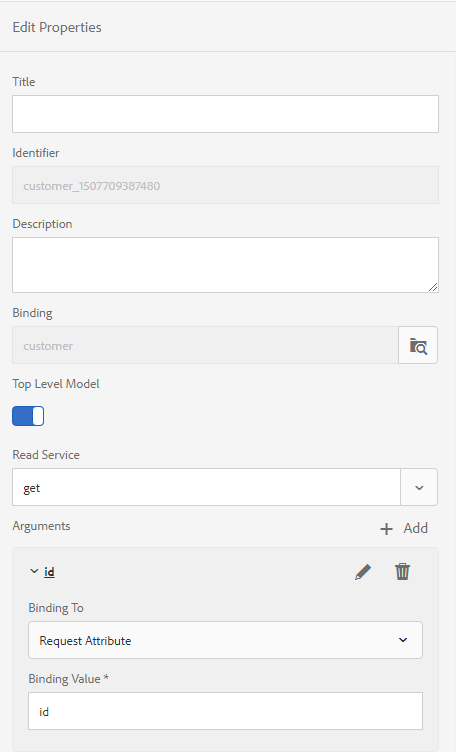

# Generate multiple interactive communications using Batch API {#use-batch-api-to-generate-multiple-ic}

You can use the Batch API to produce multiple interactive communications from a template. The template is an interactive communication without any data. The Batch API combines data with a template to produce an interactive communication. The API is useful in the mass production of interactive communications. For example, telephone bills, credit card statements for multiple customers.

The Batch API accepts records (data) in JSON format and from a Form Data Model. The number of produced interactive communications is equal to the records specified in the input JSON file in the configured Form Data Model. You can use the API to produce both Print and Web output. The PRINT option produces a PDF document and the WEB option produces data in JSON format for each individual record.

## Using the Batch API {#using-the-batch-api}

You can use the Batch API in conjunction with Watched Folders or as a standalone Rest API. You configure a template, output type (HTML, PRINT, or Both), locale, prefill service, and name for the generated interactive communications to use the Batch API.

You combine a record with an interactive communication template to produce an interactive communication. Batch APIs can read records (data for interactive communication templates) directly from a JSON file or from an external data source accessed via form data model. You can keep each record in a separate JSON file or create a JSON array to keep all the records in a single file.

**A single record in a JSON file**

```json
{
   "employee": {
       "name": "Sara",
       "id": 3,
       "mobileNo": 9871996463,
       "age": 37
   }
}

```

**Multiple records in a JSON file**

```json
[{
   "employee": {
       "name": "John",
       "id": 1,
       "mobileNo": 9871996461,
       "age": 39
   }
},{
   "employee": {
       "name": "Jacob",
       "id": 2,
       "mobileNo": 9871996462,
       "age": 38
   }
},{
   "employee": {
       "name": "Sara",
       "id": 3,
       "mobileNo": 9871996463,
       "age": 37
   }
}]

```

### Using the Batch API with Watched folders {#using-the-batch-api-watched-folders}

To make it easy to experience the API, AEM Forms provides a Watched Folder service configured to use the Batch API, out of the box. You can access the service via AEM Forms UI to generates multiple interactive communications. You can also create custom services as per your requirements. You can use the below-listed methods to use Batch API with Watched folder:

* Specify input data (records) in JSON file format to produce an interactive communication
* Use input data (records) saved in an external data source and accessed via a form data model to produce an interactive communication

#### Specify input data records in JSON file format to produce an interactive communication {#specify-input-data-in-JSON-file-format}

You combine a record with an interactive communication template to produce an interactive communication. You can create a separate JSON file for each record or create a JSON array to keep all the records in a single file:

To create interactive communication from records saved in a JSON file:

1. Create a [Watched folder](/help/forms/using/creating-configure-watched-folder.md) and configure it to use the Batch API:
    1. Log in to AEM Forms author instance.
    1. Navigate to **[!UICONTROL Tools]** > **[!UICONTROL Forms]** > **[!UICONTROL Configure Watched Folder]**. Tap **[!UICONTROL New]**.
    1. Specify the **[!UICONTROL Name]** and physical **[!UICONTROL Path]** of the folder. For example, `c:\batchprocessing`.
    1. Select the **[!UICONTROL Service]** option in the **[!UICONTROL Process File Using]** field.
    1. Select the **[!UICONTROL com.adobe.fd.ccm.multichannel.batch.impl.service.InteractiveCommunicationBatchServiceImpl]** service in the **[!UICONTROL Service Name]** field.
    1. Specify an **[!UICONTROL Output File Pattern]**. For example, the %F/ [pattern](https://helpx.adobe.com/experience-manager/6-5/forms/using/admin-help/configuring-watched-folder-endpoints.html#about_file_patterns) specifies the Watched Folder can find input files in a sub-folder of the Watched Folder\input folder.
1. Configure advanced parameters:
    1. Open the **[!UICONTROL Advanced]** tab and add the following custom properties:

        |Property|Type|Description|
        |--- |--- |--- |
        |templatePath |String|Specify path of the interactive communication template to use. For example, /content/dam/formsanddocuments/testsample/mediumic. It is a mandatory property.|
        |recordPath|String|Value of the recordPath field helps set name of an interactive communication. You can set path of a field of a record as value of the recordPath field. For example, if you specify /employee/Id, the value of id field becomes name for corresponding interactive communication. The default value is a random [random UUID](https://docs.oracle.com/javase/7/docs/api/java/util/UUID.html#randomUUID()).|
        |usePrefillService|Boolean|Set the value to False. You can use the usePrefillService parameter to prefill interactive communication with data fetched from prefill service configured for corresponding interactive communication. When usePrefillService is set to true, input JSON data (for each record) is treated as FDM Arguments. The default value is false.|
        |batchType|String|Set value to PRINT, WEB, or WEB_AND_PRINT. The default value is WEB_AND_PRINT.|
        |locale|String|Specify the locale of output interactive communication. The out-of-the-box service does not use the locale option, but you can create a custom service to generate localized interactive communications. The default value is en_US|

    1. Tap **[!UICONTROL Create]** The watched folder is created.
1. Use the watched folder to generate interactive communication:
    1. Open the Watched Folder. Navigate to the input folder.
    1. Create a folder in the input folder and place the JSON file in the newly created folder.
    1. Wait for the Watched Folder to process the file. When the processing starts, the input file and sub-folder containing the file is moved to the staging folder.
    1. Open the output folder to view the output:
        * When you specify the PRINT option in Watched Folder Configuration, PDF output for the interactive communication is generated.
        * When you specify the WEB option in Watched Folder Configuration, a JSON file per record is generated. You can use the JSON file to [pre-fill a web template](#web-template).
        * When you specify both PRINT and WEB options, both PDF documents and a JSON file per record are generated.

#### Use input data saved in an external data source and accessed via form data model to produce an interactive communication {#use-fdm-as-data-source}

You combine data (records) saved in an external data source with an interactive communication template to produce an interactive communication. When you create an interactive communication, you connect it to an external data source via a Form Data Model (FDM) to access data. You can configure Watched Folders batch process service to fetch data using the same Form Data Model from an external data source. To [create an interactive communication from records saved in an external data source](/help/forms/using/work-with-form-data-model.md):

1. Configure the Form Data Model of the template:
    1. Open the Form Data Model associated to interactive communication template.
    1. Select your TOP LEVEL MODEL OBJECT and tap Edit Properties.
    1. Select your fetch or get service from the Read Service field under Edit Properties pane.
    1. Tap the pencil icon for the read service argument to bind the argument to a Request Attribute and specify the binding value. It binds the service argument to the specified binding attribute or literal value, which is passed to the service as an argument to fetch details associated with the specified value from the data source.

        <br>
        In this example, the id argument takes the value of the id attribute of the user profile and passes it as an argument to the read service. It will read and return values of associated properties from the employee data model object for the specified id. So, if you specify 00250 in the id field in the form, the read service will read details of the employee with 00250 employee id.
        <br>

        

    1. Save properties and Form Data Model.
1. Configure value for Request Attribute:
    1. Create a .json file on your file system and open it for editing.
    1. Create a JSON array and specify the primary attribute to fetch data from Form Data Model. For example, the following JSON requests FDM to send data of records where id is 27126 or 27127:

        ```json
            [
                {
                    "id": 27126
                },
                {
                    "id": 27127
                }
            ]
        ```

    1. Save and close the file.

1. Create a [Watched folder](/help/forms/using/creating-configure-watched-folder.md) and configure it to use the Batch API service:
    1. Log in to AEM Forms author instance.
    1. Navigate to **[!UICONTROL Tools]** > **[!UICONTROL Forms]** > **[!UICONTROL Configure Watched Folder]**. Tap **[!UICONTROL New]**.
    1. Specify the **[!UICONTROL Name]** and physical **[!UICONTROL Path]** of the folder. For example, `c:\batchprocessing`.
    1. Select the **[!UICONTROL Service]** option in the **[!UICONTROL Process File Using]** field.
    1. Select the **[!UICONTROL com.adobe.fd.ccm.multichannel.batch.impl.service.InteractiveCommunicationBatchServiceImpl]** service in the **[!UICONTROL Service Name]** field.
    1. Specify an **[!UICONTROL Output File Pattern]**. For example, the %F/ [pattern](https://helpx.adobe.com/experience-manager/6-5/forms/using/admin-help/configuring-watched-folder-endpoints.html#about_file_patterns) specifies the Watched Folder can find input files in a sub-folder of the Watched Folder\input folder.  
1. Configure advanced parameters:
    1. Open the **[!UICONTROL Advanced]** tab and add the following custom properties:

        |Property|Type|Description|
        |--- |--- |--- |
        |templatePath|String|Specify path of the interactive communication template to use. For example, /content/dam/formsanddocuments/testsample/mediumic. It is a mandatory property.|
        |recordPath|String|Value of the recordPath field helps set name of an interactive communication. You can set path of a field of a record as value of the recordPath field. For example, if you specify /employee/Id, the value of id field becomes name for corresponding interactive communication. The default value is a random [random UUID](https://docs.oracle.com/javase/7/docs/api/java/util/UUID.html#randomUUID()).||
        |usePrefillService|Boolean|Set the value to True. The default value is false.  When the value is set to true, the Batch API reads data from the configured Form Data Model and fills it to the interactive communication. When usePrefillService is set to true, input JSON data (for each record) is treated as FDM Arguments.|
        |batchType|String|Set value to PRINT, WEB, or WEB_AND_PRINT. The default value is WEB_AND_PRINT.|
        |locale|String|Specify the locale of output interactive communication. The out-of-the-box service does not use the locale option, but you can create a custom service to generate localized interactive communications. The default value is en_US.|

    1. Tap **[!UICONTROL Create]** The watched folder is created.
1. Use the watched folder to generate interactive communication:
    1. Open the Watched Folder. Navigate to the input folder.
    1. Create a folder in the input folder. Place the JSON file created in Step 2 in the newly created folder.  
    1. Wait for the Watched Folder to process the file. When the processing starts, the input file and sub-folder containing the file is moved to the staging folder.
    1. Open the output folder to view the output:
        * When you specify the PRINT option in Watched Folder Configuration, PDF output for the interactive communication is generated.
        * When you specify the WEB option in Watched Folder Configuration, a JSON file per record is generated. You can use the JSON file to [pre-fill a web template](#web-template).
        * When you specify both PRINT and WEB options, both PDF documents and a JSON file per record are generated.

## Invoke the Batch API using REST requests

 You can invoke [the Batch API](https://helpx.adobe.com/experience-manager/6-5/forms/javadocs/index.html) through Representational State Transfer (REST) requests. It allows you to provide a REST endpoint to other users to access the API and configure your own methods for processing, storing, and customizing interactive communication. You can develop your own custom Java servlet to deploy the  API on your AEM instance.

 Before you deploy the Java servlet, ensure that you have an interactive communication and corresponding data files are ready. Perform the following steps to create and deploy the Java servlet:  

 1. Log in to your AEM instance and create an Interactive Communication. To use the interactive communication mentioned in the sample code given below, [click here](assets/SimpleMediumIC.zip).
 1. [Build and deploy an AEM Project using Apache Maven](https://helpx.adobe.com/experience-manager/using/maven_arch13.html) on your AEM instance.
 1. Add [AEM Forms Client SDK version 6.0.12](https://experienceleague.adobe.com/docs/experience-manager-release-information/aem-release-updates/forms-updates/aem-forms-releases.html) or later in dependencies list of POM file of your AEM project. For example,

    ```xml
        <dependency>
            <groupId>com.adobe.aemfd</groupId>
            <artifactId>aemfd-client-sdk</artifactId>
            <version>6.0.122</version>
        </dependency>
    ```
    
 1. Open the Java project, create a .java file, for example CCMBatchServlet.java. Add the following code to the file:

    ```java

            package com.adobe.fd.ccm.multichannel.batch.integration;

            import java.io.File;
            import java.io.FileInputStream;
            import java.io.FileOutputStream;
            import java.io.IOException;
            import java.io.InputStream;
            import java.io.PrintWriter;
            import java.util.List;
            import javax.servlet.Servlet;
            import org.apache.commons.io.IOUtils;
            import org.apache.sling.api.SlingHttpServletRequest;
            import org.apache.sling.api.SlingHttpServletResponse;
            import org.apache.sling.api.servlets.SlingAllMethodsServlet;
            import org.json.JSONArray;
            import org.json.JSONObject;
            import org.osgi.service.component.annotations.Component;
            import org.osgi.service.component.annotations.Reference;

            import com.adobe.fd.ccm.multichannel.batch.api.builder.BatchConfigBuilder;
            import com.adobe.fd.ccm.multichannel.batch.api.factory.BatchComponentBuilderFactory;
            import com.adobe.fd.ccm.multichannel.batch.api.model.BatchConfig;
            import com.adobe.fd.ccm.multichannel.batch.api.model.BatchInput;
            import com.adobe.fd.ccm.multichannel.batch.api.model.BatchResult;
            import com.adobe.fd.ccm.multichannel.batch.api.model.BatchType;
            import com.adobe.fd.ccm.multichannel.batch.api.model.RecordResult;
            import com.adobe.fd.ccm.multichannel.batch.api.model.RenditionResult;
            import com.adobe.fd.ccm.multichannel.batch.api.service.BatchGeneratorService;
            import com.adobe.fd.ccm.multichannel.batch.util.BatchConstants;
            import java.util.Date;


            @Component(service=Servlet.class,
            property={
                    "sling.servlet.methods=GET",
                    "sling.servlet.paths="+ "/bin/batchServlet"
            })
            public class CCMBatchServlet extends SlingAllMethodsServlet {

                @Reference
                private BatchGeneratorService batchGeneratorService;
                @Reference
                private BatchComponentBuilderFactory batchBuilderFactory;
                public void doGet(SlingHttpServletRequest req, SlingHttpServletResponse resp) {
                    try {
                        executeBatch(req,resp);
                    } catch (Exception e) {
                        e.printStackTrace();
                    }
                }
                private void executeBatch(SlingHttpServletRequest req, SlingHttpServletResponse resp) throws Exception {
                    int count = 0;
                    JSONArray inputJSONArray = new JSONArray();
                    String filePath = req.getParameter("filePath");
                    InputStream is = new FileInputStream(filePath);
                    String data = IOUtils.toString(is);
                    try {
                        // If input file is json object, then create json object and add in json array, if not then try for json array
                        JSONObject inputJSON = new JSONObject(data);
                        inputJSONArray.put(inputJSON);
                    } catch (Exception e) {
                        try {
                            // If input file is json array, then iterate and add all objects into inputJsonArray otherwise throw exception
                            JSONArray inputArray = new JSONArray(data);
                            for(int i=0;i<inputArray.length();i++) {
                                inputJSONArray.put(inputArray.getJSONObject(i));
                            }
                        } catch (Exception ex) {
                            throw new Exception("Invalid JSON Data. File name : " + filePath, ex);
                        }
                    }
                    BatchInput batchInput = batchBuilderFactory.getBatchInputBuilder().setData(inputJSONArray).setTemplatePath("/content/dam/formsanddocuments/[path of the interactive communcation]").build();
                    BatchConfig batchConfig = batchBuilderFactory.getBatchConfigBuilder().setBatchType(BatchType.WEB_AND_PRINT).build();
                    BatchResult batchResult = batchGeneratorService.generateBatch(batchInput, batchConfig);
                    List<RecordResult> recordList = batchResult.getRecordResults();
                    JSONObject result = new JSONObject();
                    for (RecordResult recordResult : recordList) {
                        String recordId = recordResult.getRecordID();
                        for (RenditionResult renditionResult : recordResult.getRenditionResults()) {
                            if (renditionResult.isRecordPassed()) {
                                InputStream output = renditionResult.getDocumentStream().getInputStream();
                                result.put(recordId +"_"+renditionResult.getContentType(), output);

                                Date date= new Date();
                                long time = date.getTime();

                                // Print output
                                if(getFileExtension(renditionResult.getContentType()).equalsIgnoreCase(".json")) {
                                    File file = new File(time + getFileExtension(renditionResult.getContentType()));
                                    copyInputStreamToFile(output, file);
                                } else
                                {
                                    File file = new File(time + getFileExtension(renditionResult.getContentType()));
                                    copyInputStreamToFile(output, file);
                                }
                            }
                        }
                    }
                    PrintWriter writer = resp.getWriter();
                    JSONObject resultObj = new JSONObject();
                    resultObj.put("result", result);
                    writer.write(resultObj.toString());
                }


                private static void copyInputStreamToFile(InputStream inputStream, File file)
                        throws IOException {

                        try (FileOutputStream outputStream = new FileOutputStream(file)) {

                            int read;
                            byte[] bytes = new byte[1024];

                            while ((read = inputStream.read(bytes)) != -1) {
                                outputStream.write(bytes, 0, read);
                            }

                        }

                    }


                private String getFileExtension(String contentType) {
                    if (contentType.endsWith(BatchConstants.JSON)) {
                        return ".json";
                    } else return ".pdf";
                }


            }
    ```

 1. In the above code, replace the template path (setTemplatePath) with the path of your template and set value of the setBatchType API:
    * When you specify the PRINT option PDF output for the interactive communication is generated.
    * When you specify the WEB option a JSON file per record is generated. You can use the JSON file to [pre-fill a web template](#web-template).
    * When you specify both PRINT and WEB options, both PDF documents and a JSON file per record are generated.

 1. [Use maven to deploy the updated code to your AEM instance](https://helpx.adobe.com/experience-manager/using/maven_arch13.html#BuildtheOSGibundleusingMaven).
 1. Invoke the batch API to generate the interactive communication. The batch API prints returns a stream of PDF and .json files depending on the number of records. You can use the JSON file to [pre-fill a web template](#web-template). If you use the above code, the API is deployed at `http://localhost:4502/bin/batchServlet`. The code prints and returns a stream of a PDF and a JSON files.

### Pre-fill a web template {#web-template}

When you set the batchType to render the Web Channel, the API generates a JSON file for every data record. You can use the following syntax to merge the JSON file with corresponding Web Channel to generate an interactive communication:

**Syntax**
`http://host:port/<template-path>/jcr:content?channel=web&mode=preview&guideMergedJsonPath=<guide-merged-json-path>`

**Example**
If your JSON file is at `C:\batch\mergedJsonPath.json` and you use the below interactive communication template: `http://host:port/content/dam/formsanddocuments/testsample/mediumic/jcr:content?channel=web`

Then, the following URL on the publish node displays the Web Channel of the interactive communication
`http://host:port/<path-to-ic>/jcr:content?channel=web&mode=preview&guideMergedJsonPath=file:///C:/batch/mergedJsonData.json`

Apart from saving the data on file system, you store JSON files in CRX-repository, file system, web server, or can access data via OSGI prefill service. Syntax to merge data using various protocols are:

* **CRX protocol**
`http://host:port/<path-to-ic>/jcr:content?channel=web&mode=preview&guideMergedJsonPath=crx:///tmp/fd/af/mergedJsonData.json`

* **File protocol**
`http://host:port/<path-to-ic>/jcr:content?channel=web&mode=preview&guideMergedJsonPath=file:///C:/Users/af/mergedJsonData.json`  

* **Prefill Service protocol**
`http://host:port/<path-to-ic>/jcr:content?channel=web&mode=preview&guideMergedJsonPath=service://[SERVICE_NAME]/[IDENTIFIER]`

    SERVICE_NAME refers to the name of the OSGI prefill service. Refer Create and run a prefill service.

    IDENTIFIER refers to any metadata required by the OSGI prefill service to fetch the prefill data. An identifier to the logged-in user is an example of metadata that could be used.

* **HTTP protocol**
`http://host:port/<path-to-ic>/jcr:content?channel=web&mode=preview&guideMergedJsonPath=http://localhost:8000/somesamplexmlfile.xml`

>[!NOTE]
>
>Only CRX protocol is enabled by default. To enable other supported protocols, see [Configuring prefill service using Configuration Manager](https://helpx.adobe.com/experience-manager/6-5/forms/using/prepopulate-adaptive-form-fields.html#ConfiguringprefillserviceusingConfigurationManager).
