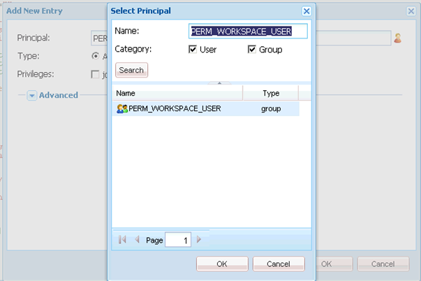

# Generic steps for AEM Forms workspace customization {#generic-steps-for-aem-forms-workspace-customization}

The generic steps to perform any customization are:

1. Log in to CRXDE Lite by accessing `https://'[server]:[port]'/lc/crx/de/index.jsp`.
1. Create a `sling:Folder` folder that is named `ws` at `/apps`, if it does not exist. To create a `sling:Folder` folder, right-click the `apps` folder and select **[!UICONTROL Create]** > **[!UICONTROL Create Node]**. Specify the name as `ws`, select type as `sling:Folder`, and click **[!UICONTROL OK]**. Click **[!UICONTROL Save All]**.
1. Browse to `/apps/ws`, and navigate to the **[!UICONTROL Access Control]** tab.
1. Select the **[!UICONTROL Repository]** option. In the **[!UICONTROL Access Control]** list, click **[!UICONTROL +]** to add an entry. Click **[!UICONTROL +]** again.
1. Search and select the **PERM_WORKSPACE_USER** Principal.

   

1. Give `jcr:read` privilege to the Principal.
1. Click **[!UICONTROL Save All]**.
1. Copy the `GET.jsp`, `index`, and `html.jsp` files from the `/libs/ws` folder to the `/apps/ws` folder.
1. Copy the `/libs/ws/locales` folder in the `/apps/ws` folder. Click **[!UICONTROL Save All]**.
1. Update the references and relative paths in the `GET.jsp` file, as shown below, and click **[!UICONTROL Save all]**.

   ```javascript
   <meta http-equiv="refresh" content="0;URL='/lc/apps/ws/index.html'" />
   ```

1. Do the following for CSS customizations:

    1. Navigate to the `/apps/ws` folder and create a folder named `css`.

    1. In the `css` folder, create a file named `newStyle.css`.

    1. Open `/apps/ws/html`.jsp and change from

   ```javascript
   <link lang="en" rel="stylesheet" type="text/css" href="css/style.css" />
   <link lang="en" rel="stylesheet" type="text/css" href="css/jquery-ui.css"/>
   ```

   to

   ```javascript
   <link lang="en" rel="stylesheet" type="text/css" href="../../libs/ws/css/style.css" />
   <link lang="en" rel="stylesheet" type="text/css" href="css/newStyle.css" />
   <link lang="en" rel="stylesheet" type="text/css" href="../../libs/ws/css/jquery-ui.css"/>
   ```

   >[!NOTE]
   >
   >Place the entry of the user-defined CSS file after the entry of style.css, as shown above.

1. In the /apps/ws/html.jsp file, change from

   ```jsp
   <script data-main="js/main" src="js/libs/require/require.js"></script>
   ```

   to

   ```jsp
   <script data-main="js/main" src="../../libs/ws/js/libs/require/require.js"></script>
   ```

1. Do the following:

    1. Create a folder named `js` at `/apps/ws`. Click **[!UICONTROL Save All]**.

    1. Create a folder named `libs` at `/apps/ws/js`. Click **[!UICONTROL Save All]**.

    1. Copy `/libs/ws/js/libs/jqueryui` folder to `/apps/ws/js/libs`. Click **[!UICONTROL Save All]**.

1. Do the following for HTML customizations:

    1. Under `/apps/ws/js`, create a folder named `runtime`. Click **[!UICONTROL Save All]**.

    1. Under `/apps/ws/js/runtime`, create a folder named `templates`. Click **[!UICONTROL Save All]**.

    1. Copy `/libs/ws/js/main.js` to `/apps/ws/js/main.js`.

    1. Copy /libs/ws/js/registry.js to `/apps/ws/js/registry.js`.

1. Click **[!UICONTROL Save All]**, clear the cache, and refresh the AEM Forms workspace.

   Access the URL `https://'[server]:[port]'/lc/ws` and log in with administrator/password credentials. The browser redirects to `https://'[server]:[port]'/lc/apps/ws/index.html`.
