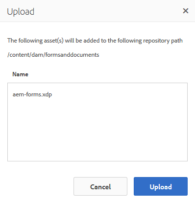
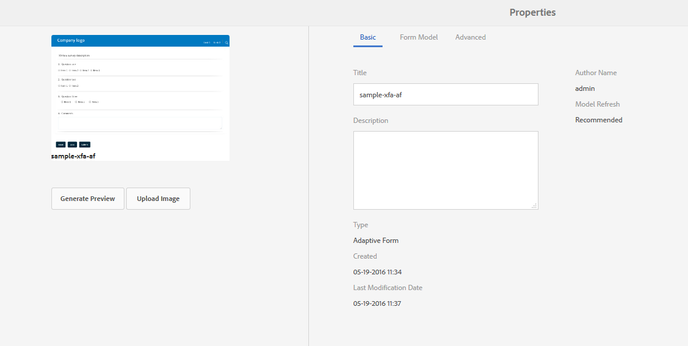

# Getting XDP and PDF documents in AEM Forms{#getting-xdp-and-pdf-documents-in-aem-forms}

## Overview {#overview}

You can import your forms from your local file system to the CRX repository, by uploading in to AEM Forms. The upload operation is supported for the following asset types:

* Form templates (XFA forms)
* PDF forms
* Document (Flat PDF documents)

You can upload the supported asset types individually or as a ZIP archive. You can upload an asset of the type `Resource`, only alongside an XFA form in a ZIP archive.

>[!NOTE]
>
>Ensure that you are a member of the `form-power-users` group to be able to upload XDP files. Contact your administrator to become a member of the group.

## Uploading forms {#uploading-forms}

1. Log in to the AEM Forms user interface by accessing `https://'[server]:[port]'/aem/forms.html`.
1. Navigate to the folder where you want to upload the form or the folder containing forms.
1. In the actions toolbar, select **Create &gt; File Upload**.

   

1. The Upload form(s) or package dialog lets you browse and choose file you want to upload. The file browser displays only the supported file formats (ZIP, XDP, and PDF).

   >[!NOTE]
   >
   >A filename can only contain alphanumeric characters, hyphen, or underscore.

1. Click Upload after file selection to upload the files or click 'Cancel' to cancel the upload. A pop-up lists the assets that are added and the assets that are updated at the current location.

   >[!NOTE]
   >
   >For a ZIP file, the relative paths of all the supported assets are displayed. Unsupported assets inside the ZIP are ignored and not listed. However, if the ZIP archive contains only the unsupported assets, an error message is displayed instead of the pop-up dialog.

   

1. If one or more assets have an invalid filename, an error is displayed. Correct the filenames highlighted in red and reupload.

   

Once the upload is complete, a background workflow generates thumbnails for each asset, based on the asset's preview. Newer versions of assets, if uploaded, override the existing assets.

### Protected Mode {#protected-mode}

AEM Forms server lets you run JavaScript code. A malicious JavaScript code can harm an AEM Forms environment. Protected mode restricts AEM Forms to run XDP files only from trusted assets and locations. All the XDP available in AEM Forms UI are considered trusted assets.

The protected mode is on, by default. If necessary, you can disable the protected mode:

1. Log in to AEM Web Console as an administrator. The URL is https://'[server]:[port]'/system/console/configMgr
1. Open Mobile Forms Configurations for editing.
1. Deselect the Protected Mode option and click **Save**. The protected mode is disabled.

## Updating referenced XFA forms {#updating-referenced-xfa-forms}

In AEM Forms, an XFA form template can be referred by an adaptive form or another XFA form template. Also, a template can refer to a resource or another XFA template.

An adaptive form referring to an XFA have its fields bound with the fields available in the XFA. On updating a form template, the associated adaptive form attempts to synchronize with the XFA. For more details, see [Synchronizing adaptive forms with the associated XFA](../../forms/using/synchronizing-adaptive-forms-xfa.md).

Removing a form template corrupts the dependent adaptive form or form template. Such an adaptive form is sometimes informally referred to as a dirty form. In AEM Forms user interface, you can find the dirty forms in the following two ways.

* A warning icon is displayed on the adaptive form thumbnail in asset listing and the following message is displayed when you hover the pointer over the warning icon.  
  `Schema/Form Template for this adaptive form has been updated so go to Authoring mode and rebase it with new version.`

A flag is maintained to indicate if an adaptive form is dirty. This information is available on the form properties page, alongside the form metadata. Only for dirty adaptive forms, a metadata property `Model Refresh` displays `Recommended` value.

