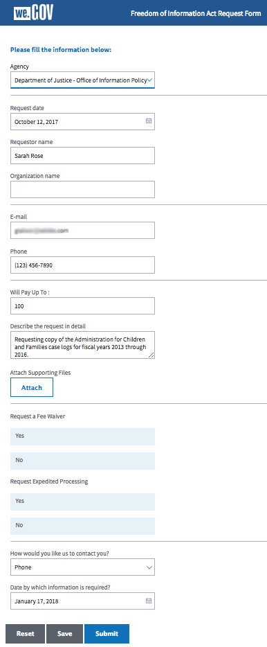
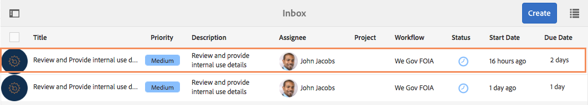
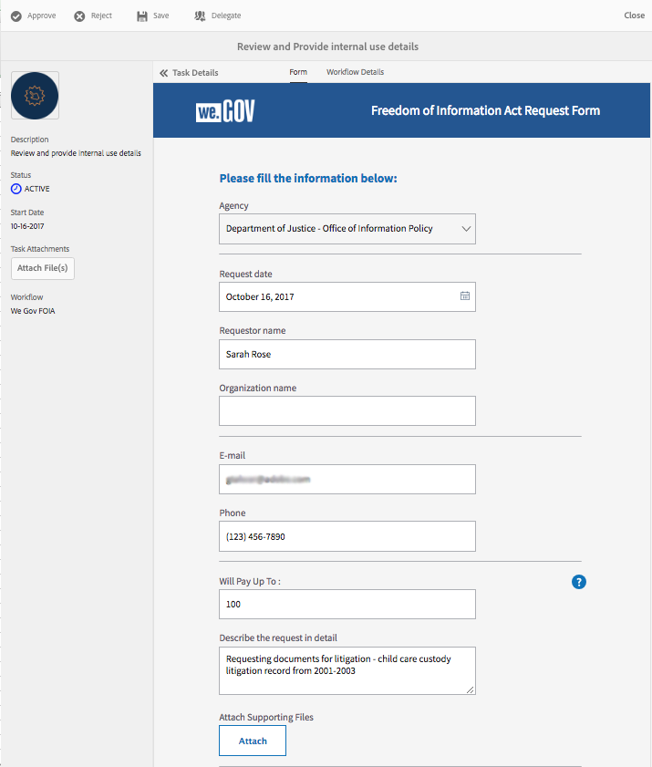
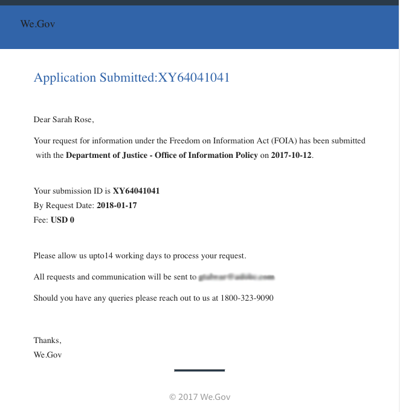
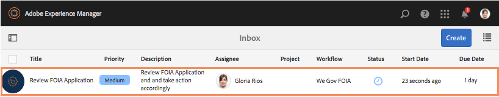
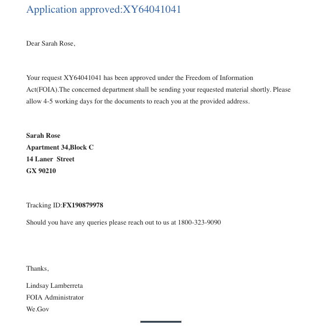

# We.Gov reference site FOIA walkthrough {#we-gov-reference-site-foia-walkthrough}

## Reference site Freedom of Information Act scenario {#reference-site-freedom-of-information-act-scenario}

We.Gov is a state-run organization that lets adoptive parents enroll for child support if they adopted a child. We.Gov also allows parents to request information from the following government departments under the freedom of information act:

* Defense Logistics Agency
* Department of Defense Office of Inspector General
* Department of Justice - Office of Information Policy
* Department of the Navy
* Environmental Protection Agency

For more information on the Freedom Of Information Act, see [https://www.foia.gov/](https://www.foia.gov).

The scenario involves the following personas:

* Sarah Rose, the person requesting information under
* John Jacobs, the person who handles the request the forwards it to the appropriate department
* Gloria Rios, the government employee who furnishes the information as per the request

## Sarah initiates request for information under FOIA {#sarah-initiates-request-for-information-under-foia}

Under the Freedom of Information Act, Sarah requests a copy of the Administration for Children and Families case logs for years (FY) 2013 through 2016. Sarah submits this request to the Department of Justice - Office Of Information Policy and also signifies that she is amenable to pay up to USD 100 for the printing and postage costs.

### How it works {#how-it-works}

### See it yourself {#see-it-yourself}

In your browser, open `https://<hostname>:<PublishPort>/wegov`. In the We.Gov site, select Applications &gt; All Applications. In the All Applications page, select Apply under Application for FOIA Request.

## Sarah starts her application for information under FOIA {#sarah-starts-her-application-for-information-under-foia}

Sarah clicks **Apply** and in the Freedom of Information Act Request Form page, Sarah enters information including the following:

* **Agency:** Sarah specifies the agency to which the request was addressed as Department of Justice - Office of Information Policy.

* **Will Pay Up To**: Sarah specifies that she is prepared to pay up to USD 100 for printing and postage expenses.
* **Describe the request in detail**: Sarah specifies "Requesting copy of the Administration for Children and Families case logs for fiscal years 2013 through 2016."

Requesting copy of the Administration for Children and Families case logs for fiscal years 2013 through 2016

At any time, Sarah can select **Save** to save a draft of the form and come back to it later to fill in the form and submit it. Sarah submits the form.

>[!NOTE]
>
>The resume-from-email workflow works with logged in users only. In the reference site scenario, ensure that the user Sarah Rose is added. Sarah's login credentials are `srose/password`.

## John Jacobs receives and approves the application {#john-jacobs-receives-and-approves-the-application}

John Jacobs receives the request and routes it to the right person. AEM Inbox lets John see all the submitted applications in one place.

### How it works {#how-it-works-1}

When Sarah fills and submits the FOIA application, a record of the application is sent to John Jacobs's inbox. John Jacobs can view the submitted application and accept or reject it.

### See it yourself {#see-it-yourself-1}

You can access the AEM Inbox at https://&lt;***hostname***&gt;:&lt;***PublishPort***&gt;/content/we-finance/global/en/login.html?resource=/aem/inbox.html. Log in to the AEM Inbox, using jjacobs/password as the username/password for John Jacobs, and see the FOIA application. For information about using AEM Inbox for forms-centric workflow tasks, see [Manage Forms applications and tasks in AEM Inbox](/help/forms/using/manage-applications-inbox.md).

John Jacobs can see, approve, or reject the application from the application dashboard. John Jacobs selects and opens the request details and after reviewing the request, approves it.

### <strong>Sarah receives an acknowledgment email</strong> {#strong-sarah-receives-an-acknowledgement-email-strong}

After John Jacobs approves the application, Sarah receives an acknowledgment email from the We.Gov site. Sarah is informed about the fees and time required for processing her application. The email also includes email and phone details Sarah can contact for updates on her application.

## Gloria receives the FOIA request for second-level approval {#gloria-receives-the-foia-request-for-second-level-approval}

After John Jacobs fills in the required information and approves Sarah's request, it goes to Gloria Rios for the final approval. Gloria reviews the attached document of record and approves the request.

### How it works {#how-it-works-2}

When John Jacobs approves the FOIA request, a PDF or Document of Record of the application is created and sent to Gloria Rios' inbox. Gloria can view the submitted request, and approve or reject it.

### See for yourself {#see-for-yourself}

You can access the AEM Inbox at https://&lt;***hostname***&gt;:&lt;***PublishPort***&gt;/content/we-finance/global/en/login.html?resource=/aem/inbox.html. Log in to the AEM Inbox using grios/password as the username/password for Gloria Rios, and see the FOIS request.

Gloria opens the request and examines the details of the FOIA request. After reviewing the details of the request and checking the feasibility of furnishing the required documents, Gloria approves the request.

## Sarah receives notification that her request is approved {#sarah-receives-notification-that-her-request-is-approved}

After Gloria approves the FOIA request, Sarah receives an email notifying her that her request is approved. The email also includes the information about the tentative timeline for furnishing the document and contact details for follow-up on the request.

