# We.Gov reference site walkthrough {#we-gov-reference-site-walkthrough}

## Pre-requisite {#pre-requisite}

Set up your We.Gov reference site as described in the [Set up and configure AEM Forms reference sites](/help/forms/using/setup-reference-sites.md).

## Reference site scenario {#reference-site-scenario}

We.Gov is a state run organization that lets adoptive parents enroll for child support if they adopted a child. The site manages the following:

* Eligibility of the applicant, the adoptive parent
* Personal and professional details of the applicant (if the applicant is eligible for child support)
* Personal details of the adopted child 

  Applicant can provide details for more than one child
* Bank account details of the applicant in which the applicant can receive child support benefits
* Recovery of application fee
* Assessment of the application
* Approval of the application
* Automated communication to the applicant

Once the application is submitted and its fee is paid, the applicant receives an email from the organization with the acknowledgement of submitted application.

The We.Gov organization receives the application. The organization gets the application assessed, and approves the applications that are genuine.

After the application is approved, the applicant receives an email from the We.Gov site. The **View Document **option in the email links to a document with the enrollment details of the applicant.

The infographic below shows the step-by-step workflow of the We.Gov reference site scenario. 

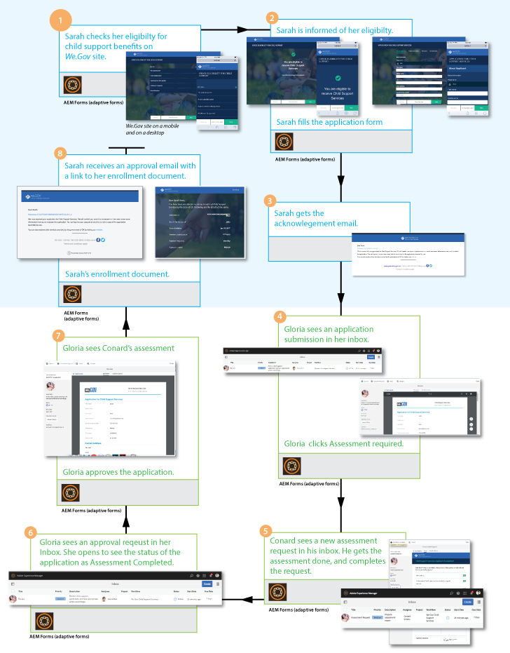

The scenario involves the following personas:

* Sarah Rose, the adoptive parent who requests for child support
* Joe, the adopted child
* Gloria Rios, the head of approval division, We.Gov
* Conard Simms, the field agent who takes care of application assessment

## Sarah initiates her eligibility check {#sarah-initiates-her-eligibility-check}

An applicant can check eligibility to request child support benefits. The site lets users answer questions to let them determine if their application is eligible for benefits. Sarah, an adoptive parent, is a prospective applicant for it. Eligibility form is a part of the Application for Child Support services of the We.Gov site. To check her eligibility, Sarah clicks **[!UICONTROL Child Support]** on the We.Gov website. In the Child Support page, Sarah clicks **[!UICONTROL Check Your Eligibility]**.

In addition to the above approach, Sarah can click **[!UICONTROL Get Started]** on the homepage. Sarah is navigated to the All Applications page, where she can click Apply under **[!UICONTROL Application for Child Support Services]**. Sarah is then taken to the eligibility check.

In the Check Eligibility For Child Support page, Sarah is asked a set of questions to determine her eligibility for child support benefits. Through the set of questions, she is asked:

* If she is the custodial parent of the child
* If she and the child live in the state of GX
* The age group of the child and child's education.

Sarah answers these questions, and her eligibility is validated. Her answers determine if she is eligible for child support.

Sarah is informed that she is eligible for child support, and the application fee is $25.

### How it works {#how-it-works}

Sarah's eligibility is validated through an eligibility barrier created using rule editor. The rule editor lets you specify conditions that are met before an applicant can fill the application form. When Sarah, the applicant, meets all the eligibility conditions, she lands on the application form.

The eligibility check is a part of the child support application adaptive form. The rule validates eligibility when:

* The applicant is a custodial parent
* The applicant and the child stay in the state of GX
* The applicant has the main day-to-day care of the child
* The age of the child getting support services coverage is under 16 years.

### See it yourself {#see-it-yourself}

In your browser, open `https://<hostname>:<PublishPort>/content/we-gov/en.html`. In the We.Gov site, click Child Support. In the Child Support page, click Check Your Eligibility.

To see the rules:

1. Open the form in edit mode on the author instance. URL: `https://<hostname>:<AuthorPort>/editor.html/content/forms/af/we-gov/child-support/css.html`.
1. Select a component and click . 

   The Rule Editor opens listing all the rules applied in the form.  

1. In the left side panel, click rules `passMsg` and `failMsg` to understand how the eligibility check works.

## Sarah starts her application for child support {#sarah-starts-her-application-for-child-support}

Sarah clicks **[!UICONTROL Start Application]** after she is informed of her eligibility for child support.  
In the Application For Child Support Services page, Sarah provides details in the following sections:

* **[!UICONTROL About Applicant]**: Lets Sarah provide her details in this section.  

* **[!UICONTROL Child Information]**: Lets Sarah provide child's information, who is covered under support services.   

* **[!UICONTROL Payment]**: Lets Sarah provide her bank details in which We.Gov can deposit monthly support compensation.  

* **[!UICONTROL Fee Payment]**: Lets Sarah provide her credit card details to pay for the application fee.

By default, Sarah is taken to the **[!UICONTROL About Applicant]** section.

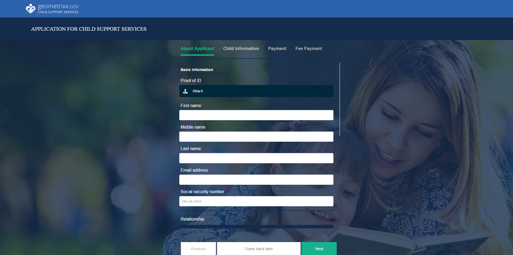

At any time, Sarah can click **[!UICONTROL Come back later]** and resume with her application. When she clicks **[!UICONTROL Come back later]**, her progress is saved as a draft, and she gets an option to email the draft.

When she clicks **[!UICONTROL Send Email]**, she receives an email with a link to the draft of her form.

The child support form on We.Gov site uses adaptive forms. She can use the link in her email, and fill the form on her mobile device.

>[!NOTE]
>
>The resume-from-email workflow works with logged in users only. In the reference site scenario, ensure that the user Sarah Rose is added. Sarah's login credentials are `srose/password`.

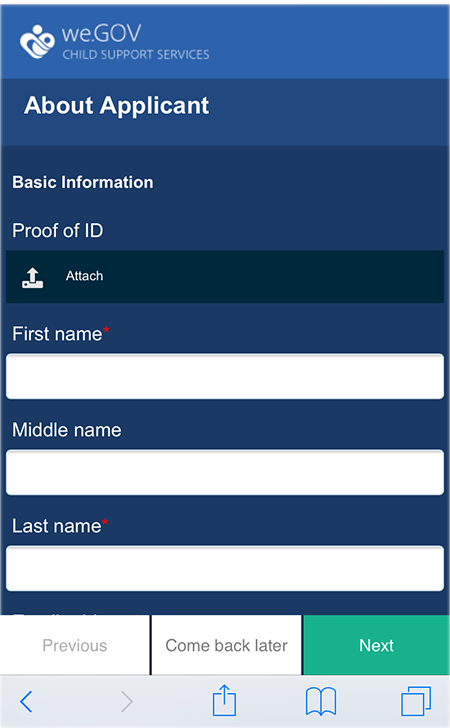

Sarah can provide details in any section, but the application fee is accepted only after she provides required information in all the sections. An application is incomplete without fee payment, and fields marked with an asterisk are required.

### <strong>Sarah provides her information</strong> {#strong-sarah-provides-her-information-strong}

After Sarah clicks **[!UICONTROL Start Application]**, she is taken to the Applicant Information section of the Application For Child Support Services page. Under Applicant Information, Sarah navigates through the tabs and provides her personal information for the application. She clicks **[!UICONTROL Next]** to navigate through the tabs.

Under Applicant Information, she is asked to provide details under the following tabs:

* **[!UICONTROL Basic Information]**

Under Basic Information, Sarah provides her ID proof and her personal information. Sarah’s personal information includes her name, email ID, and social security number.

* **[!UICONTROL Relationship]**  

  Under Relationship, Sarah enters information about her marital status. 
  
* **[!UICONTROL Additional Information]**  

  Under Additional Information, Sarah enters an ID number, her date of birth, and current address and phone number.

### Sarah provides child information {#sarah-provides-child-information}

After Sarah provides her personal information and clicks **[!UICONTROL Next]**, she is taken to the Child Information section.

In the Child Information section, she provides the following details:

* Number of children to claim child support services
* Child’s name, social security number, date of birth, and place of birth

If Sarah chooses more than one child, she gets extra forms enabled with the same details to fill.   
Sarah chooses her single child, Joe, and enters his name.  

### Sarah provides payment information {#sarah-provides-payment-information}

After Sarah provides information of the adopted child (or children) and clicks **[!UICONTROL Next]**, she is taken to the **[!UICONTROL Payment Information]** section.

In the Payment Information section, she provides the bank account details in which she can receive the child support benefits.  
She enters her 10-digit bank account number.

## Sarah pays the application fee and signs the form {#sarah-pays-the-application-fee-and-signs-the-form}

After Sarah agrees to the terms and conditions of the application, she pays the application fee of $25. Application fee is required to process her application.  
Sarah enters her credit card details and clicks **[!UICONTROL Pay Now]**. After paying the fees, a PDF version of the application appears with a signature field. 

Sarah can choose either to type in, use draw to handwrite, insert an image of signature, or use her mobile's touchscreen to draw her signature. Sarah types in her name and clicks Click To Sign.

Her application is submitted to the We.Gov site.

### <strong>Sarah receives an acknowledgement email</strong> {#strong-sarah-receives-an-acknowledgement-email-strong}

After Sarah pays the application fee, she receives an acknowledgement email from the We.Gov site.  
We.Gov processes the application, and Sarah is informed she will receive monthly compensation after her application is approved.

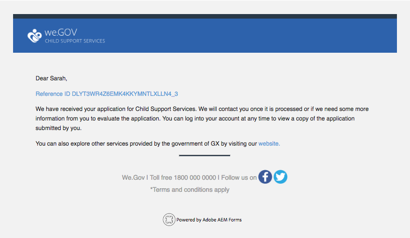 

### How it works {#how-it-works-1}

The child support application uses a combination of panel layouts such as top tab, wizard, and accordion to create the experience. It uses a form template called We.Gov Child Template.

The applicant can move across sections to fill different components of the form. When the applicant fills the form, submits it, agrees to the terms and conditions, and pays the fee, a custom workflow is initiated. The custom workflow sends an automated email to the applicant acknowledging application submission. The application is forwarded to the organization's concerned department for verification and approval.

The layout of the form is specified in the Gov Child Support Service Theme. Styling includes component style, page background, error state formatting of components, and font styles.

The eligibility check uses rules specified in the form. It uses validity checks specified below:

`SHOW passMsgWHEN (Does the child live in the state of GX? is equal to Yes) AND (Do you live in the state of GX? is equal to Yes) AND ( (Who has the main day-to-day care of the child? is equal to You) AND (Are you: is equal to The custodial parent) ) AND (Is the child you are applying for: is equal to Under 16 years) ELSE Hide`

`HIDE failMsg WHEN (Does the child lives in the state of GX? is equal to Yes) AND ( (Do you live in the state of GX? is equal to Yes) AND (Who has the main day-to-day care of the child? is equal to You) ) AND (Is the child you are applying for: is equal to Under 16 years) AND (Are you: is equal to The custodial parent) ELSE Show`

### See it yourself {#see-it-yourself-1}

In your browser, open `https://<hostname>:<PublishPort>/content/forms/af/we-gov/child-support/css.html` and fill the required information. When you submit the application after you fill the required information, pay the fees, and sign the document, you receive the acknowledgement email.

See the We.Gov Child Template here: `https://<hostname>:<AuthorPort>/editor.html/conf/we-gov/settings/wcm/templates/we-gov-child-template/structure.html`

See the theme here: `https://<hostname>:<AuthorPort>/editor.html/content/dam/formsanddocuments-themes/we-gov/we-gov-theme-A/jcr:content`

To see all the rules, perform the following steps:

1. Open the form in the authoring mode. 

   URL: `https://<hostname>:<AuthorPort>/editor.html/content/forms/af/we-gov/child-support/css.html`

1. Select a component, and tap . All the rules are listed in the rule editor, including the rules listed above.

## Gloria receives the application {#gloria-receives-the-application}

Gloria, head of approvals at We.Gov, can view, approve, or reject submitted applications. AEM Inbox lets her see all the submitted applications in one place.

### How it works {#how-it-works-2}

When Sarah fills and submits the child support application, a PDF or Document of Record of the application is created and sent to Gloria Rios' inbox. Gloria can view the submitted application, and accept or reject it.

### See it yourself {#see-it-yourself-2}

Open page `https://<***hostname***>:<*PublishPort***>/content/we-gov/en.html.`On the page, tap **[!UICONTROL Sign In]**, select the **[!UICONTROL Login as representative]** checkbox, log in to the AEM inbox using grios/password as the username/password for Gloria Rios. The child support application appears. For information about using AEM Inbox for forms-centric workflow tasks, see [Manage Forms applications and tasks in AEM Inbox](/help/forms/using/manage-applications-inbox.md).

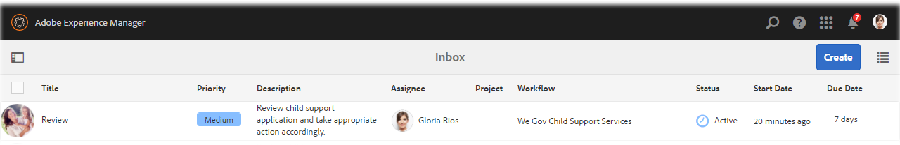

Gloria can see, approve, or reject the application from the application dashboard.

### How it works {#how-it-works-3}

Gloria, head of approvals at We.Gov, opens her AEM inbox. She sees a review task in her list of tasks. She opens and views the review task.

She sees a PDF of the form filled with details Sarah entered along with the documents Sarah uploaded.  
Gloria can approve or reject the application. However, Gloria clicks **[!UICONTROL Assessment Required]** to get the application assessed. 

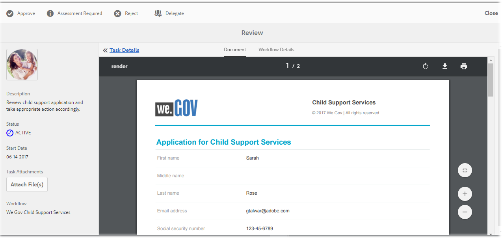

Sarah's application is a startpoint in the AEM workflow. It initiates the AEM workflow when the child support application form is submitted. The AEM workflow creates a task for Gloria, which shows up in her AEM inbox. When Gloria requests for on-site assessment, a new task is created for the field agent.

### See it yourself {#see-it-yourself-3}

If the configuration is complete, the AEM workflow starts immediately after the form is submitted. Log in to the inbox using Gloria's credentials.

Access inbox at https://&lt;***hostname***&gt;:&lt;***PublishPort***&gt;/content/we-gov/en.html. On the page, tap **[!UICONTROL Sign In]**, select the **[!UICONTROL Login as representative]** checkbox use Gloria's default credentials:

* Username: grios
* Password: password

In her AEM inbox, Sarah's application is added as a review task. Select the task, and click **Assessment Required** to proceed to the next step.  

### Conard gets the Assessment task {#conard-assessment-task}

When Gloria clicks **[!UICONTROL Assessment Required]**, Conard gets the review task in his AEM Inbox. The task is the next step in the AEM workflow defined in the workflow model. He sees the review task and opens it.

Conard gets the applicant assessment task as shown below.

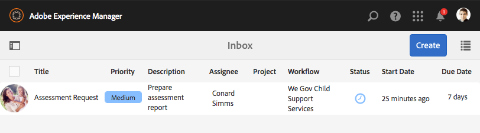

The child support assessment is a form associated with the task. He gets Sarah's details, along with the supporting documents (attached in task details). Conard fills the assessment form in the field on a device and submits for reevaluation.

Conard verifies all the details Sarah provided, and Sarah signs the assessment. AEM Forms can take the location and timestamp, and add them to the signature.

Conard clicks **[!UICONTROL Submit For Reevaluation]**, and the AEM workflow submits the assessment to the We.Gov organization.

### How it works {#how-it-works-4}

When Gloria requests for assessment, the next step in AEM workflow is initiated, and the assessment task is added in Conard's inbox. Conard is the field-worker persona.

Conard visits Sarah's place, verifies that the information Sarah provided is genuine, and fills the assessment form. Conard can access a PDF of the complete form that Sarah filled.

### See it yourself {#see-it-yourself-4}

Open the AEM inbox on your tablet, and use Conard's credentials to log in.

Conard's default credentials are:

* Username: csimms
* Password: password

You can see a new Assessment Request task added in the inbox. Submit the completed assessment and proceed to the next step.  

### Gloria reviews the assessment and approves the application {#gloria-reviews-the-assessment-and-approves-the-application}

After Conard submits the assessment, Gloria sees a Review task in her inbox. She selects and opens **[!UICONTROL Review]**.

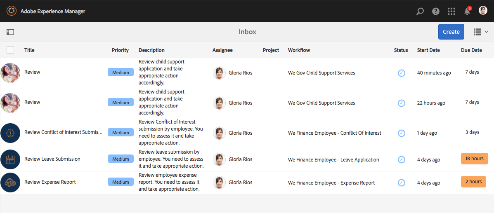

Under Task Details, Gloria sees Last Action Taken as "Submit for Re-evaluation" (by Conard). Gloria sees that Conard Simms assessed the application.

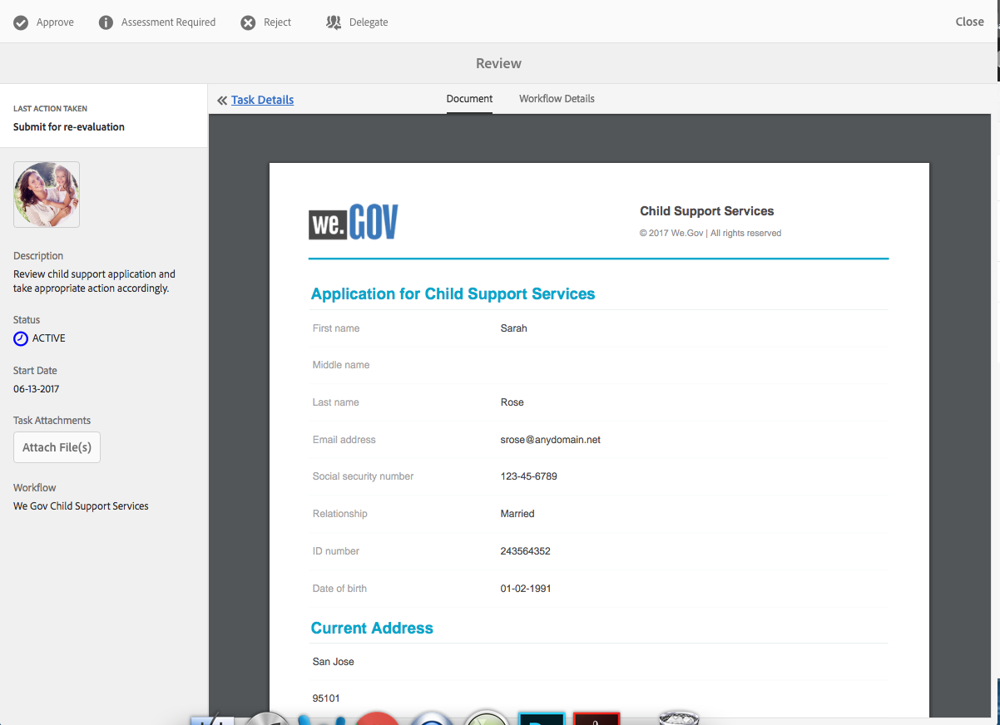 

### How it works {#how-it-works-5}

After Conard submits the assessment, Gloria sees a Review task in her inbox. She selects and opens Review. Under Task Details, Gloria sees the assessment comment made by Conard, which is "Everything found in order."

Gloria approves the application.

### See it yourself {#see-it-yourself-5}

Open the inbox and log in using Gloria's credentials. A new task called Review appears in the inbox.

Open the task to see the status of the Last Action Taken. Based on the assessment, approve the application.

## Sarah receives an approval email {#sarah-receives-an-approval-email}

After Gloria approves the application, Sarah receives an email from We.Gov that her application is approved.

The **[!UICONTROL View Document]** button in the email links to her enrollment details. Sarah clicks **[!UICONTROL View Document.]**

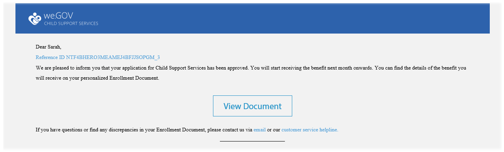

The enrollment document lists details such as the reference ID, child covered, date of initiation, bank account number, payment frequency, and payment amount.

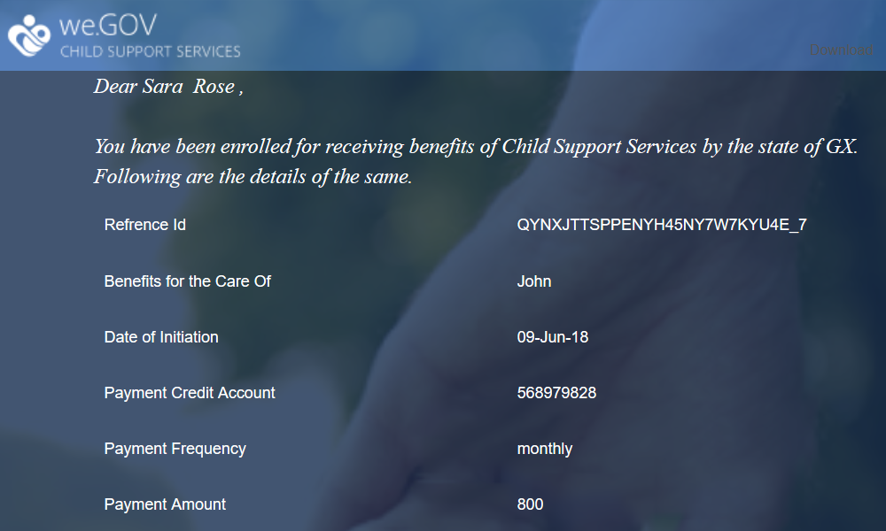

Sarah can view the documents she uploaded in the same page. 

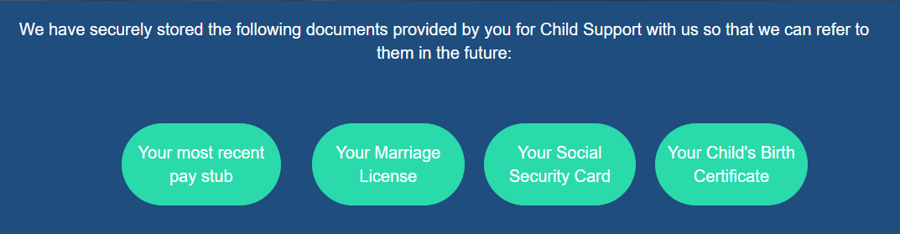 

### How it works {#how-it-works-6}

When Gloria approves the application, Sarah receives an automated email with a link to the enrollment document.

The enrollment document is an interactive communication, and can be viewed on any device. It contains details of the child support service, and information Sarah provided.

### See it yourself {#see-it-yourself-6}

Check the email client you configured for the automated email with a link to the enrollment document.

Alternatively, to see the document in your browser, open: `https://<hostname>:<PublishPort>/content/aemforms-refsite/doclink.html?document=/content/forms/af/we-gov/child-support/enrollment-document&referenceId=[reference-id]&channel=web`

## We.Gov analyzes the performance of the application {#we-gov-analyzes-the-performance-of-the-application}

We.Gov, from time to time, reviews the performance of their child support services application to check for any issues that customers might be facing. They use this analysis to take informed decisions about the changes required in the child support services application to enhance the user experience, reduce abandonment rate of forms, and thereby improve conversion. They leverage the integration of AEM Forms with Adobe Analytics for their analysis. The following image depicts their analytics dashboard.

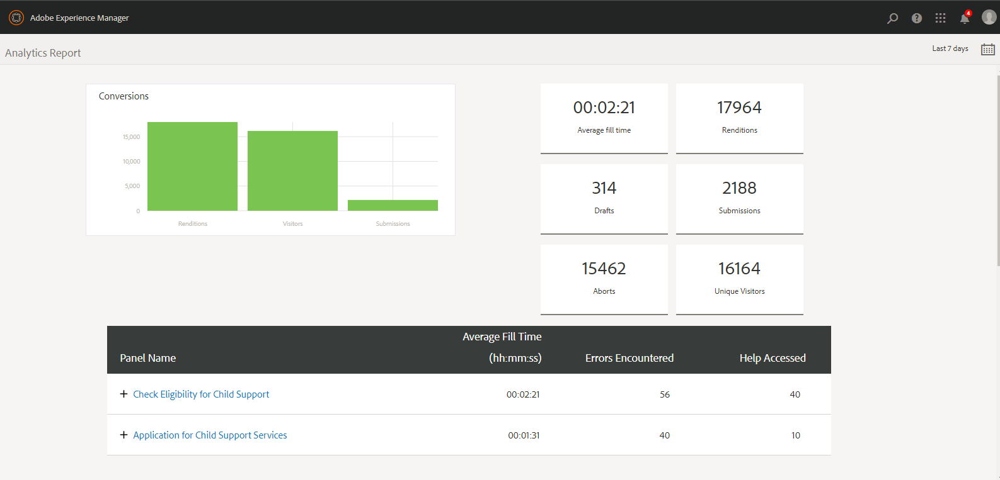 

### How it works {#how-it-works-7}

The performance metrics for the child support services application form are tracked using Adobe Analytics. For more information about configuring Adobe Analytics and viewing reports, see [Configuring analytics for forms and documents](/help/forms/using/configure-analytics-forms-documents.md).

### See it yourself {#see-it-yourself-7}

For you to view and explore the analytics report, we are providing seed data for the child support services application in the reference site. Before you use seed data, see [Configure Analytics](/help/forms/using/setup-reference-sites.md#configureanalytics). Perform the following steps in author instance to view the report with the seed data:

1. Go to **[!UICONTROL Forms & Documents]** UI at https://&lt;*hostname*&gt;:&lt;*AuthorPort*&gt;/aem/forms.html/content/dam/formsanddocuments.

1. Click to open the **We.Gov** Folder.
1. Select **[!UICONTROL Application for Child Support Services]** adaptive form and then click **[!UICONTROL Enable Analytics]** in the toolbar.

1. Select the form again and click **[!UICONTROL Analytics Report]** in the toolbar to generate the report. You see a blank report initially.

To generate analytics report with seed data:

1. In the address browser of CRXDE lite, type: **/apps/we-gov/demo-artifacts/analyticsTestData/Child support service Analytics Test Data**
1. The seed data is selected in the left side directory structure. 
1. Double click the selected file to open its content in the right side panel. 
1. Copy all the content in the test data file. 
1. In CRXDE, navigate to: **/content/dam/formsanddocuments/we-gov/child-support/css/jcr:content/analyticsdatanode/lastsevendays**
1. In the analyticsdata field under Properties, paste the copied content of the test data file.
1. Now generate analytics report again for **[!UICONTROL Application for Child Support Services]**. You can see the seed data in the generated report.

