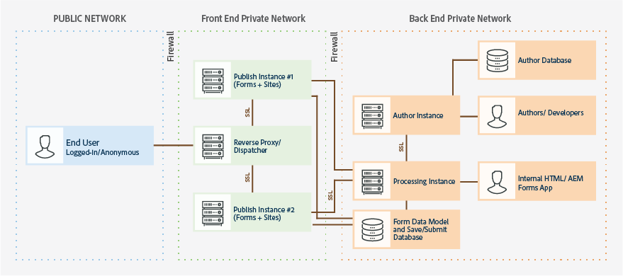

# Hardening and Securing AEM forms on OSGi environment {#hardening-and-securing-aem-forms-on-osgi-environment}

Learn recommendations and best practices for securing AEM Forms on OSGi server.

Securing a server environment is of paramount importance for an organization. This article describes recommendations and best practices for securing servers that run AEM Forms. This is not a comprehensive host-hardening document for your operating system. Instead, this article describes various security-hardening settings that you should implement to enhance the security of your deployed application. To ensure that the application servers stay secure, however, you should also implement security monitoring, detection, and response procedures in addition to recommendations provided in this article. The document also contains best practices and guidelines for securing PII (Personally Identifiable Information).

The article is intended for consultants, security specialists, systems architects, and IT professionals who are responsible for planning application or infrastructure development and deployment of AEM Forms. These roles include the following common roles:

* IT and operations’ engineers who must deploy secure web applications and servers in their own or customer organizations.  
* Architects and planners who are responsible for planning the architectural efforts for the clients in their organizations.  
* IT security specialists who focus on providing security across the platforms within their organizations.
* Consultants from Adobe and partners who require detailed resources for customers and partners.

The following image displays components and protocols that are used in a typical AEM Forms deployment, including the appropriate firewall topology:

AEM Forms is highly customizable and can work in many different environments. Some of the recommendations might not be applicable to your organization.

## Secure transport layer {#secure-transport-layer}

Transport layer security vulnerabilities are among the first threats to any Internet-facing or intranet-facing application server. This section describes the process of hardening hosts on the network against these vulnerabilities. It addresses network segmentation, Transmission Control Protocol/Internet Protocol (TCP/IP) stack hardening, and the use of firewalls for host protection.

### Limit open endpoints  {#limit-open-endpoints}

An organization can have an external firewall to restrict access between an end-user and AEM Forms publish Farm. The organization can also have an internal firewall to limit access between a publish farm and other within organization elements (For example, author instance, processing instance, databases). Allow firewalls to enable access to a limited number of AEM Forms URLs for end-users and within organizations elements:

#### Configure external firewall  {#configure-external-firewall}

You can configure an external firewall to allow a certain AEM Forms URLs to access to the internet. Access to these URLs is required to fill or submit an adaptive form, HTML5, correspondence management letter or to login to an AEM Forms server: 

<table> 
 <tbody>
  <tr>
   <td>Component</td> 
   <td>URI</td> 
  </tr>
  <tr>
   <td>Adaptive forms</td> 
   <td>
    <ul> 
     <li>/content/dam/formsanddocuments/AF_PATH/jcr:content</li> 
     <li>/etc/clientlibs/fd/</li> 
     <li>/content/forms/af/AF_PATH</li> 
     <li>/libs/granite/csrf/</li> 
    </ul> </td> 
  </tr>
  <tr>
   <td>HTML5 forms</td> 
   <td>
    <ul> 
     <li>/content/forms/formsets/profiles/</li> 
    </ul> </td> 
  </tr>
  <tr>
   <td>Correspondence management </td> 
   <td>
    <ul> 
     <li>/aem/forms/createcorrespondence* </li> 
    </ul> </td> 
  </tr>
  <tr>
   <td>Forms Portal </td> 
   <td>
    <ul> 
     <li>/content/forms/portal/</li> 
     <li>/libs/cq/ui/widgets*</li> 
     <li>/libs/cq/security/</li> 
    </ul> </td> 
  </tr>
  <tr>
   <td> AEM Forms App</td> 
   <td>
    <ul> 
     <li>/j_security_check*</li> 
     <li>/soap/services/AuthenticationManagerService</li> 
    </ul> </td> 
  </tr>
 </tbody>
</table>

#### Configure internal firewall  {#configure-internal-firewall}

You can configure the internal firewall to allow certain AEM Forms components (For example, author instance, processing instance, databases) to communicate with publish farm and other internal components mentioned in the topology diagram:

<table> 
 <tbody>
  <tr>
   <td>Host  </td> 
   <td>URI</td> 
  </tr>
  <tr>
   <td>Publish Farm (publish nodes)</td> 
   <td>/bin/receive</td> 
  </tr>
  <tr>
   <td>Processing Server</td> 
   <td>/content/forms/fp/*</td> 
  </tr>
  <tr>
   <td>Forms Workflow add-on server (AEM Forms on JEE server)</td> 
   <td>/soap/sdk</td> 
  </tr>
 </tbody>
</table>

#### Setup repository permissions and access control lists (ACLs) {#setup-repository-permissions-and-access-control-lists-acls}

By default, assets available on the publish nodes are accessible to everyone. Read-only access is enabled for all the assets. It is required to enable anonymous access. If you plan to restrict form view and submit access only to authenticated users, then use a common group to allow only authenticated users to have read-only access to the assets available on the publish nodes. The following locations/directories contain forms assets which require hardening (read only access for authenticated users):

* /content/&ast;
* /etc.clientlibs/fd/&ast;
* /libs/fd/&ast;

## Securely handle forms data  {#securely-handle-forms-data}

AEM Forms stores data to predefined locations and temporary folders. You should secure the data to prevent an unauthorized use.

### Setup periodic cleanup of temporary folder {#setup-periodic-cleanup-of-temporary-folder}

When you configure forms for file attachments, verify, or preview components, corresponding data is stored on the publish nodes at /tmp/fd/. The data is purged periodically. You can modify the default data purge job to be more aggressive. To modify the job scheduled to purge data, open AEM Web Console, open AEM Forms Temporary Storage Cleaning Task, and modify the Cron expression.

In the above-mentioned scenarios, the data is saved only for authenticated users. Moreover, the data is protected with access control lists (ACLs). So, modifying the data purge is an additional step to securing information.

### Secure data saved by forms portal submit action {#secure-data-saved-by-forms-portal-submit-action}

By default, forms portal submit action of adaptive forms saves data in the local repository of the publish node. The data is saved at /content/forms/fp. **It is not recommended to store data on publish instance.**

You can configure the storage service to send over-the-wire to the processing cluster without saving anything locally on the publish node. The processing cluster resides in a secure zone behind the private firewall and data remains safe.

Use the credentials of processing server for AEM DS settings service to post data from the publish node to the processing server. Use the credentials of a restricted non-administrative user with read-write access to repository of processing server. For more information, see [Configuring storage services for drafts and submissions](/help/forms/using/configuring-draft-submission-storage.md).

### Secure data handled by form data model (FDM) {#secure-data-handled-by-form-data-model-fdm}

Use user accounts with minimum required privileges to configure data sources for form data model (FDM). Using administrative account can provide open access of metadata and schema entities to unauthorized users.  
Data integration also provides methods to authorize FDM service requests. You can insert pre and post execution authorization mechanisms to validate a request. The service requests are generated while prefilling a form, submitting a form, and invoking services through a rule.

**Pre-process authorization:** You can use the pre-process authorization to validate authenticity of a request before executing it. You can use inputs, service and request details to allow or stop execution of the request. You can return a data integration exception OPERATION_ACCESS_DENIED if the execution is stopped. You can also modify client request before sending it for execution. For example, changing input and adding additional information.

**Post-process authorization:** You can use the post-process authorization to validate and control the results before returning the results to requester. You can also filter, prune, and insert additional data to results.

### Limit user access {#limit-user-access}

A different set of user personas are required for author, publish, and processing instances. Do not run any instance with administrator credentials.

**On a publish instance:**

* Only users of forms-users group can preview, create draft, and submit forms.
* Only users of cm-user-agent group can preview correspondence management letters.
* Disable all non-essential anonymous access.

**On an author instance:**

* There are a different set of pre-defined groups with specific privileges for every persona. Assign users to group.

    * A user of forms-user group:

        * can create, fill, publish, and submit a form.
        * cannot create an XDP-based adaptive form.
        * do not have permissions to write scripts for adaptive forms.
        * cannot import XDP or any package containing XDP

    * A user of forms-power-user group create, fill, publish, and submit all types of forms, write scripts for adaptive forms, import packages containing XDP.
    * A user of template-authors and template-power-user can preview and create a template.
    * A user of fdm-authors can create and modify a form data model.
    * A user of cm-user-agent group can create, preview, and publish correspondence management letters.
    * A user of workflow-editors group can create an inbox application and workflow model.

**On processing author:**

* For remote save and submit use cases, create a user with read, create, and modify permissions on the content/form/fp path of the crx-repository.
* Add user to workflow-user group to enable a user to use AEM inbox applications.

## Secure intranet elements of an AEM Forms environment {#secure-intranet-elements-of-an-aem-forms-environment}

In general, Processing clusters and Forms Workflow add-on (AEM Forms on JEE) run behind a firewall. So, these are considered secure. You can still perform a few steps to harden these environments:

### Secure processing cluster {#secure-processing-cluster}

A processing cluster runs in the author mode but do not use it for development activities. Do not allow a normal user to be included in content-authors and form-users groups of a processing cluster.

### USE AEM best practices to secure an AEM Forms environment {#use-aem-best-practices-to-secure-an-aem-forms-environment}

This document provide instructions specific to AEM Forms environment. You should take to ensure that your underlying AEM installation is secure when deployed. For detailed instructions, see [AEM Security Checklist](/help/sites-administering/security-checklist.md) documentation.
