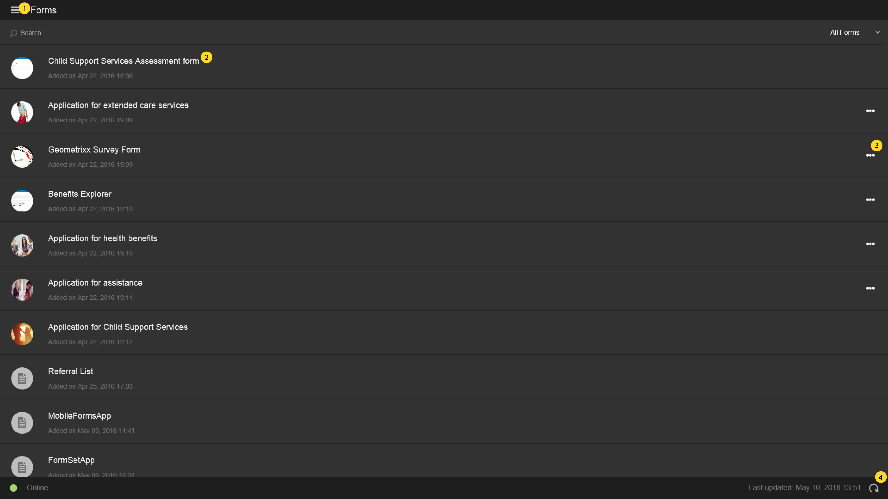
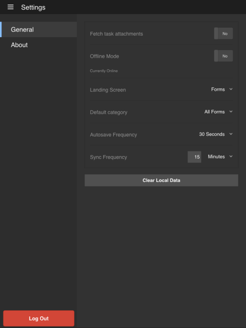

# Home screen{#home-screen}

When you log in to the AEM Forms app, you are redirected to the Home screen.

## Default Home screen {#default-home-screen}

By default, the Home screen displays all forms including startpoints and tasks (if the connected server is AEM Forms Workflow enabled), along with the associated thumbnails. You can specify the thumbnails in the AEM Forms Server.

The following figure is annotated with call-outs to the essential components on the default Home screen.

<!--Click to enlarge

-->

1. **Menu button**: Select the **Menu** button to navigate to Tasks, Forms, Outbox, and Settings. If your AEM Forms app is connected to an AEM Forms JEE server, you can see the Tasks option. The Tasks option also stores the drafts created from tasks in a process. For AEM Forms OSGi servers, the Tasks option is hidden. Outbox stores the saved forms and drafts before it syncs with the server. All saved forms and drafts in the Outbox are uploaded to the AEM Forms Server when the app is [synchronized with the server](../../forms/using/sync-app.md). For information on Settings, see [Update General Settings](../../forms/using/update-general-settings.md).
1. **Task or Form**: Select the listed task or form that you want to work with.
1. **Horizontal Ellipsis**: Denotes that actions are available for the form. Tapping the ellipsis displays the actions and description that the author has provided. The **Delete Draft** and **Complete** option is visible when you select the ellipsis.
1. **Refresh icon**: Select the refresh icon so you can synchronize your app with the AEM Forms Server.

### Customizing the Home screen {#customizing-the-home-screen}

You can change the default Home screen of the app either from the **[General Settings](../../forms/using/update-general-settings.md)** of the app, or from the **Preference** tab on HTML Workspace.

The change made to the Home screen setting on the app affects the Home screen for the currently logged in user or the user on the current mobile device.

However, the change made in HTML Workspace effects all AEM Forms app users logged in to the AEM Forms Server.
