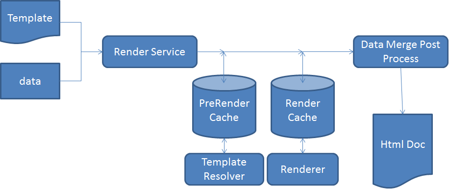

# Architecture of HTML5 forms{#architecture-of-html-forms}

## Architecture {#architecture}

HTML5 forms functionality is deployed as a package within the embedded AEM instance and is exposesd as a REST end point over HTTP/S using RESTful [Apache Sling Architecture](https://sling.apache.org/).

### Using Sling Framework {#using-sling-framework}

[Apache Sling](https://sling.apache.org/) is resource-centric. It uses a request URL to first resolve the resource. Each resource has a **sling:resourceType** (or **sling:resourceSuperType**) property. Based on this property, the request method, and properties of the request URL, a sling script is then selected to handle the request. This sling script can be a JSP or a servlet. For HTML5 forms, **Profile** nodes act as sling resources and **Profile Renderer** acts as the sling script that handles the request to render the mobile form with a particular profile. A **Profile Renderer** is a JSP that reads parameters from a request and calls the Forms OSGi Service.

For details on REST endpoint and supported request parameters, see [Rendering Form Template](/help/forms/using/rendering-form-template.md).

When a user makes a request from a client device such as an iOS or Android&trade; browser, Sling first resolves the Profile Node based on the request URL. From this Profile Node, it reads **sling:resourceSuperType** and **sling:resourceType** to determine all available scripts that can handle this Form Render request. It then uses Sling request selectors along with request method to identify the script best suited for handling this request. Once the request reaches a Profile Renderer JSP, the JSP calls the Forms OSGi service.

For more details on sling script resolution, see [AEM Sling Cheat Sheet](https://experienceleague.adobe.com/docs/experience-manager-release-information/aem-release-updates/previous-updates/aem-previous-versions.html?lang=en) or [Apache Sling Url decomposition](https://sling.apache.org/documentation/the-sling-engine/url-decomposition.html).

#### Typical form processing call flow {#typical-form-processing-call-flow}

HTML5 forms cache all the intermediate objects required to process (rendition or submission) a form on the first request. It does not cache the objects dependent on the data as such objects are likely to change.

Mobile Form maintains two different levels of cache, PreRender cache and Render Cache. The preRender cache contains all the fragments and images of a resolved template and Render cache contains rendered content such as HTML.

HTML5 forms workflow

HTML5 forms do not cache templates that have missing references of fragments and images. If HTML5 forms take more than normal amount of time, then check the server logs for missing references and warnings. Also ensure that the maximum size of the object is not reached.

Forms OSGi service processes a request in two steps:

* **Layout and Initial Form State generation**: Forms OSGi render service calls the Forms Cache component to determine if the form has already been cached and has not been invalidated. If the form is cached and valid, it serves the generated HTML from the cache. If the form is invalidated, the Forms OSGi render service generates Initial Form Layout and Form State in XML format. This XML is transformed into HTML layout and Initial JSON Form State by the Forms OSGi service and then cached for subsequent requests.
* **Prepopulated Forms**: While rendering, If a user requests forms with prepopulated data, the Forms OSGi render service calls the Forms service container and generates a new Form state with merged data. However, since the layout is already generated in the above step, this call is faster than the first call. This call only performs the data merge and runs the scripts on the data.

If there is any update in form or any of assets used inside form, the form cache component detects it and the cache for that particular form is invalidated. Once the Forms OSGi service completes processing, the Profile Renderer jsp adds JavaScript library references and styling to this form and returns the response to client. A typical web server like [Apache](https://httpd.apache.org/) can be used here with HTML compression on. A web server would reduce the response size, network traffic, and time required to stream the data between server and client machine significantly.

When a user submits the form, the browser sends state of form in JSON format to the [submit service proxy](../../forms/using/service-proxy.md); then the submit service proxy generates a data XML using JSON data and submits that data XML to submit endpoint.

## Components {#components}

You require AEM Forms add-on package to enable HTML5 forms. For information about installing AEM Forms add-on package, see [Installing and configuring AEM Forms](../../forms/using/installing-configuring-aem-forms-osgi.md).

### OSGi Components (adobe-lc-forms-core.jar) {#osgi-components-adobe-lc-forms-core-jar}

**Adobe XFA Forms Renderer (com.adobe.livecycle.adobe-lc-forms-core)** is the display name of the HTML5 forms OSGi bundle when viewed from Bundle View of Felix admin console (https://[host]:[port]/system/console/bundles).

This component contains OSGi components for render, cache management, and configuration settings.

#### Forms OSGi Service {#forms-osgi-service}

This OSGi Service contains the logic to render an XDP as HTML and handles the submission of a form to generate data XML. This service uses Forms service container. The Forms service container internally calls native component `XMLFormService.exe` that performs the processing.

If a render request is received, this component calls Forms service container to generate layout and state information that is further processed to generate HTML and JSON form DOM states.

This component is also responsible for generating data XML from submitted form state JSON.

#### Cache Component {#cache-component}

HTML5 forms uses caching to optimize throughput and response time. You can configure the level of the cache service to fine-tune the trade-off between performance and space utilization.

<table>
 <tbody>
  <tr>
   <th>Cache Strategy</th>
   <th>Description</th>
  </tr>
  <tr>
   <td>None</td>
   <td>Do not cache artifacts  </td>
  </tr>
  <tr>
   <td>Conservative</td>
   <td>Cache only intermediate artifacts that are generated before the render of the form like template containing inline fragments and images</td>
  </tr>
  <tr>
   <td>Aggressive</td>
   <td>Cache Rendered HTML content  Cache all the artifacts cached in the Conservative level.  <strong>Note</strong>: This strategy results in best performance but consumes more memory for storing the cached artifacts.</td>
  </tr>
 </tbody>
</table>

HTML5 forms perform in-memory caching using LRU strategy. If cache strategy is set to None cache will not be created and existing cache data, if any, would be cleared. Besides the caching strategy, you can also configure the total in-memory cache size which can help in having the maximum bound on cache size and if it goes beyond that it will use LRU mode to free up cache resources.

>[!NOTE]
>
>In-memory cache is not shared between cluster nodes.

#### Configuration Service {#configuration-service}

Configuration Service enables tuning the configuration parameters and cache settings for HTML5 forms.

To update these settings, go to the CQ Felix Admin Console (available at https://&lt;'[server]:[port]'/system/console/configMgr), search for and select Mobile Forms Configuration.

You can configure the cache size or disable the cache using configuration service. You can also enable debugging using Debug Options parameter. More information about debugging forms can be found at [Debugging HTML5 forms](/help/forms/using/debug.md).

### Runtime Components (adobe-lc-forms-runtime-pkg.zip) {#runtime-components-adobe-lc-forms-runtime-pkg-zip}

The Runtime Package contains the client-side libraries used to render HTML forms.

**Important components available as part of Runtime package:**

#### Scripting Engine {#scripting-engine}

Adobe XFA implementation supports two kinds of scripting languages to enable user-defined logic execution in forms: JavaScript and FormCalc.

The scripting engine of HTML Forms is written in JavaScript to support the XFA scripting API in both these languages.

At render time, the FormCalc script is translated (and cached) into JavaScript on the server transparent to the user or designer.

This scripting engine uses some of the feature of ECMAScript5 like Object.defineProperty. The engine / library is delivered as CQ Client Lib with the category name **xfaforms.profile**. It also provides **FormBridge API** to enable external portals or apps to interact with form. Using FormBridge, an external app can programmatically hide certain elements, get or set their values, or change their attributes.

For more details, see the [Form Bridge](/help/forms/using/form-bridge-apis.md) article.

#### Layout Engine {#layout-engine}

The layout and visual aspect of the HTML5 forms is based on SVG 1.1, jQuery, BackBone, and CSS3 features. The initial appearance of a form is generated and cached at server. The tweaking of that initial layout and any further incremental changes to the form layout are managed on the client. To achieve this, the Runtime package contains a layout engine written in JavaScript and based on jQuery/Backbone. This engine handles all dynamic behavior, like Add/Remove repeatable instances, Growable object layout. This layout engine renders a form one page at a time. Initially a user views only one page and the horizontal scroll bar accounts for only first page. However, when a user scrolls down, the next page starts rendering. This page-by-page rendition reduces the amount of time required to render the first page in a browser and enhances the perceived performance of the form. This engine/library is part of CQ Client Lib with the category name **xfaforms.profile**.

Layout Engine also contains a set of widgets used to capture the value of form fields from a user. These widgets are modeled as [jQuery UI Widgets](https://api.jqueryui.com/jQuery.widget/) that implement certain additional contract to work seamlessly with Layout engine.

For more details on widgets and the corresponding contracts, see [Custom Widgets for HTML5 forms](/help/forms/using/introduction-widgets.md).

#### Styling {#styling}

The style associated with the HTML elements is added either inline or based on embedded CSS block. Some common styles which are not dependent on form are part of CQ Client Lib with category name xfaforms.profile.

In addition to default styling properties, each form element also contains certain CSS classes based on element type, name, and other properties. Using these classes, one can restyle elements by specifying their own CSS.

For more details on default styling and classes, see [Introduction to styles](/help/forms/using/css-styles.md).

#### Server-Side script and Web Services {#server-side-script-and-web-services}

Any scripts that are marked to run-at-server or marked to call a Web Service (regardless of where it is marked to execute) always executes on server.

The client script engine:

1. Makes a synchronous call to the server passing the current Form state in the form of JSON
1. Executes the script or Web Service on the server
1. Generates a new JSON state
1. Merges the new JSON state on the client when the response is returned.

#### Localization Resource Bundles {#localization-resource-bundles}

HTML5 forms support Italian (it), Spanish (es), Brazilian Portuguese (pt_BR), Simplified Chinese (zh_CN), Traditional Chinese (limited support only) (zh_TW), Korean (ko_KR), English (en_US), French (fr_FR), German (de_DE), and Japanese (ja) language. Based on the locale received in the request header, corresponding Resource Bundle is sent to the client. This resource bundle is added to Profile JSP as a CQ Client Lib with category name **xfaforms.I18N**. You can override the logic of picking up the locale package in the profile.

### Sling Components (adobe-lc-forms-content-pkg.zip) {#sling-components-adobe-lc-forms-content-pkg-zip}

Sling package contains content related to Profiles and Profile Renderer.

#### Profiles {#profiles}

Profiles are the Resource nodes in sling that represent a form or Family of Forms. At the CQ Level, these profiles are JCR nodes. The nodes reside under the **/content** folder in JCR repository and can be inside any sub folder under the **/content** folder.

#### Profile Renderers {#profile-renderers}

The Profile node has a property **sling:resourceSuperType** with value **xfaforms/profile**. This property internally sends forward requests to the sling script for Profile nodes located in the **/libs/xfaforms/profile** folder. These scripts are JSP pages, that are containers for putting together the HTML forms and required JS/CSS artifacts. The pages include references to:

* **xfaforms.I18N.&lt;locale&gt;**: This library contains localized data.
* **xfaforms.profile**: This library contains implementation for XFA Scripting and Layout engine.

These libraries are modeled as CQ Client Libraries which take advantages of automatic concatenation, minification, and compression capabilities of the CQ framework JavaScript libraries.
For more information on CQ Client Libs, see [CQ Clientlib Documentation](https://experienceleague.adobe.com/docs/experience-manager-release-information/aem-release-updates/previous-updates/aem-previous-versions.html?lang=en).

As described above, the profile renderer JSP calls Forms Service via a sling include. This JSP also sets various debug options based on admin configuration or request parameters.

HTML5 forms allow developers to create Profile and Profile Renderer to customize the appearance of the forms. For example, HTML forms allow developers to integrate forms in a panel or &lt;div&gt; section of an existing HTML portal.
For more details on creating custom profiles, see [Creating a Custom Profile](/help/forms/using/custom-profile.md).
