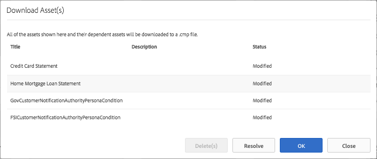
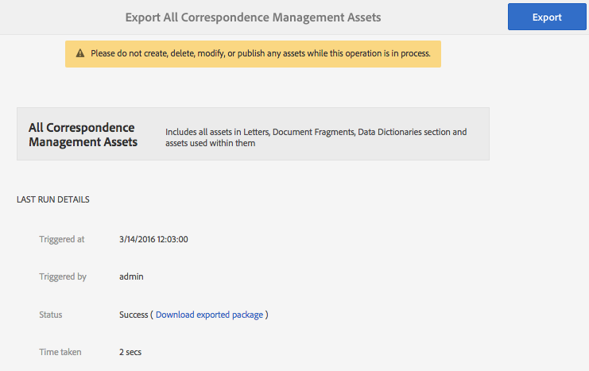
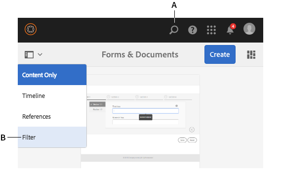
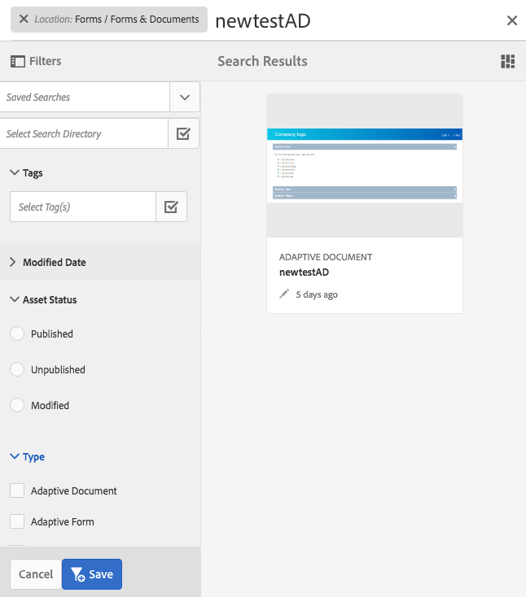

# Importing and exporting assets to AEM Forms{#importing-and-exporting-assets-to-aem-forms}

You can move forms and related assets, themes, data dictionaries, document fragments, and letters between different AEM Forms instances. Such a movement is required when migrating systems or moving forms from a stage server to a production server. For those assets for which upload and import via the AEM Forms UI is supported, using the Forms UI is the recommended way for export or import. Using AEM Package Manager for exporting or importing such assets is not recommended.

>[!NOTE]
>
>* In AEM 6.4 Forms, the structure and paths of crx-repository has changed. If you import assets from a previous version to AEM 6.4 Forms and the form has some dependencies on the older structure, you have to manually export the dependencies. For details of changes in the structure and paths of the repository, see [Repository Restructuring in AEM](/help/sites-deploying/repository-restructuring.md).
>

## Download or upload Forms &amp; Documents assets {#download-or-upload-forms-amp-documents-assets}

AEM Forms user interface lets you export assets from an AEM instance by downloading them as an AEM CRX-package or binary files. You can then import the downloaded AEM CRX-package or the binary file into another AEM instance.

Export and import via AEM Forms user interface is supported for all assets except for Adaptive Form templates and Adaptive Form content policies. Therefore, on exporting an adaptive form from AEM Forms UI, the related adaptive form template and content policies are not automatically exported like other related assets.

For these asset types, you must use AEM Package Manager to create a CRX package on the source AEM server and install the package on the destination server. For information about creating and installing packages, see [Working with packages](/help/sites-administering/package-manager.md).

### Download Forms &amp; Documents assets {#download-forms-amp-documents-assets}

To download Forms & Documents assets:

1. Log in to the AEM Forms instance.
1. Select Experience Manager  icon &gt; navigation  icon&gt; Forms &gt; Forms & Documents.
1. Select the forms assets and select the **Download** icon.
1. In the Download Asset(s), choose one of the following options, and select **Download**.

    * **Download as CRX Package:** Use the option to download and move all selected assets and related dependencies from an AEM Forms instance to another. It downloads all assets and folders as crx package. Any form assets including the forms authored in AEM (adaptive forms, Interactive Communications, and adaptive form fragments), form sets, form templates, PDF documents, and resources (XSDs, XFS, images) can be downloaded as package from AEM Forms UI.
      The advantage of downloading assets as package is that it also downloads assets that have been used by the asset selected to download. For example, If you have an adaptive form which uses a form template, XSD, and an image. When you select this adaptive form and download it as package, the downloaded package also contains the form template, XSD, and the image. All the metadata properties (including custom properties) associated with the asset are also downloaded.

    * **Download asset(s) as binary files:** Use the option to download only form templates (XDP), PDF forms (PDF), document (PDF), and resources (images, schemas, stylesheets). You can edit these assets with external applications. It downloads the forms assets that have binaries, such as XSDs, XDPs, images, PDFs, and XDPs as a .zip file.
      You cannot download adaptive forms, Interactive Communications, adaptive form fragments, themes, and form sets with **Download asset(s) as binary files** option. To download these assets, you should use **Download as CRX Package** option.

   The selected assets are downloaded as an archive (.zip file).

   >[!NOTE]
   >
   >Both AEM package and binary files are downloaded as an archive (.zip file). The templates for the assets do not get downloaded along with the assets. You need to export the asset templates separately.

### Upload Forms &amp; Documents assets {#upload-forms-amp-documents-assets}

To upload Forms & Documents assets:

>[!VIDEO](https://vimeo.com/)

1. Log in to the AEM Forms instance.
1. Select Experience Manager  icon &gt; navigation  icon&gt; Forms&gt; Forms & Documents.
1. Select **Create** &gt;**File Upload**. An upload forms or package dialog appears.
1. In the dialog box, browse and select the package or the archive to import. You can also select PDF document, XSDs, images, stylesheets, and XDP forms. Select **Open**. The folder or the file name that you select must not include any special characters.

   On the dialog box, verify the details of assets being uploaded, and select **Upload**.

   In case, you upload an existing forms asset, the asset gets updated.

   >[!NOTE]
   >
   >Uploading a package does not replace existing folder hierarchy. For example, If you have an adaptive form named 'Training' at location /content/dam/formsanddocuments on one server. You download the adaptive form and upload the form on another server. The second server also has a folder with name 'Training' at the same location /content/dam/formsanddocuments. The upload fails.

## Downloading or uploading a theme {#downloading-or-uploading-a-theme}

With AEM Forms, you can create, download, or upload themes. A theme is created like other assets such as forms, documents, and letters. You can create a theme, download it, and upload it on a separate instance to reuse it. For more information about themes, see [Themes in AEM Forms](../../forms/using/themes.md).

### Downloading a theme {#downloading-a-theme}

You can export themes in AEM Forms that you can use in other projects or instances. AEM lets you download theme as a zip file, that you can upload on the instance.

To download a theme:

1. Log in to the AEM Forms instance.
1. Select Experience Manager  icon &gt; navigation  icon&gt; Forms&gt; Themes.
1. Select the theme and select **Download**. The theme is downloaded as an archive (.zip file).

### Uploading a theme {#uploading-a-theme}

You can use created themes with styling presets on your project. You can import theme packages that others create by uploading them on your project.

To upload a theme:

1. In Experience Manager, navigate to **Forms &gt; Themes**.
1. In the Themes page, click **Create &gt; File Upload**.
1. In the File Upload prompt, browse and select a theme package on your computer and click **Upload**.
   The uploaded theme is available in the themes page.

1. Log in to the AEM Forms instance.
1. Select Experience Manager  icon &gt; navigation  icon&gt; Forms&gt; Themes.
1. click **Create** &gt; **File Upload**. In the File Upload prompt, browse and select a theme package on your computer and click **Upload**. The theme is uploaded.

## Import and export assets in Correspondence Management {#import-and-export-assets-in-correspondence-management}

To share assets, such as data dictionaries, letters, and document fragments, between two different implementations of Correspondence Management, you can create and share .cmp files. A .cmp file can include one or more data dictionaries, letters, document fragments, and forms.

### Export Document Fragments, Letters, and/or Data Dictionaries {#export-document-fragments-letters-and-or-data-dictionaries}

1. In the letters, document fragments, or data dictionary pages, select and select the assets you want to export to a single package, and then select Queue For Download. The assets are lined-up for export.
1. As required, repeat the above step to add letters, document fragments, and data dictionaries.
1. Select **Download**.
1. Correspondence Management displays Download Asset(s) dialog with a list of assets in the export list.

   

1. To view the dependencies that are exported, Select Resolve. Or skip to the next step. Even if you do not select resolve, the dependencies are still exported.
1. To download the .cmp file, select **OK**.
1. Correspondence Management downloads a .cmp file to your computer.

   The .cmp file includes the exported assets. You can share the .cmp file with others. Other users can import the .cmp file in a different server to get all the assets in the new server.

### Export all the Correspondence Management assets as a package {#export-all-the-correspondence-management-assets-as-a-package}

Use this option to download all the Correspondence Management assets and related dependencies as a package from an AEM forms instance.

For example, if Correspondence Management has a letter that uses an image and text, the downloaded package also contains the image and the text related to the letter. All the metadata properties (including custom properties) associated with the asset are also downloaded. Once you have downloaded the package (.cmp), you can [import the package to a different AEM Forms instance](../../forms/using/import-export-forms-templates.md#p-upload-forms-documents-assets-p).

To download all the Correspondence Management assets and related dependencies as a package, complete the following steps:

1. Log in to AEM Forms server as a forms user.
1. Select **Adobe Experience Manager** in the Global Navigation bar.
1. Select tools ( ) and then select **Forms**.
1. Select **Export Correspondence Management Assets**.

   

   ( ``The Export All Correspondence Management Assets page appears and displays the information about the last time the Export process was attempted and a link to download the last successfully exported package.

   

1. Select **Export** and, in the confirm message, select **OK**.

   After a batch process is complete, the last run details and the link to download the package are updated. This includes information such as the Administrator login and if the batch run successfully or failed. The assets are exported to a package and the Download Exported Package link appears.

   >[!NOTE]
   >
   >The Export All Assets process cannot be canceled once initiated. Also, while the export all operation is in process, do not create, delete, modify, or publish any assets or initiate Publish All Assets process.a

1. Select the **Download Exported Package** link to download the package file.

   To add the assets in the package to another instance of Correspondence Management, [import the package to an AEM Forms instance](../../forms/using/import-export-forms-templates.md#p-upload-forms-documents-assets-p).

### Import Document Fragments, Letters and/or Data Dictionaries into Correspondence Management {#import-document-fragments-letters-and-or-data-dictionaries-into-correspondence-management}

You can import assets that are exported into a .cmp file. A .cmp file can have one or more letters, data dictionaries, document fragments, and dependent assets.

>[!NOTE]
>
>While importing old Correspondence Management assets for migration, log in using an Admin account. For more information on Migrating old Correspondence Management assets, see [Migrate Correspondence Management assets to AEM 6.1 forms](/help/forms/using/migration-utility.md).

1. On the data dictionary, letters, or document fragments page, select **Create &gt; File Upload** and select the .cmp file.
1. Correspondence Management displays the Import Assets dialog with the list of assets that are imported. Select **Import**.

   After importing the assets, the following properties of the assets are updated while the other properties remain the same:

    * Author: Displays the ID of the user that imported the asset to the server
    * Modified: The time when the asset was imported to the server

   >[!NOTE]
   >
   >For you to be able to upload XDPs (as part of the cmp file or otherwise), you need to be a part of forms-power-users group. For access rights, contact the administrator.

## Export a workflow application {#export-a-workflow-application}

You can use AEM package manger to export workflow applications. The procedure is as listed below:

1. Open AEM Forms package manager. URL of package manager is https://&lt;server&gt;:&lt;port&gt;/crx/packmgr.
1. Click **[!UICONTROL Create Package]**. The **[!UICONTROL New Package]** dialog box appears.
1. Specify name, version, and group for the package. Click **[!UICONTROL OK]**.
1. Click **[!UICONTROL Edit]** and open the **[!UICONTROL Filters]** tab. Click **[!UICONTROL Add Filter]**. Specify the path of the workflow application. For example, /etc/fd/dashboard/startpoints/homemortgage. Click **[!UICONTROL Add rule]**.

1. Open the **[!UICONTROL Advanced]** tab. Select **[!UICONTROL Merge]** or **[!UICONTROL Overwrite]** in ACL Handling field. Click **[!UICONTROL Save]**.
1. Click **[!UICONTROL Build]** to create the package.

   After the package is built, you can download the package and import it to the other server. The workflow application appears on the server where the package is uploaded.

   >[!NOTE]
   >
   >For the workflow application to work properly, also export corresponding adaptive form and workflow model with the work application.

## Folders and organizing assets {#folders-and-organizing-assets}

AEM Forms user interface uses folders to arrange assets. These folders are used for arranging assets created within AEM Forms user interface. You can rename, create subfolders, and store assets and documents in these folders. Organizing documents and assets in a folder let you group the files together for easy management. You can select a folder and choose to download or delete it.

To create a folder, complete the following steps:

### Create a folder {#create-a-folder}

1. Log in to the AEM Forms user interface at `https://<server>:<port>/aem/forms.html`.
1. Navigate to the location under which you want to create a folder.
1. Select Create &gt; Folder.
1. Enter the following details:

    * **Title:** Display name for the folder
    * **Name:** *(Mandatory)* The node name under which you want to store the folder in the repository

   >[!NOTE]
   >
   >By default, the value of name field is automatically populated from the title. The name can only contain alphanumeric characters, or the hyphen (-) and underscore (_) special characters. Any other special characters entered in the title are automatically replaced with a hyphen and you are prompted to confirm the new name. You can choose to continue with suggested name or edit it further.

1. A new folder with the title you defined is displayed at the current location in the asset listing.

   If a folder exists with the name specified, the submission fails with an error. You can view the error message by hovering over the error  icon that appears beside the name field.

   You can select the newly created folder to go inside the folder and create assets or folders within the folder. Further, you can select a folder and choose to queue it for download, delete it, or edit its name.

   

### Create copies of one or more assets or letters {#create-copies-of-one-or-more-assets-or-letters}

You can use an existing assets and letters to quickly create a assets and letters with similar properties, content, and inherited assets. You can copy and paste data dictionaries, document fragments, and letters.

Complete the following steps to create copies of assets and letters:

1. In the relevant Assets or Letters page, select one or more assets/letters. The UI displays the Copy icon.
1. Select Copy. The UI displays the Paste icon. You can also choose to go/navigate inside a folder before you paste. Different folders can contain assets with same names. For more information on folders, see [Folders and organizing assets](#folders-and-organizing-assets).
1. Select Paste. The Paste dialog appears. The system auto generates names and titles to the new copies of assets/letters, but you can edit the titles and names of the assets/letters.

   If you are copying and pasting the assets/letters at the same place, a suffix "-CopyXX" gets added to the existing name of the asset/letter. If no title existed for the copied asset/letter, the auto generated title field remains blank.

1. If necessary, edit the Title and Name with which you want to save the copy of the asset/letter.
1. Select Paste. New copies of the copied assets are created.

## Search {#search-forms}

AEM Forms UI lets you search your content. Using the top bar, you can select Search **[A]** to search your content for resources such as assets and documents.

When you search for assets, AEM Forms displays the side panel. You can also select  &gt; Filter **[B]** to invoke the side panel. Using the various filters in the side panel, you can narrow down your search. The side panel also lets you save your searches.

**A.** Search **B.** Filter

Side panel - Filters

On the side panel, you can use the following to narrow down your search results:

* Search Directory
* Tags
* Search Criteria; for example, Modified Dates, Publish Status, LiveCopy Status.

The side panel also lets you save your search settings with names of your choice.

For more information and instructions on using search, filters, saved search, and side panel, see [Search](/help/sites-authoring/search.md).
