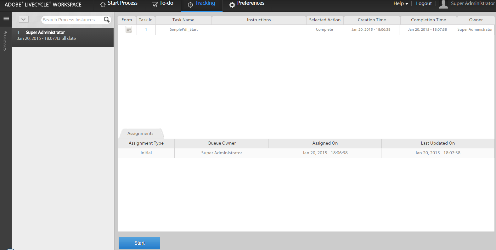
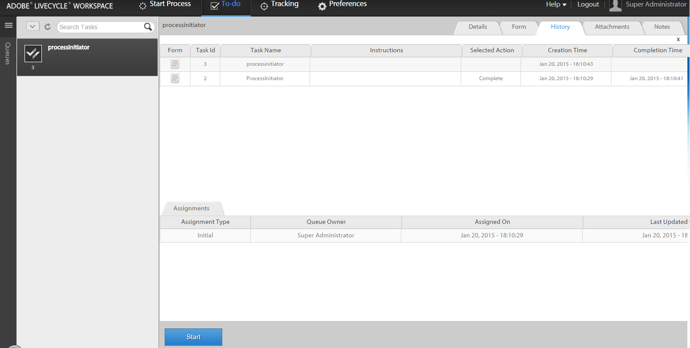

# Initiating a new process with existing process data in AEM Forms workspace{#initiating-a-new-process-with-existing-process-data-in-aem-forms-workspace}

You can initiate a new process using the data of an existing process data. The need to initiate a new process from existing process data arises when we have to use the same form frequently with few changes in content like that of paid-time-off forms. This feature saves time and effort of users especially when the process has long form to fill.

Following are the steps to initiate a new process from existing process data:-

1. Do one of the following actions:

    * In Tracking, click the process instance whose data you want to use. From the Process History view in the right pane, click the task row that corresponds to the start point.
    * In Tracking, select a search template to display a list of process instances. Select the instance whose data you want to use.
    * In the **[!UICONTROL To-Do]** tab, select the task. Click the **[!UICONTROL History]** tab, and select the task that initiated the process instance.

    

1. In the Task action toolbar, click **[!UICONTROL Start]**. An Adaptive Form for the new process instance is displayed with prefilled data.  

1. Update the data as necessary, and click either **[!UICONTROL Complete]** or an appropriate button on the form.
