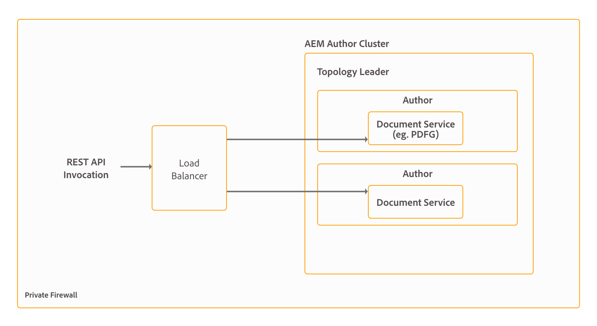

# Installing and configuring document services {#installing-and-configuring-document-services}

AEM Forms provides a set of OSGi services to accomplish different document level operations, for example, services to create, assemble, distribute, and archive PDF documents, add digital signatures to limit access to documents, and decode Barcoded Forms. These services are included in AEM Forms add-on package. Collectively, these services are known as document services. The list of available document services and their major capabilities is as below:

* **Assembler service:** Enables you to combine, rearrange, and augment PDF and XDP documents and obtain information about PDF documents. It also helps convert and validate PDF documents to PDF/A standard, transforms PDF forms, XML forms, and PDF forms to PDF/A-1b, PDF/A-2b, and PDFA/A-3b. For more information, see [Assembler Service](/help/forms/using/assembler-service.md).

* **ConvertPDF service:** Enables you to convert PDF documents to PostScript or image files (JPEG, JPEG 2000, PNG, and TIFF). For more information, see [ConvertPDF Service](/help/forms/using/using-convertpdf-service.md).

* **Barcoded Forms service:** Enables you to extract data from electronic images of barcodes. The service accepts TIFF and PDF files that include one or more barcodes as input and extracts the barcode data. For more information, see [Barcoded Forms Service](/help/forms/using/using-barcoded-forms-service.md).

* **DocAssurance service:** Enables you to encrypt and decrypt documents, extend the functionality of Adobe Reader with additional usage rights, and add digital signatures to your documents. The Doc Assurance service contains three services: signature, encryption, and reader extension. For more information, see [DocAssurance Service](/help/forms/using/overview-aem-document-services.md).

* **Encryption service:** Enables you to encrypt and decrypt documents. When a document is encrypted, its contents become unreadable. An authorized user can decrypt the document to obtain access to its contents. For more information, see [Encryption Service](/help/forms/using/overview-aem-document-services.md#encryption-service).

* **Forms service:** Lets you create interactive data capture client applications that validate, process, transform, and deliver forms that are typically created in Forms Designer. The Forms service renders any form design that you develop to PDF documents. For more information, see [Forms Service](/help/forms/using/forms-service.md).

* **Output service:** Enables you to create documents in different formats, including PDF, laser printer formats, and label printer formats. Laser printer formats are PostScript and Printer Control Language (PCL). For more information, see [Output Service](/help/forms/using/output-service.md).

* **PDF Generator service:** The PDF Generator service provides APIs to converts native file formats to PDF. It also converts PDF to other file formats and optimizes the size of PDF documents. For more information, see [PDF Generator Service](aem-document-services-programmatically.md#pdfgeneratorservice).

* **Reader Extension service:** Enables your organization to easily share interactive PDF documents by extending the functionality of Adobe Reader with additional usage rights. The service activates features that are not available when a PDF document is opened using Adobe Reader, such as adding comments to a document, filling forms, and saving the document. For more information, see [Reader Extension Service](/help/forms/using/overview-aem-document-services.md#reader-extension-service).

* **Signature service:** Lets you work with digital signatures and documents on the AEM server. For example, the Signature service is typically used in the following situations:

  * The AEM server certifies a form before it is sent to a user to open by using Acrobat or Adobe Reader.
  * The AEM server validates a signature that was added to a form by using Acrobat or Adobe Reader.
  * The AEM server signs a form on behalf of a public notary.

   The signature service accesses certificates and credentials that are stored in the trust store. For more information, see [Signature Service](/help/forms/using/aem-document-services-programmatically.md).

AEM Forms is a powerful enterprise-class platform and the document services is only one of the capability of AEM Forms. For the complete list of capabilities, see [Introduction to AEM Forms](/help/forms/using/introduction-aem-forms.md).

## Deployment Topology {#deployment-topology}

AEM Forms add-on package is an application deployed onto AEM. Generally, you require only one AEM instance (author or publish) to run AEM Forms document services. The following topology is recommended to run AEM Forms document services. For detailed information about topologies, see [Architecture and deployment topologies for AEM Forms](/help/forms/using/aem-forms-architecture-deployment.md).



>[!NOTE]
>
>Although AEM Forms lets you set up and run all the functionalities from a single server, you should do capacity planning, load balancing, and set up dedicated servers for specific capabilities in a production environment. For example, for an environment using the PDF Generator service to convert thousands of pages a day and multiple adaptive forms to capture data, set up separate AEM Forms servers for the PDF Generator service and adaptive forms capabilities. It helps provide optimum performance and scale the servers independent of each other.

## System Requirements {#system-requirements}

Before you begin to install and configure AEM Forms document services, ensure that:

* Hardware and software infrastructure is in place. For a detailed list of supported hardware and software, see [technical requirements](/help/sites-deploying/technical-requirements.md).  

* Installation path of the AEM instance does not contain white-spaces.
* An AEM instance is up and running. In AEM terminology, an "instance" is a copy of AEM running on a server in the author or publish mode. Generally, you require only one AEM instance (author or publish) to run AEM Forms document services:

  * **Author**: An AEM instance used to create, upload, and edit content and to administer the website. Once content is ready to go live, it is replicated to the publish instance.
  * **Publish**: An AEM instance that serves the published content to the public over the internet or an internal network.

* Memory requirements are met. AEM Forms add-on package requires:

  * 15 GB of temporary space for Microsoft&reg; Windows-based installations.
  * 6 GB of temporary space for UNIX-based installations.

* Client software required for PDF generator to perform conversion on Microsoft&reg; Windows and Linux&reg; are installed:

  * **Microsoft&reg; Windows**: Install [Microsoft&reg; Office](/help/forms/using/aem-forms-jee-supported-platforms.md#p-software-support-for-pdf-generator-p) or [Apache OpenOffice](/help/forms/using/aem-forms-jee-supported-platforms.md#software-support-for-pdf-generator)
  * **Linux&reg;**: Install [Apache OpenOffice](/help/forms/using/aem-forms-jee-supported-platforms.md#p-software-support-for-pdf-generator-p)

>[!NOTE]
>
>* On Microsoft&reg; Windows, PDF Generator supports WebKit, Acrobat WebCapture, and WebToPDF conversion routes to convert HTML files to PDF documents.
>* On UNIX-based operating systems, PDF Generator supports WebKit and WebToPDF conversion routes to convert HTML files to PDF documents.
>

### Extra requirements for UNIX-based operating system {#extrarequirements}

If you are using a UNIX-based operating system, install the following 32-bit packages from the installation media of the respective operating system: 
<table>
 <tbody>
  <tr>
   <td>
    <ul>
     <li>expat</li>
    </ul> </td>
   <td>
    <ul>
     <li>libxcb</li>
    </ul> </td>
   <td>
    <ul>
     <li>freetype</li>
    </ul> </td>
   <td>
    <ul>
     <li>libXau</li>
    </ul> </td>
  </tr>
  <tr>
   <td>
    <ul>
     <li>libSM</li>
    </ul> </td>
   <td>
    <ul>
     <li>zlib</li>
    </ul> </td>
   <td>
    <ul>
     <li>libICE</li>
    </ul> </td>
   <td>
    <ul>
     <li>libuuid</li>
    </ul> </td>
  </tr>
  <tr>
   <td>
    <ul>
     <li>glibc</li>
    </ul> </td>
   <td>
    <ul>
     <li>libXext</li>
    </ul> </td>
   <td>
    <ul>
     <li>nss-softokn-freebl</li>
    </ul> </td>
   <td>
    <ul>
     <li>fontconfig</li>
    </ul> </td>
  </tr>
  <tr>
   <td>
    <ul>
     <li>libX11</li>
    </ul> </td>
   <td>
    <ul>
     <li>libXrender</li>
    </ul> </td>
   <td>
    <ul>
     <li>libXrandr</li>
    </ul> </td>
   <td>
    <ul>
     <li>libXinerama</li>
    </ul> </td>
  </tr>
 </tbody>
</table>

* **(PDF Generator only**) Install the 32-bit version of libcurl, libcrypto, and libssl libraries and create the below symlinks. The symlinks point to the latest version of the respective libraries:

  * /usr/lib/libcurl.so
  * /usr/lib/libcrypto.so
  * /usr/lib/libssl.so

* **(PDF Generator only)** PDF Generator service supports WebKit and WebToPDF routes to convert HTML files to PDF documents. To enable conversion for WebToPDF route, install the below listed 64-bit libraries. Generally, these libraries are already installed. If any library is missing, install it manually:

  * linux-gate.so.1
  * libz.so.1
  * libfontconfig.so.1
  * libfreetype.so.6
  * libdl.so.2
  * librt.so.1
  * libpthread.so.0
  * libstdc++.so.6
  * libm.so.6
  * libgcc_s.so.1
  * libc.so.6
  * ld-linux.so.2
  * libexpat.so.1

## Pre-installation configurations {#preinstallationconfigurations}

Configurations listed in the pre-installation configurations section are applicable only to the PDF Generator service. If you are not configuring the PDF Generator service, you can skip the pre-installation configuration section.

### Install Adobe Acrobat and third-party applications {#install-adobe-acrobat-and-third-party-applications}

If you are going use the PDF Generator service to convert native file formats such as Microsoft&reg; Word, Microsoft&reg; Excel, Microsoft&reg; PowerPoint, OpenOffice, WordPerfect X7, and Adobe Acrobat to PDF Documents, ensure that these applications are installed on the AEM Forms Server.

>[!NOTE]
>
>* If your AEM Forms Server is in an offline or secure environment and internet is not available to activate Adobe Acrobat, see [Offline Activation](https://exception.licenses.adobe.com/aoes/aoes/v1/t1?locale=en) for instructions to activate such instances of Adobe Acrobat.
>* Adobe Acrobat, Microsoft&reg; Word, Excel, and Powerpoint are available only for Microsoft&reg; Windows. If you are using the UNIX-based operating system, install OpenOffice to convert rich text files and supported Microsoft&reg; Office files to PDF documents.
>* Dismiss all the dialog boxes that are displayed after installing Adobe Acrobat and third-party software for all the users configured to use the PDF Generator service.
>* Start all the installed software at least once. Dismiss all the dialog boxes for all the users configured to use the PDF Generator service.
>* [Check expiration date of your Adobe Acrobat serial numbers](https://helpx.adobe.com/enterprise/kb/volume-license-expiration-check.html) and set a date to update license or [migrate your serial number](https://www.adobe.com/devnet-docs/acrobatetk/tools/AdminGuide/licensing.html#migrating-your-serial-number) based on the expiry date.  

After installing Acrobat, open Microsoft&reg; Word. On the **Acrobat** tab, click **Create PDF** and convert a .doc or .docx file available on your machine to a PDF Document. If the conversion is successful, AEM Forms is ready to use Acrobat with PDF Generator service.

### Setup environment variables {#setup-environment-variables}

Set environment variables for 64-bit Java Development Kit, third-party applications, and Adobe Acrobat. The environment variables should contain the absolute path of the executable used to start the corresponding application, for example, the table below lists environment variables for a few applications:

<table>
 <tbody>
  <tr>
   <td><p><strong>Application</strong></p> </td>
   <td><p><strong>Environment variable</strong></p> </td>
   <td><p><strong>Example</strong></p> </td>
  </tr>
  <tr>
   <td><p><strong>JDK (64-bit)</strong></p> </td>
   <td><p>JAVA_HOME</p> </td>
   <td><p>C:\Program Files\Java\jdk1.8.0_74</p> </td>
  </tr>
  <tr>
   <td><p><strong>Adobe Acrobat</strong></p> </td>
   <td><p>Acrobat_PATH</p> </td>
   <td><p>C:\Program Files (x86)\Adobe\Acrobat 2015\Acrobat\Acrobat.exe</p> </td>
  </tr>
  <tr>
   <td><p><strong>Notepad</strong></p> </td>
   <td><p>Notepad_PATH</p> </td>
   <td><p>C:\WINDOWS\notepad.exe<br /> <strong></strong></p> </td>
  </tr>
  <tr>
   <td><p><strong>OpenOffice</strong></p> </td>
   <td><p>OpenOffice_PATH</p> </td>
   <td><p>C:\Program Files (x86)\OpenOffice.org4</p> </td>
  </tr>
 </tbody>
</table>

>[!NOTE]
>
>* All environment variables and respective paths are case-sensitive.
>* JAVA_HOME and Acrobat_PATH (Windows only) are mandatory environment variables.  
>* The environment variable OpenOffice_PATH is set to the installation folder instead of the path to the executable.
>* Do not set up environment variables for Microsoft&reg; Office applications such as Word, PowerPoint, Excel, and Project, or for AutoCAD. If these applications are installed on the server, the Generate PDF service automatically starts these applications.
>* On UNIX-based platforms, install OpenOffice as /root. If OpenOffice is not installed as root, the PDF Generator service fails to convert OpenOffice documents to PDF documents. If you are required to install and run OpenOffice as a non-root user, then provide sudo rights to the non-root user.  
>* If you are using OpenOffice on a UNIX-based platform, run the following command to set the path variable:  
> `export OpenOffice_PATH=/opt/openoffice.org4`
>* For testing PDF conversions on SUSE&reg; Linux&reg; (SLES 15 SP6 or later) server, ensure you have the following configurations:
>     * Install the latest available 32-bit variant of `OpenOffice 4.1.x` to a directory such as `/opt/openoffice4`.
>     * Set the `OpenOffice_PATH` environment variable to point to this location. For example: `OpenOffice_PATH=/opt/openoffice4`.
>     * Ensure that the `OpenOffice_PATH` variable is set globally (for example, using `/etc/profile` or the system-specific equivalent) so it is available to all users upon login.

### (Only for IBM&reg; WebSphere&reg;) Configure IBM&reg; SSL socket provider {#only-for-ibm-websphere-configure-ibm-ssl-socket-provider}

Perform the following steps to configure IBM&reg; SSL socket provider:

1. Create a copy of the java.security file. The default location of the file is `[WebSphere_installation_directory]\Appserver\java_[version]\jre\lib\security`.
1. Open the copied java.security file for editing.
1. Change the default SSL socket factories to use the JSSE2 factories instead of default IBM&reg; WebSphere&reg; factories:

   **Default content:**

   ```shell
   #ssl.SocketFactory.provider=com.ibm.jsse2.SSLSocketFactoryImpl
   #ssl.ServerSocketFactory.provider=com.ibm.jsse2.SSLServerSocketFactoryImpl
   #WebSphere socket factories (in cryptosf.jar)
   ssl.SocketFactory.provider=com.ibm.websphere.ssl.protocol.SSLSocketFactory
   ssl.ServerSocketFactory.provider=com.ibm.websphere.ssl.protocol.SSLServerSocketFactory
   ```

   **Modified content:**

   ```shell
   ssl.SocketFactory.provider=com.ibm.jsse2.SSLSocketFactoryImpl
   ssl.ServerSocketFactory.provider=com.ibm.jsse2.SSLServerSocketFactoryImpl
   
   #WebSphere socket factories (in cryptosf.jar)
   #ssl.SocketFactory.provider=com.ibm.websphere.ssl.protocol.SSLSocketFactory
   #ssl.ServerSocketFactory.provider=com.ibm.websphere.ssl.protocol.SSLServerSocketFactory
   ```

1. To enable AEM Forms Server to use the updated java.security file, while starting the AEM Forms server, add the following java argument:

   `-Djava.security.properties= [path of newly created Java.security file].`

### (Windows Only) Configure the file block settings for Microsoft&reg; Office {#configure-the-file-block-settings-for-microsoft-office}

Change the Microsoft&reg; Office trust center settings to enable the PDF Generator service to convert files created with older versions of Microsoft&reg; Office.

1. Open a Microsoft&reg; Office application. For example, Microsoft&reg; Word. Navigate to **[!UICONTROL File]**> **[!UICONTROL Options]**. The options dialog box appears.  

1. Click **[!UICONTROL Trust Center]**, and click **[!UICONTROL Trust Center Settings]**.
1. In the **[!UICONTROL Trust Center settings]**, click **[!UICONTROL File Block Settings]**.
1. In the **[!UICONTROL File Type]** list, deselect **[!UICONTROL Open]** for the file type that the PDF Generator service should be allowed to convert to PDF documents.

### (Windows Only) Grant the Replace a process level token privilege {#grant-the-replace-a-process-level-token-privilege}

The user account used to start the application server requires the **Replace a process level token** privilege. The local system account has the **Replace a process level token** privilege by default. For the servers running with a user of the Local Administrators group, the privilege must be granted explicitly. Perform the following steps to grant the privilege:

1. Open the Group Policy Editor for Microsoft&reg; Windows. To open the Group Policy Editor, click **[!UICONTROL Start]**, type **gpedit.msc** in the Start Search box, and click **[!UICONTROL Group Policy Editor]**.
1. Navigate to **[!UICONTROL Local Computer Policy]** &gt; **[!UICONTROL Computer Configuration]** &gt; **[!UICONTROL Windows Settings]** &gt; **[!UICONTROL Security Settings]** &gt; **[!UICONTROL Local Policies]** &gt; **[!UICONTROL User Rights Assignment]** and edit the **[!UICONTROL Replace a process level token]** policy and include the Administrators group.
1. Add the user to the Replace a Process Level Token entry.

>[!NOTE]
>
> As implied above, if the AEM server is running as a service under the LocalSystem account (LSA), explicitly assigning this privilege to a user is not necessary.

### (Windows Only) Enable the PDF Generator service for non-administrators {#enable-the-pdf-generator-service-for-non-administrators}

You can enable a non-administrator user to use the PDF Generator service. Normally, only users with administrative privileges can use the service:

1. Create an environment variable, PDFG_NON_ADMIN_ENABLED.
1. Set value of the environment variable to TRUE.
1. Restart the AEM Forms instance.

>[!NOTE]
>
> It is recommended to use the 'Ctrl + C' command to restart the SDK. Restarting the AEM SDK using alternative methods, for example, stopping Java processes, may lead to inconsistencies in the AEM development environment.

### (Windows Only) Disable User Account Control (UAC) {#disable-user-account-control-uac}

1. To access the System Configuration Utility, go to **[!UICONTROL Start &gt; Run]** and then enter **[!UICONTROL MSCONFIG]**.
1. Click the **[!UICONTROL Tools]** tab and scroll down and select **[!UICONTROL Change UAC Settings]**. Click **[!UICONTROL Launch]** to run the command in a new window.
1. Adjust the slider to the Never notify level. When finished, close the command window and close the System Configuration window.
1. Verify that registry setting for UAC is set to 0 (zero). Perform the following steps to verify:

    1. Microsoft&reg; recommends backing up the registry before you modify it. For detailed steps, see [How to back up and restore the registry in Windows](https://support.microsoft.com/en-us/help/322756).
    1. Open Microsoft&reg; Windows Registry editor. To open registry editor, go to Start &gt; Run, type regedit, and click OK.
    1. Navigate to `HKEY_LOCAL_MACHINE\SOFTWARE\Microsoft\Windows\CurrentVersion\policies\system\`. Ensure value of EnableLUA is set to 0 (zero).
    1. Ensure value of **EnableLUA** is set to 0 (zero). If the value is not 0, change the value to 0. Close the registry editor.

1. Restart your computer.

### (Windows Only) Disable Error Reporting service {#disable-error-reporting-service}

While converting a document to PDF using the PDF Generator service on Windows Server, occasionally, Windows Server reports that the executable has encountered a problem and must close. However, it does not impact the PDF conversion as it continues in the background.

To avoid receiving the error, you can disable the Windows error reporting. For more information on disabling error reporting, see [https://technet.microsoft.com/en-us/library/cc754364.aspx](https://technet.microsoft.com/en-us/library/cc754364.aspx).

### (Windows Only) Configure HTML to PDF conversion {#configure-html-to-pdf-conversion}

The PDF Generator service provides WebKit, WebCapture, and WebToPDF routes or methods to convert HTML files to PDF documents. On Windows, to enable conversion for WebKit and Acrobat WebCapture routes, copy the Unicode font to %windir%\fonts directory.

>[!NOTE]
>
>Whenever you install new fonts to the fonts folder, restart the AEM Forms instance.

### (UNIX-based platforms only) Extra configurations for HTML to PDF conversion  {#extra-configurations-for-html-to-pdf-conversion}

On UNIX-based platforms, the PDF Generator service supports WebKit and WebToPDF routes to convert HTML files to PDF documents. To enable HTML to PDF conversion, perform the following configurations, applicable to your preferred conversion route:

### (UNIX-based platforms only) Enable support for Unicode fonts (WebKit only) {#enable-support-for-unicode-fonts-webkit-only}

Copy the Unicode font to any of the following directories as appropriate for your system:

* /usr/lib/X11/fonts/TrueType
* /usr/share/fonts/default/TrueType
* /usr/X11R6/lib/X11/fonts/ttf
* /usr/X11R6/lib/X11/fonts/truetype
* /usr/X11R6/lib/X11/fonts/TrueType
* /usr/X11R6/lib/X11/fonts/TTF
* /usr/openwin/lib/X11/fonts/TrueType (Solaris&trade;)

>[!NOTE]
>
>* On Red Hat&reg; Enterprise Linux&reg; 6.x and later, the courier fonts are not available. To install the courier fonts, download the font-ibm-type1-1.0.3.zip archive. Extract the archive at /usr/share/fonts. Create a symbolic link from /usr/share/X11/fonts to /usr/share/fonts.  
>* Delete all the .lst font cache files from the Html2PdfSvc/bin and /usr/share/fonts directories.
>* Ensure that the directories /usr/lib/X11/fonts and /usr/share/fonts exist. If the directories do not exist, then use the ln command to create a symbolic link from /usr/share/X11/fonts to /usr/lib/X11/fonts and another symbolic link from /usr/share/fonts to /usr/share/X11/fonts. Also ensure that the courier fonts are available at /usr/lib/X11/fonts.
>* Ensure that all the fonts (Unicode and non-unicode) are available in the /usr/share/fonts or /usr/share/X11/fonts directory.  
>* When you run PDF Generator service as a non-root user, provide the non-root user read and write access to all the font directories.
>* Whenever you install new fonts to the fonts folder, restart the AEM Forms instance.
>

## Install AEM Forms add-on package {#install-aem-forms-add-on-package}

AEM Forms add-on package is an application deployed onto AEM. The package contains AEM Forms Document Services and other AEM Forms capabilities. Perform the following steps to install the package:

1. Open [Software Distribution](https://experience.adobe.com/downloads). You require an Adobe ID to log in to the Software Distribution.
1. Select **[!UICONTROL Adobe Experience Manager]** available in the header menu.
1. In the **[!UICONTROL Filters]** section:
   1. Select **[!UICONTROL Forms]** from the **[!UICONTROL Solution]** drop-down list.
   2. Select the version and type for the package. You can also use the **[!UICONTROL Search Downloads]** option to filter the results.
1. Select the package name applicable to your operating system, select **[!UICONTROL Accept EULA Terms]**, and select **[!UICONTROL Download]**.
1. Open [Package Manager](https://experienceleague.adobe.com/docs/experience-manager-65/administering/contentmanagement/package-manager.html)  and click **[!UICONTROL Upload Package]** to upload the package.
1. Select the package and click **[!UICONTROL Install]**.

   You can also download the package via the direct link listed in the [AEM Forms releases](https://experienceleague.adobe.com/docs/experience-manager-release-information/aem-release-updates/forms-updates/aem-forms-releases.html) article.

1. After the package is installed, you are prompted to restart the AEM instance. **Do not immediately stop the server.** Before stopping the AEM Forms Server, wait until the ServiceEvent REGISTERED and ServiceEvent UNREGISTERED messages stop appearing in the `[AEM-Installation-Directory]/crx-quickstart/logs/error`.log file and the log is stable.

## Post-installation configurations {#post-installation-configurations}

### Configure Boot Delegation for RSA/BouncyCastle libraries  {#configure-boot-delegation-for-rsa-bouncycastle-libraries}

1. Stop the AEM instance. Navigate to the [AEM installation directory]\crx-quickstart\conf\ folder. Open the sling.properties file for editing.

   If you use `[AEM installation directory]\crx-quickstart\bin\start.bat` to start an AEM instance, edit the sling.properties located at `[AEM_root]\crx-quickstart\`.

1. Add the following properties to the sling.properties file:

   ```shell
   sling.bootdelegation.class.com.rsa.jsafe.provider.JsafeJCE=com.rsa.*
   ```

1. (AIX&reg; only) Add the following properties to the sling.properties file:

    ```shell
    sling.bootdelegation.xerces=org.apache.xerces.*
    ```

1. Save and close the file.

### Configuring the font manager service  {#configuring-the-font-manager-service}

1. Log in to [AEM Configuration Manager](http://localhost:4502/system/console/configMgr) as an administrator.
1. Locate and open the **[!UICONTROL CQ-DAM-Handler-Gibson Font Managers]** service. Specify the path of the System Fonts, Adobe Server Fonts, and Customer Fonts directories. Click **[!UICONTROL Save]**.

   >[!NOTE]
   >
   >Your right to use fonts provided by parties other than Adobe is governed by the license agreements provided to you by such parties with those fonts, and is not covered under your license to use Adobe software. Adobe recommends that you review and ensure that you are in compliance with all applicable non-Adobe license agreements before using non-Adobe fonts with Adobe software, particularly concerning use of fonts in a server environment.
   >When you install new fonts to the fonts folder, restart the AEM Forms instance.
   >

### Configure a local user account to run the PDF Generator service  {#configure-a-local-user-account-to-run-the-pdf-generator-service}

A local user account is required to run the PDF Generator service. For steps to create a local user, see [Create a user account in Windows](https://support.microsoft.com/en-us/help/13951/windows-create-user-account) or create a user account in UNIX-based platforms.

1. Open the [AEM Forms PDF Generator Configuration](http://localhost:4502/libs/fd/pdfg/config/ui.html) page.

1. In the **[!UICONTROL User Accounts]** tab, provide credentials of a local user account, and click **[!UICONTROL Submit]**. If Microsoft&reg; Windows prompts, allow access to the user. When added successfully, the configured user is displayed under the **[!UICONTROL Your user accounts]** section in the **[!UICONTROL User Accounts]** tab.

### Configure the time-out settings {#configure-the-time-out-settings}

1. In [AEM configuration manager](http://localhost:4502/system/console/configMgr), locate and open the **[!UICONTROL Jacorb ORB Provider]** service.

   Add the following to the **[!UICONTROL Custom Properties.name]** field and click **[!UICONTROL Save]**. It sets the pending reply timeout (also known as, CORBA client timeout) to 600 seconds.

   `jacorb.connection.client.pending_reply_timeout=600000`

1. Log in to the AEM author instance and navigate to **[!UICONTROL Adobe Experience Manager]** &gt; **[!UICONTROL Tools]** &gt; **[!UICONTROL Forms]** &gt; **[!UICONTROL Configure PDF Generator]**. The default URL is <http://localhost:4502/libs/fd/pdfg/config/ui.html>.

   Open the **[!UICONTROL General Configuration]** tab and modify the value of the following fields for your environment:

<table>
 <tbody>
  <tr>
   <td>Field</td>
   <td>Description</td>
   <td>Default Value</td>
  </tr>
  <tr>
   <td>Server Conversion Timeout</td>
   <td>A PDFG conversion stays active for the number of seconds defined in the Server Conversion timeout</td>
   <td>270 seconds<br /> </td>
  </tr>
  <tr>
   <td>PDFG Cleanup Scan Seconds</td>
   <td>The number of seconds required to perform post-conversion operations.<br /> </td>
   <td>3600 seconds</td>
  </tr>
  <tr>
   <td>Job Expiration Seconds</td>
   <td>Duration for which PDF Generator service is allowed to run a conversion. Ensure that the value of the Job Expiration Seconds is greater than the PDFG Cleanup Scan Seconds value.</td>
   <td>7200 seconds</td>
  </tr>
 </tbody>
</table>

### (Windows only) Configure Acrobat for the PDF Generator service {#configure-acrobat-for-the-pdf-generator-service}

On Microsoft&reg; Windows, the PDF Generator service uses Adobe Acrobat to convert supported file formats to a PDF document. Perform the following steps to configure Adobe Acrobat for the PDF Generator service:

1. Open Acrobat and select **[!UICONTROL Edit]**> **[!UICONTROL Preferences]**> **[!UICONTROL Updater]**. In Check for updates, deselect **[!UICONTROL Automatically install updates]**, and click **[!UICONTROL OK]**. Close Acrobat.
1. Double-click a PDF document on your system. When Acrobat starts for the first time, the dialog boxes for Sign-in, Welcome screen, and EULA appear. Dismiss these dialog boxes for all the users configured to use PDF Generator.
1. Run the PDF Generator utility batch file to configure Acrobat for the PDF Generator service:

    1. Open [AEM Package Manager](http://localhost:4502/crx/packmgr/index.jsp) and download the `adobe-aemfd-pdfg-common-pkg-[version].zip` file from the Package Manager.
    1. Unzip the downloaded .zip file. Open the command prompt with administrative privileges.
    1. Navigate to the `[extracted-zip-file]\jcr_root\etc\packages\day\cq60\fd\adobe-aemds-common-pkg-[version]\jcr_root\etc\packages\day\cq60\fd\`
    1. Unzip the `adobe-aemfd-pdfg-common-pkg-[version]`.
    1. Navigate to the `[downloaded-adobe-aemfd-pdfg-common-pkg]\jcr_root\libs\fd\pdfg\tools\adobe-aemfd-pdfg-utilities-[version]` directory. Run the following batch file:

       `Acrobat_for_PDFG_Configuration.bat`

       Acrobat is configured to run with the PDF Generator service.

1. Run [System Readiness Tool (SRT)](#SRT) to validate Acrobat installation.

### (Windows only) Configure primary route for HTML to PDF conversion {#configure-primary-route-for-html-to-pdf-conversion-windows-only}

The PDF Generator service provides multiple routes to convert HTML files to PDF documents: Webkit, Acrobat WebCapture (Windows only), and WebToPDF. Adobe recommends using WebToPDF route because it has the capability to handle dynamic content and has no dependencies on 32-bit libraries or requires no extra fonts. Also, WebToPDF route does not require sudo or root access to run the conversion.

The default primary route for HTML to PDF conversion is Webkit. To change the conversion route:

1. On AEM author instance, navigate to **[!UICONTROL Tools]**> **[!UICONTROL Forms]**> **[!UICONTROL Configure PDF Generator]**.

1. In the **[!UICONTROL General Configuration]** tab, select the preferred conversion route from the **[!UICONTROL Primary Route for HTML to PDF conversions]** drop-down.

### Initialize Global Trust Store {#intialize-global-trust-store}

Using the Trust Store Management, you can import, edit, and delete certificates that you trust on the server for validation of digital signatures and certificate authentication. You can import and export any number of certificates. After a certificate is imported, you can edit the trust settings and trust store type. Perform the following steps to initialize a trust store:

1. Log in to AEM Forms instance as an administrator.  
1. Go to  **[!UICONTROL Tools]** >  **[!UICONTROL Security]** >  **[!UICONTROL Trust Store]**.
1. Click  **[!UICONTROL Create TrustStore]**. Set password and select **[!UICONTROL Save]**.

### Set up certificates for Reader extension and encryption service {#set-up-certificates-for-reader-extension-and-encryption-service}

The DocAssurance service can apply usage rights to PDF documents. To apply usage rights to PDF documents, configure the certificates.

Before setting up the certificates, ensure that you have a:

* Certificate file (.pfx).

* Private Key password provided with the certificate.

* Private Key Alias. You can execute the Java keytool command to view the Private Key Alias:
`keytool -list -v -keystore [keystore-file] -storetype pkcs12`

* Keystore file password. If you are using Adobe's Reader Extensions certificate, the Keystore file password is always the same as Private Key password.

Perform the following steps to configure the certificates:

1. Log in to AEM Author instance as an administrator. Go to **[!UICONTROL Tools]** > **[!UICONTROL Security]** > **[!UICONTROL Users]**.
1. Click the **[!UICONTROL name]** field of the user account. The **[!UICONTROL Edit User Settings]** page opens. On the AEM Author instance, certificates reside in a KeyStore. If you have not created a KeyStore earlier, click **[!UICONTROL Create KeyStore]** and set a new password for the KeyStore. If the server already contains a KeyStore, skip this step.  If you are using Adobe's Reader Extensions certificate, the Keystore file password is always the same as Private Key password.
1. On the **[!UICONTROL Edit User Settings]** page, select the **[!UICONTROL KeyStore]** tab. Expand the **[!UICONTROL Add Private Key from Key Store file]** option and provide an alias. The alias is used to perform the Reader Extensions operation.
1. To upload the certificate file, click **[!UICONTROL Select Key Store File]** and upload a &lt;filename&gt;.pfx file.

   Add the **[!UICONTROL Key Store Password]**, **[!UICONTROL Private Key Password]**, and **[!UICONTROL Private Key Alias]** that is associated with the certificate to the respective fields. Click **[!UICONTROL Submit]**.

   >[!NOTE]
   >
   >In the production environment, replace your evaluation credentials with production credentials. Ensure that you delete your old Reader Extensions credentials, before updating an expired or evaluations credential.

1. Click **[!UICONTROL Save & Close]** on the **[!UICONTROL Edit User Settings]** page.

### Enable AES-256 {#enable-aes}

To use AES 256 encryption for PDF files, obtain and install the Java Cryptography Extension (JCE) Unlimited Strength Jurisdiction Policy files. Replace the local_policy.jar and US_export_policy.jar files in the jre/lib/security folder. For example, if you are using Sun JDK, copy the downloaded files to the `[JAVA_HOME]/jre/lib/security` folder.

The Assembler service depends on the Reader Extensions service, Signature service, Forms service, and Output service. Perform the following steps to verify that the required services are up and running:

1. Log in to URL `https://'[server]:[port]'/system/console/bundles` as an administrator.
1. Search the following service and ensure that the services are up and running:

<table>
 <tbody>
  <tr>
   <th>Service Name</th>
   <th>Bundle Name</th>
  </tr>
  <tr>
   <td>Signatures Service</td>
   <td>adobe-aemfd-signatures</td>
  </tr>
  <tr>
   <td>Reader Extensions Service</td>
   <td>com.adobe.aemfd.adobe-aemfd-readerextensions<br /> </td>
  </tr>
  <tr>
   <td>Forms Service</td>
   <td>com.adobe.livecycle.adobe-lc-forms-bedrock-connector<br /> </td>
  </tr>
  <tr>
   <td>Output Service</td>
   <td>com.adobe.livecycle.adobe-lc-forms-bedrock-connector</td>
  </tr>
 </tbody>
</table>

### (Windows only) Configure registry entry for Microsoft&reg; Project {#configure-registry-entry-for-microsoft-project}

After you install AEM Forms add-on and Microsoft&reg; Project on your machine, Register an entry for Microsoft&reg; Project in the 64-bit location. It facilitates the execution of Project to PDFG conversions tests. Following are the steps outlining the process for registry entry:

1. Open Microsoft&reg; Windows Registry editor (regedit), To open registry editor, go to Start > Run, type regedit, and click OK.
1. Navigate to `Computer\HKEY_LOCAL_MACHINE\SOFTWARE\Adobe\Acrobat PDFMaker\<version>\Office\SupportedApp`, and create a new **Binary Value** registry and rename it to **Project**.
1. Modify the data value of created Binary registry to 01 and click OK.
1. Close the registry entry.


## Known issues and troubleshooting {#known-issues-and-troubleshooting}

* The HTML to PDF conversion fails if a zipped input file contains HTML files with double-byte characters in filenames. To avoid this problem, do not use double-byte characters when naming HTML files.

* On UNIX-based operating systems, do the following to find any missing libraries:

1. Navigate to `[crx-repository]/bedrock/svcnative/HtmlToPdfSvc/bin/`.  

1. Run the following command to list all libraries that WebToPDF requires for HTML to PDF conversion.

   `ldd phantomjs`

   Run the following command to list missing libraries.

   `ldd phantomjs | grep not`

1. Manually install the missing libraries.

## System Readiness Tool (SRT) {#SRT}

The [System Readiness tool](#srt-configuration) checks if the machine is configured properly to run PDF Generator conversions. The tool generates report at the specified path. To run the tool:

1. Open command prompt. Navigate to the `[extracted-adobe-aemfd-pdfg-common-pkg]\jcr_root\libs\fd\pdfg\tools` folder.

1. Run the following command from the command prompt:

   `java -jar forms-srt-[version].jar [Path_of_reports_folder] en`

   The command generates report and also creates the srt_config.yaml file. You can use it to configure options for SRT tool. It is optional to configure options for SRT tool. 

   >[!NOTE]
   >
   >* If the System Readiness Tool reports that the pdfgen.api file is not available in the Acrobat plug-ins folder then copy the pdfgen.api file from the `[extracted-adobe-aemfd-pdfg-common-pkg]\jcr_root\libs\fd\pdfg\tools\adobe-aemfd-pdfg-utilities-[version]\plugins\x86_win32` directory to the `[Acrobat_root]\Acrobat\plug_ins` directory.

1. Navigate to `[Path_of_reports_folder]`. Open the SystemReadinessTool.html file. Verify the report and fix the mentioned issues.

### Configuring options for the SRT tool {#srt-configuration}

You can use the srt_config.yaml file to configure various settings for the SRT tool. The format of the file is:

   ``` shell

      # =================================================================
      # SRT Configuration
      # =================================================================
      #Note - follow correct format to avoid parsing failures
      #for example, <param name>:<space><param value> 
      #locale: (mandatory field)Locale to be used for SRT. Supported locales [en/fr/de/ja].
      locale: en
      
      #aemTempDir: AEM Temp direcotry
      aemTempDir:
      
      #users: provide PDFG converting users list
      #users:
      # - user1
      # - user2
      users:
      
      #profile: select profile to run specific checks. Choose from [LCM], more will be added soon 
      profile:
      
      #outputDir: directory where output files will be saved
      outputDir:
   
   ```

* **Locale:** It is a mandatory parameter. It supports English(en), German (de), French (fr), and Japanese(ja). The default value is en. It has no impact on PDF Generator services running on AEM Forms on OSGi.
* **aemTempDir:** It is an optional parameter. It specifies temporary storage location of Adobe Experience Manager.
* **users:** It is an optional parameter. You can specify a user to check if the user has required permissions and read/write access on directories required to run PDF Generator. If no user is specified, user-specific checks are skipped and displayed as failed in the report.
* **outputDir:** Specify the location to save the SRT report. The default location is the current working directory of SRT tool.

## Troubleshooting

If you face issues even after fixing all the problems reported by SRT tool, perform the following checks:

Before performing the following checks, ensure that [System Readiness Tool](#SRT) does not report any error.

+++ Adobe Acrobat

* Ensure only [supported version](aem-forms-jee-supported-platforms.md#software-support-for-pdf-generator) of Microsoft&reg; Office (32-bit) and Adobe Acrobat is installed and opening dialogs are cancelled.
* Ensure that Adobe Acrobat Update Service is disabled.
* Ensure that the [Acrobat_for_PDFG_Configuration.bat](#configure-acrobat-for-the-pdf-generator-service) batch file was run with administrator privileges.
* Ensure a PDF Generator user is added in PDF configuration UI.
* Ensure that the [Replace a  process level token](#grant-the-replace-a-process-level-token-privilege) permission is added for the PDF Generator user.
* Ensure the Acrobat PDFMaker Office COM Addin is enabled for Microsoft Office applications.

+++

+++OpenOffice

**Microsoft&reg; Windows**

* Ensure that 32-bit [supported version ](aem-forms-jee-supported-platforms.md#software-support-for-pdf-generator) of Microsoft Office is installed and opening dialogs are cancelled for all applications.
* Ensure a PDF Generator user is added in PDF configuration UI.
* Ensure the PDF Generator user is a member of administrators group and the [Replace a process level token](#grant-the-replace-a-process-level-token-privilege) privilege is set for the user.
* Ensure that the user is configured in PDF Generator UI and performs the following actions:
   1. Log in to the Microsoft&reg; Windows with PDF Generator user.
   1. Open Microsoft&reg; Office or OpenOffice applications and cancel all dialogs.
   1. Set AdobePDF as default printer.
   1. Set Acrobat as default program for PDF files.
   1. Perform manual conversion using options  File > Print and Acrobat ribbon in Microsoft Office applications and cancel all dialogs.
   1. End all the processes related to conversion such as winword.exe, powerpoint.exe, and excel.exe.
   1. Restart the AEM Forms Server.

**Linux&reg;**

* Install the [supported version](aem-forms-jee-supported-platforms.md#software-support-for-pdf-generator) of OpenOffice. AEM Forms supports both 32-bit and 64-bit versions. After installing, open all the OpenOffice applications, cancel all the dialog windows, and close the applications. Reopen the applications and ensure that no dialog box is displayed on opening an OpenOffice application.

* Create an environment variable `OpenOffice_PATH` and set it to point it to OpenOffice installation is set in the [console](https://linuxize.com/post/how-to-set-and-list-environment-variables-in-linux/) or the dt (Device Tree) profile.  
* If there are issues in installing OpenOffice, ensure that [32-bit libraries](#extrarequirements) required for OpenOffice installation are available.

+++

+++HTML to PDF conversion issues

* Ensure that fonts directories are added in PDF Generator config UI.

**Linux and Solaris (WebToPDF conversion route)**

* Ensure that 32-bit library is available (libicudata.so.42) for Webkit based HTMLToPDF conversion and 64-bit (libicudata.so.42 libs are available for WebToPDF based HTMLToPDF conversion.

* Run the following command to list missing libraries for WebToPDF:

   ```

   ldd phantomjs | grep not

   ```

**Linux&reg; and Solaris&trade; (WebKit conversion route)**

* Ensure that the directories `/usr/lib/X11/fonts` and `/usr/share/fonts` exist. If the directories do not exist, create a symbolic link from `/usr/share/X11/fonts` to `/usr/lib/X11/fonts` and another symbolic link from `/usr/share/fonts` to `/usr/share/X11/fonts`.

   ```

   ln -s /usr/share/fonts /usr/share/X11/fonts

   ln -s /usr/share/X11/fonts /usr/lib/X11/fonts

   ```

* Ensure that IBM fonts are copied under usr/share/fonts.
* Ensure that ghost vulnerability fix glibc is available on the machine. Use your default package manager to update to the latest version of glibc. It includes ghost vulnerability fix.
* Ensure that the latest versions of 32-bit lib curl, libcrypto, and libssl libraries are installed on the system. Also create symlinks `/usr/lib/libcurl.so` (or libcurl.a for AIX&reg;), `/usr/lib/libcrypto.so` (or libcrypto.a for AIX&reg;) and `/usr/lib/libssl.so` (or libssl.a for AIX&reg;) pointing to the latest versions (32-bit) of respective libraries.

* Perform the following steps for IBM&reg; SSL Socket provider:
   1. Copy the java.security file from `<WAS_Installed_JAVA>\jre\lib\security` to any location on your AEM Forms Server. The default location is Default Location is = `<WAS_Installed>\Appserver\java_[version]\jre\lib\security`.

   1. Edit the java.security file at the copied location and change the default SSL Socket factories with JSSE2 factories (Use JSSE2 factories instead of WebSphere&reg;).

      Change the following default JSSE socket factories:

      ```
      
      #ssl.SocketFactory.provider=com.ibm.jsse2.SSLSocketFactoryImpl
      #ssl.ServerSocketFactory.provider=com.ibm.jsse2.SSLServerSocketFactoryImpl
      WebSphere socket factories (in cryptosf.jar)
      ssl.SocketFactory.provider=com.ibm.websphere.ssl.protocol.SSLSocketFactory
      ssl.ServerSocketFactory.provider=com.ibm.websphere.ssl.protocol.SSLServerSocketFactory
      
      ```

      with

      ```
      ssl.SocketFactory.provider=com.ibm.jsse2.SSLSocketFactoryImpl
      ssl.ServerSocketFactory.provider=com.ibm.jsse2.SSLServerSocketFactoryImpl
      WebSphere socket factories (in cryptosf.jar)
      #ssl.SocketFactory.provider=com.ibm.websphere.ssl.protocol.SSLSocketFactory
      #ssl.ServerSocketFactory.provider=com.ibm.websphere.ssl.protocol.SSLServerSocketFactory

      ```

+++

+++ Unable to add a PDF Generator (PDFG) user

* Ensure Microsoft&reg; Visual C++ 2012 x86 and Microsoft&reg; Visual C++ 2013 x86 (32-bit) redistributable are installed on Windows.

+++

+++Automation test failures

* For Microsoft&reg; Office and OpenOffice, perform at least one conversion manually (as each user) to ensure that no dialogue pops up during conversion. If any dialogue appears, dismissed it. No such dialogue should appear during automated conversion.

* Before running automation on an AEM Forms on OSGi environment, ensure that the test package is installed and active.

+++

+++Multiple user conversion failures

* Verify the server logs to check if the conversion is failing for a particular user.(Process Explorer can help you check running process for different users)

* Ensure that the user configured for PDF Generator has local admin rights.

* Ensure that PDF Generator user has read, write, and execute permissions on LC temp and PDFG temp users.

* For Microsoft&reg; Office and OpenOffice, perform at least one conversion manually (as each user) to ensure that no dialogue pops up during conversion. If any dialogue appears, dismissed it. No such dialogue should appear during automated conversion.

* Perform a sample conversion.

+++

+++License of Adobe Acrobat installed on AEM Forms Server expires

* If you have an existing license of Adobe Acrobat and it has expired, [Download the latest version of Adobe Application Manager](https://helpx.adobe.com/in/creative-suite/kb/aam-troubleshoot-download-install.html), and migrating your serial number. Before [migrating your serial number](https://www.adobe.com/devnet-docs/acrobatetk/tools/AdminGuide/licensing.html#migrating-your-serial-number).

   * Use the following commands to generate prov.xml and reserialize the existing install using the prov.xml file instead of commands provided in [migrating your serial number](https://www.adobe.com/devnet-docs/acrobatetk/tools/AdminGuide/licensing.html#migrating-your-serial-number) number article.

         ```

         adobe_prtk --tool=VolumeSerialize --generate --serial=<serialnum> [--leid=<LEID>] [--regsuppress=ss] [--eulasuppress] [--locales=limited list of locales in xx_XX format or ALL>] [--provfile=<Absolute path to prov.xml>]

         ```

   * Volume serialize the package (Re-serialize the existing install using the prov.xml file and the new serial): Run the following command from the PRTK installation folder as an administrator to serialize and activate the deployed packages on client machines:

         ```
         adobe_prtk --tool=VolumeSerialize --provfile=C:\prov.xml –stream
         
         ```

* For large-scale installations, use the [Acrobat Customization Wizard](https://www.adobe.com/devnet-docs/acrobatetk/tools/Wizard/index.html) to remove previous versions of Reader and Acrobat. Customize the installer and deploy it to all the machines of your organization.

+++

+++ AEM Forms Server is in an offline or secure environment and internet is not available to activate Acrobat.

* You can go online within 7 days of the first launch of your Adobe product to complete an online activation and registration or use an internet-enabled device and your product's serial number to complete this process. For detailed instructions, see [Offline Activation](https://exception.licenses.adobe.com/aoes/aoes/v1/t1?locale=en).

+++

+++ Unable to convert Word or Excel file to PDF on Windows Server

When user tries to convert Word or Excel files to PDF on Microsoft Windows Server, the following error is encountered as:

*Error message from the primary converter:
ALC-PDG-015-003-The system cannot open the input file. Submit your file again or contact your system administrator.*

To resolve the issue, see [Unable to convert Word or Excel file to PDF on Windows Server](/help/forms/using/disable-uac-for-pdfgconfiguration.md).

+++

+++ Unable to convert Excel files to PDF on Windows Server 2019

When you convert Microsoft Excel 2019 to PDF on Microsoft Windows Server 2019, you must ensure the following:

* While using the PDF Generator service, your Windows machine should not have any active remote connection with the AEM server (Windows RDP session).
* The default printer must be set to Adobe PDF.

   >[!NOTE]
   >* For Apple macOS and Ubuntu OS, you are not required to configure the aforementioned settings.

+++

+++ Unable to convert XPS files to PDFs

To resolve the issue, [create a feature-specific registry key on Windows](https://helpx.adobe.com/in/acrobat/kb/unable-convert-xps-to-pdfs.html).

+++


## Next steps {#next-steps}

You have a working AEM Forms document services environment. You can use document services through:

* [Form centric workflows on OSGi](/help/forms/using/aem-forms-workflow.md)
* [Watched Folders](/help/forms/using/watched-folder-in-aem-forms.md)
* [Document services APIs](/help/forms/using/aem-document-services-programmatically.md)
