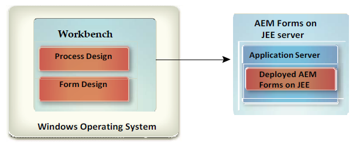

# Install Workbench {#install-workbench}

This document provides instructions for installing and configuring AEM Forms Workbench. The installation program also installs Forms Designer.

## Who should read this document? {#who-should-read-this-doc}

This document is intended for administrators or developers who are responsible for installing, configuring, administering, or deploying Workbench. Also included is information to configure your system to support your upgraded AEM Forms processes. The information provided is based on the assumption that anyone reading this document is familiar with Microsoft&reg; Windows&reg; operating system.

## Additional information {#additional-information}

The resources in this table can help you learn more about and get started using AEM Forms.
<table>
 <tbody>
  <tr>
   <td>
<strong>For information about</strong>
 </td>
   <td>
<strong>See</strong>
 </td>
  </tr>
  <tr>
   <td>
Procedural information for Workbench
 </td>
   <td>
<a href="https://helpx.adobe.com/content/dam/help/en/experience-manager/6-5/forms/pdf/WorkbenchHelp.pdf">Workbench Help</a>    
 </td>
  </tr>
  <tr>
   <td>
General information about AEM Forms and how it integrates with other Adobe products
 </td>
   <td>
<a href="https://experienceleague.adobe.com/docs/experience-manager-65/forms/getting-started/introduction-aem-forms.html?lang=en">AEM Forms Overview</a>    
 </td>
  </tr>
  <tr>
   <td>
All the documentation available for AEM Forms
 </td>
   <td>
<a href="https://experienceleague.adobe.com/docs/experience-manager-65/forms/getting-started/introduction-aem-forms.html?lang=en">AEM Forms documentation</a>    
 </td>
  </tr>
  <tr>
   <td>
Patch updates, technical notes, and additional information on this product version
 </td>
   <td>
Contact Adobe Enterprise Support</a>    
 </td>
  </tr>
 </tbody>
</table>

>[!NOTE]
>
>The Flex Workspace is deprecated for AEM Forms. It is available for the AEM Forms release.

## Before You Install {#before-you-install}

### Workbench installation overview {#workbench-installation-overview}

Workbench is an integrated development environment (IDE) that developers and form authors use to create automated business processes and forms. It is also used to manage the resources and services that the processes and forms use.

The following illustration depicts the Workbench installation including:
* Process Design using Workbench
* Form Design using Designer

>[!NOTE]
>
>The AEM Forms Server requires a separate installation program. For more information, see the AEM Forms on JEE installation documentation.

## System prerequisites {#system-prerequisites}

This section outlines the hardware and software requirements and supported platforms.

### Minimum hardware and software requirements {#minimum-hardware-software-requirements}

**Workbench**
The following requirements are recommended as the minimum:
Disk space for installation:
* 680 MB for Workbench only.
* 2.15 GB on a single drive for a full installation of Workbench, Designer, and the samples assembly.
* 400 MB for temporary install directories - 200 MB in the user \temp directory and 200 MB in the Windows temporary directory.

>[!NOTE]
>
>If all these locations reside on a single drive, there must be 1.5 GB of space available during installation. The files copied to the temporary directories are deleted when installation is complete.

* Hardware requirement: Intel&reg; Pentium&reg; 4 or AMD&reg; equivalent, 1 GHz processor.
* Java&trade; Runtime Environment (JRE) 7.0 update 51 or later updates to 7.0.
* Minimum1024 X 768 pixels or greater monitor resolution with 16-bit color or higher.
* TCP/IPv4 or TCP/IPv6 network connection to the AEM Forms Server.
* Install Visual C++ Redistributable runtime Packages 2012 32-bit.
* Install Visual C++ Redistributable runtime Packages 2013 32-bit.

>[!NOTE]
>
>You must have Administrative privileges to install Workbench. If you are installing using a non-administrator account, the installer prompts you for the credentials for an appropriate account.

### Supported Platforms {#supported-platforms}

See the complete list of supported platforms for Workbench at [AEM Forms Supported Platforms](https://www.adobe.com/go/learn_aemforms_supportedplatforms_65).

## Designer installation considerations {#designer-installation-considerations}

By default, the Workbench installation includes a corresponding English-only version of Designer. If the Workbench installation application detects an existing version of Designer on your computer, the installation may terminate, and you are required to remove the current version of Designer before you can continue.
The table below has a complete list of possible Designer installation scenarios that you may encounter, and any actions you must take, when installing Workbench.

<table>
 <tbody>
  <tr>
   <td>
<strong>Version of Designer currently installed</strong>
 </td>
   <td>
<strong>Required actions</strong>
 </td>
  </tr>
  <tr>
   <td>
Acrobat Pro or Acrobat Pro Extended (includes Designer)
 </td>
   <td>
None.  
The Workbench installation detects an instance of Designer on your computer that was installed with either Acrobat Pro or Acrobat Pro Extended. 
Different versions of Designer can coexist on the same system, for example Designer 6.4.x for Workbench 6.4 and Designer 6.5.0.x for Workbench 6.5. It is not necessary to uninstall the version of Designer installed with Acrobat 10 Pro or Acrobat 10 Pro Extended, or above.
 
 </td>
  </tr>
  <tr>
   <td>
Designer (stand-alone)
 </td>
   <td>
None.  The version of Designer included with Workbench is English-only.  The Workbench installer will not reinstall a new version of Designer. Instead an updated version, bundled with the Workbench installer, will be patched. This also allows you to use your localized version of Designer within Workbench.  
 </td>
  </tr>
 </tbody>
</table>

### To uninstall Designer (stand-alone) on Windows 10 {#uninstall-designer-standalone-windows10}

1. Go to **Control Panel > Programs > Programs and Features**
1. In the Currently installed programs list, select **Adobe Designer**.
1. Click **Uninstall** and then click **Yes**.

## Installing Workbench {#installing-workbench}

This chapter describes how to install Workbench.

### Installing and running Workbench {#installing-and-running-workbench}

Before you install Workbench, you must ensure that your environment includes the software and hardware required to run it (See section: **Before You Install**).

**To install and run Workbench:**

1. Do one of these tasks:
   * Navigate to the \workbench directory on the install media and double-click the run_windows_installer.bat file.
   * Download and decompress the Workbench to your file system. After it is downloaded, navigate to the \workbench directory and double-click the run_windows_installer.bat file.

   >[!IMPORTANT]
   >
   >The Workbench installer only runs from a local drive. It cannot be run from a remote site.

   >[!NOTE]
   >
   >If you encounter an error "Could not create the Java&trade; Virtual Machine", then create an environment variable named _JAVA_OPTIONS with value -Xmx512M and run the installer.

1. On the Introduction screen, click Next.
1. Read the Product License Agreement, select I accept the terms of the License Agreement, and then click Next.
1. (Optional) Select Install Adobe Designer if you require this tool to create and modify forms.

   >[!NOTE]
   >
   >You can continue to use Designer installed with Acrobat 10 by leaving this option deselected.

1. Accept the default directory as listed or click Choose and navigate to the directory where you want to install Workbench, and then click Next.

   >[!NOTE]
   >
   >The installation directory path should not contain # (pound) and $ (dollar) characters.

1. Review the preinstallation summary and click Install. The installation program displays the progress of the installation.
1. Review the installation summary. Select Start AEM Forms Workbench to launch Workbench and click Next.
1. Review the Release Notes and click Done.
1. The following items are now installed on your computer:
   * **Workbench**: To run Workbench from the Start menu, select All Programs > AEM Forms > Workbench, if you chose to store the shortcut folder there. For  information,   see the <a href="https://helpx.adobe.com/content/dam/help/en/experience-manager/6-5/forms/pdf/WorkbenchHelp.pdf">Using Workbench</a> documentation.
   * **Designer**: You can access Designer from inside Workbench. For information, see Getting Started topic in <a href="https://helpx.adobe.com/content/dam/help/en/experience-manager/6-5/forms/pdf/using-designer.pdf">Designer Help</a>.
   * **AEM Forms SDK**: For more information on using the SDK, see <a href="https://helpx.adobe.com/pdf/aem-forms/6-3/programming-with-aem-forms.pdf">Programming with AEM Forms</a>.

## Upgrading processes {#upgrading-processes}

AEM Forms on JEE processes can be upgraded to AEM Forms applications using the Upgrade Wizard. See Upgrading legacy artifacts documentation in Workbench Help for more information.

### Configuring and logging in to a server {#configuring-and-logging-server}

To use Workbench, you must have an instance of AEM Forms running, typically on a separate computer. You must have a user name and password to log on to AEM Forms, and details about the location of the server.

>[!NOTE]
>
>If you configured AEM Forms to use the EMC Documentum&reg; or IBM&reg; FileNet repository provider and you want to log in to a repository other than the repository that is configured as the default in AEM forms administration console, provide the user name as username@Repository.

### Configuring time-out settings {#configuring-timeout-settings}

By default, Workbench times out after two hours, regardless of activity or inactivity. To edit the time-out setting, see "Configuring User Management > Configure advanced system attributes" in the <a href="https://experienceleague.adobe.com/docs/experience-manager-65/forms/administrator-help/configure-user-management/configure-advanced-system-attributes.html">administration console Help</a>.

### Configuring Workbench to connect over HTTPS {#configuring-workbench-to-connect-over-HTTPS}

To connect Workbench to an AEM Forms Server over HTTPS, you must ensure that the certificate authority (CA) that issued the public key will be recognized as being trusted by Workbench. If the certificate is not recognized as coming from a trusted source, you must update the cacert file in the [Workbench_HOME]/workbench/jre/lib/security directory.

>[!NOTE]
>
>[Workbench_HOME] represents the directory where you installed Workbench. The default location is C:\Program Files (x86)\Adobe Experience Manager forms Workbench.

Ensure that you connect to HTTPS by using the name that is specified in the certificate. This name is typically the fully qualified host name.

**To update the cacert file**:
1. Ensure that you have a copy of the Secure Sockets Layer (SSL) certificate. Either contact the administrator who configured the SSL server or export the certificate by using a web browser.

   >[!NOTE]
   >
   >To export the certificate, open a web browser and log in to administration console, install the certificate in the browser, then export the certificate from the browser to a temporary storage location (or directly to the [Workbench_HOME]/workbench/jre/lib/security directory).

1. Copy the certificate to the [Workbench_HOME]/workbench/jre/lib/security directory.

1. Open a command prompt window, navigate to [Workbench_HOME]/workbench/jre/bin, and then type the following command:
  `keytool -import -storepass changeit -file [Workbench_HOME]\workbench\jre\lib\security\ssl_cert_for_certname.cer -keystore [Workbench_HOME]\workbench\jre\lib\security\cacerts -alias example`
  Where:
    * `changeit` is the default password to the cacerts keystore.
    * certname is the certificate that you selected in step 1.
    * example is the alias that you choose for the certificate. This value can be changed.

1. When prompted to trust the certificate, type Yes and hit the Enter key. The keytool proceeds to import the cacerts file into the [Workbench_HOME]/workbench/jre/lib/security directory.

1. Close and restart Workbench to apply changes.

### Configuring cache settings for dynamically generated templates {#configuring-cache-settings-for-dynamically-generated-templates}

The following aspects of cache operation should be considered if your application generates unique templates on the fly by automatically updating XFA content. In effect, each transaction uses a new, unique template.

When forms generator or output searches for, or updates, entries in the cache for a specific form template, it uses several key values to locate the specific cache entry that will be accessed.

* **Template file name**: The location and filename of the template used as the primary unique identifier of the cached form.
* **Timestamp**: The template file contains a timestamp used to determine the last update time of the form.
* **Template UUID**: Designer inserts in each template a unique identifier (UUID) for the form and its version. Each time the form is updated, the embedded UUID is updated. For example, an XDP template might show the following content:

  `<?xml version="1.0" encoding="UTF-8"?>`
  `<?xfa generator="AdobeAEM formsDesignerES_V8.2" APIVersion="2.6.7185.0"?><xdp:xdp xmlns:xdp=https://ns.adobe.com/xdp/ timeStamp="2008-07-29T21:22:12Z" uuid="823e538f-ff6c-4961-b759-f7626978a223"><template xmlns="https://www.xfa.org/schema/xfa-template/2.6/">`

* **Render options**: Within the rendered form cache, the cache contents are stored separately for each set of unique render options.

The Forms service receives templates by reference to filename or repository location, or by value as an XML object in memory.
* **Templates passed by reference**: Uses the content root and the form name. If unique templates with different filenames are passed in every request using this method, the disk cache grows endlessly and is never reused. To prevent this, unique templates should be passed with same filename to ensure that same cache is updated for all requests.
* **Templates passed by value**: Uses template bytes passed along with the data using theinDataDoc parameter. If unique templates with different UUID are passed using this method, the disk cache grows endlessly and will never be reused. To prevent this, the UUID attribute should be stripped from all templates to ensure that no cache is created for the template. Alternatively, passing the same non-null UUID allows the cache objects to be created, but ensures that the same cache is updated with each request.

To prevent the cache from growing endlessly, consider the following factors for rendering dynamically generated templates using the new AEM Forms APIs, those being renderHTMLForm2, and renderPDFForm2.

When using the new APIs, the template is passed as a document object, which is handled in the Forms service based on whether it is passivated or not.

For passivated documents in which the UUID and content root serve as the cache key, consider the following aspects:
* The cache is not created for passivated input templates with no UUID.
* If more than one passivated input template having the same UUID and content root are passed, then the same cache is overwritten.

For non-passivated documents in which the filename and content root serve as the cache key, consider the following aspect:
* For non-passivated input templates, caching depends on the content root and filename from which the document was generated.
The same cache is used only for requests with the same content root and template filename.
The following best practices ensure that the cache does not grow endlessly when dynamically generated templates are passed to the Forms service:
  * Strip the UUID or pass the same UUID in all dynamically generated templates.
  * Generate the document either from template bytes or from the same filename on disk.

### Uninstalling Workbench {#uninstalling-workbench}

Use the Add or Remove Programs function in the Control Panel to start the Uninstaller. The Workbench and Designer applications have separate uninstall programs.

## Configuring AEM Forms XDC Editor {#configuring-aem-forms-xdc-editor}

Using the XDC Editor, network printer administrators can create and modify XML Forms Architecture Device Configuration (XDC) files. XDC files describe the capabilities of printers, such as the printer language or the correlation between paper size and tray location.

Before your network printer administrator uses the XDC Editor, relocate the sample XDC files and see Creating device profiles using XDC Editor.

**To obtain the sample XDC files**:
1. On the AEM Forms Server, locate the XDC folder in [AEM Forms root]\sdk\samples\Output\IVS.
1. Copy the contents of this folder into a directory that is accessible from the Workbench or Eclipse system.

**To obtain the XDC Editor Help**:
1. Go to the AEM Forms documentation website.
1. Click the **Develop** tab and navigate to Creating device profiles using XDC Editor. Download the xdc_editor_help_web.zip file and install the Help files by following the instructions provided in the Readme file.
