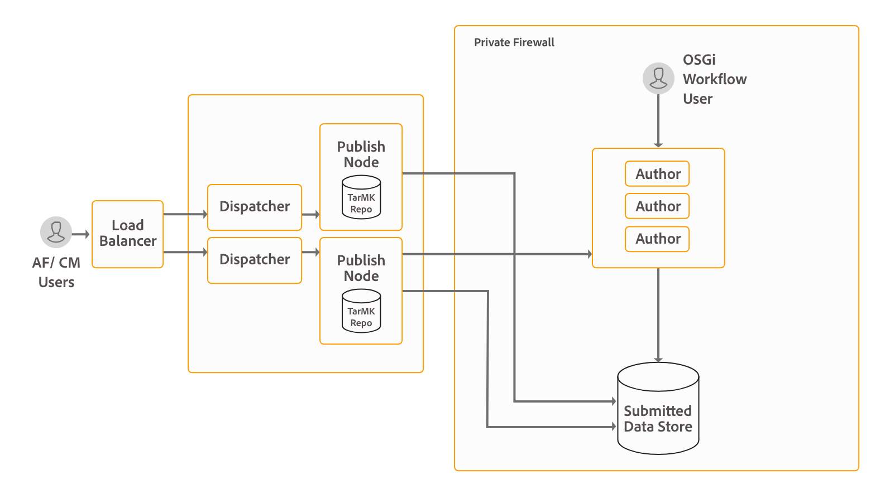

# Install and configure Interactive Communications{#install-and-configure-interactive-communications}

## Introduction {#introduction}

AEM Form has a capability to centralize creation, assembly, management and delivery of secure, and interactive documents such as business correspondences, documents, statements, benefit notices, marketing mails, bills, and welcome kits. This capability is known as interactive communication. The capability is included in AEM Forms add-on package. The add-on package is deployed on an Author or Publish instance of AEM.

You can use the interactive communication capability to produce communication in multiple formats. For example, web and PDF. You can integrate interactive communication with AEM Workflow to process and deliver the assembled communication to customers on the channel of their choice. For example, sending a communication to end user through email.

If you are upgrading from a previous version and have already invested in correspondence management, you can install the [compatibility package](../../forms/using/installing-configuring-intreactive-communication-correspondence-management.md#install-compatibility-package) to continue using correspondence management. For information about the differences between interactive communication and correspondence management, see [Interactive Communication Overview](/help/forms/using/interactive-communications-overview.md#interactive-communications-vs-correspondence-management).

AEM Forms is a powerful enterprise-class platform. Interactive communication is only one of the capability of AEM Forms. For the complete list of capabilities, see [Introduction to AEM Forms](../../forms/using/introduction-aem-forms.md).

## Deployment Topology {#deployment-topology}

AEM Forms add-on package is an application deployed onto AEM. You require only a minimum of one AEM Author and Processing instance to run the Interactive Communications capability. The following topology is indicative topology to run AEM Forms Interactive Communications, Correspondence Management, AEM Forms data capture, and Forms-Centric workflow on OSGi capabilities. For detailed information about the topology, see [Architecture and deployment topologies for AEM Forms](/help/forms/using/aem-forms-architecture-deployment.md).



AEM Forms Interactive Communications run admin, authoring, and agent user interfaces on the Author instances of AEM Forms. The Publish instances host final version of interactive communications which are ready for consumption by end-users.

## System Requirements {#system-requirements}

Before you begin to install and configure interactive communication and correspondence management capabilities of AEM Forms, ensure that:

* Hardware and software infrastructure is in place. For a detailed list of supported hardware and software, see [technical requirements](/help/sites-deploying/technical-requirements.md).

* Installation path of the AEM instance does not contain white-spaces.
* An AEM instance is up and running. In AEM terminology, an "instance" is a copy of AEM running on a server in the author or publish mode. You require at least one AEM instances (Author or Processing) to run AEM Forms interactive communication and correspondence management capabilities:

    * **Author**: An AEM instance used to create, upload, and edit content and to administer the website. Once content is ready to go live, it is replicated to the publish instance.
    * **Processing:** A processing instance is a [hardened AEM Author](/help/forms/using/hardening-securing-aem-forms-environment.md) instance. You can set up an Author instance and harden it after performing the installation.

    * **Publish**: An AEM instance that serves the published content to the public over the Internet or an internal network.

* Memory requirements are met. AEM Forms add-on package requires:

    * 15 GB of temporary space for Microsoft&reg; Windows-based installations.
    * 6 GB of temporary space for UNIX-based installations.

* Extra requirements for UNIX-based systems: If you are using the UNIX-based operating system, install the following packages from the installation media of the respective operating system.

<table>
 <tbody>
  <tr>
   <td>expat</td>
   <td>libxcb</td>
   <td>freetype</td>
   <td>libXau</td>
  </tr>
  <tr>
   <td>libSM</td>
   <td>zlib</td>
   <td>libICE</td>
   <td>libuuid</td>
  </tr>
  <tr>
   <td>glibc</td>
   <td>libXext</td>
   <td><p>nss-softokn-freebl</p> </td>
   <td>fontconfig</td>
  </tr>
  <tr>
   <td>libX11</td>
   <td>libXrender</td>
   <td>libXrandr</td>
   <td>libXinerama</td>
  </tr>
 </tbody>
</table>

## Install AEM Forms add-on package {#install-aem-forms-add-on-package}

AEM Forms add-on package is an application deployed onto AEM. The package contains AEM Forms interactive communication, correspondence management, and other capabilities. Perform the following steps to install the add-on package:

1. Open [Software Distribution](https://experience.adobe.com/downloads). You require an Adobe ID to log in to the Software Distribution.
1. Tap **[!UICONTROL Adobe Experience Manager]** available in the header menu.
1. In the **[!UICONTROL Filters]** section:
   1. Select **[!UICONTROL Forms]** from the **[!UICONTROL Solution]** drop-down list.
   2. Select the version and type for the package. You can also use the **[!UICONTROL Search Downloads]** option to filter the results.
1. Tap the package name applicable to your operating system, select **[!UICONTROL Accept EULA Terms]**, and tap **[!UICONTROL Download]**.
1. Open [Package Manager](https://experienceleague.adobe.com/docs/experience-manager-65/administering/contentmanagement/package-manager.html)  and click **[!UICONTROL Upload Package]** to upload the package.
1. Select the package and click **[!UICONTROL Install]**.

   You can also download the package via the direct link listed in the [AEM Forms releases](https://experienceleague.adobe.com/docs/experience-manager-release-information/aem-release-updates/forms-updates/aem-forms-releases.html?lang=en) article.

1. After the package is installed, you are prompted to restart the AEM instance. **Do not immediately restart the server.** Before stopping the AEM Forms Server, wait until the ServiceEvent REGISTERED and ServiceEvent UNREGISTERED messages stop appearing in the [AEM-Installation-Directory]/crx-quickstart/logs/error.log file and the log is stable.
1. Repeat steps 1-7 on all the Author and Publish instances.

## Post-installation configurations {#post-installation-configurations}

AEM Forms has a few mandatory and optional configurations. The mandatory configurations include configuring BouncyCastle libraries and serialization agent. The optional configurations include configuring Dispatcher and Adobe Target.

### Mandatory post-installation configurations {#mandatory-post-installation-configurations}

#### Configure RSA and BouncyCastle libraries  {#configure-rsa-and-bouncycastle-libraries}

Perform the following steps on all the Author and Publish instances to boot delegate the libraries:

1. Stop the underlying AEM instance.
1. Open the [AEM installation directory]\crx-quickstart\conf\sling.properties file for editing.

   If you used [AEM installation directory]\crx-quickstart\bin\start.bat to start AEM, then edit the sling.properties at [AEM_root]\crx-quickstart\.

1. Add the following properties to the sling.properties file:

   ```shell
   sling.bootdelegation.class.com.rsa.jsafe.provider.JsafeJCE=com.rsa.*
   ```

1. Save and close the file and start the AEM instance.
1. Repeat steps 1-4 on all the Author and Publish instances.

#### Configure the serialization agent {#configure-the-serialization-agent}

Perform the following steps on all the Author and Publish instances to add the package to the allowlist:

1. Open AEM Configuration Manager in a browser window. The default URL is https://'[server]:[port]'/system/console/configMgr.
1. Search and open **Deserialization Firewall Configuration**.
1. Add the **sun.util.calendar** package to the **allowlist** field. Click Save.
1. Repeat steps 1-3 on all the Author and Publish instances.

### Optional post-installation configurations {#optional-post-installation-configurations}

#### Install Compatibility Package {#install-compatibility-package}

Interactive communication is the default and recommended approach to create customer communications in AEM 6.5 Forms. If you have upgraded or migrated from a previous version, and plan to continue using letters (Correspondence Management), install the [AEMFD Compatibility package](https://experienceleague.adobe.com/docs/experience-manager-65/forms/upgrade-aem-forms/aem-forms-osgi-upgrade/compatibility-package.html?lang=en).

The AEMFD Compatibility package allows you to use the following assets from AEM 6.4 Forms, AEM 6.3 Forms, and AEM 6.2 Forms on AEM 6.5 Forms:

* Document fragments
* Letters
* Data dictionaries
* Adaptive forms deprecated templates and pages

#### Configure Dispatcher {#configure-dispatcher}

Dispatcher is Adobe Experience Manager's caching and load balancing tool that is used with an enterprise-class web server. If you use [Dispatcher](https://experienceleague.adobe.com/docs/experience-manager-dispatcher/using/configuring/dispatcher-configuration.html?lang=en), then perform the following configurations for AEM Forms:

1. Configure access for AEM Forms:

   Open the dispatcher.any file for editing. Navigate to the filter section and add the following filter to the filter section:

   `/0025 { /type "allow" /glob "* /bin/xfaforms/submitaction*" } # to enable AEM Forms submission`

   Save and Close the file. For detailed information about filters, see [Dispatcher documentation](https://experienceleague.adobe.com/docs/experience-manager-dispatcher/using/configuring/dispatcher-configuration.html?lang=en).

1. Configure the referrer filter service:

   Log in to the Apache Felix configuration manager as an administrator. The Default URL of the configuration manager is https://'server':[port_number]/system/console/configMgr. In the **Configurations** menu, select the **Apache Sling Referrer Filter** option. In the Allow Hosts field, enter host name of the Dispatcher to allow it as a referrer and click **Save**. The format of the entry is https://'[server]:[port]'.

#### Integrate Adobe Target {#integrate-adobe-target}

Your customers are likely to abandon an interactive communication if the experience it delivers is not engaging. While it is frustrating for the customers, it also upturns the support volume and cost for your organization. It is critical and challenging to identify and provide the right customer experience that increases the conversion rate. AEM forms holds the key to this problem.

AEM forms integrates with Adobe Target, an Adobe Experience Cloud solution, to deliver personalized and engaging customer experiences across multiple digital channels. To use Adobe Target to personalize an interactive communication, [Integrate Adobe Target with AEM Forms](../../forms/using/ab-testing-adaptive-forms.md#setupandintegratetargetinaemforms).

#### Configure SSL communication for Form Data Model  {#configure-ssl-communcation-for-form-data-model}

You can enable SSL communication for Form Data Model. To enable SSL communication for Form data model, before starting any AEM Forms instance, add certificates to Java&trade; Trust Store of all the instances. You can run the below command to add the certificates:

`keytool -import -alias <alias-name> -file <pathTo .cer certificate file> -keystore <<pathToJRE>\lib\security\cacerts>`

## Next steps {#next-steps}

You have configured an environment to use interactive communication and correspondence management capabilities. Now, the steps towards using the capability are:

* [Correspondence management overview](/help/forms/using/interactive-communications-overview.md)

* [Create an interactive communication](../../forms/using/create-interactive-communication.md)

* [Create a correspondence management letter](../../forms/using/create-letter.md)
