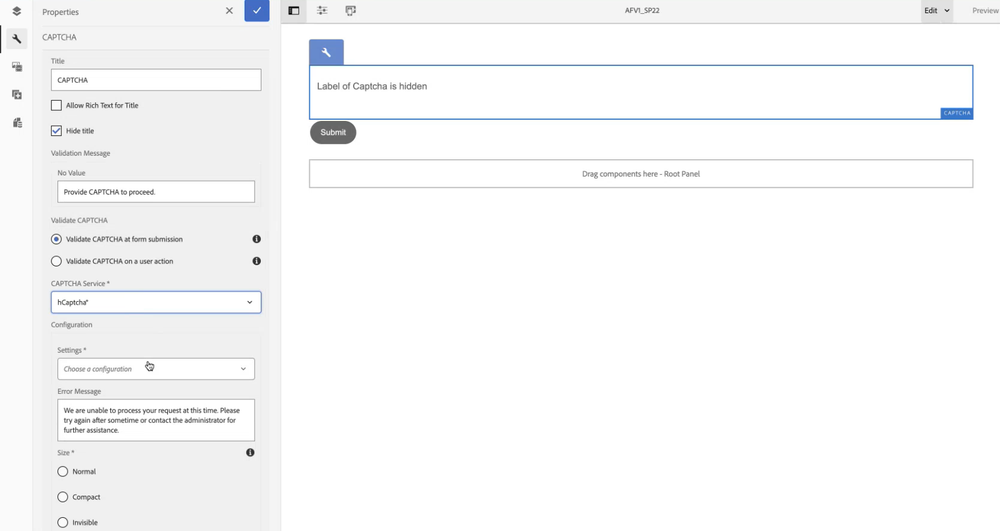

# Connect your AEM Forms environment with hCaptcha&reg; {#connect-your-forms-environment-with-hcaptcha-service}

<!--
This feature is based on Feature Toggle id `FT_FORMS-12407`. To enable the feature, follow the steps given in the [Enable Feature Toggle](/help/forms/using/enable-feature-toggle.md) article. 
-->

This feature is not enabled by default. You can write from your official address to aem-forms-ea@adobe.com to request access to the feature.

CAPTCHA (Completely Automated Public Turing test to tell Computers and Humans Apart) is a program commonly used in online transactions to distinguish between humans and automated programs or bots. It poses a challenge and evaluates user response to determine if it's a human or a bot interacting with the site. It prevents the user to proceed if the test fails and helps make online transactions secure by keeping bots from posting spam or malicious purposes.

In addition to hCaptcha&reg;, AEM Forms 6.5 supports the following CAPTCHA solutions:

* [Google reCAPTCHA](/help/forms/using/captcha-adaptive-forms.md)
* [Cloudflare Turnstile](/help/forms/using/integrate-adaptive-forms-turnstile.md)

## Integrate AEM Forms environment with hCaptcha&reg;

hCaptcha&reg; service protects your forms from bots, spam, and automated abuse. It poses a checkbox widget challenge and evaluates the user response to determine if it's a human or a bot interacting with the form. It prevents the user to proceed if the test fails and helps make online transactions secure by keeping bots from posting spam or malicious activities.

AEM 6.5 Adaptive Forms support hCaptcha&reg. You can use it to present a checkbox widget challenge on form submission.

<!-- -->

### Prerequisites to integrate AEM Forms environment with hCaptcha&reg; {#prerequisite}

To configure hCaptcha&reg; with AEM Forms, you need to obtain the [hCaptcha&reg; site key and secret key](https://docs.hcaptcha.com/switch/#get-your-hcaptcha-sitekey-and-secret-key) from the hCaptcha&reg; website.

### Configure hCaptcha&reg; {#steps-to-configure-hcaptcha}

To integrate AEM Forms with hCaptcha&reg; service, perform the following steps:

1. Create a Configuration Container on your AEM Forms environment, which holds Cloud Configurations used to connect AEM to external services. To create a Configuration Container:
    1. Open your AEM Forms environment. 
    1. Go to **[!UICONTROL Tools > General > Configuration Browser]**.  
    1. In the Configuration Browser, you can select an existing folder or create a new folder:
        * To create a new folder and enable the Cloud Configurations: 
            1. In the Configuration Browser, click **[!UICONTROL Create]**. 
            1. In the Create Configuration dialog, specify a name, title, and check **[!UICONTROL Cloud Configurations]**.
            1. Click **[!UICONTROL Create]**.
        * To enable Cloud Configuration for an existing folder:
            1. In the Configuration Browser, select the folder and select **[!UICONTROL Properties]**.
            1. In the Configuration Properties dialog, enable **[!UICONTROL Cloud Configurations]**.
            1. Click **[!UICONTROL Save & Close]** to save the configuration and exit the dialog.

1. Configure your Cloud Services: 
    1. On your AEM author instance, go to  &gt; **[!UICONTROL Cloud Services]** and Click **[!UICONTROL hCaptcha&reg;]**.
        
    1. Select a Configuration Container, created or updated, as described in the previous section. Select **[!UICONTROL Create]**.
        
    1. Specify **[!UICONTROL Title]**, <!--**[!UICONTROL Name]**--> **[!UICONTROL Site Key]**, and **[!UICONTROL Secret Key]** for hCaptcha&reg; service [obtained in Prerequisite](#prerequisite). 
    1. Click **[!UICONTROL Create]**.

        

    >[!NOTE]
    > Users need not to modify [Client-side JavaScript validation URL](https://docs.hcaptcha.com/#add-the-hcaptcha-widget-to-your-webpage) and [Server-side validation URL](https://docs.hcaptcha.com/#verify-the-user-response-server-side) as they are already prefilled for hCaptcha&reg; validation.

   Once the hCAPTCHA service is configured, it is available for use in your adaptive form.

## Use hCaptcha&reg; in an Adaptive Forms {#using-hCaptcha-in-aem-6.5}

1. Open your AEM Forms environment.
1. Go to **[!UICONTROL Forms]** > **[!UICONTROL Forms and Documents]**.
1. Select an Adaptive Form and Click **[!UICONTROL Properties]**. 
1. In the **[!UICONTROL Configuration Container]**, select your Cloud Configuration for hCaptcha&reg;.
1. Click **[!UICONTROL Save & Close]**.

    If you do not have a Configuration Container for hCaptcha, see section [Connect your AEM Forms environment with hCaptcha&reg;](#configure-hcaptcha-steps-to-configure-hcaptcha) to learn how to create a Configuration Container.

    

1. Select an Adaptive Form and Click **[!UICONTROL Edit]** to open the form in the editor.
1. From the component browser, drag-drop the **[!UICONTROL Captcha]** component onto the Adaptive Form.
1. Select the **[!UICONTROL Captcha]** component, and click properties  to open the properties dialog. Specify the following properties:

    

    * **[!UICONTROL Title]:** Specify the title for your Captcha component.
    * **[!UICONTROL Validation Message]:** Provide a validation message for your Captcha validation on form submission or on a user action.
    * **[!UICONTROL Captcha Service]:** Select the CAPTCHA Service for your form submission, here you select hCaptcha&reg;.
    * **[!UICONTROL Configuration Settings]:** Select your Cloud Configuration configured for hCaptcha&reg;.
        >[!NOTE]
        >You can have multiple Cloud Configurations in your environment for a similar purpose. So, choose the service carefully. If no service is listed, see [Connect your AEM Forms environment with hCaptcha&reg;](#connect-your-forms-environment-with-hcaptcha-service) to learn how to create a Cloud Service that connects your AEM Forms environment with hCaptcha&reg; service.

    * **[!UICONTROL Error Message]:** Provide the error message to display to the user when the Captcha submission fails.
    * **[!UICONTROL Captcha Size]:** You can select the display size of the hCaptcha&reg; challenge dialog. Use the **[!UICONTROL Compact]** option to display a small sized and the **[!UICONTROL Normal]** to display a relatively large-size hCaptcha&reg; challenge dialog or **[!UICONTROL Invisible]** to validate hCaptcha&reg; without explicitly rendering the checkbox widget on the user interface.

1. Select **[!UICONTROL Done]**.

Now, only legitimate forms, in which the form filler successfully clears the challenge posed by the hCaptcha&reg; service are allowed for the form submission.

**hCaptcha&reg; is a registered trademark of Intuition Machines, Inc.**

## Frequently Asked Questions

* **Q: Can I use more than one Captcha component in an Adaptive Form?**
* **Ans:** Using more than one Captcha component in an Adaptive Form is not supported. Also, it is not recommended to use a Captcha component in a fragment or a panel marked for lazy loading.

## See also {#see-also}

* [Using CAPTCHA in adaptive forms](/help/forms/using/captcha-adaptive-forms.md)
* [Using Turnstile Captcha in adaptive forms](/help/forms/using/integrate-adaptive-forms-turnstile.md)
