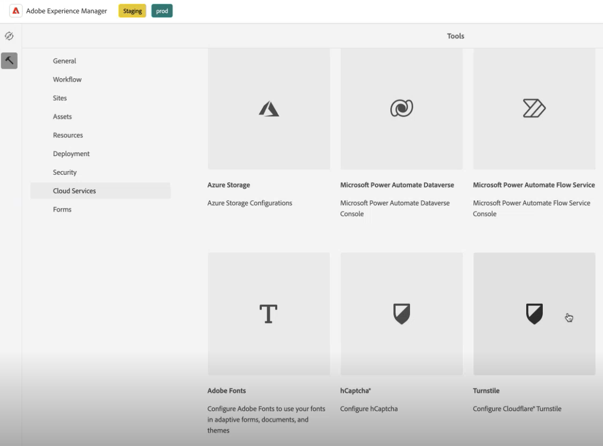
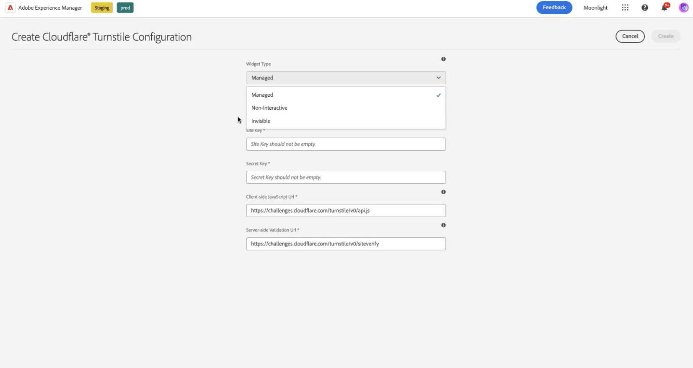
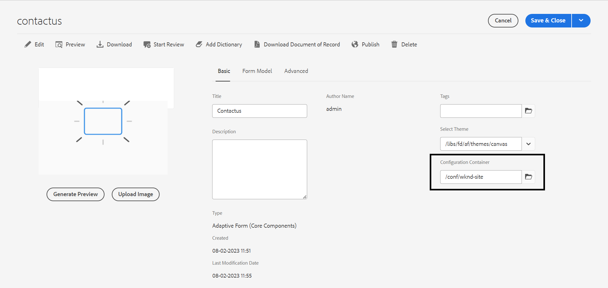
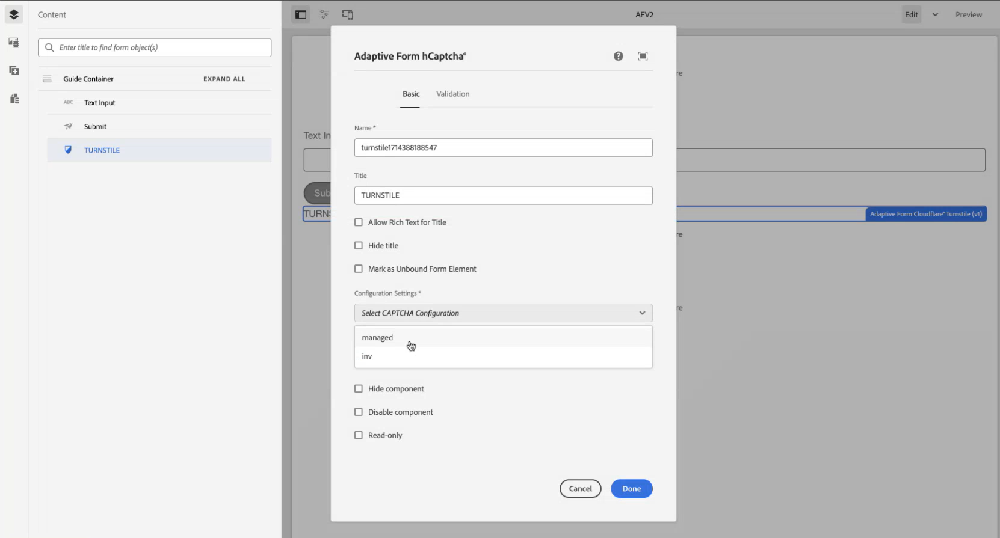
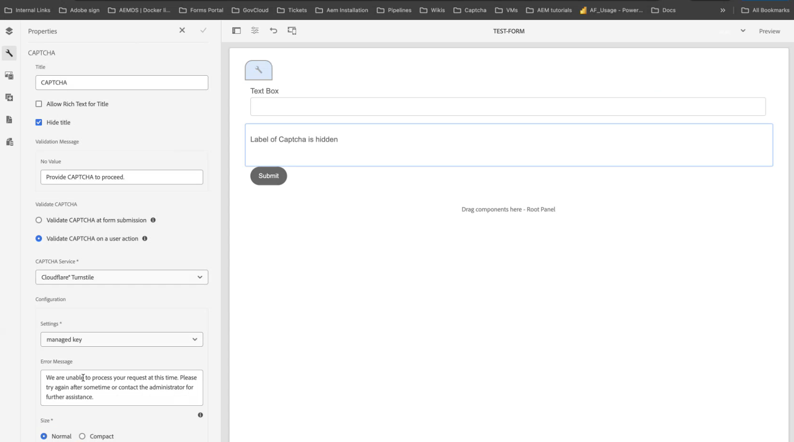
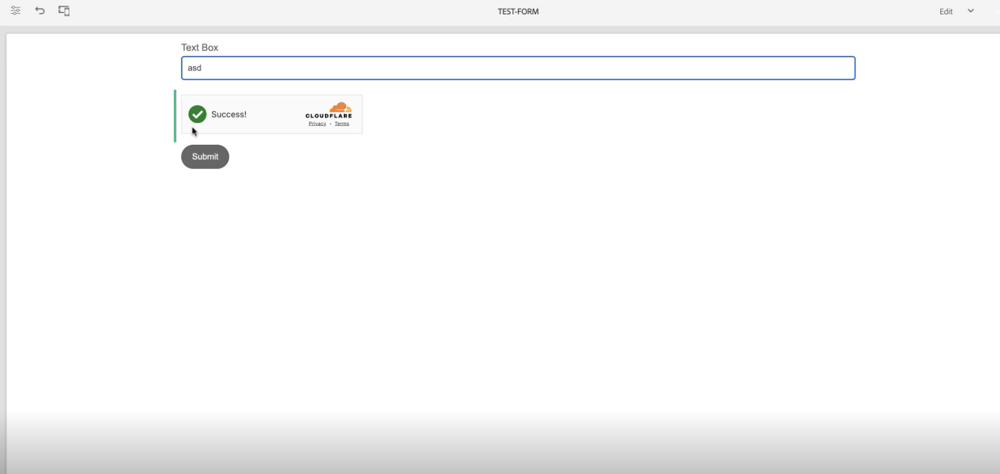

# Connect your AEM Forms environment with Turnstile {#connect-your-forms-environment-with-turnstile-service}

 This feature is under Early Adopter Program. You can write to aem-forms-ea@adobe.com from your official email id to join the early adopter program and request access to the capability. 

CAPTCHA (Completely Automated Public Turing test to tell Computers and Humans Apart) is a program commonly used in online transactions to distinguish between humans and automated programs or bots. It poses a challenge and evaluates user response to determine if it's a human or a bot interacting with the site. It prevents the user to proceed if the test fails and helps make online transactions secure by keeping bots from posting spam or malicious purposes. 

AEM Forms 6.5 supports the following CAPTCHA solutions:

* [Turnstile Captcha](/help/forms/using/integrate-adaptive-forms-turnstile.md)
* [Google reCAPTCHA](/help/forms/using/captcha-adaptive-forms.md)
* [hCaptcha](/help/forms/using/integrate-adaptive-forms-hcaptcha.md)  

<!-- -->

## Integrate AEM Forms environment with Turnstile Captcha

Cloudflare's Turnstile Captcha is a security measure that aims to protect forms and sites from automated bots, malicious attacks, spams and unwanted automated traffic. It presents a checkbox on form submission to verify that they are human, before allowing them to submit the form.

### Prerequisites to integrate AEM Forms environment with Turnstile Captcha {#prerequisite}

To configure Turnstile for AEM Forms, you need to obtain [Turnstile sitekey and secret key](https://developers.cloudflare.com/turnstile/get-started/) from the Turnstile website.

### Configure Turnstile {#steps-to-configure-hcaptcha}

To integrate AEM Forms with Turnstile service, perform the following steps:

1. Create a Configuration Container on your AEM Forms environment. A Configuration Container holds Cloud Configurations used to connect AEM Forms to external services. To create a Configuration Container:
    1. Open your AEM Forms environment.
    1. Go to **[!UICONTROL Tools > General > Configuration Browser]**.  
    1. In the Configuration Browser, you select an existing folder or create a new folder:
        * To create a **new folder** and enable the Cloud Configurations: 
            1. In the Configuration Browser, click **[!UICONTROL Create]**. 
            1. In the Create Configuration dialog, specify a name, title, and check **[!UICONTROL Cloud Configurations]**.
            1. Click **[!UICONTROL Create]**.
        * To enable Cloud Configuration for an **existing folder**:
            1. In the Configuration Browser, select the folder and click **[!UICONTROL Properties]**.
            1. In the Configuration Properties dialog, enable **[!UICONTROL Cloud Configurations]**.
            1. Click **[!UICONTROL Save & Close]** to save the configuration.

1. Configure your Cloud Services:
    1. On your AEM author instance, go to  &gt; **[!UICONTROL Cloud Services]** and Click **[!UICONTROL Turnstile]**.
        
    1. Select a Configuration Container, created or updated, as described in the previous section. Click **[!UICONTROL Create]**.
        
    1. Specify **[!UICONTROL Widget Type]** as managed, non-interactive or invisible.  
    1. Provide other details such as **[!UICONTROL Title]**, **[!UICONTROL Name]**.
    1. Specify **[!UICONTROL Site Key]**, and **[!UICONTROL Secret Key]** for Turnstile service [obtained in prerequisite](#prerequisite). 
    1. Click **[!UICONTROL Create]**.

        

    >[!NOTE]
    > Users need not to modify Client-side JavaScript validation URL and Server-side validation URL as they are already prefilled for Turnstile validation.

   Once the Turnstile Captcha service is configured, it is available for use in your Adaptive Form.

## Use Turnstile in an Adaptive Form {#using-turnstile-aem-6.5}

1. Open your AEM Forms environment. 
1. Go to **[!UICONTROL Forms]** > **[!UICONTROL Forms and Documents]**.
1. Select an Adaptive Form, and Click **[!UICONTROL Properties]**. In **[!UICONTROL Configuration Container]**, select your Cloud Configuration for Turnstile&reg;.
1. Click **[!UICONTROL Save & Close]**.

    If you do not have such a Configuration Container, see section [Connect your AEM Forms environment with Turnstile](#connect-your-forms-environment-with-turnstile-service) to learn how to create a Configuration Container.

    

1. Select an Adaptive Form, and Click **[!UICONTROL Edit]** to open your adaptive form in editor.
1. From the component browser, drag-drop or add the **[!UICONTROL Adaptive Form Turnstile]** component onto the Adaptive Form.
1. Select the **[!UICONTROL Adaptive Form Turnstile]** component and Click properties  icon. It opens the properties dialog. Specify the following properties:

    <!---->
    

    * **[!UICONTROL Title]:** Specify the title for your Captcha component. you can identify a form component easily with its unique title both in the form and in the rule editor.
    * **[!UICONTROL Configuration Settings]:** Select a Cloud Configuration configured for Turnstile.
    * **[!UICONTROL Validation Message]:** Provide a validation message for validating Captcha on form submission or on a user action.
    * **[!UICONTROL Captcha Service]:** Select the CAPTCHA Service for your form submission, here you select Turnstile&reg;.
    * **[!UICONTROL Configuration Settings]:** Select your Cloud Configuration configured for Turnstile&reg;.
        >[!NOTE]
        >You can have multiple Cloud Configurations in your environment for a similar purpose. So, choose the service carefully. If no service is listed, see [Connect your AEM Forms environment with Turnstile](#connect-your-forms-environment-with-turnstile-service) to learn how to create a Cloud Service that connects your AEM Forms environment with Turnstile service.
    * **Error Message:** Provide the error message to display to the user when the Captcha submission fails.
    * **Captcha Size:** You can select the display size of the hCaptcha&reg; challenge dialog. Use the **[!UICONTROL Compact]** option to display a small sized and the **[!UICONTROL Normal]** to display a relatively large-size hCaptcha&reg; challenge dialog.

1. Select **[!UICONTROL Done]**.

Now, only legitimate forms, in which the form filler successfully clears the challenge posed by the Turnstile service are allowed for the form submission.

## Frequently Asked Questions

* **Q: Can I use more than one Captcha component in an Adaptive Form?**
* **Ans:** Using more than one Captcha component in an Adaptive Form is not supported. Also, it is not recommended to use a Captcha component in a fragment or a panel marked for lazy loading.

## See also {#see-also}

* [Using CAPTCHA in adaptive forms](/help/forms/using/captcha-adaptive-forms.md)
* [Using hCaptcha in adaptive forms](/help/forms/using/integrate-adaptive-forms-hcaptcha.md)