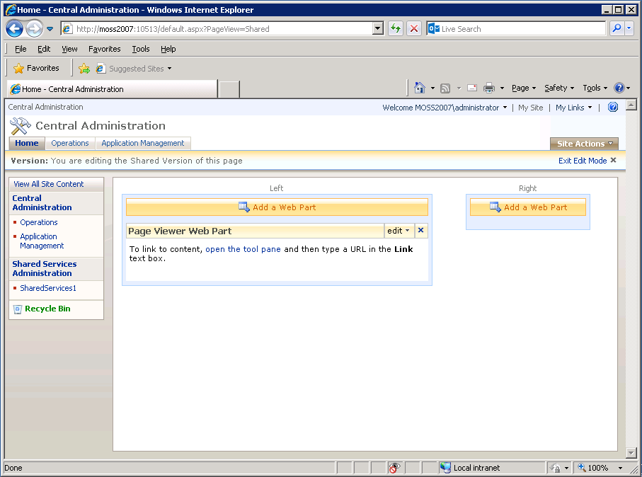
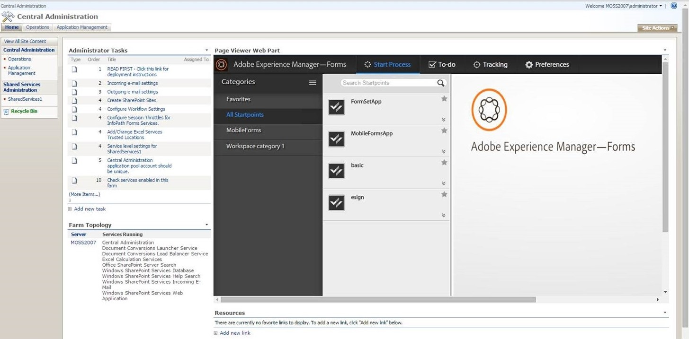

# Integrating AEM forms workspace with Microsoft Office SharePoint Server{#integrating-aem-forms-workspace-with-microsoft-office-sharepoint-server}

**- Requirements** 
  
**Prerequisite knowledge** 
Before you can add AEM Forms Workspace to SharePoint Server, you must have access to SharePoint Server with the appropriate privileges, and you must know the URL to access Workspace. The steps below assume that you are knowledgeable with SharePoint Server. For more information about Web Parts in SharePoint Server, see Web Parts in Windows SharePoint Services.

**User level** 
Beginning

You can use AEM Forms Workspace as a Web Part in Microsoft Office SharePoint Server( For example, Microsoft Office SharePoint Server 2007). Users can access AEM Forms Workspace by connecting to your SharePoint Server using a web browser to provide a unified experience. In this article, you learn the basic steps to display AEM Forms Workspace as a Web Part in Microsoft Office SharePoint Server. You can perform the steps described in this article to provide a unified experience so that users connecting to your SharePoint server can access AEM Forms Workspace from the same port.

>[!NOTE]
>
>The steps listed in this article are specific Microsoft SharePoint Server 2007. You can also configure HTML Workspace with other supported versions of Microsoft SharePoint.

## Integrate AEM Forms Workspace with Microsoft Office SharePoint Server 2007 {#integrate-aem-forms-workspace-with-microsoft-office-sharepoint-server}

Perform the following steps to integrate AEM Forms Workspace into a Web Part:

1. In a web browser, navigate to the SharePoint site such as, http://*[myMOSSserver]:*44299/default.aspx where *[myMOSSserver]* is the name or the IP address of the Sharepoint server.

   >[!NOTE]
   >
   >44299 is the default port number for the SharePoint server. The port number depends on your installation of SharePoint Server.

1. On the upper-right side of the web page, click **Site Actions** and select **Edit Page**.
1. Click the **Add a Web Part** button. 
1. In the Add Web Parts - web page Dialog dialog box, under Miscellaneous, select **Page Viewer Web Part** and then click **Add**.
1. In the Page Viewer Web Part box, click **edit** and select **Modify Shared Web Part**.

   >[!NOTE]
   >
   >The Page Viewer Web Part box appears under the **Add a Web Part** button that you clicked in step 3 as shown in the following illustration (Figure 1):

   

   Figure 1. – The Page Viewer Web Part box in Microsoft Office SharePoint server.

1. On the Page Viewer page, perform the following tasks:

    1. In the Link box, type the URL of AEM Forms Workspace, such as http://*[AEM_forms_Server]:*8080/lc/ws where *[AEM_forms_Server]* represents the IP or Name of AEM forms server.
    1. Click **Appearance** and modify the height, width, and title so that you can see the entire Workspace user interface. For example, you can set height and width to 6 inches and 11 inches, respectively.
    1. Click **Test Link**. A new web browser window appears with Workspace displayed in it.
    1. (Optional) Click **Layout** and modify the layout of Workspace in Web Part.
    1. (Optional) Click **Advanced** and modify other settings, such as the description and whether Workspace can be minimized or closed in the Web Part.

       Click **Apply**.

1. Click **Exit Edit Mode** and verify that you can access Workspace.

After you complete the above steps, your SharePoint site looks similar to the following illustration (Figure 2):

Figure 2 - AEM Forms Workspace integrated with Microsoft Office SharePoint Server

